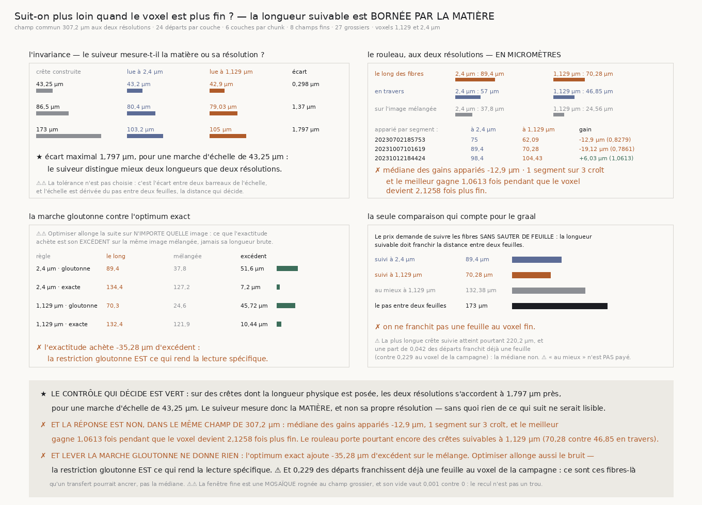

# `186` — Suit-on plus loin quand le voxel est plus fin ?

*Non. Et ce n'est pas l'instrument qui bute, c'est la matière.*

## 0. Pourquoi cette tranche, et c'est `R4-P34` qui la nomme

`185` a mesuré pour la première fois le critère que le prix emploie — *« follow horizontal papyrus
fibers... and not jumping between sheets »* — et la réponse fut un demi-pas : **84,0** µm suivis pour
un pas entre deux feuilles de **173** µm. Le suiveur suivait, le rouleau portait des crêtes
suivables : ce qui manquait n'était ni l'instrument ni la matière, c'était la **longueur**.

D'où la porte : une matière mieux résolue la rendrait-elle suivable sur une feuille entière ? À
**2,4** µm le voxel, une fibre fait quatre à huit voxels ; à **1,129** µm elle en ferait une
quinzaine, et `docs/mesures/volumes_surface_PHercParis4.txt` recense ces volumes.

⚠⚠⚠ **Et la comparaison ne peut se faire qu'en micromètres.** Un voxel deux fois plus fin double
mécaniquement le nombre de pas sans rien ajouter : publier des pas ferait lire un **changement
d'unité** comme un gain. Tout ce que cette tranche publie du rouleau est en micromètres.

## 1. La fenêtre, qui devait être la même des deux côtés

Un chunk du dépôt fait **128** voxels de côté aux deux résolutions. Cela fait **307,2** µm à 2,4 µm —
le champ que `185` a lu — mais à 1,129 µm le même chunk couvre **moins qu'un pas entre deux
feuilles**. Lire un chunk fin nu aurait donc borné la longueur par la **fenêtre** et non par la
matière, et le verdict aurait été le nôtre.

La fenêtre fine est donc une **mosaïque** de **3 × 3** chunks voisins, rognée au centre à **272**
voxels : **307,2** µm, le même carré de papyrus, avec le même nombre de départs, donc à la même
densité physique de départs.

⚠⚠ **Et chaque chunk de la mosaïque doit porter de la matière**, parce que c'est exactement la règle
que la résolution grossière applique à son chunk unique. Sans elle la comparaison serait truquée dans
un sens : une fenêtre de neuf chunks a neuf fois plus d'occasions d'en contenir un vide, une plage
noire coupe les crêtes, et on lirait le **découpage du dépôt** comme une propriété de la matière
fine. Le contrôle est publié : la part de vide vaut **0,001** côté fin contre **0** côté grossier.

⚠⚠ **Et les segments sont l'intersection des deux résolutions.** L'inventaire ne recense la
résolution fine que pour une partie des segments ; prendre les trois premiers de chaque liste aurait
fait comparer deux morceaux de rouleau différents et attribuer leur écart à la résolution.

## 2. Le contrôle qui décide, et il est construit

Sur des crêtes dont la **longueur physique** est posée, un suiveur qui mesure la **matière** doit
rendre la même longueur en micromètres aux deux résolutions ; un suiveur qui mesure sa propre
résolution en rendrait le double. Tant que cette invariance n'est pas constatée, **aucun** chiffre du
rouleau n'est interprétable — c'est le précédent de `181`, où rien n'a été publié pendant que le
contrôle était rouge.

L'échelle est dérivée du pas entre deux feuilles, la distance dont dépend le verdict : **43,25**,
**86,5** et **173,0** µm.

| crête construite | lue à 2,4 µm | lue à 1,129 µm | écart |
|---:|---:|---:|---:|
| **43,25** µm | **43,2** | **42,902** | **0,298** |
| **86,5** µm | **80,4** | **79,03** | **1,37** |
| **173,0** µm | **103,2** | **104,997** | **1,797** |

⚠ L'écart de chaque barreau est **produit par la mesure** et non soustrait ici : un document qui
calculerait lui-même la différence de deux valeurs publiées écrirait un nombre sans producteur.

⭐ **L'écart maximal vaut 1,797 µm pour une marche d'échelle de 43,25 µm.** La tolérance n'est pas
choisie : c'est l'écart entre deux barreaux de l'échelle, donc le suiveur distingue **mieux deux
longueurs qu'il ne distingue deux résolutions**. Il mesure la matière.

⚠⚠ **Les crêtes sont coupées, et il le fallait.** Des crêtes traversant l'image entière feraient
saturer les deux résolutions sur le bord du champ, donc l'invariance serait vraie **par
construction** — une vérification incapable d'échouer. La coupure vaut une période de crête, donc
elle est visible aux deux résolutions.

⚠ **Ce que ce contrôle N'EST PAS.** La longueur rendue est **comprimée** au barreau long — **173,0** µm
construits pour **103,2** lus au voxel de la campagne — parce qu'un départ tombe quelque part **le long** d'une crête et n'en voit
que la fin. L'invariance porte sur l'**accord entre les deux résolutions**, pas sur la fidélité
absolue de la longueur.

## 3. Ce que le rouleau rend, apparié par segment

⚠⚠ **La comparaison est appariée.** Deux médianes de résolutions différentes mêleraient l'écart entre
résolutions et l'écart entre morceaux de rouleau, et les segments ne rendent pas la même longueur.

| segment | à 2,4 µm | à 1,129 µm | gain |
|---|---:|---:|---:|
| `20230702185753` | **75,0** µm | **62,095** µm | **−12,905** µm (**0,8279** fois) |
| `20231007101619` | **89,4** µm | **70,28** µm | **−19,12** µm (**0,7861** fois) |
| `20231012184424` | **98,4** µm | **104,433** µm | **+6,033** µm (**1,0613** fois) |

★ La médiane des gains appariés vaut **−12,905** µm et **1** segment sur **3** croît.

⭐⭐⭐⭐ **Et l'énoncé qui répond à la porte est plus exigeant que « croître ».** Si c'était la finesse
du voxel qui bornait la longueur, alors le **meilleur** segment devrait s'allonger d'autant que le
voxel s'affine. Le voxel devient **2,1258** fois plus fin ; le meilleur segment gagne **1,0613** fois.
**Aucun** segment ne voit la longueur suivre la résolution.

## 4. Et ce n'est pas l'instrument qui a échoué

Un recul pourrait vouloir dire « le suiveur ne lit plus rien sur ce volume ». Les deux contrôles de
`185` disent le contraire : au voxel fin, **70,28** µm le long des fibres contre **46,853** en travers
et **24,556** sur l'image mélangée. Le rouleau porte donc encore des crêtes suivables à 1,129 µm.

⚠ **Et l'excédent sur le mélange bouge beaucoup moins que la longueur brute** : **51,6** µm à 2,4 µm
contre **45,724** à 1,129. La longueur brute recule de 0,7861 fois parce que le mélange lui-même
raccourcit en micromètres — un bruit plus finement échantillonné se décorrèle sur une distance plus
courte. Ce qui reste du signal, lui, tient presque.

## 5. La marche gloutonne : une limite qu'il ne fallait pas lever

`185` marchait **gloutonnement** — le plus brillant des trois voisins à chaque pas — donc sans
chercher le meilleur chemin. `suivre_au_mieux` rend l'**optimum exact** sur le même jeu de mouvements,
par programmation dynamique sur le décalage perpendiculaire, **sans aucune largeur à choisir**.

⚠⚠ **Mais optimiser trouve toujours quelque chose**, et c'est la leçon de `179` retrouvée sur une
autre matière. Ce que l'exactitude achète est son **excédent sur le mélange**, jamais sa longueur
brute :

| règle | le long | mélangée | excédent |
|---|---:|---:|---:|
| 2,4 µm · gloutonne | **89,4** µm | **37,8** | **51,6** µm |
| 2,4 µm · exacte | **134,4** µm | **127,2** | **7,2** µm |
| 1,129 µm · gloutonne | **70,28** µm | **24,556** | **45,724** µm |
| 1,129 µm · exacte | **132,375** µm | **121,932** | **10,443** µm |

⭐⭐⭐⭐ **L'optimum exact suit 127,2 µm sur du bruit pur.** Il achète **−35,281** µm d'excédent au
voxel fin : il perd. **La restriction gloutonne EST ce qui rend la lecture spécifique**, et la limite
nommée par `R4-P34` n'était pas une limite à lever.

## 6. La seule comparaison qui compte

Le pas entre deux feuilles vaut **173** µm, et **on ne le franchit pas** : **70,28** µm au voxel fin,
**89,4** au voxel de la campagne.

⚠ **Mais la médiane n'est pas toute l'histoire.** La plus longue crête suivie atteint **220,155** µm
au voxel fin et **262,8** au voxel de la campagne, et une part de **0,229** des départs franchit déjà
une feuille à 2,4 µm, contre **0,042** à 1,129. **Ce sont ces fibres-là qu'un transfert pourrait
ancrer, pas la médiane** — et elles sont plus nombreuses à la résolution de la campagne.

## 7. Ce que cette tranche ne dit pas

⚠ **Trois segments ne tranchent pas un signe.** Un sur trois croît ; avec trois appariements cela
n'écarte pas le hasard. Ce que trois appariements tranchent est une **magnitude** : aucun segment ne
voit la longueur suivre la finesse du voxel, et le meilleur en est loin.

⚠⚠ **Les deux volumes d'un même segment ne couvrent pas la même étendue physique.** Le volume fin
couvre environ la moitié de l'étendue linéaire du volume grossier, et rien dans le dépôt ne dit où.
Les deux résolutions lisent donc le même **segment**, sur un treillis régulier de ce que chacune
offre, mais pas le même carré de papyrus. C'est ce que l'appariement par segment réduit ; ce n'est pas
ce qu'il supprime.

⚠ **Le côté fin est plus petit** : **8** champs contre **27**, parce qu'un site fin meurt si l'un de
ses neuf chunks manque et que le dépôt n'en rend qu'une fraction.

⚠ Et la limite que `177` nomme reste entière : une rotation lente de la **matière** et une rotation
lente de l'**instrument** le long de la spire rendent la même courbe.

## 8. Ce qui est ouvert

`R4-P34` est **répondue, et par la négative** : la résolution n'est pas ce qui manque. Une fibre de
papyrus ne se suit pas sur une feuille entière parce qu'elle ne **dure** pas une feuille entière —
pas parce qu'on la voit mal.

⭐ **Ce que la mesure laisse ouvert a une forme concrète.** Une part de **0,229** des départs franchit
déjà une feuille au voxel de la campagne, et le maximum atteint **262,8** µm. La question n'est donc
plus « comment suivre plus loin » mais **« ces fibres-là suffisent-elles à transférer une spire »** :
sont-elles assez nombreuses, assez réparties, et se retrouvent-elles de part et d'autre d'une
frontière ? C'est une question sur une **minorité utile**, pas sur une médiane.
