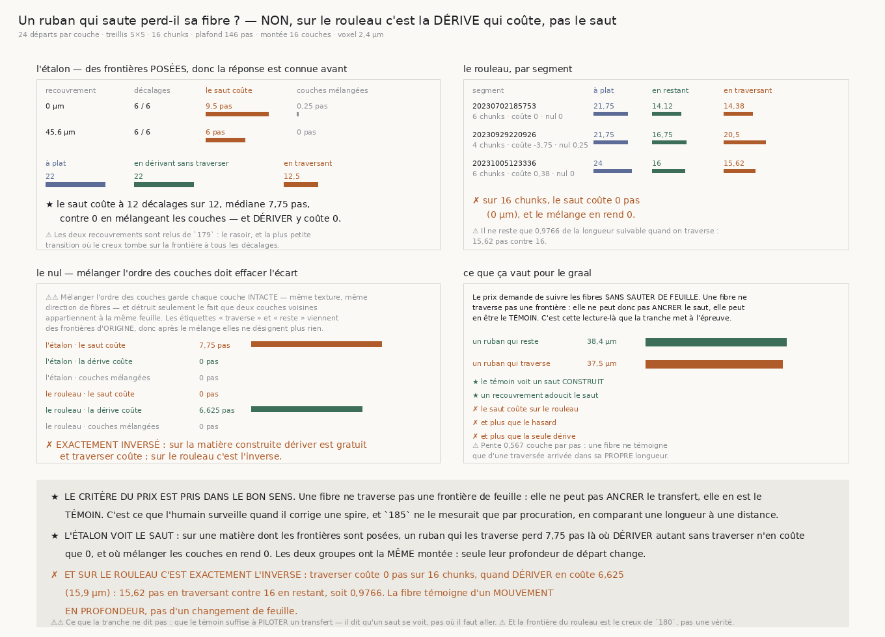

# `187` — Un ruban qui saute perd-il sa fibre ?

*Le témoin fonctionne. Et sur le rouleau, c'est la dérive qui coûte, pas le saut.*

## 0. Pourquoi cette tranche, et elle redresse la question

`R4-P35` demandait si la minorité qui franchit déjà **ancre** un transfert de spire à spire.

⚠⚠⚠ **Elle ne le peut pas, et c'est une propriété de la matière, pas de l'instrument.** Une fibre
appartient à une feuille et s'arrête avec elle : elle ne traverse **pas** une frontière, donc elle
n'a rien à dire sur ce qu'il y a de l'autre côté. Ce que le prix demande est l'inverse, et sa phrase
le dit : *« follow horizontal papyrus fibers... **and not jumping between sheets** »*. La continuité
d'une fibre est le **témoin** qu'on n'a **pas** sauté.

⭐⭐⭐⭐ **Et c'est exactement ce que l'humain surveille au transfert.** Il regarde si la surface qu'il
vient de poser est encore sur la même feuille, et il corrige quand elle a sauté. Un témoin
automatique de ce saut-là est, mot pour mot, ce qui le remplace. `185` ne l'avait mesuré que par
**procuration** — une longueur comparée à une distance ; ici le saut est **construit** et le témoin
est mis à l'épreuve dessus.

## 1. Le ruban, l'objet qui manquait

Une surface de segmentation n'est pas une couche : elle avance latéralement **et** dérive en
profondeur. Un **ruban** est la marche de `185` dont la profondeur **monte** d'un bout à l'autre. Il
lit la matière comme une segmentation la lit.

⚠⚠⚠ **Le contrôle qui décide est le ruban qui dérive SANS traverser.** Sans lui, un témoin qui
pénalise n'importe quel mouvement en profondeur passerait pour un détecteur de saut — et il serait
inutilisable, puisqu'une vraie feuille dérive. Les deux groupes ont donc **exactement la même
montée** ; seule leur profondeur de départ change, et c'est la **matière** qui décide lequel
traverse.

⚠⚠ **L'angle est celui de la couche de départ, tenu fixe.** C'est ce qu'un pipeline connaît : on est
sur une feuille, on lit sa direction de fibres, et on avance. Si le ruban passe sur une autre feuille
dont les fibres pointent ailleurs, la marche quitte la crête — et c'est l'effet mesuré.

⚠ La montée vaut la **moitié** de l'espacement des frontières que la matière porte : plus grande,
tout ruban traverserait et le contrôle n'existerait pas. C'est la borne que `184` a dérivée pour sa
plage de décalage, et pour la même raison.

## 2. Deux défauts payés, et aucun n'a été trouvé en relisant

⚠⚠⚠ **Le premier rendait la mesure aveugle par construction.** Le plafond du ruban valait celui de
`185` — de quoi franchir un pas entre deux feuilles, soit **146** pas — alors qu'une fibre n'en
survit qu'une vingtaine. La montée s'étalait donc sur tout le parcours et la traversée arrivait
**longtemps après** que la crête était morte. L'étalon l'a montré nu : le témoin ne voyait pas une
frontière **posée**.

⭐ **Une fibre ne peut témoigner que d'une traversée qui arrive dans sa propre longueur.** Le plafond
se lit donc dans la matière : c'est la longueur que le ruban **plat** atteint ici, par le même
suiveur et les mêmes départs. Il vaut **22** pas sur l'étalon et **32** sur le rouleau.

⚠⚠⚠ **Le second faisait mesurer la densité de la feuille et non la fibre**, et il a fallu un
**instrument** pour le trancher après deux hypothèses fausses — le recouvrement, puis la phase. Le
plancher était la médiane du **bloc** ; or une matière empilée porte un profil de densité en
profondeur, et dans la fixture il est **deux fois plus ample** que la modulation des fibres. Des
couches entières tombaient donc sous le plancher et cassaient la suite pour une raison qui n'est **pas** la
fibre. Les longueurs déclinaient continûment avec la couche de départ, **sans aucune marche à la
frontière**. Le plancher de chaque couche — celui de `185` — répare tout.

## 3. L'étalon : le témoin voit le saut, aux douze décalages

Les frontières sont **posées** et non relues, et les deux recouvrements viennent de `179` : le
**rasoir**, qu'il nomme comme le contrôle vide, et **45,6** µm, la plus petite transition où le creux
tombe sur la frontière à tous les décalages.

| recouvrement | décalages où le saut coûte | coût médian | couches mélangées |
|---|---:|---:|---:|
| **0** µm (rasoir) | **6 / 6** | **9,5** pas | **0,25** pas |
| **45,6** µm | **6 / 6** | **6** pas | **0** pas |

★ **Le saut coûte aux 12 décalages sur 12**, coût médian **7,75** pas, contre **0** en mélangeant
l'ordre des couches. Le ruban plat atteint **22** pas, celui qui dérive **sans** traverser en atteint
**22** aussi — **dériver y coûte 0** — et celui qui traverse tombe à **12,5** au rasoir.

⭐ **Et un recouvrement adoucit le saut** : **9,5** au rasoir contre **6** à 45,6 µm. Une frontière
qui se recouvre est un saut moins net, donc un témoin moins fort.

⚠⚠ **Le nul est le mélange de l'ORDRE des couches.** Il garde chaque couche intacte — même texture,
même direction de fibres — et détruit seulement le fait que deux couches voisines appartiennent à la
même feuille. Les étiquettes « traverse » et « reste » viennent des frontières d'**origine**, donc
après le mélange elles ne désignent plus rien : les deux groupes doivent s'égaler, et ils s'égalent.

## 4. Ce que le rouleau rend, et c'est exactement l'inverse

| segment | à plat | en restant | en traversant | la dérive coûte | le saut coûte | le nul |
|---|---:|---:|---:|---:|---:|---:|
| `20230702185753` | **21,75** | **14,125** | **14,375** | **7,875** | **0** | **0** |
| `20230929220926` | **21,75** | **16,75** | **20,5** | **4,625** | **−3,75** | **0,25** |
| `20231005123336` | **24** | **16** | **15,625** | **6,625** | **0,375** | **0** |

⭐ **La dérive coûte dans les trois segments** — 7,875, 4,625 et 6,625 pas — là où le saut ne coûte
dans aucun.

✗ Sur **16** chunks, **le saut coûte 0 pas** — **0** µm — et le mélange des couches en rend **0**
aussi. Il reste **0,9766** de la longueur suivable quand le ruban traverse : **15,625** pas contre
**16**.

⭐⭐⭐⭐ **Mais dériver coûte 6,625 pas, soit 15,9 µm.** Le ruban plat atteint **21,75** pas et celui
qui dérive sans traverser n'en atteint que **16**. Sur la matière construite, dériver est **gratuit**
et traverser coûte **7,75** ; sur le rouleau, dériver coûte **6,625** et traverser ne coûte **rien**.

**La fibre du rouleau témoigne d'un mouvement en profondeur, pas d'un changement de feuille.**

## 5. Ce que ça veut dire

Le témoin existe et il fonctionne : sur une matière dont les frontières sont posées, il les voit à
tous les décalages, à deux recouvrements, et le mélange des couches efface l'écart. Ce qu'il ne
trouve pas, il ne le trouve pas faute de sensibilité — il ne le trouve pas parce que **la matière ne
le porte pas**.

⚠⚠ **Et la tranche ne peut pas séparer deux causes**, donc elle les nomme : ou bien le creux de
cohérence de `180` n'est pas une frontière qui change la direction des fibres, ou bien la texture du
rouleau ne persiste pas d'une couche à l'autre. La seconde est soutenue par la mesure elle-même —
dériver coûte à elle seule **un quart** de la longueur suivable — et elle s'accorde avec `182` (la
profondeur n'est périodique à **aucun** pas) et avec `181` (espacement médian **23,5** couches, moins
qu'un pli).

## 6. Ce que cette tranche ne dit pas

⚠ **Elle ne dit pas que le témoin suffirait à PILOTER un transfert.** Il dit qu'un saut se voit, pas
où il faut aller.

⚠ **La frontière du rouleau est le creux de `180`, pas une vérité.** Des chunks ont été écartés faute
d'en porter deux, et l'espacement qui fixe la montée se lit dans ces creux-là.

⚠ **La pente est une limite géométrique et non un réglage** : **0,567** couche par pas sur le rouleau,
**0,818** sur l'étalon. Une surface qui dérive plus **lentement** que cette pente ne sera jamais prise
en faute par une fibre, quelle que soit la qualité du témoin — elle n'aura pas traversé dans la
longueur d'une fibre.

⚠ Et une garde de figure n'a **pas** attrapé une ligne posée sous la bordure d'un panneau :
`textes_hors_cadre` ne juge que les textes qui **commencent** dans un cadre. C'est en regardant
l'image qu'elle a été vue.

## 7. Ce qui est ouvert

`R4-P35` se ferme : la minorité qui franchit n'ancre rien, et le témoin qu'on pouvait en tirer ne
trouve rien à témoigner sur cette matière.

⭐ **Ce que la mesure laisse à sa place est un nombre qui n'était pas là** : sur le rouleau, **une
dérive en profondeur de 16 couches coûte un quart de la longueur suivable**. Ce n'est pas le saut qui
casse la fibre, c'est le mouvement. La question devient donc : **jusqu'où une surface peut-elle
dériver avant que la matière cesse de se lire**, et cette distance est-elle celle qu'un transfert
demande ?
