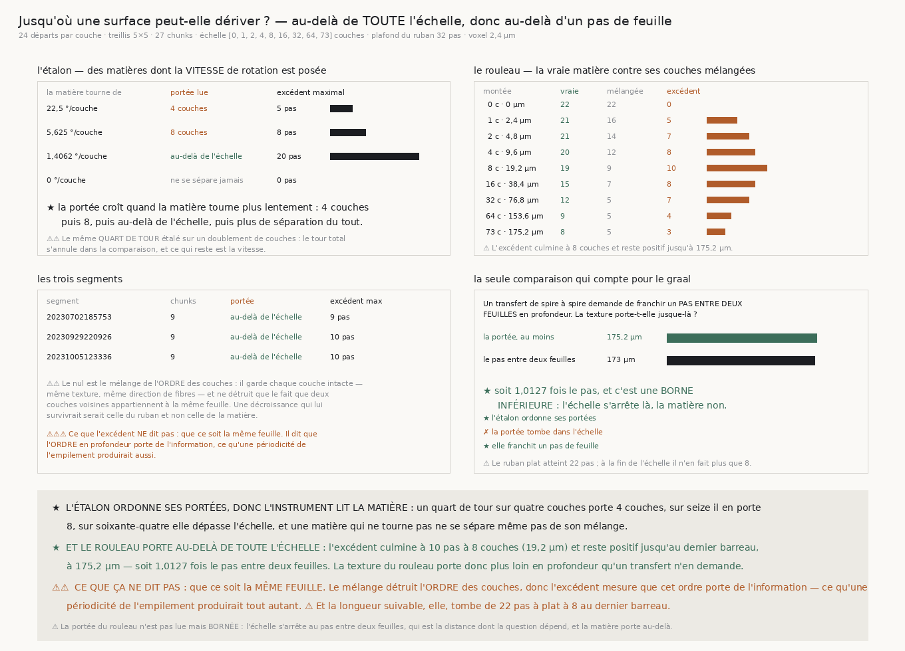

# `188` — Jusqu'où une surface peut-elle dériver avant que la matière cesse de se lire ?

*Au-delà de toute l'échelle. La texture porte en profondeur plus loin qu'un transfert n'en demande.*

## 0. Pourquoi cette tranche, et c'est `R4-P36` qui la nomme

`187` a fermé la voie du témoin de saut et, ce faisant, a rendu un nombre que rien n'avait mesuré :
sur le rouleau, une dérive en profondeur de seize couches coûte **6,625** pas de longueur suivable sur
un ruban qui en atteint **21,75** à plat. Ce n'est pas le saut qui casse la fibre, c'est le
**mouvement**.

⭐⭐⭐⭐ **Et la réponse à la question qui suit est une longueur, pas un verdict.** On fait de la montée
du ruban une **échelle** et l'on regarde à quel barreau la matière réelle cesse de rendre plus qu'une
matière dont l'**ordre des couches** est mélangé. Ce point n'est pas un seuil choisi : c'est le
**croisement de deux courbes mesurées**, et il a une unité.

## 1. L'échelle, et ce qu'elle doit pouvoir exprimer

Les montées vont de **0** à **73** couches en doublant : **0, 1, 2, 4, 8, 16, 32, 64, 73**.

⚠ Le **doublement** parce que la réponse cherchée est un ordre de grandeur — une échelle linéaire
dépenserait presque tous ses barreaux là où rien ne bouge. **0** est le barreau de référence, la
marche à plat de `185`.

⚠⚠⚠ **Et le dernier barreau est le pas entre deux feuilles lui-même, arrondi vers le haut.** Un
doublement ne tombe pas dessus : l'échelle s'arrêterait à **64** couches, soit **153,6** µm, et
l'énoncé « la portée franchit-elle un pas entre deux feuilles » deviendrait **une vérification qui ne
peut pas réussir** — le pendant exact d'une vérification qui ne peut pas échouer. Une échelle qui ne
sait pas exprimer la distance à laquelle on la compare ne peut jamais y répondre.

⚠⚠ Les deux pièges de `187` sont tenus : le **plafond du ruban** se lit dans la matière — c'est la
longueur qu'une fibre y survit à plat, **32** pas ici — et le **plancher** se lit dans **chaque
couche**.

## 2. L'étalon : une échelle de VITESSES, et il a fallu la mesure pour le comprendre

⚠⚠⚠ **Une première version faisait varier le nombre de PLIS de `VolumeFabriqueAFibres`**, en croyant
faire varier l'espacement des frontières. Or ce volume étale un **demi-tour par feuille** quel que
soit son nombre de plis : huit plis et deux plis tournent donc à la **même vitesse**, et les trois
matières ont rendu la même chose. **Ce qui gouverne la portée n'est pas l'espacement, c'est la vitesse
à laquelle la direction des fibres change en profondeur.**

L'étalon est donc le même **quart de tour** étalé sur un doublement de couches — le tour total
s'annule dans la comparaison et ce qui reste est la vitesse.

| la matière tourne de | portée lue | excédent maximal |
|---|---|---:|
| **22,5** °/couche | **4** couches | **5** pas |
| **5,625** °/couche | **8** couches | **8** pas |
| **1,4062** °/couche | **au-delà de l'échelle** | **20** pas |
| **0** °/couche | **ne se sépare jamais** | **0** pas |

★ **La portée croît quand la matière tourne plus lentement**, et une matière qui ne tourne pas ne se
sépare même pas de son mélange. L'instrument lit donc la matière et non sa propre échelle.

⚠⚠⚠ **Trois issues, et elles sont ordonnées.** Une portée peut tomber **dans** l'échelle, la
**dépasser**, ou **ne pas exister** parce que la matière ne se sépare jamais de son mélange. Exiger
quatre nombres croissants aurait rendu le contrôle indécidable dès qu'une portée sort de l'échelle —
ce qu'une matière lente **doit** faire.

## 3. Le nul, et ce qu'il price exactement

Mélanger l'**ordre** des couches garde chaque couche **intacte** — même texture, même direction de
fibres — et ne détruit que le fait que deux couches voisines appartiennent à la même feuille.

⚠⚠ Une décroissance qui **survivrait** au mélange serait celle du ruban et non celle de la matière.
Et à montée nulle le ruban ne quitte pas sa couche, donc l'excédent y vaut **0** par construction :
les deux courbes partent ensemble.

⚠⚠⚠ **Le croisement se cherche APRÈS le sommet**, et une première version le cherchait depuis le
début. L'avance de la vraie matière **monte** d'abord — à petite montée le mélange n'a pas encore eu
le temps de détruire grand-chose — puis retombe. Chercher depuis le premier barreau rendait une portée
d'**une** couche à une matière qui tourne lentement, c'est-à-dire l'inverse de ce qu'elle porte.

## 4. Ce que le rouleau rend

| montée | | la vraie matière | ses couches mélangées | excédent |
|---:|---:|---:|---:|---:|
| **0** c | **0** µm | **22** | **22** | **0** |
| **1** c | **2,4** µm | **21** | **16** | **5** |
| **2** c | **4,8** µm | **21** | **14** | **7** |
| **4** c | **9,6** µm | **20** | **12** | **8** |
| **8** c | **19,2** µm | **19** | **9** | **10** |
| **16** c | **38,4** µm | **15** | **7** | **8** |
| **32** c | **76,8** µm | **12** | **5** | **7** |
| **64** c | **153,6** µm | **9** | **5** | **4** |
| **73** c | **175,2** µm | **8** | **5** | **3** |

⭐⭐⭐⭐ **L'excédent culmine à 10 pas à 8 couches — 19,2 µm — et reste positif jusqu'au dernier
barreau.** La portée du rouleau n'est donc pas lue mais **bornée** : elle vaut **au moins 175,2** µm,
soit **1,0127** fois le pas entre deux feuilles. Les trois segments s'accordent, chacun sur **9**
chunks, avec des excédents maximaux de **9**, **10** et **10** pas.

**La texture du rouleau porte en profondeur plus loin qu'un transfert n'en demande.**

## 5. Ce que ça ne dit pas

⚠⚠⚠ **Ça ne dit pas que ce soit la même feuille.** Le mélange détruit l'**ordre** des couches, donc
l'excédent mesure que cet ordre **porte de l'information** — ce qu'une **périodicité de l'empilement**
produirait tout autant. Une spire ressemble à la suivante ; c'est une explication entière de ce qui
est mesuré, et cette tranche ne la sépare pas de la continuité de matière.

⚠ **Et la longueur suivable, elle, tombe** : de **22** pas à plat à **8** au dernier barreau. Ce qui
survit à la dérive est l'**avance** sur le hasard, pas la longueur. Un pipeline qui dériverait d'un
pas de feuille lirait donc une fibre trois fois plus courte, mais encore trois pas plus longue que ce
que du bruit lui donnerait.

⚠ La portée est une **borne inférieure**, pas une valeur : l'échelle s'arrête au pas entre deux
feuilles parce que c'est la distance dont la question dépend, et la matière porte au-delà.

## 6. Ce qui est ouvert

`R4-P36` est répondue, et pour la première fois depuis `182` la réponse est **positive** : l'ordre en
profondeur du rouleau porte de l'information sur au moins un pas entre deux feuilles.

⭐ **Ce que ça ouvre est nommé par ce que ça ne dit pas.** Il reste à séparer deux explications d'un
seul fait mesuré — **la continuité d'une même feuille** et **la périodicité de l'empilement** — et la
forme de la mesure est déjà là : une périodicité rendrait l'excédent **remonter** au voisinage d'un
multiple du pas, une continuité le ferait décroître partout. L'échelle actuelle s'arrête juste après
le premier pas et ne peut pas voir cette remontée.
