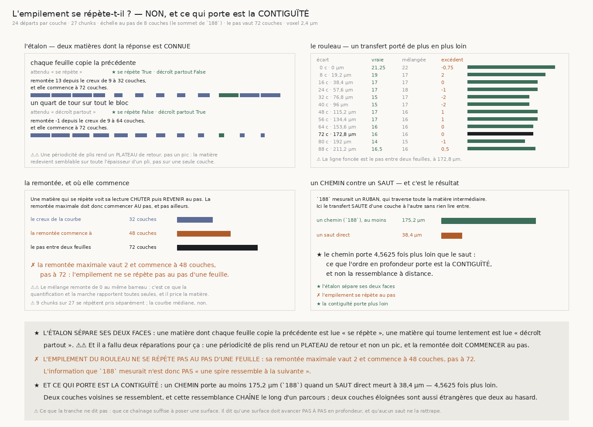

# `189` — L'empilement se répète-t-il, ou est-ce la même feuille ?

*Ni l'un ni l'autre tout à fait. Ce que l'ordre en profondeur porte est la CONTIGUÏTÉ.*

## 0. Pourquoi cette tranche, et c'est `R4-P37` qui la nomme

`188` mesure que mélanger l'ordre des couches détruit de l'information sur au moins **175,2** µm de
profondeur. Deux explications rendent ce fait entier et `188` ne les sépare pas : la **continuité
d'une même feuille**, et la **périodicité de l'empilement**, une spire ressemblant à la suivante.

⭐ La forme de la mesure est dans la courbe elle-même : une périodicité fait **revenir** la lecture au
voisinage d'un multiple du pas ; une continuité la fait décroître **partout**.

## 1. ⚠⚠⚠ Un ruban ne peut pas répondre, et c'est une erreur de conception que la sonde a trouvée

`188` mesurait un **ruban** : une marche dont la profondeur monte d'un bout à l'autre. Or un ruban
d'écart `m` **ne saute pas** `m` couches — il **traverse tout ce qu'il y a entre**. Sa crête meurt dans
la matière intermédiaire, et le fait que les deux bouts se ressemblent n'y change rien.

**Une périodicité ne peut donc PAS produire de remontée dans cette statistique-là.** Une matière
construite pour se répéter exactement l'a montré : le ruban n'y voyait aucune bosse.

⭐⭐⭐⭐ **Ce qu'il faut est un TRANSFERT.** On prend les départs et la direction des fibres d'une
couche, et on **marche avec eux** dans une couche située `m` plus loin, à plat, sans rien lire entre
les deux. C'est exactement la question du pipeline : *si ma surface se trompe de `m` couches, la
lecture de la fibre tient-elle encore ?*

⚠⚠ **L'angle reste celui de la couche SOURCE.** C'est ce qu'un pipeline connaît ; prendre celui de la
cible ferait mesurer « la couche cible a-t-elle des crêtes », ce qui n'est pas la question. Rien ne
l'exerçait — une sonde est passée au **vert** — et le contrôle qui l'exerce compare le transfert à la
lecture **en travers** plutôt qu'à un écart choisi.

## 2. L'échelle, et le même jeu de départs partout

Les écarts vont de **0** à **88** couches par pas de **8** — le **sommet de `188`**, relu et non tapé :
c'est l'échelle de corrélation de la matière, et un pas plus grossier ne résoudrait pas une bosse.
L'échelle dépasse le pas d'exactement **deux** sommets, pour qu'une bosse ait son autre versant.

⚠⚠⚠ **Le même jeu de départs sert à tous les barreaux.** Un écart qui approche la hauteur du bloc n'a
plus que quelques profondeurs admissibles ; laisser chaque barreau prendre ce qu'il peut ferait varier
l'échantillon le long de la courbe, et la **forme** — la seule chose que cette tranche lit — mêlerait
la matière et le rétrécissement.

⚠ Le pas vaut ici **72** couches, arrondi **au plus proche** et non vers le haut comme dans `188` :
là-bas le dernier barreau devait franchir le pas, ici l'échelle le dépasse de toute façon et ce qu'il
faut est un barreau **au** pas.

## 3. L'étalon, et il a fallu deux réparations

| matière construite | attendu | lu |
|---|---|---|
| chaque feuille copie la précédente | se répète | **se répète** ★ |
| un quart de tour sur tout le bloc | décroît partout | **décroît partout** ★ |

La périodique chute de **22** à **9** puis revient à **22** : remontée **13,0** depuis un creux atteint
à **32** couches, et elle **commence à 72** — le pas. La continue décroît de **30** à **6** sans jamais
revenir.

⚠⚠⚠ **Première réparation : une périodicité de plis rend un PLATEAU de retour, pas un pic.** La
matière redevient semblable sur toute l'épaisseur d'un pli, pas sur une seule couche. Un critère de
**maximum local strict** déclarait donc « pas de bosse » sur une matière construite pour en avoir une —
et l'étalon était rouge sur ses **deux** faces.

⚠⚠⚠ **Seconde réparation : la remontée doit COMMENCER au pas.** La règle réparée se contentait
d'abord de « la valeur au pas dépasse le creux », ce qu'un frisson de médiane suffit à satisfaire :
elle ne testait pas « au pas » du tout, seulement « au-dessus du creux quelque part ». **Elle
n'implémentait pas son propre énoncé.** On prend maintenant le **maximum d'après le creux** et l'on
regarde à quel barreau il est atteint **pour la première fois**.

⚠⚠ Et la remontée du **mélange** est lue au même barreau, comme la porte l'exigeait : le mélange n'a
plus d'ordre en profondeur, donc ce qu'il remonte est ce que la quantification et la marche rapportent
toutes seules.

## 4. Ce que le rouleau rend

| écart | | la vraie matière | ses couches mélangées | excédent |
|---:|---:|---:|---:|---:|
| **0** c | **0** µm | **21,25** | **22** | **−0,75** |
| **8** c | **19,2** µm | **19** | **17** | **2** |
| **16** c | **38,4** µm | **17** | **17** | **0** |
| **24** c | **57,6** µm | **17** | **18** | **−1** |
| **32** c | **76,8** µm | **15** | **17** | **−2** |
| **40** c | **96** µm | **15** | **17** | **−2** |
| **48** c | **115,2** µm | **17** | **16** | **1** |
| **56** c | **134,4** µm | **17** | **16** | **1** |
| **64** c | **153,6** µm | **16** | **16** | **0** |
| **72** c | **172,8** µm | **16** | **16** | **0** |
| **80** c | **192** µm | **14** | **15** | **−1** |
| **88** c | **211,2** µm | **16,5** | **16** | **0,5** |

✗ **L'empilement ne se répète PAS au pas d'une feuille.** La remontée maximale vaut **2** et commence à
**48** couches, pas à **72** ; le mélange en remonte **0** au même barreau. Sur **27** chunks, **9** se
répètent pris séparément, mais la courbe médiane non.

**L'information que `188` mesurait n'est donc pas « une spire ressemble à la suivante ».**

## 5. Et ce qui porte est la contiguïté

La même règle que `188` — le croisement de la vraie matière avec son mélange — appliquée à cette
courbe rend une **portée du transfert de 16 couches, soit 38,4 µm**. `188` publiait, pour un **chemin**,
au moins **175,2** µm.

⭐⭐⭐⭐ **Un chemin porte 4,5625 fois plus loin qu'un saut direct.** Deux couches voisines se
ressemblent, et cette ressemblance **chaîne** le long d'un parcours ; deux couches éloignées sont aussi
étrangères que deux couches tirées au hasard.

Ce que l'ordre en profondeur du rouleau porte est donc la **contiguïté**, et non la ressemblance à
distance — ni une périodicité, ni une continuité qui survivrait à un saut.

## 6. Ce que cette tranche ne dit pas

⚠ **Elle ne dit pas que ce chaînage suffise à poser une surface.** Elle dit qu'une surface doit avancer
**pas à pas** en profondeur, et qu'aucun saut ne la rattrape.

⚠ **Neuf chunks sur vingt-sept se répètent pris séparément.** La courbe médiane ne le fait pas, et
c'est elle qui décide — mais ces neuf-là ne sont pas rien, et rien ici ne dit s'ils partagent quelque
chose.

⚠ Le bloc du dépôt ne fait que **109** couches : un seul pas y tient avec ses deux versants, deux
non. Une périodicité qui ne se manifesterait qu'au **deuxième** pas serait invisible ici.

## 7. Ce qui est ouvert

`R4-P37` est répondue : **ni périodicité, ni ressemblance à distance — la contiguïté**.

⭐ Et elle laisse une contrainte de conception, pas une question ouverte de mesure : **une surface qui
se pose en profondeur doit y avancer par pas contigus de moins de 38,4 µm**, faute de quoi elle n'a
plus rien à quoi se raccrocher. C'est une borne sur le PAS d'un déroulage, et c'est la première que la
chaîne rende.
