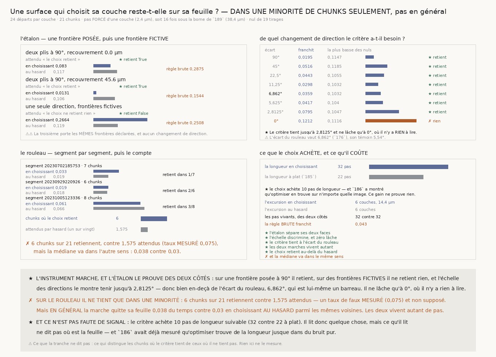

# `190` — Une surface qui choisit sa couche reste-t-elle sur sa feuille ?

*Dans une minorité de chunks seulement, et en général elle la quitte plus souvent que le hasard.*

## 0. Pourquoi cette tranche, et c'est `R4-P38` qui la nomme

`189` rend la première **borne sur le pas d'un déroulage** que la chaîne ait produite : ce que
l'ordre en profondeur du rouleau porte est la **contiguïté**, un chemin portant **4,5625** fois plus
loin qu'un saut direct. Une surface qui se pose en profondeur doit donc y avancer par pas contigus
de moins de **38,4** µm.

⭐⭐⭐⭐ La question du graal devient alors concrète et c'est celle-ci : **une surface posée pas à
pas, qui à chaque pas choisit la couche voisine où la lecture de la fibre se transfère le mieux,
dérive-t-elle vers la feuille ou s'en écarte-t-elle ?**

Le pas de cette marche vaut **une couche**, soit **2,4** µm : **16** fois sous la borne de `189`,
relue et jamais retapée. C'est le plus contigu que l'échantillonnage permette, donc aucune échelle
n'est choisie.

## 1. Ce qui se mesure n'est pas la longueur, c'est où la marche atterrit

⚠⚠⚠ `186` a établi qu'**optimiser trouve de la longueur sur n'importe quelle image** — son optimum
exact suit **127,2** µm de bruit pur. Une marche qui choisit la plus brillante de ses voisines
suivra donc plus loin qu'une marche à plat, et **ce gain ne prouve rien**. Ce qui prouve quelque
chose est l'endroit où elle se trouve à la fin : une marche tenue par la matière reste dans sa
feuille, une marche qui achète sa longueur va où la brillance l'appelle.

La statistique publiée est donc la **part des marches qui ont quitté leur pli**, et rien d'autre.

## 2. Quatre décisions, et chacune répare une panne déjà payée

⚠⚠⚠ **Le pas est FORCÉ** : la couche change d'exactement une couche à chaque pas latéral, jamais
zéro. Autoriser l'immobilité confondrait « la marche est tenue » et « la marche ne bouge pas » — le
glouton choisirait de rester, le hasard bougerait deux fois sur trois, et leurs excursions
différeraient par la **mobilité** et non par le critère. Forcée, la marche et son nul parcourent
exactement la même longueur en profondeur.

⚠⚠⚠ **La valeur comparée est celle au-dessus du plancher de sa propre couche**, et c'est le défaut
que `187` a payé. Une matière empilée porte un **profil de densité** en profondeur, d'amplitude
double de celle des fibres : comparer les brillances brutes ferait choisir à la marche la couche la
plus **dense** et non celle où la fibre continue. La règle brute est portée comme **contrôle nommé**
— sur le rouleau elle franchit **0,043** contre **0,038**, et sur l'étalon **0,2875** contre
**0,083**, soit plus que le hasard lui-même.

⚠⚠ **Les égalités se tranchent au hasard.** Un départage déterministe est une préférence cachée pour
un sens de la profondeur : sur une matière dont les couches se ressemblent, toute marche
descendrait tout droit. Ce n'est pas cosmétique — en cassant cette règle, l'étalon à frontière posée
passe au **rouge**.

⚠ Le plafond se lit dans la **matière** et le plancher dans **chaque couche**, les deux pièges de
`187` ; et l'angle reste celui de la couche de **départ**, qui est ce qu'un pipeline connaît.

## 3. Le nul, et la réparation que l'échelle a imposée

Le nul est une marche qui choisit **au hasard** parmi les mêmes voisines, avec la même poursuite
latérale et le même nombre de pas. C'est le piège de `184`, payé exactement.

⚠⚠⚠ **Une première version comparait à UN seul tirage, et c'était une règle qu'un frisson
suffisait à satisfaire.** Sur une matière sans aucun changement de direction — celle où il n'y a
rien à tenir — elle passait au vert pour **quatre dix-millièmes** d'écart. C'est la seconde
réparation de `189` sous un autre costume, et c'est le **barreau zéro de l'échelle** qui l'a montrée
nue. Le nul est désormais une **famille de 19 tirages**, comme dans `176` et `179`, et le glouton
doit franchir moins que **tous**.

⚠⚠⚠ **Et le taux de faux se MESURE au lieu de se supposer.** Un sur vingt est la garantie d'une
*permutation*, dont les tirages sont échangeables avec l'observé ; ici l'observé vient d'une **règle
différente**, donc rien ne garantit l'échangeabilité. Mesuré sur **40** réplicats de la matière à
écart nul : **0,075**, soit une fois et demie la garantie de **0,05**.

## 4. L'étalon, et il peut échouer des deux côtés

| matière construite | attendu | en choisissant | au hasard | la plus basse des **19** | la règle brute | lu |
|---|---|---:|---:|---:|---:|---|
| deux plis à **90°**, rasoir | le choix retient | **0,083** | **0,117** | **0,1135** | **0,2875** | **retient** ★ |
| deux plis à **90°**, recouvrement **45,6** µm | le choix retient | **0,0131** | **0,106** | **0,1028** | **0,1544** | **retient** ★ |
| une seule direction, frontières **fictives** | le choix ne retient rien | **0,2664** | **0,119** | **0,1124** | **0,2508** | **ne retient rien** ★ |

⚠⚠ C'est la colonne « la plus basse des **19** » que le verdict compare, jamais la médiane : le
glouton doit franchir moins que **tous** les tirages du nul, faute de quoi un frisson suffirait.

⚠⚠ La troisième porte **exactement les mêmes couches-frontières déclarées** et le même étiquetage
des plis ; ce qui lui manque est le **changement de direction**. C'est un contrôle sur la forme et
non sur la conséquence, et l'instrument y franchit **plus** que le hasard.

## 5. De quel changement de direction le critère a-t-il besoin ?

L'échelle va de l'écart de la fixture à celui du rouleau, tous deux relus de `176`, puis descend
sous le **témoin** de l'estimateur et finit à **zéro**.

| écart | franchit | la plus basse des 19 | |
|---:|---:|---:|---|
| **90°** | 0,0195 | 0,1147 | retient ★ |
| **45°** | 0,0516 | 0,1185 | retient ★ |
| **22,5°** | 0,0443 | 0,1055 | retient ★ |
| **11,25°** | 0,0298 | 0,1032 | retient ★ |
| **6,862°** | **0,0359** | 0,1032 | **retient ★ — l'écart du ROULEAU** |
| **5,625°** | 0,0417 | 0,104 | retient ★ |
| **2,8125°** | 0,0795 | 0,1047 | retient ★ |
| **0°** | 0,1212 | 0,1116 | **ne retient rien ✗ — rien à lire** |

⚠⚠⚠ **Zéro est le dernier barreau parce que sans lui l'échelle ne peut rien dire.** Une échelle dont
tous les barreaux tiennent ressemble exactement à une échelle qui ne mesure rien.

⭐⭐⭐⭐ **L'explication évidente est RÉFUTÉE.** On pouvait croire que le critère échoue sur le rouleau
parce que sa bascule de spire à spire vaut **6,862°** contre **90°** sur la fixture (`176`,
**×0,076**). C'est faux : sur une matière construite portant **exactement** cet écart, le critère
tient très bien — **0,0359** contre **0,1032**. Il tient encore à **2,8125°**, soit **sous le témoin
de l'estimateur**. Il ne lâche qu'à **0°**.

## 6. Ce que le rouleau rend

| | en choisissant | au hasard | retient |
|---|---:|---:|---|
| segment `20230702185753`, 7 chunks | 0,033 | 0,019 | 1/7 |
| segment `20230929220926`, 6 chunks | 0,019 | 0,018 | 2/6 |
| segment `20231005123336`, 8 chunks | 0,061 | 0,066 | 3/8 |

★ **6** chunks sur **21** retiennent au-delà du hasard, contre **1,575** attendus avec le taux
**mesuré** de **0,075**. C'est la statistique de `176` et de `180`, et elle est positive.

✗ **Mais la médiane va dans l'autre sens** : la marche quitte sa feuille **0,038** du temps contre
**0,03** en choisissant au hasard parmi les mêmes voisines — **0,7895** fois seulement, donc elle
franchit **plus**.

⚠⚠ Les deux lectures sont publiées **ensemble**, y compris celle qui dérange : le compte dit qu'une
minorité retient au-delà du hasard, la médiane dit ce que la marche fait **en général**. Les faire
tenir dans un seul mot publierait un nombre juste sous un mauvais nom.

⚠ Et ce n'est pas que la marche meurt plus tôt : les deux vivent **32** pas exactement.

## 7. Et ce n'est pas faute de signal

| | |
|---|---:|
| la longueur en choisissant | **32** pas |
| la longueur à plat (`185`) | **22** pas |
| ce que le choix achète | **10** pas |
| l'excursion en profondeur | **6** couches, **14,4** µm |
| l'excursion au hasard | **6** couches |

⭐ Le critère **lit quelque chose** — il achète dix pas de longueur suivable — mais ce qu'il lit **ne
dit pas où est la feuille**. C'est très exactement ce que `186` avait mesuré d'une autre façon :
optimiser trouve de la longueur jusque dans du bruit pur, et cette longueur-là ne se paie pas en
justesse.

## 8. Ce que cette tranche ne dit pas

⚠⚠⚠ **Elle ne dit pas ce qui distingue les six chunks où le critère tient des quinze où il ne tient
pas.** Rien ici ne le mesure, et c'est la question qu'elle laisse ouverte. C'est la même forme que
la contradiction irréparable de `167` — une minorité réelle dont rien ne dit de quoi elle est faite.

⚠⚠ **Elle ne dit pas qu'aucun critère local ne puisse poser une surface.** Elle dit que **celui-là**
ne le peut pas, et que sa longueur ne le trahit pas — ce qui est la panne la plus dangereuse pour un
pipeline, puisqu'elle s'accompagne d'un indicateur qui s'améliore.

⚠ Le bloc ne fait que **109** couches et les frontières lues y sont **2** en médiane : la marche ne
se juge que sur un pas et demi de feuille, et la plupart des départs ne s'approchent jamais d'une
frontière. L'appariement contrôle cela — les deux marches partent des mêmes points — mais l'effet
mesuré est dilué.

⚠ **21** chunks sur les 27 du treillis sont lus : le reste est absent du dépôt ou porte moins de
deux frontières lisibles, et un chunk sans deux frontières est **refusé** plutôt que compté comme
« ne franchit pas ».

## 9. Ce qui est ouvert

`R4-P38` est répondue, et la réponse est nuancée : **une surface qui choisit sa couche sur la
lecture de la fibre ne tient sa feuille que dans une minorité de chunks, et en général la quitte
plus qu'une surface qui choisit au hasard.**

⭐ Ce que ça ouvre est nommé par ce que ça ne dit pas : **six chunks sur vingt et un tiennent, et
rien ne dit de quoi ils sont faits.** L'instrument est là, l'étalon prouve qu'il marche, et la
question devient : qu'ont en commun les endroits où le rouleau se laisse suivre en profondeur ?
