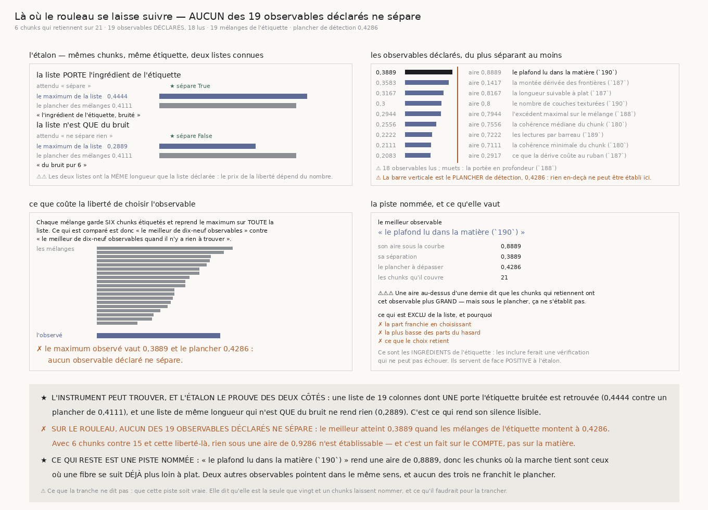

# `191` — Là où le rouleau se laisse suivre, et le prix de la question

*Aucun des dix-neuf observables déclarés ne sépare, et le plancher de détection dit pourquoi.*

## 0. Pourquoi cette tranche, et c'est `R4-P39` qui la nomme

`190` rend un fait sans explication : **6** chunks sur **21** voient une marche qui choisit sa couche
tenir sa feuille au-delà du hasard, contre **1,575** attendus — c'est réel, le taux de faux est
mesuré — et **rien ne dit de quoi ces six-là sont faits**.

⭐⭐⭐⭐ Or un déroulage n'a pas besoin qu'un critère marche partout : il a besoin de **savoir où il
marche**. Une surface qui sait où elle est fiable peut avancer là et demander de l'aide ailleurs ;
une surface qui l'ignore se trompe en silence, et `190` montre qu'elle se trompe **avec un
indicateur de qualité qui monte**.

## 1. ⚠⚠⚠ Le piège EST la tranche, pas un détail de méthode

Chercher ce qui sépare six chunks de quinze parmi une liste d'observables **est** une maximisation,
donc elle trouvera **toujours** quelque chose. C'est la leçon de `186` — l'optimum exact suit
**127,2** µm de bruit pur — et de `174`, où maximiser l'écart le trouvait là où il n'était pas.

Trois règles, et elles sont dans le code :

1. **La liste est DÉCLARÉE, fermée, et son nombre est publié.** Elle est écrite une fois, en tête de
   fichier, et chaque entrée nomme la mesure publiée d'où elle vient. Un observable ajouté après
   avoir vu les résultats serait une liberté non comptée ; en retirer un après coup le serait tout
   autant.
2. **La liberté du choix est PAYÉE par une statistique de FAMILLE** : le maximum sur toute la liste
   doit dépasser celui que rendent **19** mélanges de l'étiquette sur les mêmes chunks. C'est la
   statistique de `176`, de `179` et de `190`, avec le même taux de faux garanti — un sur vingt.
3. **Le PLANCHER DE DÉTECTION est publié** : la plus grande séparation que les mélanges eux-mêmes
   atteignent. C'est ce que six chunks contre quinze permettent de voir, et rien en dessous ne peut
   être établi ici, quoi qu'on mesure.

⚠⚠ **Et trois observables sont exclus délibérément** — la part franchie, la plus basse des tirages,
et ce que le choix retient. Ce sont les **ingrédients de l'étiquette** : les mettre dans la liste
ferait une vérification qui ne peut pas échouer. Ils servent de face **positive** à l'étalon, où
c'est exactement leur rôle.

## 2. La jointure, et elle n'a rien demandé à personne

⭐ **Toutes les tranches du rouleau lisent le même treillis et enregistrent leurs chunks sous les
mêmes coordonnées.** La clef `(segment, ligne, colonne)` existait déjà dans chaque mesure ; rien n'a
été ajouté pour cette tranche. Les **19** observables viennent de `180`, `187`, `188`, `189` et des
conditions de marche de `190`, lus **verbatim** dans leurs fichiers publiés.

⚠⚠ **Un chunk absent d'une source est un TROU pour cet observable-là**, jamais une valeur par
défaut : une colonne complétée serait une colonne dont une partie ne vient d'aucune mesure. `187`
n'en couvre que **16** sur **21**, et le mélange en tient compte tout seul puisqu'il porte sur
l'étiquette.

⚠ **Un observable que sa source ne rend nulle part est NOMMÉ**, jamais retiré en silence : la portée
en profondeur de `188` est muette ici — `188` l'avait publiée comme une **borne** et non comme une
valeur — et elle compte quand même dans la liberté qu'on s'est donnée.

## 3. La statistique, et pourquoi c'est un rang

L'aire sous la courbe est la probabilité qu'un chunk qui retient se classe au-dessus d'un chunk qui
ne retient pas. ⭐ **Avec six contre quinze c'est ce qu'il faut** : elle ne suppose aucune forme de
distribution, elle est insensible à une valeur aberrante, et elle vaut **0,5** quand l'observable ne
sait rien de l'étiquette.

⚠ Les égalités comptent une demie — sans cela une colonne constante rendrait **0** ou **1**, une
séparation parfaite pour une colonne qui ne dit rien. Et la séparation est **symétrique** : un creux
plus profond ou plus plat là où ça tient sont deux réponses également intéressantes, et n'en
admettre qu'une serait un choix déguisé en mesure.

## 4. L'étalon, et il peut échouer des deux côtés

| liste construite | attendu | maximum | plancher | lu |
|---|---|---:|---:|---|
| **19** colonnes dont une porte l'étiquette bruitée | sépare | **0,4444** | **0,4111** | **sépare** ★ |
| **19** colonnes de bruit pur | ne sépare rien | **0,2889** | **0,4111** | **ne sépare rien** ★ |

⚠⚠ Les deux listes ont la **même longueur** que la liste déclarée : le prix de la liberté dépend du
nombre, donc un étalon plus court serait un étalon plus facile.

⚠ La colonne qui porte l'étiquette est **bruitée** : une colonne qui *serait* l'étiquette rendrait
une séparation de **0,5** exactement, ce qu'aucun observable réel ne peut atteindre. Ce qu'il faut
est une colonne qui la porte avec du bruit.

⭐ **C'est ce qui rend le silence de l'instrument lisible.** Un chercheur qui ne retrouverait pas une
colonne portant l'étiquette ne pourrait rien trouver du tout ; un qui trouverait quelque chose dans
du bruit pur ne mesurerait que la liberté qu'on lui a donnée.

## 5. Ce que le rouleau rend

| séparation | aire | chunks | observable |
|---:|---:|---:|---|
| **0,3889** | **0,8889** | 21 | le plafond lu dans la matière (`190`) |
| **0,3583** | **0,1417** | 16 | la montée dérivée des frontières (`187`) |
| **0,3167** | **0,8167** | 16 | la longueur suivable à plat (`187`) |
| **0,3** | **0,8** | 21 | le nombre de couches texturées (`190`) |
| **0,2944** | **0,7944** | 21 | l'excédent maximal sur le mélange (`188`) |
| **0,2556** | **0,7556** | 21 | la cohérence médiane du chunk (`180`) |
| **0,2222** | **0,7222** | 21 | les lectures par barreau (`189`) |
| **0,2111** | **0,7111** | 21 | la cohérence minimale du chunk (`180`) |
| **0,2083** | **0,2917** | 16 | ce que la dérive coûte au ruban (`187`) |
| **0,1833** | **0,6833** | 21 | les profondeurs communes montantes (`189`) |
| **0,0889** | **0,4111** | 21 | la profondeur du creux (`180`) |
| **0,0722** | **0,5722** | 21 | la montée où l'excédent culmine (`188`) |
| **0,0556** | **0,4444** | 21 | la largeur du creux (`180`) |
| **0,05** | **0,55** | 21 | le nombre de frontières lues (`190`) |
| **0,0444** | **0,4556** | 21 | la couche où le creux tombe (`180`) |
| **0,0333** | **0,5333** | 16 | ce que le saut coûte au ruban (`187`) |
| **0,0222** | **0,4778** | 21 | l'excédent du creux sur ses mélanges (`180`) |
| **0,0222** | **0,4778** | 21 | la statistique de famille du creux (`180`) |

⚠ **Les dix-huit sont donnés, et c'est voulu** : la liste déclarée est ce que la famille paie, donc n'en publier que le haut laisserait croire qu'on en a essayé moins.

✗ **Aucun ne sépare.** Le maximum vaut **0,3889** et le plancher de détection **0,4286** : les
mélanges de l'étiquette montent plus haut que le meilleur observable réel.

⚠⚠⚠ **Et c'est un fait sur le COMPTE, pas sur la matière.** Avec **6** chunks contre **15** et cette
liberté-là, rien sous une aire de **0,9286** n'est établissable ici, quoi qu'on mesure.

## 6. Ce qui reste : une piste nommée

⭐ Le meilleur observable est **le plafond lu dans la matière** — la longueur qu'une fibre survit à
plat, lue par `187` et reprise par `190` — avec une aire de **0,8889**. Les chunks où la marche
tient sont donc ceux où une fibre se suit **déjà plus loin à plat**.

⚠⚠ **Deux autres observables pointent dans le même sens et ne sont pas indépendants de lui** : la
longueur suivable à plat de `187` (aire **0,8167**, la même quantité lue par une autre tranche) et
le nombre de couches texturées de `190` (aire **0,8**). Et la montée dérivée des frontières de `187`
va dans le sens inverse (aire **0,1417**), c'est-à-dire que les frontières y sont plus **espacées**.

⚠⚠⚠ **Aucun des trois ne franchit le plancher, donc rien n'est établi.** Ce qui est rendu est une
piste et son prix, pas un résultat.

## 7. Ce que cette tranche ne dit pas

⚠⚠⚠ **Elle ne dit pas que la piste soit vraie.** Elle dit qu'elle est la seule que vingt et un
chunks laissent nommer, et elle dit ce qu'il faudrait pour la trancher : assez de chunks pour que le
plancher descende sous une aire de **0,8889**.

⚠⚠ **Elle ne dit pas qu'aucun observable ne sépare** — elle dit qu'aucun des **19 déclarés** ne le
fait au-delà de la liberté qu'on s'est donnée. Un vingtième observable essayé maintenant serait une
liberté non comptée, et c'est exactement ce que la règle interdit.

⚠ La portée en profondeur de `188` est **muette** ici : cette tranche-là l'avait publiée comme une
borne inférieure, pas comme une valeur, donc la colonne est vide partout. Elle reste déclarée et
comptée.

## 8. Ce qui est ouvert

`R4-P39` est répondue par la négative, et la réponse porte sur le **compte** autant que sur la
matière : **rien ne s'établit avec six chunks contre quinze**.

⭐ Ce qui s'ouvre est nommé par le plancher lui-même : **il faut plus de chunks étiquetés**, et le
treillis en offre. `190` n'en a lu que **21** sur les **27** du treillis — les autres sont absents du
dépôt ou portent moins de deux frontières lisibles — et le dépôt tout entier en porte bien
davantage.
