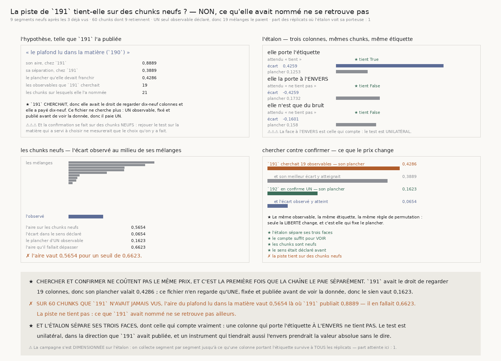

# `192` — La piste de `191` tient-elle sur des chunks qu'elle n'a jamais vus ?

*Non. Et c'est la première fois que la chaîne sépare le prix de CHERCHER de celui de CONFIRMER.*

## 0. Pourquoi cette tranche, et c'est `R4-P40` qui la nomme

`191` a cherché ce qui distingue les chunks où une surface tient sa feuille, parmi **19** observables
déclarés, et n'a rien établi : son meilleur atteignait **0,3889** quand le plancher de détection
valait **0,4286**. Mais elle a **nommé** une piste — le plafond lu dans la matière, aire **0,8889** —
et l'a écrite dans le registre.

⭐⭐⭐⭐ **Et c'est la différence entre chercher et confirmer, que cette chaîne n'avait jamais faite.**
`191` cherchait : elle avait le droit de regarder dix-neuf colonnes, donc elle a payé dix-neuf. `192`
ne cherche plus — **un seul observable, fixé et publié avant de voir la donnée**, donc il paie un.
Confondre les deux coûte des deux côtés : payer dix-neuf pour une hypothèse unique interdit de jamais
conclure, et n'en payer qu'un après avoir regardé dix-neuf confirme n'importe quoi.

## 1. Trois règles, et chacune interdit une tricherie

⚠⚠⚠ **La confirmation se fait sur des chunks NEUFS.** La piste a été choisie sur les trois premiers
segments ; ce fichier étiquette les **suivants**, dans l'ordre que le dépôt recense, et aucun
recouvrement. Rejouer le test sur la matière qui a servi à choisir ne mesurerait que le choix qu'on y
a fait.

⚠⚠ **Le sens est DÉCLARÉ, donc le test est unilatéral.** C'est légitime ici et nulle part ailleurs :
`191` a **publié** la direction — aire au-dessus d'une demie, donc un plafond plus **grand** là où la
marche tient — et cette direction est dans le registre, commitée, avant que ces chunks-ci n'existent
pour nous. Un test unilatéral dans une direction choisie après coup serait une tricherie ; dans une
direction publiée, c'est l'information qu'on a déjà.

⚠ **Rien de `190` n'est modifié ni rejoué différemment** : l'étiquetage passe par son `un_segment`,
avec ses départs, son pas forcé, son plancher par couche, ses dix-neuf tirages et sa graine. Une
seconde écriture de la marche serait une seconde définition de l'étiquette, libre de diverger — et
c'est l'étiquette qui est comparée d'un jeu de chunks à l'autre.

## 2. ⚠⚠⚠ Le premier essai était AVEUGLE, et c'est l'étalon qui l'a dit

Une première collecte a pris **trois** segments neufs. Son étalon est passé au **rouge** : une
colonne portant littéralement l'étiquette n'y survivait pas à la permutation. La campagne se
**dimensionne** donc sur l'étalon — on collecte segment par segment jusqu'à ce qu'une colonne
portant l'étiquette survive à **tous** les réplicats — et la montée est **enregistrée**, ce qui rend
la règle d'arrêt vérifiable au lieu d'affirmée :

| segments | chunks | qui retiennent | part des réplicats où l'étalon voit |
|---:|---:|---:|---:|
| **1** | **7** | **0** | **0** |
| **2** | **14** | **1** | **0,2** |
| **3** | **23** | **3** | **0,72** |
| **4** | **31** | **5** | **0,84** |
| **5** | **37** | **6** | **0,96** |
| **6** | **42** | **6** | **0,88** |
| **7** | **49** | **7** | **0,96** |
| **8** | **57** | **9** | **0,96** |
| **9** | **60** | **9** | **1** |

⭐⭐⭐⭐ **Un instrument aveugle ne publie rien sur la matière.** À trois segments l'étalon ne voyait
sa colonne porteuse que **0,72** du temps : un silence rendu là n'aurait pas voulu dire « la piste ne
tient pas », il aurait voulu dire « on ne peut pas voir ». La différence est toute la valeur du
contrôle.

⚠ La montée n'est pas monotone — **0,96** puis **0,88** puis **0,96** — parce qu'elle est elle-même
mesurée sur un nombre fini de réplicats. C'est la raison pour laquelle la règle exige **tous** les
réplicats et non un seuil : un seuil se ferait franchir par le bruit de la mesure du seuil.

⚠⚠ **Et cette règle d'arrêt ne peut pas favoriser l'hypothèse**, parce qu'elle ne regarde que le
nombre de chunks et combien retiennent — jamais l'observable testé. Une règle d'arrêt qui ne peut pas
connaître l'hypothèse ne peut pas la servir.

⚠ Elle exige **tous** les réplicats et non « la plupart » : un instrument qui voit neuf fois sur dix
rend un silence dont un dixième est du bruit, et c'est précisément le silence qu'on s'apprête à
publier.

## 3. L'étalon, et il peut échouer des trois côtés

| colonne construite | attendu | écart | plancher | lu |
|---|---|---:|---:|---|
| elle **porte** l'étiquette, bruitée | tient | **0,4259** | **0,1253** | **tient** ★ |
| elle la porte à l'**ENVERS** | ne tient pas | **−0,4259** | **0,1732** | **ne tient pas** ★ |
| elle n'est que du **bruit** | ne tient pas | **−0,1601** | **0,158** | **ne tient pas** ★ |

⭐⭐⭐⭐ **La face à l'ENVERS est celle qui compte**, et `191` ne l'avait pas. Le test étant
unilatéral, une colonne qui porte l'étiquette renversée **doit** échouer — un instrument qui la
tiendrait prendrait la valeur absolue sans le dire, et la direction publiée par `191` ne servirait à
rien.

## 4. Ce que les chunks neufs rendent

| | |
|---|---:|
| segments neufs collectés | **9** |
| chunks étiquetés | **60** |
| dont retiennent | **9** |
| l'aire du plafond lu dans la matière | **0,5654** |
| l'écart dans le sens déclaré | **0,0654** |
| le plancher d'UN observable | **0,1623** |
| l'aire qu'il fallait dépasser | **0,6623** |

✗ **La piste ne tient pas.** L'aire tombe de **0,8889** chez `191` à **0,5654** ici — à peine
au-dessus de l'indifférence — pour un seuil de **0,6623**.

## 5. Chercher contre confirmer : ce que le prix change

| | plancher | écart atteint |
|---|---:|---:|
| `191` cherchait **19** observables sur **21** chunks | **0,4286** | **0,3889** |
| `192` en confirme **1** sur **60** chunks | **0,1623** | **0,0654** |

⭐ **Le même observable, la même étiquette, la même règle de permutation** : seule la **liberté**
change, et c'est elle qui fixe le plancher. Il tombe de **0,4286** à **0,1623**, c'est-à-dire que
l'instrument voit désormais plus de deux fois plus fin — et il ne voit rien.

⭐⭐ **Et cela valide rétroactivement le refus de `191`.** Elle avait mesuré que son meilleur ne
franchissait pas son plancher et refusé de publier un résultat ; la confirmation dit qu'elle avait
raison. Le plancher a fait son travail.

## 6. Ce que cette tranche ne dit pas

⚠⚠⚠ **Elle ne dit pas qu'aucun observable ne sépare** — elle dit que **celui que `191` a nommé** ne
se retrouve pas. Les dix-huit autres n'ont pas été rejugés ici, et les rejuger maintenant sur cette
matière-ci serait exactement la recherche que `191` a déjà payée, avec un plancher qu'il faudrait
repayer.

⚠⚠ **Elle ne dit pas pourquoi.** Elle dit si le fait se retrouve, pas ce qui le produit.

⚠ **Les segments neufs retiennent moins** : **9** chunks sur **60**, soit **15 %**, contre **6** sur
**21** — **28,6 %** — sur les trois premiers. Rien ici ne dit d'où vient l'écart, et c'est une
propriété de l'étiquetage de `190`, pas de ce test.

## 7. Ce qui est ouvert

`R4-P40` est répondue par la négative : **ce que `191` avait nommé ne se retrouve pas sur soixante
chunks qu'elle n'avait jamais vus**, et l'étalon prouve que l'instrument pouvait le voir.

⭐ Ce qui reste est ce que `191` disait déjà, et que `192` durcit : **rien, dans ce que la chaîne sait
mesurer d'un chunk, ne dit où une surface pourra se poser.** La question du graal n'est donc pas
« quel observable prédit » mais **« que faudrait-il mesurer qui ne soit pas déjà là »** — et c'est une
question sur l'instrument, pas sur le rouleau.
