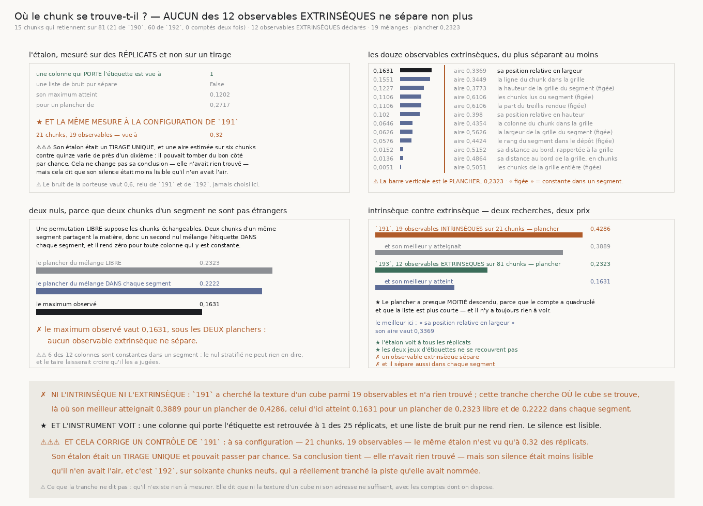

# `193` — Où le chunk se trouve-t-il, et est-ce que ça dit où une surface pourra se poser ?

*Non plus. Ni la texture d'un cube ni son adresse, et l'instrument prouve qu'il aurait vu.*

## 0. Pourquoi cette tranche, et c'est `R4-P41` qui la nomme

`191` a cherché parmi **19** observables et n'a rien établi ; `192` a confirmé que la piste qu'elle
avait nommée ne se retrouve pas. Mais les dix-neuf observables de `191` sont **tous intrinsèques** :
ils décrivent la texture d'un cube de matière sans jamais dire **où** ce cube se trouve. Un chunk au
bord d'un segment, là où la segmentation est la moins sûre, n'est pas un chunk du milieu.

⭐⭐⭐⭐ **Et c'est une NOUVELLE recherche, donc elle paie sa propre famille entière.** Ce n'est pas un
élargissement de la liste de `191` — qui rendrait son plancher faux rétroactivement — mais une liste
neuve, déclarée et fermée avant de regarder, d'un genre différent, et payée par des mélanges qui
reprennent le maximum sur **toute** la liste.

## 1. Quatre-vingt-un chunks, parce que l'extrinsèque ne coûte rien

Un observable extrinsèque ne demande **aucun téléchargement de matière** : il se lit dans l'adresse
du chunk et dans la forme de la grille de son segment, qui tient dans une seule requête de
métadonnées. Les **60** chunks que `192` a étiquetés rejoignent donc les **21** de `190` —
**81** au total, dont **15** retiennent, et **0** compté deux fois.

⚠⚠ **Les deux jeux portent la MÊME étiquette**, produite par le même `un_segment` de `190` avec les
mêmes départs, le même pas forcé et les mêmes dix-neuf tirages. `192` n'a pas rejoué la marche
autrement : il l'a rejouée ailleurs.

## 2. ⚠⚠⚠ Deux nuls, parce que deux chunks d'un segment ne sont pas étrangers

Une permutation **libre** suppose les chunks échangeables, or deux chunks d'un même segment
partagent la matière. Un second nul mélange donc l'étiquette **à l'intérieur** de chaque segment.

⚠⚠ Et il rend **zéro** pour toute colonne constante dans un segment — **6** des **12** le sont. C'est
ce qu'il **doit** dire : une colonne qui ne varie pas à l'intérieur d'un segment ne peut pas être
distinguée du regroupement des étiquettes par segment, et prétendre le contraire serait lire la
structure du dépôt pour une propriété de la matière. Elles restent **déclarées et nommées**, jamais
retirées.

## 3. ⭐⭐⭐⭐ L'étalon se mesure sur des RÉPLICATS, et cela corrige un contrôle de `191`

Une colonne portant l'étiquette bruitée est retrouvée à **1** des **25** réplicats, et une liste de
même longueur qui n'est que du bruit rend **0,1202** pour un plancher de **0,2717** : elle ne sépare
rien. Le silence de l'instrument est donc lisible.

⚠⚠⚠ **Mais la même mesure, faite à la configuration de `191` — 21 chunks, 19 observables — ne voit
la colonne porteuse qu'à 0,32 des réplicats.** Son étalon était un **tirage unique**, et une aire
estimée sur six chunks contre quinze varie de près d'un dixième : il pouvait tomber du bon côté par
chance.

⭐ **Cela ne change pas sa conclusion** — elle n'avait rien trouvé, et son plancher était honnête —
**mais son silence était moins lisible qu'il n'en avait l'air**, et c'est `192`, sur soixante chunks
neufs, qui a réellement tranché la piste qu'elle avait nommée.

⚠ Le bruit de la porteuse vaut **0,6**, relu de `191` et de `192`, jamais choisi ici.

## 4. Ce que les douze observables rendent

| séparation | aire | observable |
|---:|---:|---|
| **0,1631** | **0,3369** | sa position relative en largeur |
| **0,1551** | **0,3449** | la ligne du chunk dans la grille |
| **0,1227** | **0,3773** | la hauteur de la grille du segment *(figée dans un segment)* |
| **0,1106** | **0,6106** | les chunks lus du segment *(figée dans un segment)* |
| **0,1106** | **0,6106** | la part du treillis rendue *(figée dans un segment)* |
| **0,102** | **0,398** | sa position relative en hauteur |
| **0,0646** | **0,4354** | la colonne du chunk dans la grille |
| **0,0626** | **0,5626** | la largeur de la grille du segment *(figée dans un segment)* |
| **0,0576** | **0,4424** | le rang du segment dans le dépôt *(figée dans un segment)* |
| **0,0152** | **0,5152** | sa distance au bord, rapportée à la grille |
| **0,0136** | **0,4864** | sa distance au bord de la grille, en chunks |
| **0,0051** | **0,5051** | les chunks de la grille entière *(figée dans un segment)* |
✗ **Aucun ne sépare.** Le maximum vaut **0,1631** — l'aire de **0,3369** dit que les chunks qui
retiennent sont plutôt à **gauche** de leur segment — contre un plancher de **0,2323** en mélange
libre et **0,2222** en mélange dans chaque segment. Il est sous les **deux**.

⚠ Les douze sont donnés, et c'est voulu : la liste déclarée est ce que la famille paie, donc n'en
publier que le haut laisserait croire qu'on en a essayé moins.

## 5. Intrinsèque contre extrinsèque

| | observables | chunks | plancher | meilleur |
|---|---:|---:|---:|---:|
| `191`, **intrinsèque** | **19** | **21** | **0,4286** | **0,3889** |
| `193`, **extrinsèque** | **12** | **81** | **0,2323** | **0,1631** |

⭐ **Le plancher a presque de moitié descendu** — le compte a quadruplé et la liste est plus courte
— et il n'y a toujours rien à voir. Ce n'est donc pas une question de finesse : l'instrument voit
deux fois mieux et ne voit rien.

## 6. Ce que cette tranche ne dit pas

⚠⚠⚠ **Elle ne dit pas qu'il n'existe rien à mesurer.** Elle dit que ni la texture d'un cube ni son
adresse ne suffisent, **avec les comptes dont on dispose** — et que ces comptes permettent
désormais de voir une aire de **0,7323**, ce que `191` ne permettait pas.

⚠⚠ **Elle ne juge pas les six colonnes figées par le nul stratifié.** Une propriété de segment —
sa taille, son rang, la part de treillis qu'il rend — ne peut pas être distinguée du regroupement
des étiquettes par segment avec ce nul-là. Le mélange libre, lui, les juge, et aucune ne passe.

⚠ **Les observables extrinsèques disponibles sont pauvres.** Ils décrivent la position d'un chunk
**dans son segment**, pas dans le **rouleau** : ni rayon depuis l'axe, ni rang de spire, ni
courbure. Ces trois-là demanderaient de relier chaque chunk à la géométrie du rouleau entier, ce
qu'aucune mesure publiée ne fait par chunk.

## 7. Ce qui est ouvert

`R4-P41` est répondue par la négative sur les observables que la chaîne peut produire **sans
nouvelle mesure**.

⭐ Ce qui s'ouvre est ce que la tranche ne pouvait pas faire : **relier chaque chunk à la géométrie
du rouleau** — son rayon depuis l'axe, son rang de spire — ce qui n'est pas une nouvelle statistique
de texture mais un nouveau **rattachement**. `laxe_est_une_courbe` et `espacement_spires` mesurent
déjà ces quantités sur le maillage ; rien ne les porte encore jusqu'au chunk.
