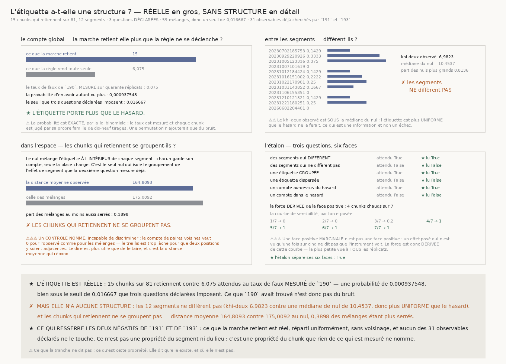

# `194` — L'étiquette a-t-elle une structure, ou la chaîne poursuit-elle du bruit ?

*Réelle en gros, sans structure en détail — et c'est ce qui resserre les deux négatifs.*

## 0. Pourquoi cette tranche

`191` a cherché parmi **19** observables intrinsèques, `193` parmi **12** extrinsèques, et aucun des
**31** ne sépare les chunks où une surface tient sa feuille de ceux où elle ne la tient pas. Avant
d'en déclarer un trente-deuxième, il faut demander ce que la chaîne n'a jamais demandé : **cette
étiquette porte-t-elle seulement une structure ?**

⭐⭐⭐⭐ **Et trois questions suffisent, toutes trois répondues sans un seul téléchargement.** Elles
sont déclarées avant de regarder, et le nombre de mélanges est **dérivé** de leur nombre : la chaîne
se donne un sur vingt par famille depuis `176`, donc trois questions exigent de résoudre un sur
soixante, et **59** tirages sont le plus petit nombre qui le permette.

⚠⚠ **Ce fichier ne cherche rien.** Aucune liste, aucun maximum, aucun observable — trois questions
écrites avant de regarder, trois réponses.

## 1. Le compte global : la marche retient-elle plus que la règle ne se déclenche ?

| | |
|---|---:|
| ce que la marche retient | **15** sur **81** |
| ce que la règle rend toute seule | **6,075** |
| le taux de faux de `190`, **mesuré** sur 40 réplicats | **0,075** |
| la probabilité d'en avoir autant ou plus | **0,000937548** |
| le seuil que trois questions déclarées imposent | **0,016667** |

★ **L'étiquette porte plus que le hasard.** Ce que `190` avait trouvé n'est donc pas du bruit.

⚠ La probabilité est **exacte**, par la loi binomiale : le taux est mesuré et chaque chunk est jugé
par sa propre famille de dix-neuf tirages. Une permutation n'ajouterait ici que du bruit à un calcul
qui n'en a pas besoin.

## 2. Entre les segments : diffèrent-ils ?

| segment | taux | | segment | taux |
|---|---:|---|---|---:|
| `20230702185753` | **0,1429** | | `20231022170901` | **0,25** |
| `20230929220926` | **0,3333** | | `20231031143852` | **0,1667** |
| `20231005123336` | **0,375** | | `20231106155351` | **0** |
| `20231007101619` | **0** | | `20231210121321` | **0,1429** |
| `20231012184424` | **0,1429** | | `20231221180251` | **0,25** |
| `20231016151002` | **0,2222** | | `20260602204401-5753_-7` | **0** |

✗ **Les segments ne diffèrent pas.** Le khi-deux observé vaut **6,9823** contre une médiane de nul
de **10,4537**, et **0,8136** des mélanges en rendent au moins autant.

⚠⚠ **Et le khi-deux observé est SOUS la médiane du nul** : l'étiquette est plus **uniforme** que le
hasard ne la ferait. C'est une information et non un échec, et c'est pourquoi le verdict dit « les
segments diffèrent » et jamais « le test a échoué ».

⚠⚠⚠ **Cela corrige une lecture que `192` invitait.** Sa tranche notait que les segments neufs
retenaient moins — **9** sur **60** contre **6** sur **21** — en disant honnêtement que rien ne
disait d'où venait l'écart. La réponse est qu'**il n'y a pas d'écart** : la répartition est
remarquablement uniforme, et les deux comptes sont ce que le hasard rend sur des tailles
différentes.

## 3. Dans l'espace : les chunks qui retiennent se groupent-ils ?

Le nul mélange l'étiquette **à l'intérieur** de chaque segment : chacun garde exactement son compte,
seule la place change. C'est le seul nul qui isole le groupement de l'effet de segment que la
deuxième question mesure déjà.

| | |
|---|---:|
| la distance moyenne observée | **164,8093** |
| celle des mélanges | **175,0092** |
| part des mélanges au moins aussi serrés | **0,3898** |

✗ **Les chunks qui retiennent ne se groupent pas.**

⚠⚠⚠ **Et un CONTRÔLE NOMMÉ, incapable de discriminer** : le compte de paires voisines vaut **0**
pour l'observé comme pour tous les mélanges — le treillis est trop lâche pour que deux positions y
soient adjacentes. Le dire est plus utile que de le taire, et c'est la distance moyenne qui répond.

## 4. L'étalon, et il peut échouer des six côtés

| matière d'étiquette construite | attendu | lu |
|---|---|---|
| des segments qui **diffèrent** | diffèrent | **diffèrent** ★ |
| des segments qui ne diffèrent pas | ne diffèrent pas | **ne diffèrent pas** ★ |
| une étiquette **groupée** | se groupe | **se groupe** ★ |
| une étiquette dispersée | ne se groupe pas | **ne se groupe pas** ★ |
| un compte au-dessus du hasard | porte plus | **porte plus** ★ |
| un compte dans le hasard | ne porte pas plus | **ne porte pas plus** ★ |

⭐⭐⭐⭐ **Et la force de la face positive est DÉRIVÉE, jamais choisie.** Une face positive
*marginale* n'est pas une face positive : un effet posé qui n'est vu qu'une fois sur cinq ne dit pas
que l'instrument voit, il dit qu'il voit parfois. La courbe de sensibilité est donc mesurée —

| force posée | 1/7 | 2/7 | 3/7 | 4/7 | 5/7 | 6/7 | 7/7 |
|---|---:|---:|---:|---:|---:|---:|---:|
| part des réplicats où l'instrument voit | **0** | **0** | **0,2** | **1** | **1** | **1** | **1** |

— et la face retenue est **4/7**, la plus petite vue à **tous** les réplicats.

## 5. Ce que les trois réponses disent ensemble

⭐⭐⭐⭐ **Ce que la marche retient est RÉEL, réparti UNIFORMÉMENT, SANS VOISINAGE, et aucun des 31
observables déclarés ne le touche.** Ce n'est donc ni une propriété du segment ni une propriété du
lieu : c'est une propriété du **chunk**, que rien de ce qui est mesuré ne nomme.

⭐ Et cela **resserre** les deux négatifs de `191` et de `193` au lieu de les répéter : ils disaient
« aucun observable ne sépare », ce qui laissait ouverte la possibilité qu'il n'y eût rien à séparer.
Il y a quelque chose.

## 6. Ce que cette tranche ne dit pas

⚠⚠⚠ **Elle ne dit pas ce qu'est cette propriété.** Elle dit qu'elle existe, et où elle n'est pas.

⚠⚠ **Elle ne dit pas que l'étiquette soit sans structure spatiale À TOUTE ÉCHELLE.** Le treillis
n'offre que quelques positions par segment, et le contrôle nommé montre qu'aucune paire n'y est
adjacente : un groupement à l'échelle d'un chunk voisin serait invisible ici. Ce qui est mesuré est
l'absence de groupement à l'échelle du treillis.

⚠ **Trois questions déclarées sont trois chances**, et elles sont payées : le seuil de chacune est
**0,016667** et non un sur vingt. La seule qui le franchit le franchit de plus d'un ordre de
grandeur.

## 7. Ce qui est ouvert

Il reste une propriété du chunk, réelle, que trente et un observables ne nomment pas.

⭐ Ce qui s'ouvre est ce que les trois tranches n'ont jamais fait : **regarder les quinze chunks qui
retiennent**. La chaîne les a comptés, permutés et corrélés ; elle ne les a pas ouverts. `186` a
montré qu'un défaut se voit en regardant une image, et `187` que deux hypothèses fausses cèdent
devant un instrument — mais aucune des deux n'a été essayée sur ces quinze-là.
