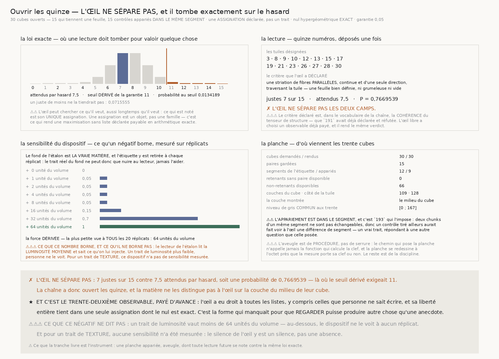
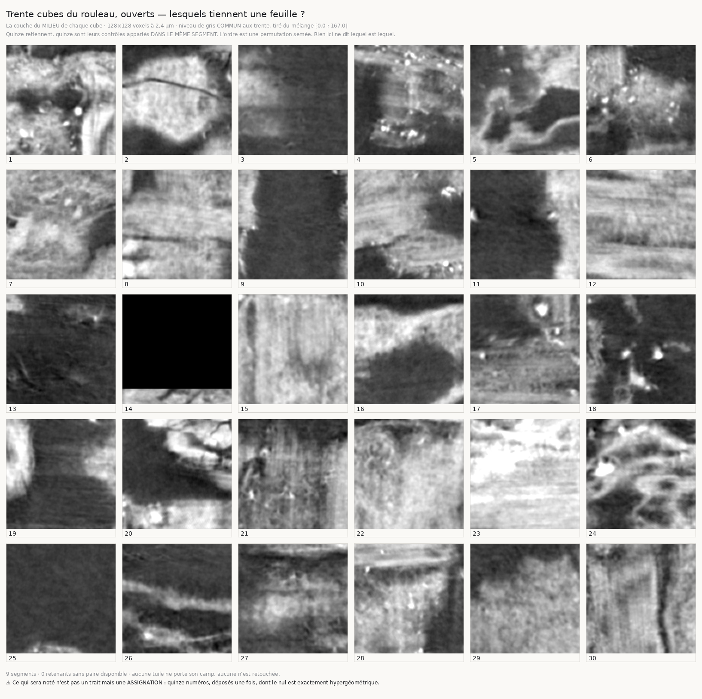

# `195` — Ouvrir les quinze, à l'aveugle

*L'œil a eu droit à toutes les listes, y compris celles que personne ne sait écrire — et il tombe exactement sur le hasard.*

## 0. Pourquoi cette tranche

`194` a établi que l'étiquette de `190` est **réelle** — **15** chunks sur **81** contre **6,075**
attendus, probabilité **0,000937548** — et qu'elle n'a **aucune structure** : les segments ne
diffèrent pas, les chunks retenants ne se groupent pas, et aucun des **31** observables déclarés par
`191` (**19** intrinsèques) et `193` (**12** extrinsèques) ne les touche.

⭐⭐⭐⭐ **Il reste donc une propriété du chunk, réelle, que rien de ce qui est mesuré ne nomme.** Or
la chaîne a compté ces quinze chunks, les a permutés et corrélés, et ne les a **jamais ouverts**.

⭐ Et ce dépôt sait ce que ça vaut : `186` a trouvé un défaut en **regardant** une image, `187` a vu
deux hypothèses fausses céder devant un **instrument**.

## 1. Le piège est écrit d'avance, et la forme qui le désamorce

⚠⚠⚠ **Regarder quinze cubes et y trouver un trait commun EST une maximisation sans liste
déclarée** — la pire forme de celle que `191` a payée. L'œil choisit son observable après coup et ne
le déclare jamais, donc il ne peut rien payer. `191` a payé dix-neuf observables, `193` douze ; un
œil libre en a une infinité.

⭐⭐⭐⭐ **La sortie est de renverser ce que l'œil déclare.** Il ne déclare pas un **trait**, il
déclare une **assignation** : quinze tuiles parmi trente, désignées sur une planche où rien ne dit
lesquelles retiennent. Une assignation est **un objet, pas une famille**, et son nul est **exact** —
c'est la loi hypergéométrique, comme le compte global de `194` est exactement binomial.

L'œil peut alors chercher ce qu'il veut, aussi longtemps qu'il veut, avec n'importe quel critère,
déclaré ou non : ce qui est noté est sa réponse unique. **C'est la forme qui manquait pour que
regarder produise autre chose qu'une anecdote.**

## 2. La planche : trente cubes, quinze paires, un contrôle dans le segment

| | |
|---|---:|
| cubes demandés / rendus | **30** / **30** |
| paires gardées | **15** |
| segments de l'étiquette / appariés | **12** / **9** |
| retenants sans paire disponible | **0** |
| non-retenants disponibles | **66** |
| couches du cube · côté de la tuile | **109 couches** · **128 voxels** |
| la couche montrée | le **milieu** du cube |
| niveau de gris commun aux trente, percentiles **1** et **99** | **[0 ; 167]** |

La planche porte donc **30 tuiles** : quinze cubes où la marche de `190` tient sa feuille, et
quinze contrôles.

⚠⚠ **Le contrôle est apparié DANS LE MÊME SEGMENT, et c'est `193` qui l'impose** : deux chunks d'un
même segment ne sont pas échangeables. Un contrôle tiré ailleurs aurait fait voir à l'œil une
différence **de segment** — un vrai trait, répondant à une autre question que celle posée.

⚠⚠⚠ **La couche montrée est nommée par l'arithmétique, jamais par ce qu'elle montre.** Le milieu
d'un cube est la seule couche désignable sans avoir regardé aucune des trente ; « la plus texturée »
ou « celle où le creux tombe » serait déjà une maximisation, et ce serait celle-là, exactement, que
la tranche interdit.

⚠⚠ **Le niveau de gris est commun aux trente, et c'est une décision.** Une normalisation **par
tuile** rendrait toutes les tuiles également contrastées, donc effacerait la luminosité et le
contraste — deux traits que ni `191` ni `193` n'ont déclarés, donc deux traits que personne n'a
encore payés. Un niveau tiré du mélange des trente est symétrique entre les deux camps et ne cache
rien.

⚠ **L'aveugle est de PROCÉDURE, pas de serrure.** Le chemin qui pose la planche n'appelle jamais la
fonction qui calcule la clef, et la planche se redessine **à l'octet près** que la mesure porte sa
clef ou non — sa batterie le vérifie en la lui ajoutant. Ce que le dispositif rend impossible est la
maximisation **inconsciente**, pas le mensonge délibéré. ⭐ En revanche l'**adresse** de chaque tuile
est publiée : la clef cesse d'être un nombre qu'il faut croire sur parole, n'importe qui peut la
refaire depuis les mesures de `190` et de `192`. Le voile est sur l'œil, pas sur le lecteur du dépôt.

## 3. La loi exacte : où une lecture doit tomber pour valoir quelque chose

| | |
|---|---:|
| justes attendus par hasard | **7,5** |
| seuil **dérivé** de la garantie de la chaîne (**0,05**) | **11** |
| probabilité au seuil | **0,0134189** |
| probabilité un juste plus bas | **0,0715555** |

⚠⚠ **Le seuil est dérivé, jamais tapé.** Une lecture doit atteindre **11 justes** : c'est le plus
petit compte dont la queue hypergéométrique tienne la garantie que la chaîne se donne depuis `176` —
et le compte juste en-dessous ne la tient pas, ce qui est publié à côté pour qu'on puisse le
vérifier. Au hasard, on en attend **7,5 justes**.

## 4. Ce que l'œil a déclaré, et ce qu'il a rendu

Quinze numéros, déposés **une fois**, dans le module, avant toute levée :

> **3 · 8 · 9 · 10 · 12 · 13 · 15 · 17 · 19 · 21 · 23 · 26 · 27 · 28 · 30**

Et le critère qu'il a déclaré à côté d'eux :

> *une striation de fibres **parallèles**, continue et d'une seule direction, traversant la tuile —
> une feuille bien définie, ni grumeleuse ni vide.*

| | |
|---|---:|
| justes | **7** sur **15** |
| attendus par hasard | **7,5** |
| probabilité | **0,7669539** |
| seuil à atteindre | **11** |

✗ **L'œil ne sépare pas les deux camps.** Il rend **7 justes**, soit *exactement* le hasard, un
juste **en dessous** de ce que le hasard rend en moyenne.

⚠⚠⚠ **Et le critère déclaré est, dans le vocabulaire de la chaîne, la COHÉRENCE du tenseur de
structure** — que `191` avait déjà déclarée et réfutée sous le nom `coherence_mediane`. L'œil libre,
autorisé à choisir n'importe quel observable, a choisi un observable **déjà payé**, et il rend le
même verdict. C'est un recoupement, pas une coïncidence : ce que la matière offre d'abord à un
regard est ce que le tenseur de structure mesure.

⚠⚠ **Le trait le plus voyant de la planche était déjà payé lui aussi.** Une tuile — la quatorzième —
est très majoritairement vide : un chunk de bord, dont la couche médiane est surtout du remplissage.
C'est le seul trait qui saute aux yeux sur les trente, et c'est une propriété **d'adresse**, que
`193` avait déclarée sous le nom `distance_au_bord` et réfutée. L'œil n'avait donc même pas de prise
neuve à saisir.

## 5. La sensibilité du dispositif : ce que ce négatif borne

Un négatif ne vaut que ce que l'instrument sait voir, et cela se **mesure**.

| force posée, en unités du volume | part des **20 réplicats** où elle est retrouvée |
|---|---:|
| **0** | **0** |
| **1** | **0,05** |
| **2** | **0,05** |
| **4** | **0,05** |
| **8** | **0,05** |
| **16** | **0,15** |
| **32** | **0,7** |
| **64** | **1** |

⭐⭐⭐⭐ **Le fond de l'étalon est LA VRAIE MATIÈRE**, et l'étiquette y est **retirée à chaque
réplicat** : les quinze injectés sont tirés au hasard, donc le trait réel du fond, s'il existe, ne
peut que **nuire** au lecteur, jamais l'aider. Et la dispersion naturelle des trente tuiles est
exactement le bruit contre lequel le trait doit ressortir.

⚠⚠⚠ La force retenue est **64 unités du volume**, la plus petite vue à **tous** les réplicats — la
leçon de `193` et de `194` appliquée avant plutôt qu'après : *une face positive marginale n'est pas
une face positive*.

La part vue passe de **0,05 des réplicats** aux forces faibles à **0,15 des réplicats** à seize et
**0,7 des réplicats** à trente-deux, avant d'atteindre la totalité à soixante-quatre.

⚠⚠ **Le plancher de la courbe est la garantie elle-même.** Aux forces de 1 à 8, la part vaut
**0,05 des réplicats** : c'est le taux de faux que la loi exacte annonce, mesuré, et non un reste de
sensibilité.

⚠⚠⚠ **Ce que ce nombre borne, et ce qu'il ne borne pas.** Le lecteur de l'étalon lit la **luminosité
moyenne** et **sait** ce qu'on lui injecte : sa sensibilité est donc une **borne supérieure**. Un
trait de luminosité valant moins de 64 unités, personne ne le voit. Pour un trait de **texture**, ce
dispositif **n'a pas de sensibilité mesurée** — le silence de l'œil y est un silence, pas une
absence.

## 6. Ce que la tranche livre

Une **planche appariée, aveugle, et une loi exacte** contre laquelle toute lecture future se note.
Le dispositif ne dépend d'aucun observable : c'est ce qui le rend réutilisable le jour où quelqu'un
— un œil, un modèle, une main — croit voir quelque chose dans ces cubes.

⚠ Et la discipline qui va avec est écrite : ce que le regard peut légitimement rendre est une
**hypothèse à déclarer**, jamais un résultat. Une hypothèse déclarée ici devrait ensuite être
confirmée comme `192` l'a fait — sur des chunks neufs, un seul observable, sens déclaré, et un compte
où l'étalon voit à tous les réplicats.

## 7. Les sondes, et les huit bris

Le module rend **58** contrôles, la figure **29**, la planche **16**. Huit bris ont été posés et
sept ont viré au rouge du premier coup ; **le huitième est resté vert, et c'était une sonde incapable
d'échouer.**

⚠⚠⚠ **Le défaut le plus instructif : ma sonde d'appariement lisait une étiquette que j'écris
moi-même.** Elle vérifiait le champ `segment` de chaque paire — que le module remplit depuis le
**retenant** — au lieu de la **provenance** du contrôle. Tirer les contrôles dans tout le dépôt la
laissait parfaitement verte. Elle vérifie désormais l'**appartenance des coordonnées rendues**, et sa
fixture porte cinq segments pour qu'un tirage libre ne puisse pas les remettre en place par chance.
Une seconde sonde, sur la réutilisation d'un contrôle, était verte pour la même raison : sa fixture
n'avait qu'un retenant par segment, donc reprendre toujours le même contrôle rendait la même réponse.

⚠⚠⚠ **Le défaut le plus grave : la levée retéléchargeait.** Une exécution a perdu un cube sur le
réseau, a posé **28** tuiles au lieu de 30, et a donc **tiré un autre ordre** — la lecture déposée
sur la planche précédente devenait fausse sans que rien ne le dise. Deux réparations : une planche
**amputée est refusée** (elle est complète ou elle n'existe pas), et la levée **lit l'artefact
publié** au lieu de recommencer la mesure. La clef ne vient plus du tirage de téléchargement mais de
l'étiquette publiée par `190` et `192`, relue par adresse — donc plus rien après coup ne peut la
déplacer. La planche regardée et la planche notée sont **le même fichier, au même octet**.

⚠⚠ **Et un troisième, sur un nom.** L'échelle de force est en **unités du volume** et non en niveaux
de gris de la planche ; le commentaire disait l'inverse pendant que le code faisait le bon calcul. Un
nombre juste sous un mauvais nom est pire qu'un nombre absent.

Les autres bris, tous rouges : la planche publie la clef ; la planche lit les camps ; l'appariement
tire n'importe où ; un contrôle sert deux fois ; le seuil est tapé au lieu d'être dérivé ; le lecteur
de l'étalon désigne au hasard ; une lecture du mauvais compte est rognée au lieu d'être refusée ; le
rendu est sauté dans la sensibilité ; la levée ne vérifie pas le compte des retenants ; une adresse
inconnue est défautée à froid ; une planche amputée est acceptée.

## 8. Ce que cette tranche ne dit pas

⚠ **Elle ne dit pas qu'il n'y a rien à voir.** Elle dit qu'un œil libre, sur la **couche du milieu**
d'un cube de **128** voxels de côté, rendue en un niveau de gris commun, tombe sur le hasard. Une
autre coupe, une autre échelle, un autre rendu sont d'autres questions — et chacune devrait être
déclarée avant d'être regardée.

⚠⚠ **Une statistique appariée existe et n'a pas été déclarée.** Les quinze paires sont connues, donc
on pourrait demander, paire par paire, si l'œil a désigné le bon des deux. Ce serait un **second
test sur les mêmes données**, et l'ajouter après avoir vu le premier résultat serait exactement le
péché que `191` a payé. Il n'est donc pas publié — il se déclare avant, sur des cubes neufs.

## 9. La porte

`R4-P43` est répondue **par la négative**, et elle en ouvre une : **`R4-P44`**.
