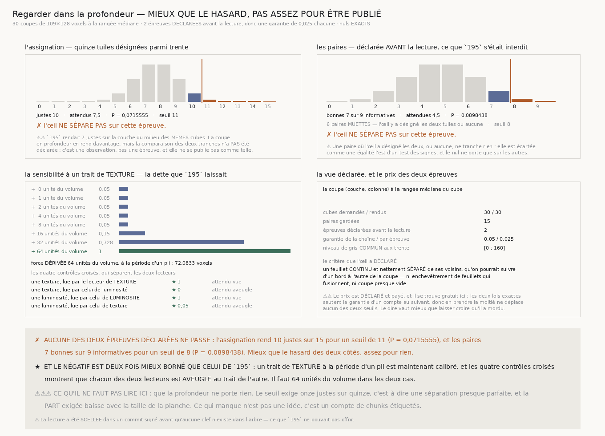
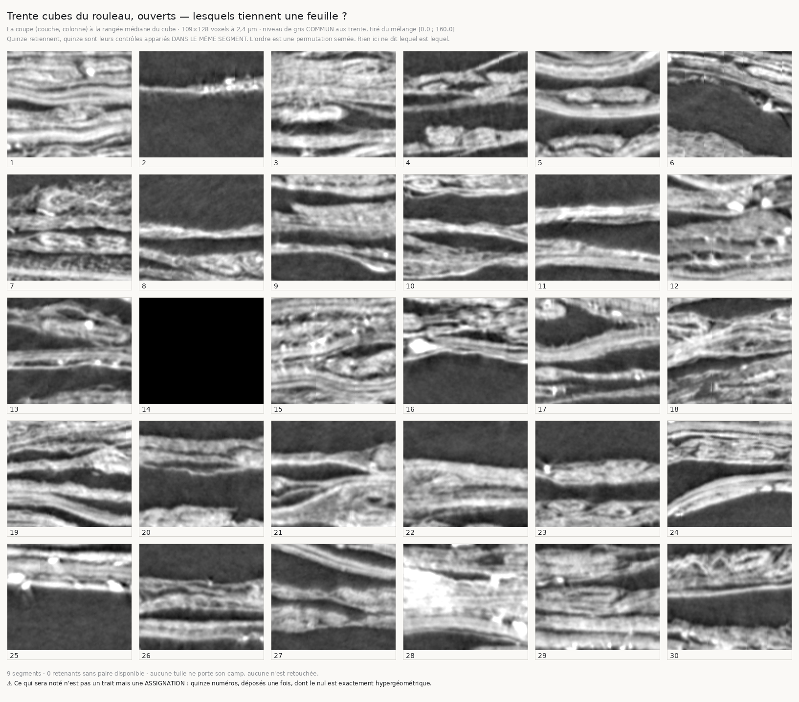

# `196` — Regarder dans la profondeur

*La coupe où la propriété pouvait apparaître — mieux que le hasard des deux côtés, assez pour rien.*

## 0. Pourquoi cette tranche

`195` a ouvert les quinze chunks à l'aveugle et l'œil est tombé **exactement** sur le hasard :
**7 justes** sur quinze contre **7,5 justes** attendus. Mais il regardait **une couche**, et
l'étiquette de `190` naît d'une marche qui **choisit sa couche** en avançant : c'est une propriété de
la relation **entre** couches, donc une propriété que la coupe de `195` ne pouvait structurellement
pas porter.

⭐⭐⭐⭐ **Une section le long de la profondeur montre ce que la marche travaille** : les feuillets
empilés. La vue est déclarée par l'arithmétique — la rangée **médiane** du cube — parce que choisir
la plus parlante des cent vingt-huit sections serait exactement la maximisation que `195` a
désamorcée.

## 1. Les deux épreuves sont déclarées AVANT la lecture, et leur nombre fixe le prix

`195` s'était **interdit** d'ajouter une épreuve appariée après avoir vu son premier résultat : ce
serait le péché que `191` a payé. Déclarée d'avance, elle devient légitime.

| l'épreuve | le nul | ce qu'elle demande |
|---|---|---|
| **l'assignation entière** | hypergéométrique | quinze tuiles désignées parmi trente |
| **les quinze paires** | binomial | paire par paire, l'œil a-t-il désigné le retenant ? |

⚠⚠ **Deux épreuves sur les mêmes données sont deux chances.** Chacune reçoit donc la **moitié** de
la garantie que la chaîne se donne depuis `176` : **0,025**.

⚠⚠⚠ **Et le prix est gratuit ici, ce qui se dit plutôt que se tait.** Les deux lois exactes
**sautent** la garantie d'un compte au suivant, donc en prendre la moitié ne déplace **aucun** des
deux seuils. Le mécanisme reste vérifié : à quatre épreuves, le seuil de l'assignation se déplace
bel et bien.

## 2. La planche : trente coupes qui traversent l'empilement

| | |
|---|---:|
| cubes demandés / rendus | **30** / **30** |
| paires gardées | **15 paires** |
| coupe de chaque tuile | **109** × **128 voxels** |
| niveau de gris commun aux trente, percentiles **1** et **99** | **[0 ; 160]** |

⚠⚠ **La planche aveugle ne publie pas le plan place → adresse, et c'est une réparation que `195`
rendait nécessaire** : sa clef est publiée, donc un artefact qui donnerait ici l'adresse de chaque
place se joindrait à elle d'un seul coup d'œil. L'artefact porte l'**ensemble trié** des trente
adresses — de quoi vérifier la composition — et la levée **reconstruit** le plan depuis le pipeline
déterministe, sans un seul téléchargement.

⭐⭐⭐⭐ **Et la lecture a été SCELLÉE dans un commit signé avant qu'aucune clef n'existe dans
l'arbre.** C'est ce que `195` ne pouvait pas offrir : son aveugle était de procédure, donc rien hors
de la séance ne pouvait vérifier que la lecture précédait la clef. ⚠ Ce que le sceau prouve est
étroit et se dit : la lecture existe dans l'arbre avant tout fichier qui porte la réponse. Il ne
prouve pas que le code n'aurait pas pu la calculer, puisque le code est là. **Un sceau est un
horodatage, pas une serrure.**

## 3. Ce que l'œil a déclaré

> **1 · 5 · 8 · 9 · 10 · 11 · 12 · 16 · 19 · 20 · 21 · 24 · 26 · 27 · 30**

> *un feuillet **continu** et nettement **séparé** de ses voisins, qu'on pourrait suivre d'un bord à
> l'autre de la coupe — ni enchevêtrement de feuillets qui fusionnent, ni coupe presque vide.*

## 4. L'assignation

| | |
|---|---:|
| justes | **10** sur **15** |
| attendus par hasard | **7,5 justes** |
| probabilité | **0,0715555** |
| seuil à atteindre | **11 justes** · probabilité au seuil **0,0134189** |

✗ **L'œil ne sépare pas sur cette épreuve.**

⚠⚠ `195` rendait **7 justes** sur la couche du milieu des **mêmes** cubes. La coupe en profondeur en
rend davantage. ⚠⚠⚠ **Mais la comparaison des deux tranches n'a PAS été déclarée** : c'est une
observation, pas une épreuve, et elle ne se publie pas comme telle.

## 5. Les paires

| | |
|---|---:|
| paires | **15 paires** |
| dont **muettes** (l'œil a désigné les deux, ou aucune) | **6** |
| paires informatives | **9** |
| bonnes désignations | **7** |
| attendues par hasard | **4,5 bonnes** |
| probabilité | **0,0898438** |
| seuil à atteindre | **8** |

✗ **L'œil ne sépare pas non plus sur cette épreuve.**

⚠ **Une paire muette ne tranche rien** : elle est écartée comme une égalité l'est d'un test des
signes, et le nul ne porte que sur les autres. Six muettes sur quinze est un fait mesuré de cette
lecture, pas un défaut du dispositif.

## 6. La sensibilité à un trait de TEXTURE — la dette que `195` laissait

`195` n'avait calibré que la **luminosité**, donc son silence ne bornait rien d'autre. Un second
lecteur est déclaré : il lit la **stratification**, c'est-à-dire l'écart-type du profil en
profondeur.

| force posée, en unités du volume | part des 20 réplicats |
|---|---:|
| **0** · **1** · **2** · **4** · **8** | **0,05 des réplicats** |
| **16** | **0,15 des réplicats** |
| **32** | **0,45 des réplicats** |
| **64** | **1** |

⚠⚠ La stratification est posée à la **période d'un pli**, dérivée et non choisie : **72,0833
voxels**, soit le pas d'un pli rapporté au voxel. La force retenue est **64 unités du volume**, la
plus petite vue à **tous** les réplicats.

⭐⭐⭐⭐ **Et les quatre contrôles croisés séparent les deux lecteurs**, sans quoi « un lecteur de
texture » ne serait qu'un nom :

| | part vue |
|---|---:|
| une texture, lue par le lecteur de **texture** | **1** |
| une texture, lue par celui de luminosité | **0** |
| une luminosité, lue par celui de **luminosité** | **1** |
| une luminosité, lue par celui de texture | **0,05 des réplicats** |

⚠⚠⚠ **Un défaut réel est né là, et la sonde l'a dit.** La stratification posée n'était pas centrée :
le cube fait cent neuf couches pour une période de soixante-douze, donc une sinusoïde brute y tient
une cycle et demi et sa moyenne ne s'annule pas. Le trait déplaçait alors la **luminosité** de
plusieurs niveaux, le lecteur de luminosité le voyait, et le contrôle croisé qui doit **séparer** les
deux lecteurs virait au rouge. **Un trait de texture qui déplace la moyenne est en partie un trait de
luminosité.**

## 7. Ce que la tranche établit, et ce qu'elle n'établit pas

✗ **Aucune des deux épreuves déclarées ne passe.** Mieux que le hasard des deux côtés, assez pour
rien.

★ **Le négatif est deux fois mieux borné que celui de `195`** : un trait de **texture** à la période
d'un pli est maintenant calibré, et il faut **64 unités du volume** dans les deux cas.

⚠⚠⚠ **Ce qu'il ne faut PAS lire ici : que la profondeur ne porte rien.** Le seuil exige **11 justes**
sur quinze, c'est-à-dire une séparation presque parfaite. La **part** exigée baisse avec la taille de
la planche — la batterie de `195` le vérifie déjà en comparant une planche de trente à une planche de
soixante. Ce qui manque n'est pas une idée, c'est un **compte de chunks étiquetés**.

## 8. Les sondes, et les onze bris

Le module rend **52** contrôles, la figure **36**, la planche **12**. Onze bris ont été posés ; neuf
ont viré au rouge du premier coup, **deux sont restés verts** et les deux étaient des sondes
incapables d'échouer.

⚠⚠⚠ **La première inspectait un dictionnaire que le test fabrique.** Elle vérifiait que l'artefact
aveugle ne porte aucun plan — sur une fixture écrite dans la batterie, pas sur ce que `mesurer`
publie. Un bris qui ajoutait la liste des retenants à la vraie sortie la laissait verte. Elle porte
désormais sur un **ensemble de champs déclaré**, comparé à ce que `mesurer` rend : n'importe quel
champ ajouté, quel que soit son nom, la fait échouer.

⚠⚠ **La seconde affirmait un seuil que la mesure n'a pas rendu** : j'avais écrit que le seuil
apparié valait **13** ; l'arithmétique exacte en donne **8** sur neuf paires informatives et **12**
sur quinze. Une batterie lit le dernier barreau de l'échelle dérivée, jamais une valeur tapée.

⚠ **Et une assertion supposait une stricture qui n'existe pas** : j'avais écrit que la moitié de
garantie **resserre** le seuil. Elle ne le relâche jamais, ce qui est la propriété vraie, et elle ne
le déplace que si le prix est assez lourd — ce que la sonde vérifie maintenant à quatre épreuves.

Les autres bris, tous rouges : la vue retombe sur une couche ; le prix des deux épreuves n'est pas
payé ; une paire muette est comptée comme fausse ; l'onde n'est plus centrée ; le lecteur de texture
lit la moyenne ; la planche aveugle publie le plan ; la levée ne vérifie pas les adresses
reconstruites ; l'ordre téléchargé n'est pas vérifié ; les contrôles croisés ne séparent plus ; le
seuil apparié n'est pas dessiné.

## 9. La porte

`R4-P44` est répondue **par la négative**, et `R4-P45` **s'ouvre**.
