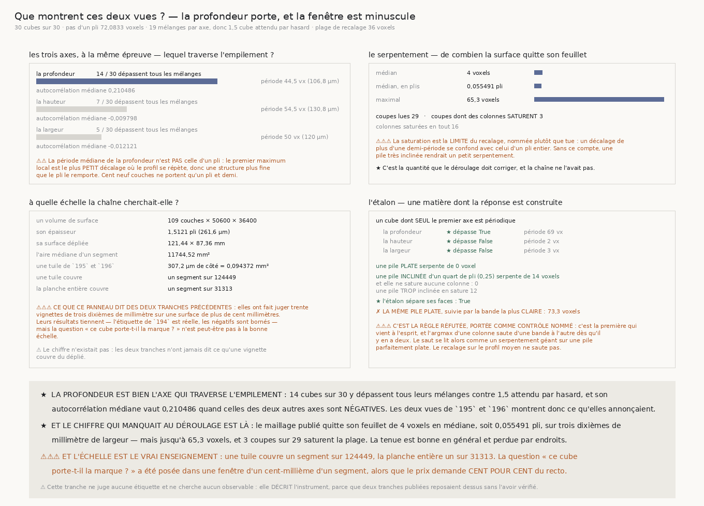

# `197` — Que montrent ces deux vues, et à quelle échelle la chaîne cherchait-elle ?

*Les axes sont bien ceux qu'on annonçait — et une vignette couvre un segment sur cent vingt-quatre mille.*

## 0. Pourquoi cette tranche — une objection, pas un plan

Devant la planche de `196`, l'auteur a dit : *« ça ressemble encore à une vue axiale, pas au
résultat déplié »*.

⭐⭐⭐⭐ **Et il avait raison sur ce qui compte : `195` et `196` ont publié deux vues de trente cubes
en AFFIRMANT ce que leurs axes signifient — « la couche du milieu », « la coupe en profondeur » — et
rien dans la chaîne ne l'avait jamais mesuré.** Le dépôt lit des `surface-volumes` de segment : leur
premier axe est *censé* traverser l'empilement des feuillets et les deux autres porter la surface
dépliée. Censé.

⚠⚠ **Cette tranche ne juge aucune étiquette et ne cherche aucun observable.** Elle **décrit
l'instrument**, parce que deux tranches publiées reposaient dessus sans l'avoir vérifié.

## 1. Quel axe traverse l'empilement ?

Le pas d'un pli est connu — **72,0833 voxels** au voxel de la campagne — donc un axe qui traverse la
pile porte une **période**, et les deux autres non. Chaque axe est jugé contre **19 mélanges** de son
propre profil, donc **1,5** cube sur trente les dépasse tous par hasard.

| axe | dépassent tous les mélanges | période médiane | autocorrélation médiane |
|---|---:|---:|---:|
| **la profondeur** | **14 cubes** sur 30 | **44,5** vx (**106,8** µm) | **0,210486** |
| la hauteur | **7 cubes** sur 30 | 54,5 vx (130,8 µm) | **-0,009798** |
| la largeur | **5 cubes** sur 30 | 50 vx (120 µm) | **-0,012121** |

★ **La profondeur est bien l'axe qui traverse l'empilement.** Elle est la seule dont
l'autocorrélation médiane soit **positive** — celles des deux autres sont négatives — et elle
dépasse ses mélanges trois fois plus souvent qu'elles.

⚠⚠ **Mais la période médiane n'est PAS celle d'un pli** : **44,5** voxels contre **72,0833**.
L'estimateur prend le **premier maximum local** après le passage à zéro, c'est-à-dire le plus
**petit** décalage où le profil se répète ; une structure plus fine que le pli le remporte donc. Et
cent neuf couches ne portent qu'**1,5121 pli** : la limite est nommée plutôt que tue.

## 2. De combien la surface quitte-t-elle son feuillet ?

Si le maillage du segment tenait son feuillet, une coupe en profondeur montrerait des bandes
**horizontales**. Le décalage de chaque colonne est estimé par **recalage sur le profil moyen de la
coupe**, dans une plage de **36** voxels — la demi-période, qui est une **borne** et non un réglage.

| | |
|---|---:|
| coupes lues | **29** |
| serpentement médian | **4** voxels, soit **0,055491** pli |
| serpentement maximal | **65,3** voxels |
| coupes dont des colonnes saturent | **3** |
| colonnes saturées en tout | **16** |

⭐⭐⭐⭐ **C'est la quantité que le déroulage doit corriger, et la chaîne ne l'avait pas.** Le
maillage publié tient son feuillet à un vingtième de pli près en médiane, sur trois dixièmes de
millimètre de largeur — **et le perd complètement par endroits**.

⚠⚠⚠ **La saturation est la limite du recalage, publiée à côté du résultat** : un décalage de plus
d'une demi-période se confond avec celui d'un pli entier. Sans ce compte, une pile très inclinée
rendrait un **petit** serpentement.

## 3. À quelle échelle la chaîne cherchait-elle ?

| | |
|---|---:|
| un volume de surface | **109** couches × **50600** × **36400** |
| son épaisseur | **1,5121** pli (**261,6** µm) |
| sa surface dépliée | **121,44** × **87,36** mm |
| l'aire médiane d'un segment, sur **9** lus | **11744,52** mm² |
| une tuile de `195` et `196` | **307,2** µm de côté = **0,094372** mm² |
| **une tuile couvre** | **un segment sur 124449** |
| **la planche entière couvre** | **un segment sur 4148** |

⚠⚠⚠ **Ce que ça dit des deux tranches précédentes.** Elles ont fait juger trente vignettes de trois
dixièmes de millimètre sur une surface de plus de cent millimètres. Leurs résultats **tiennent** —
l'étiquette de `194` est réelle, les négatifs de `195` et `196` sont bornés — mais la question
« ce cube porte-t-il la marque ? » a été posée dans une fenêtre d'un **cent-millième** d'un segment,
alors que le prix demande **cent pour cent** du recto.

⚠ Et le chiffre n'existait pas : ni `195` ni `196` n'ont jamais dit ce qu'une vignette couvre du
déplié.

## 4. L'étalon, et le contrôle nommé

| la face | ce qu'elle rend |
|---|---:|
| un cube dont **seul** le premier axe est périodique | seul lui dépasse ses mélanges |
| une pile **plate** | **0** voxel de serpentement |
| une pile **inclinée** d'un quart de pli (**0,25 pli**) | **14** voxels |
| … et elle ne sature **aucune** colonne | **0** |
| une pile **trop** inclinée | **12** colonnes saturées |

⚠⚠⚠ **Et la règle réfutée est portée comme CONTRÔLE NOMMÉ, avec son chiffre mesuré.** Suivre la
**bande la plus claire** d'une colonne à l'autre est la première idée qui vient — et sur la **même**
pile parfaitement plate elle fabrique **73,3** voxels de serpentement, soit **1,016879** pli, contre
**0** pour le recalage. L'argmax saute d'une bande à l'autre dès qu'il y en a deux, et le saut se lit
comme un serpentement géant.

## 5. Les sondes, et les huit bris

Le module rend **38** contrôles, la figure **29**. Huit bris ont été posés et **les huit ont viré au
rouge**. Mais trois vrais défauts ont été trouvés **avant** eux, par les sondes elles-mêmes :

⚠⚠⚠ **L'autocorrélation n'était pas normalisée par le RECOUVREMENT.** Divisée par la norme entière,
celle d'une onde de période quarante culminait au décalage **deux**, parce qu'un décalage court somme
plus de termes qu'un décalage long. La fonction rendait donc « période 2 » sur une matière dont la
période était posée.

⚠⚠ **Le maximum GLOBAL n'est pas la fondamentale.** Une onde de période quarante sur quatre cents
points culmine autant à quarante qu'à quatre-vingts ou à deux cents : l'argmax rendait « période
200 ». La période fondamentale est le **plus petit** décalage où le profil se répète ; les multiples
sont ses harmoniques.

⚠⚠ **Et une règle de `196` avait été transplantée à tort** : la mesure a d'abord **refusé** parce
que 28 cubes sur 30 avaient répondu. Là-bas un cube perdu change le nombre de tuiles, donc le tirage
de l'ordre de la planche, donc la lecture déposée. Ici il n'y a **aucune planche** : ce qui doit être
publié n'est pas un refus mais le **compte** de ce qui a répondu et la raison de ce qui manque.

⚠⚠⚠ **Enfin, un chiffre de sonde avait été dessiné dans la figure.** Le serpentement fabriqué par le
suivi par argmax y était écrit **74**, valeur lue dans une sortie de bris. Elle est fausse : la
mesure en rend **73,3**. Le remède n'est pas de corriger le nombre mais de lui donner un
**producteur** — c'est pourquoi la règle réfutée est maintenant mesurée par l'étalon.

Les huit bris, tous rouges : l'autocorrélation n'est plus normalisée par le recouvrement ; la plage
basse n'est plus dérivée du passage à zéro ; le maximum global remplace la fondamentale ; le
serpentement suit la bande la plus claire ; la saturation n'est plus comptée ; le nul du profil ne
mélange rien ; l'étalon ne sépare plus ; le contrôle nommé ne fabrique rien.

## 6. La porte

`R4-P46` **s'ouvre**.
