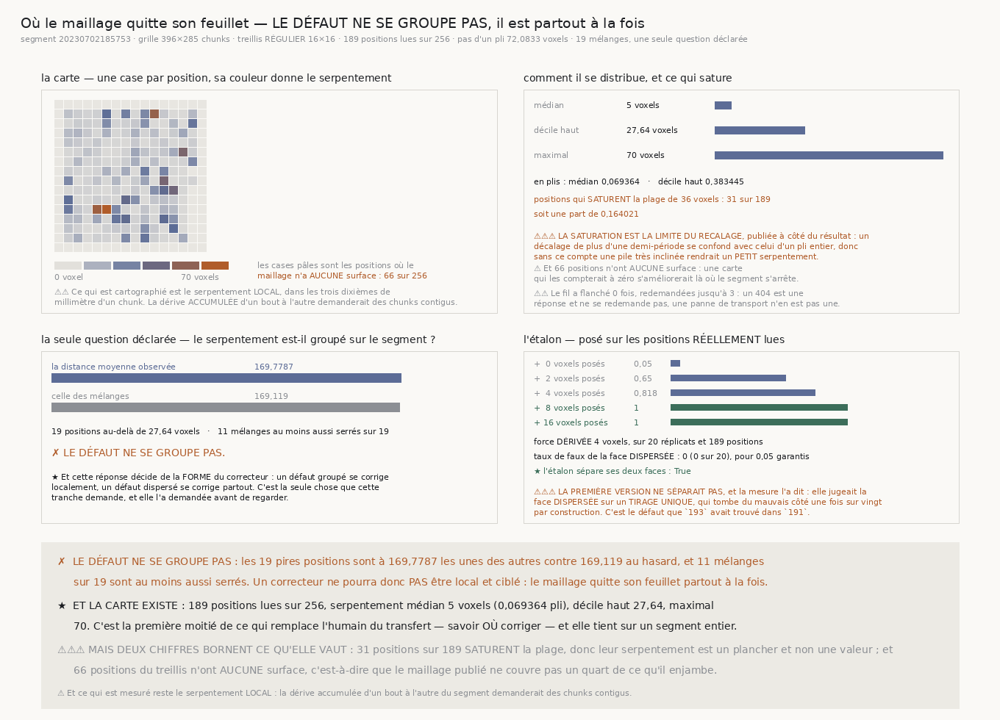

# `198` — Où le maillage quitte-t-il son feuillet, sur un segment entier ?

*Le défaut ne se groupe pas : il est partout à la fois, donc aucun correcteur ne pourra être local.*

## 0. Pourquoi cette tranche

`197` a mesuré la quantité que le déroulage doit corriger — de combien la surface dépliée quitte son
feuillet — mais sur **trente vignettes**, et la même tranche a mesuré pourquoi ce n'est pas assez :
une vignette couvre un segment sur cent vingt-quatre mille.

⭐⭐⭐⭐ **Ce que cette tranche rend est une carte** : où la surface a quitté son feuillet, et de
combien. C'est la **première moitié** de ce qui remplace l'humain du transfert — savoir **où** il faut
corriger — et elle se mesure sans rien inventer, avec l'instrument que `197` a livré.

## 1. La carte

| | |
|---|---:|
| segment | `20230702185753` |
| grille de chunks | **396** × **285** |
| treillis **régulier** | **16 positions de côté** |
| positions lues | **189** sur **256 positions** |
| positions sans surface au dépôt | **66 positions** |
| positions au profil moyen plat | **1** |
| fois où le fil a flanché | **0 fois**, redemandées jusqu'à **3 fois** |

⚠⚠ **Le treillis est un BUDGET, pas une propriété de la matière** : deux cent cinquante-six
positions valent deux cent cinquante-six téléchargements. Ce qui est une propriété du dessin, c'est
qu'il soit **régulier** — aucune position n'est choisie pour ce qu'elle contient.

⚠⚠⚠ **Et soixante-six positions du treillis n'ont AUCUNE surface** : le maillage publié ne couvre
pas un quart de ce qu'il enjambe. Une carte qui les compterait à zéro s'améliorerait là où le
segment s'arrête.

## 2. Comment le serpentement se distribue

| | |
|---|---:|
| médian | **5 voxels**, soit **0,069364** pli |
| décile haut | **27,64 voxels**, soit **0,383445** pli |
| maximal | **70 voxels** |
| positions qui **saturent** la plage de **36 voxels** | **31** sur **189 positions** |
| la part qui sature | **0,164021** |

⚠⚠⚠ **La saturation est la limite du recalage, publiée à côté du résultat** : un décalage de plus
d'une demi-période se confond avec celui d'un pli entier, donc sans ce compte une pile très inclinée
rendrait un **petit** serpentement. Pour ces trente et une positions, le serpentement rendu est un
**plancher**, pas une valeur.

## 3. La seule question déclarée : se groupe-t-il ?

Déclarée **avant** de regarder, et une seule — donc la garantie de la chaîne s'applique telle quelle,
dix-neuf mélanges pour un sur vingt.

| | |
|---|---:|
| positions au-delà de **27,64 voxels** | **19 positions** |
| distance moyenne observée | **169,7787** |
| celle des mélanges | **169,119** |
| mélanges au moins aussi serrés | **11** sur **19** |

✗ **Le défaut NE se groupe PAS.**

⭐⭐⭐⭐ **Et cette réponse décide de la FORME du correcteur** : un défaut groupé se corrige
localement, un défaut dispersé se corrige partout. Le maillage quitte son feuillet **partout à la
fois**, donc ce qui remplacera l'humain du transfert ne pourra pas être une retouche ciblée.

## 4. L'étalon, posé sur les positions RÉELLEMENT lues

| force posée | part des **20 réplicats** |
|---|---:|
| **0** voxel | **0,05** |
| **2** voxels | **0,65** |
| **4** voxels | **1** |
| **8** voxels | **1** |
| **16** voxels | **1** |

| | |
|---|---:|
| force **dérivée** | **4 voxels**, sur **189 positions** |
| taux de faux de la face **dispersée** | **0 faux sur 20** réplicats |
| garantie | **0,05 garantis** |

★ **L'étalon sépare ses deux faces**, et les **deux** sont mesurées sur réplicats.

⚠⚠⚠ **La première version ne séparait pas, et c'est la mesure qui l'a dit.** Elle jugeait la face
**dispersée** sur un **tirage unique**, qui tombe du mauvais côté une fois sur vingt par
construction — exactement le défaut que `193` avait trouvé dans `191`. Réparé en faisant passer les
deux faces par la même fonction, sur le même nombre de réplicats.

⚠⚠ **Et le critère n'est pas « le taux est sous la garantie » mais « il est COMPATIBLE avec elle ».**
Sur vingt réplicats, un dispositif qui se trompe une fois sur vingt en rend **deux** une fois sur
quatre. Ce qui se vérifie est donc la probabilité exacte d'en voir autant ou plus — et un étalon
n'est déclaré cassé que si ce compte serait lui-même surprenant au même niveau.

## 5. Ce qu'une coupure de connexion a révélé

⚠⚠⚠ **Un chunk qui n'existe pas et un lien qui tombe tombaient dans le même mot.** Une coupure de
connexion a fait passer les positions lues de **189** à **110** et les « absents » de **66** à
**145**, sans que rien ne le dise. Le chiffre publié comme « positions sans surface » était donc un
chiffre sur **le réseau** autant que sur le maillage.

⭐ **Le dépôt avait déjà résolu ça** : `tracecheck.get_with_reason` distingue un 404 d'une panne de
transport, et sa docstring date la leçon du **2026-08-26**. Elle est **réutilisée**, pas réécrite.

⭐⭐⭐⭐ **Et la vraie réparation est de REDEMANDER.** Un 404 est une **réponse** — le dépôt dit que
ce chunk n'existe pas, et il le redira — tandis qu'une panne de transport n'en est pas une.
Redemander est donc la façon **empirique** de distinguer les deux, là où le code d'erreur seul ne
fait que les nommer. Une panne qui **persiste** après le budget de reprises reste une panne, et la
mesure **refuse** alors de publier : un compte de couverture mesuré à travers un lien qui tombe n'en
est pas un.

## 6. Les sondes, et les vingt-trois bris

Le module rend **64** contrôles, la figure **36**. Vingt-trois bris ont été posés ; **six sont
restés verts du premier coup**, et les six étaient des sondes incapables d'échouer.

⚠⚠⚠ **Quatre d'entre elles portaient sur une fixture que le test fabrique** plutôt que sur ce que le
code rend : le compte de positions chaudes des deux faces de l'étalon était lu sur le **décile des
valeurs** — qui vaut toujours un dixième du treillis — au lieu du compte **injecté** ; le nul du
groupement n'était vérifié par rien quant au nombre de points qu'il tire ; le treillis n'était
exercé par aucune sonde parce que `la_carte` exigeait le réseau ; et `un_chunk` n'était visité par
aucune sonde parce que toutes injectaient un ouvreur. ⭐ Remède à chaque fois : **rendre le chemin
réel exerçable sans réseau** et asserter une **identité structurelle** plutôt qu'une valeur relue.

⚠⚠ **Une cinquième portait sur le chemin PAR DÉFAUT, que rien ne prenait** — et une référence morte
y a survécu jusqu'à ce que la mesure plante en plein téléchargement.

⚠ **Et une sonde a exigé plus que la précision publiée** : deux parts arrondies à trois chiffres
significatifs ne peuvent pas vérifier une égalité exacte.

## 7. Ce que cette tranche ne dit pas

⚠⚠ **Ce qui est cartographié est le serpentement LOCAL**, dans les trois dixièmes de millimètre d'un
chunk. La **dérive accumulée** d'un bout à l'autre du segment demanderait des chunks contigus, et
cette tranche ne la mesure pas.

⚠ Et elle porte sur **un** segment, le premier du recensement, jamais choisi.

## 8. La porte

`R4-P46` est **répondue**, et `R4-P47` **s'ouvre**.
