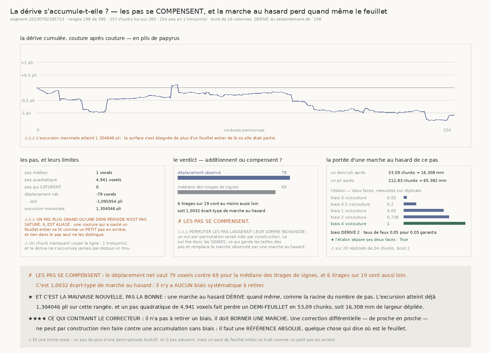

# `199` — La dérive s'accumule-t-elle le long d'une spire ?

*Les pas se compensent — et c'est la mauvaise nouvelle, parce qu'une marche au hasard perd le feuillet quand même.*

## 0. Pourquoi cette tranche

`198` a mesuré le serpentement **local** en cent quatre-vingt-neuf endroits d'un segment et a établi
qu'il ne se groupe pas. Mais un treillis **saute** d'un endroit à l'autre : il ne peut rien dire de
ce qui s'additionne **entre** eux. Or c'est l'accumulation qui fait perdre une feuille — un
demi-voxel par chunk sur trois cents chunks est un pli entier, et chaque mesure locale y paraîtrait
irréprochable.

⭐⭐⭐⭐ **La question change donc de nature** : il ne s'agit plus de recaler un chunk sur **lui-même**
mais **sur son voisin**. Ce qui est mesuré est le **pas** d'une couture à l'autre, puis sa somme.

## 1. La ligne

| | |
|---|---:|
| segment | `20230702185753` |
| rangée **médiane** de la grille | **198** sur **396** |
| chunks demandés | **285 colonnes** |
| chunks lus | **257 colonnes** |
| chunks sans surface au dépôt | **28 colonnes** |
| fois où le fil a flanché | **0 fois** |
| tronçons contigus | **1 tronçon**, de la colonne **17 à la colonne 273** |
| pas mesurés | **254 pas** |

⚠⚠⚠ **Un chunk manquant COUPE la contiguïté** : deux chunks séparés par un chunk absent ne sont pas
voisins, et recaler l'un sur l'autre inventerait un pas que personne n'a mesuré. La ligne se lit donc
en **tronçons**, et la dérive s'accumule à l'intérieur de chacun, jamais par-dessus un trou.

⚠⚠ **La largeur de la bande de bord est DÉRIVÉE, pas choisie** : **16 colonnes**. Un pas se mesure à
la **couture**, et moyenner un chunk entier la noierait dans son propre serpentement ; reste à savoir
quelle largeur on peut moyenner sans que la bande serpente elle-même. La règle est une tolérance d'un
voxel, et le chiffre vient de `198` — son serpentement médian vaut **5 voxels** sur **128 colonnes**,
donc une bande de `w` colonnes serpente de `w·5/128`, et on prend la plus grande puissance de deux
qui garde cela sous un voxel.

## 2. Les pas

| | |
|---|---:|
| pas médian | **1 voxels** |
| pas quadratique | **4,941 voxels** |
| pas qui **saturent** la plage de **36 voxels** | **0 pas** |
| déplacement net | **-79 voxels**, soit **-1,095954** pli |
| excursion maximale | **94 voxels**, soit **1,304046** pli |

⚠⚠⚠ **Un pas plus grand qu'une demi-période n'est pas SATURÉ, il est ALIASÉ — et c'est pire.** Une
couture qui a sauté un feuillet entier se lit comme un **petit pas en arrière**, et rien dans le pas
seul ne permet de la distinguer d'une couture presque parfaite. La sonde le mesure : un pas posé de
**41** est lu **-31**, c'est-à-dire **41** moins une période.

## 3. La seule question déclarée : s'additionnent-ils, ou se compensent-ils ?

⭐⭐⭐⭐ **Le nul tire les SIGNES, et c'est le seul qui réponde.** Permuter les pas laisse leur somme
**inchangée** — un nul par permutation serait vide par construction. Tirer les signes garde leurs
tailles et remplace la marche observée par une **marche au hasard** : si les pas s'additionnent,
l'observé dépasse ; s'ils se compensent, non.

| | |
|---|---:|
| déplacement observé | **79 voxels** |
| médiane des tirages de signes | **69 voxels** |
| tirages au moins aussi loin | **6** sur **19 mélanges** |
| la marche au hasard attendue | **78,7464 voxels** |
| **combien d'écarts-types de marche au hasard** | **1,0032** |

✗ **Les pas se compensent.** Le déplacement observé vaut **un** écart-type de marche au hasard, à
trois millièmes près. **Il n'y a aucun biais systématique à retirer.**

## 4. Et c'est la mauvaise nouvelle, pas la bonne

⭐⭐⭐⭐ **Une marche au hasard DÉRIVE quand même**, comme la racine du nombre de pas. La question
utile n'est donc pas « y a-t-il un biais » mais **« au bout de combien de coutures le feuillet
est-il perdu »**, et la réponse se calcule sans aucun réglage : `n = (distance / pas)²`.

| | |
|---|---:|
| un **demi-pli** après | **53,09 chunks** = **16,308 mm** |
| un **pli** après | **212,83 chunks** = **65,382 mm** |

⭐⭐⭐⭐ **Ce qui contraint le correcteur.** Il n'a pas à retirer un biais : il doit **borner une
marche**. Une correction **différentielle** — de proche en proche — ne peut par construction rien
faire contre une accumulation sans biais, puisqu'elle n'a rien à corriger localement. Il faut une
**référence absolue**, quelque chose qui dise **où est le feuillet**.

## 5. L'étalon

| biais posé, en voxels par couture | part des **20 réplicats** |
|---|---:|
| **0** | **0,05** |
| **0,5** | **0,2** |
| **1** | **0,65** |
| **2** | **1** |
| **4** | **1** |

| | |
|---|---:|
| biais **dérivé** | **2 voxels** par couture |
| taux de faux de la face sans biais | **0,05 de faux** (**1 sur 20**) |
| garantie | **0,05 garantis** |

★ **L'étalon sépare ses deux faces**, et les **deux** sont mesurées sur réplicats — la leçon que
`198` a payée.

## 6. Ce qu'une coupure de connexion a encore appris

⚠⚠⚠ **Redemander aussitôt ne sert à rien contre une panne qui dure.** Une première exécution a perdu
**152** requêtes sur des échecs de résolution de nom, et **aucune** reprise n'a abouti — les quatre
essais tenaient dans quelques millisecondes. Le refus a bien fonctionné (la ligne n'a pas été
publiée), mais la reprise ne servait à rien.

⭐ **Réparé par une attente qui DOUBLE** entre deux essais, nulle par défaut pour que rien
d'antérieur ne change. Elle absorbe un accroc transitoire sans jamais rendre une panne longue
acceptable : celle-là reste un refus.

## 7. Les sondes, et les dix bris

Le module rend **43** contrôles, la figure **32**. Dix bris ont été posés et **les dix ont viré au
rouge**. Mais deux vrais défauts ont été trouvés **avant** eux, par les sondes :

⚠⚠⚠ **Le pas était rendu avec le SIGNE INVERSE** : l'argmax d'une corrélation croisée vaut **moins**
le décalage cherché. Sans conséquence sur le verdict — une inversion globale ne change ni la somme
absolue ni le tirage des signes — mais chaque pas publié pointait dans la mauvaise direction.

⚠⚠ **Et la corrélation était normalisée par la LONGUEUR de la fenêtre**, comme `197` et `198` le
font pour mesurer un **étalement**. Cela déplace le maximum d'un voxel quand la fenêtre ne porte
qu'un pli et demi : un pas posé de **3** était lu **2**, un pas de **11** était lu **12**. Un voxel
de biais répété trois cents fois ferait quatre plis, donc un pas qui s'**accumule** exige une
normalisation par l'**énergie** des deux fenêtres. Après correction, les pas posés sont lus
exactement.

⚠ **Et une sonde affirmait la mauvaise panne** : elle attendait qu'un pas trop grand **sature**,
alors qu'il **aliase**. Corrigée en mesurant l'aliasing lui-même.

## 8. Ce que cette tranche ne dit pas

⚠ Elle porte sur **une** rangée d'**un** segment, la médiane, jamais choisie. ⚠⚠ Et le pas est
mesuré à la couture entre deux chunks : une dérive qui se produirait **à l'intérieur** d'un chunk
sans discontinuité à ses bords ne serait pas vue ici — c'est le serpentement que `198` mesure.

## 9. La porte

`R4-P47` est **répondue**, et `R4-P48` **s'ouvre**.
