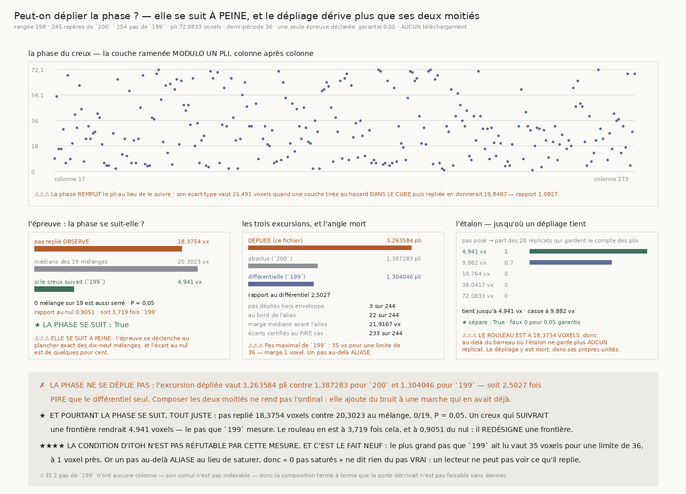

# `201` — Peut-on déplier la phase ?

*Les deux moitiés étaient complémentaires sur le papier. Sur la matière, l'absolue n'est pas une phase.*

## 0. Pourquoi cette tranche

`R4-P49` la nomme, et son argument était le meilleur de toute la chaîne : **les deux moitiés
manquantes sont exactement complémentaires, et les deux sont mesurées.**

- `199` rend un incrément **relatif** qui ne saute jamais — pas quadratique **4,941 voxels**,
  **0 pas** saturés sur **254** — mais qui dérive comme la racine du nombre de pas.
- `200` rend un repère **absolu**, lisible dans **245 chunks** sur **251**, mais défini **modulo un
  pli** : il dit qu'il y a une frontière, jamais **laquelle**.

C'est le problème classique du **dépliage de phase**, et il est soluble quand l'incrément est
fiable à mieux qu'une demi-période. La tranche ne télécharge **rien** : les deux traces existent,
sur la **même** rangée du **même** segment.

## 1. Le défaut d'alignement, nommé avant tout le reste

⚠⚠⚠ **La composition terme à terme que la porte décrivait n'est pas faisable, et la raison est un
défaut réel de la publication de `199`.** Son tronçon porte **257 chunks**, donc **256
intervalles**, et seulement **254 pas décidables**. Le cumul est indexé par **numéro de pas** et non
par colonne.

| | |
|---|---:|
| pas de `199` sans colonne | **2 pas** |
| son cumul est-il indexable par colonne | **non** |

Deux pas manquants à des positions inconnues décalent la correspondance. Joindre les deux traces
colonne à colonne demanderait de **deviner** où, et un déplacement deviné vaut jusqu'à deux fois le
plus grand pas lu — davantage que la demi-période. Le compte est publié plutôt que contourné.

⭐ **Et il existe un usage de `199` plus fort que l'addition terme à terme, qui ne demande aucun
alignement.**

## 2. La condition d'Itoh — et le fait neuf, qui est qu'elle n'est pas réfutable

Le théorème qui résout le dépliage de phase dit ceci : si le déplacement **vrai** entre deux
échantillons reste sous la demi-période, alors replier chaque écart observé et les accumuler
reconstruit la trace absolue **exactement**. Le repli et le dépliage s'écrivent

$$\mathcal{W}(x) \;=\; x - P\left\lfloor \frac{x}{P} + \frac{1}{2} \right\rfloor,
\qquad u_k \;=\; u_{k-1} + \mathcal{W}(\varphi_k - \varphi_{k-1})$$

avec $P$ le pas d'un pli, **72,0833 voxels**. Le différentiel n'entre donc pas terme à terme : il
**certifie** que le dépliage par continuité est licite.

| | |
|---|---:|
| plus grand pas lu par `199` | **35 voxels** |
| demi-période | **36 voxels** |
| marge | **1 voxel** |
| pas de `199` à moins d'un pas quadratique de la limite | **1 pas** |
| écarts certifiés au **pire cas** | **233 écarts** sur **244 écarts** |
| écarts certifiés au cas **typique** | **244 écarts** |
| pire cas maximal | **105 voxels** |
| cas typique maximal | **8,5581 voxels** |

⚠⚠⚠ **Et voici le fait neuf de cette tranche : ce « 35 sur 36 » ne certifie rien.** Un pas lu **ne
peut pas** dépasser la demi-période, parce que la recherche de `199` s'y arrête — et un pas plus
grand **aliase** au lieu de saturer. `199` l'a mesuré lui-même : posé **41 voxels**, lu **−31**.
Donc « **0 pas saturés sur 254** » ne dit **rien** du pas vrai : un lecteur ne peut pas voir ce
qu'il replie. La condition d'Itoh porte sur le pas vrai, et **aucune mesure différentielle de cette
forme ne peut la réfuter**. Le dire est la différence entre une certification et une tautologie.

⚠⚠ Le fait que le maximum observé soit à **un voxel** de la limite rend cette réserve concrète
plutôt que théorique.

## 3. La phase — ce que `200` portait réellement

⭐ **`200` n'avait pas fait cette lecture.** Le cube porte **109 couches** pour un pli de **72,0833 voxels**, donc deux frontières peuvent
y tomber et le lecteur en désigne une : la couche brute **mélange les deux répliques**, et c'est
pourquoi sa dispersion ressemblait à un tirage au hasard. Ramener modulo un pli les superpose.

| | |
|---|---:|
| phases lues | **245** |
| phase médiane | **28 voxels** |
| écart-type de la phase | **21,491 voxels** |
| écart-type si la couche était tirée **dans le cube** puis repliée | **19,8487 voxels** |
| rapport au nul | **1,0827** |

⚠⚠⚠ **Le nul n'est pas une phase uniforme, et c'est un piège de cette lecture.** Une couche tirée
uniformément dans **109 couches** puis ramenée modulo **72,0833** charge **deux fois** la première
demi-période. Comparer à une phase uniforme ferait passer cette asymétrie pour de l'information. Le
nul est donc la loi uniforme du cube **réduite**, tirée explicitement.

✗ La phase n'est pas concentrée : elle est **légèrement plus dispersée** que le non-informatif.

⚠⚠ Et cette quantité est **invariante par mélange**, donc elle ne se teste pas par permutation :
elle est publiée comme **description**, jamais comme épreuve.

## 4. L'unique épreuve déclarée

Une seule épreuve est déclarée — **la phase se suit-elle d'un chunk au suivant** — et c'est ce qui
garde la garantie entière : **0,05**, soit exactement $1/(19+1)$.

La statistique est le pas **quadratique** des écarts repliés. C'est l'énoncé direct de la condition
d'Itoh : un repère qui suit la même frontière rend des écarts repliés petits, un repère qui en
désigne une au hasard les étale sur toute la demi-période.

⭐⭐⭐⭐ **Le mélange est le nul exact, et il n'est pas vide.** Il garde la loi marginale des phases —
donc tout ce que le cube impose : sa profondeur, ses deux répliques, la forme du lecteur — et ne
détruit que l'**ordre**. Or le pas quadratique des écarts repliés dépend de l'ordre, contrairement
au déplacement net de `199`, qu'une permutation laissait inchangé.

| | |
|---|---:|
| pas replié **observé** | **18,3754 voxels** |
| médiane des **19 mélanges** | **20,3023 voxels** |
| minimum des mélanges | **19,3939 voxels** |
| mélanges au moins aussi serrés | **0 mélange** sur 19 |
| rapport au nul | **0,9051** |
| valeur **P** | **0,05** |
| garantie de l'épreuve | **0,05 garantis** |
| **la phase se suit** | **oui** |

★ **L'épreuve se déclenche.** Et elle se déclenche **tout juste**, au plancher exact que dix-neuf
mélanges permettent d'atteindre.

⚠⚠⚠ **Ce que ce « oui » vaut se lit dans l'écart, pas dans le verdict.** Un creux qui **suivrait**
une frontière rendrait **4,941 voxels** — le pas que `199` mesure sur la même rangée. Le rouleau
rend **18,3754**, soit **3,719 fois** cela, et **0,9051** du nul. Le creux ne suit donc pas une
frontière : **il en redésigne une, presque au hasard**, avec une trace d'ordre à peine détectable.

## 5. Le dépliage, et son angle mort

| | |
|---|---:|
| pas dépliés | **244 pas dépliés** |
| pas quadratique déplié | **18,3754 voxels** |
| déplacement net | **0,83237 pli** |
| excursion | **3,263584 pli** |

⚠⚠⚠ **Les deux comptes de l'angle mort sont publiés avant le verdict, et leurs seuils sont des
nombres du producteur, pas des choix.** L'enveloppe est le plus grand pas que `199` ait jamais lu, **35 voxels** ;
la marge exigée est son pas quadratique.

| | |
|---|---:|
| enveloppe du différentiel | **35 voxels** |
| pas dépliés **hors enveloppe** | **3 pas** sur 244 (part **0,012295**) |
| marge d'alias exigée | **4,941 voxels** |
| pas dépliés **au bord de l'alias** | **22 pas** sur 244 (part **0,090164**) |
| marge médiane avant l'alias | **21,9167 voxels** |

⚠⚠ Ces comptes disent à quel point on est près de l'alias ; **ils ne le détectent pas**, parce que
rien dans la phase seule ne le peut.

## 6. Le verdict

| | |
|---|---:|
| excursion **dépliée** | **3,263584 pli** |
| excursion absolue (`200`) | **1,387283 pli** |
| excursion différentielle (`199`) | **1,304046 pli** |
| rapport à l'absolue | **2,3525** |
| rapport au différentiel | **2,5027** |
| **le dépliage rend-il un ordinal** | **non** |

✗ **Composer les deux moitiés ne rend pas l'ordinal : elle ajoute du bruit à une marche qui en avait
déjà.** Le dépliage dérive **deux fois et demie plus** que le différentiel seul, parce qu'il
accumule des pas de **18,3754 voxels** là où `199` en accumulait de **4,941**.

⚠⚠ Le verdict ne tient qu'à l'épreuve déclarée ; la comparaison des trois excursions met en regard
des nombres **déjà publiés** et n'est pas une seconde épreuve — en faire une diviserait la garantie
sans rien mesurer de neuf.

## 7. L'étalon

⭐⭐⭐⭐ **L'échelle est dérivée des nombres du producteur, aucune valeur n'est tapée** : le pas
quadratique de `199`, ses doubles et quadruples, puis la demi-période et la période. Le bruit de
lecture est lui aussi le pas quadratique de `199`.

| pas posé | part des **20 réplicats** qui gardent le compte des plis |
|---:|---:|
| **4,941** | **1** |
| **9,882** | **0,7** |
| **19,764** | **0** |
| **36,0417** | **0** |
| **72,0833** | **0** |

| | |
|---|---:|
| tient jusqu'à | **4,941 voxels** |
| n'en garde plus que **0,7 des réplicats** à | **9,882 voxels** |
| casse à | **9,882 voxels** |
| réplicats | **20 réplicats** · **60 échantillons** par trace |
| faux | **0 faux** — taux **0 faux** pour **0,05 garantis** |
| probabilité d'en avoir autant | **1 sous la garantie** |
| **l'étalon sépare** | **oui** |

⭐ **Le critère de réussite ne comporte aucun seuil** : l'écart entre la trace dépliée et la trace
posée vaut la différence des bruits de lecture — qui se télescope et reste bornée — **plus un
multiple entier de la période**. Diviser par la période et arrondir rend le **nombre de plis
perdus**, exactement.

⚠⚠ **La fixture est une marche au hasard et non une droite** : une dérive constante se déplie même
au-delà de la demi-période, parce que l'erreur est la même à chaque pas et se lit comme une autre
pente. C'est une matière **complaisante**, et l'étalon ne séparerait plus rien. La sonde le mesure :
les pas aliasés d'une droite sont **tous identiques**, donc la trace fausse est parfaitement lisse.

⚠⚠⚠ **Et l'étalon place le rouleau lui-même sur son échelle** : son pas replié observé vaut
**18,3754 voxels**, donc **au-delà du barreau 9,882 où l'étalon ne garde plus que sept réplicats sur
dix, et au-delà de 19,764 où il n'en garde aucun**. Dans ses propres unités, le dépliage y est mort.

## 8. Les sondes, vérifiées en cassant le code

**60 sondes** pour le module, **54** pour la figure. **Vingt et un bris** posés, et **trois sont
restés verts** — chacun a nommé un défaut réel.

1. ⚠⚠⚠ **Le critère de l'ordinal n'était épinglé par aucune sonde.** Il comparait à une
   demi-période, et un bris qui le remplaçait par **quatre plis** est resté vert : toutes les
   matières d'épreuve perdaient soit bien plus de quatre plis, soit aucun. **Remède** : compter les
   plis perdus exactement, ce qui supprime la question, **plus** une matière qui n'en perd **qu'un
   seul** — rejetée par le compte exact, acceptée par toute tolérance plus large.
2. ⚠⚠⚠ **Un nombre juste sous un mauvais nom.** Un bris remplaçant le pas **quadratique** par une
   moyenne absolue est resté vert, parce que les deux séparent aussi bien. Le nombre publié se
   serait alors appelé « quadratique » sans l'être. **Remède** : une sonde qui épingle la valeur
   exacte sur une matière où les deux diffèrent.
3. ⚠⚠⚠ **Une fixture complaisante, révélée par la mesure et non par une sonde.** Le lecteur de `199`
   ne cherchait ses pas que dans `la_marche` — et toutes les sondes passaient, **parce que leur
   fixture les y mettait**. `199` les **hisse à la racine** du document. La mesure réelle a rendu
   « `199` ne publie aucun pas ». **Remède** : exercer la disposition **du producteur**, telle
   qu'elle est.

Les dix-huit autres bris — repli par arrondi banquier, phase sans modulo, dépliage sans repli,
enveloppe remplacée par la demi-période, nul sans mélange, coutures supposées, pas maximal lu dans
une clef, pas sans colonne toujours nuls, pire cas confondu avec le typique, échelle d'étalon tapée,
verdict qui ignore l'épreuve, nul marginal uniforme, trace non cumulée, sens de l'épreuve inversé,
bord d'alias jamais compté, condition déclarée réfutable, rapport au nul faussé, rapport
inversé — sont tous **rouges**.

## 9. Ce que ça ferme, ce que ça ouvre

✗ **`R4-P49` est fermée par la négative.** Les deux moitiés n'étaient complémentaires que sur le
papier : le dépliage exige que l'**absolue** soit une phase, et elle n'en est pas une.

⭐⭐⭐⭐ **Mais la tranche déplace la question, et c'est son apport.** Ce qui manque n'est plus « un
repère absolu » — `200` en a un, lisible dans 245 chunks sur 251 — ni « un incrément fiable » —
`199` en a un. Ce qui manque est que le repère absolu **désigne la même frontière** d'un chunk au
suivant. Il ne le fait pas : il en redésigne une presque au hasard, à **0,9051** du non-informatif.

⭐ **Et la piste que ça ouvre est nommée par la mesure elle-même** : un creux qui suivrait rendrait
**4,941 voxels**, et le rouleau rend **18,3754** — un facteur **3,719**, et **0,9051** du
non-informatif. Ce n'est pas un abîme : c'est la distance entre un lecteur qui désigne une frontière
et un lecteur qui désignerait **la** frontière. La question suivante est donc : **qu'est-ce qui, dans un chunk, distingue les deux
frontières que son cube contient ?** Tant que le lecteur ne le sait pas, il tire à pile ou face, et
le dépliage hérite du tirage.

⚠⚠⚠ **Et une limite structurelle reste posée** : la condition d'Itoh n'est pas réfutable par une
mesure différentielle de cette forme, parce qu'un pas au-delà de la demi-période aliase au lieu de
saturer. Toute tranche qui s'appuiera sur « aucun pas ne dépasse » devra dire d'où elle tient ce
qu'aucun repli ne peut montrer.
