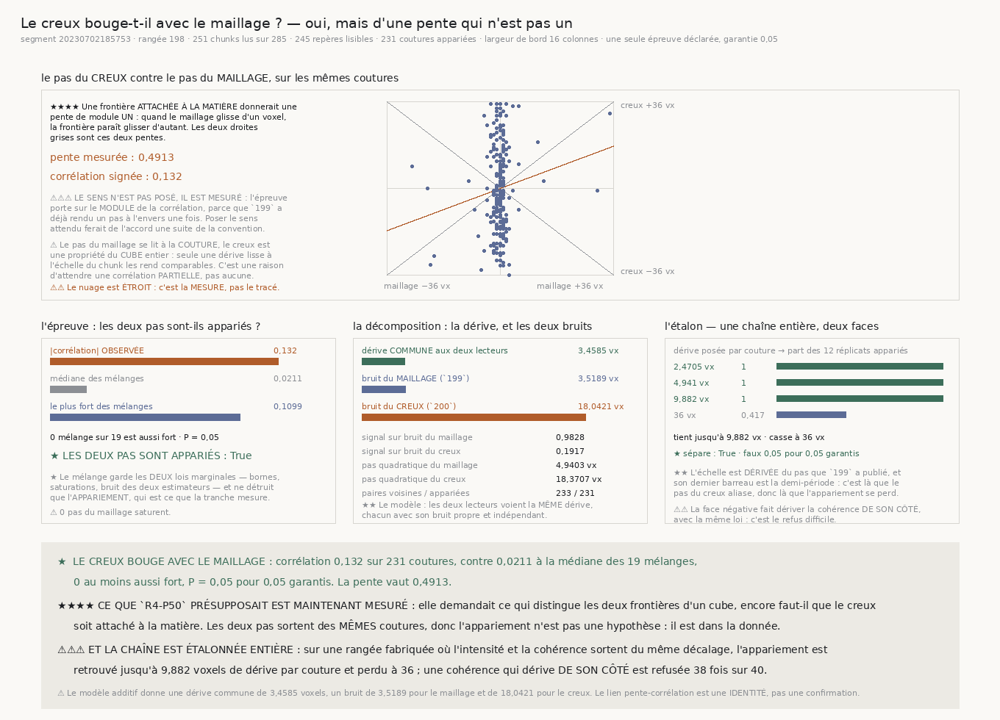

# `202` — Le creux bouge-t-il avec le maillage ?

*Il y bouge. C'est la première bonne nouvelle depuis `199`, et elle est chiffrée : la dérive vraie vaut trois voxels et demi par couture, et le creux la lit avec dix-huit voxels de bruit.*

## 0. Pourquoi cette tranche

`R4-P50` demandait ce qui, dans un cube, distingue les **deux frontières** qu'il peut contenir.
Mais cette question en présuppose une autre, que rien n'avait mesurée : **le creux est-il seulement
attaché à la matière ?**

⭐⭐⭐⭐ **Et la réponse est un test apparié, exact, sur les mêmes coutures.** Si le creux est une
frontière de feuillet, alors quand le maillage dérive de `d` voxels d'un chunk au suivant, la
frontière doit paraître bouger d'autant — au signe près. `199` rend le pas du maillage, `200` rend
la couche du creux, et les deux se lisent sur la **même** paire de chunks.

⚠⚠ **Et la tranche répare le défaut que `201` a nommé** : chaque pas est publié **avec ses deux
colonnes**. Le cumul de `199` était indexé par numéro de pas, donc injoignable ; ici la jointure est
dans la donnée.

## 1. La ligne, et ce qui en sort

| | |
|---|---:|
| segment | `20230702185753` |
| rangée **médiane** | **198** |
| colonnes demandées | **285 colonnes** |
| colonnes lues | **251 colonnes** |
| repères lisibles | **245 repères** |
| sans surface au dépôt | **28 colonnes** |
| écartées par le filtre du producteur | **6 colonnes** |
| paires de colonnes **voisines** | **233 paires** |
| coutures réellement appariées | **231 coutures** |
| largeur de bord | **16 colonnes** |
| pas du maillage qui saturent | **0 pas** |

⚠⚠⚠ **Seules les colonnes voisines comptent, et c'est une contrainte de l'estimateur, pas un
choix** : `un_pas` compare le bord **droit** d'un chunk au bord **gauche** du suivant. Deux chunks
séparés par un trou n'ont pas de couture commune.

⚠ **Les deux lectures sortent du même téléchargement.** Les lire en deux passes en ferait deux
rangées, et rien ne garantirait qu'elles portent sur les mêmes chunks.

## 2. L'unique épreuve déclarée

Une seule épreuve — **le pas du creux est-il apparié au pas du maillage** — donc la garantie reste
entière : **0,05**, soit exactement $1/(19+1)$.

⚠⚠⚠ **Le sens n'est pas posé, il est mesuré.** La statistique est la **valeur absolue** de la
corrélation. `199` a déjà rendu un pas à l'envers une fois ; poser le sens attendu ferait de
l'accord une conséquence de la convention.

⭐⭐⭐⭐ **Le mélange est le nul exact, et il mord** : il garde les **deux** lois marginales — bornes,
saturations, bruit des deux estimateurs — et ne détruit que l'**appariement**, qui est précisément
ce que la tranche mesure.

| | |
|---|---:|
| corrélation signée | **0,132** |
| son module | **0,132** |
| médiane des **19 mélanges** | **0,0211** |
| le plus fort des mélanges | **0,1099** |
| mélanges au moins aussi forts | **0 mélange** sur 19 |
| valeur **P** | **0,05** |
| garantie de l'épreuve | **0,05 garantis** |
| **les deux pas sont appariés** | **oui** |

★ **L'épreuve se déclenche**, et le plus fort des dix-neuf mélanges reste sous l'observé — mais
l'observé n'en est pas loin, et **P vaut le plancher exact** que dix-neuf tirages permettent.

## 3. La décomposition — la partie utile

Prise seule, une pente de **0,4913** se lirait « le creux bouge deux fois moins ». Le modèle dit
tout autre chose.

⭐⭐⭐⭐ **Le modèle est écrit ici et nulle part ailleurs** : les deux lecteurs voient une même dérive
$T$, et chacun y ajoute une erreur qui lui est propre et indépendante de l'autre. Alors la
covariance des deux pas **est** la variance de $T$, et ce qui reste de chaque variance est le bruit
de ce lecteur-là.

| | |
|---|---:|
| pas quadratique du maillage | **4,9403 voxels** |
| pas quadratique du creux | **18,3707 voxels** |
| variance du pas du maillage | **24,3439** voxels² |
| variance du pas du creux | **337,4794** voxels² |
| **dérive commune** | **3,4585 voxels** |
| bruit du **maillage** (`199`) | **3,5189 voxels** |
| bruit du **creux** (`200`) | **18,0421 voxels** |
| signal sur bruit du maillage | **0,9828** |
| signal sur bruit du creux | **0,1917** |

⭐ **Le creux bouge donc AUTANT que le maillage ; il est lu cinq fois moins bien.**

⚠⚠⚠ **Le lien entre la pente et la corrélation est une identité algébrique, pas une confirmation du
modèle.** $r = \text{pente} \times \sigma_x / \sigma_y$ est vrai de n'importe quelles deux suites,
donc le vérifier ne prouve rien. Ce qui se vérifie est ailleurs : que la variance commune reste
**positive** et **inférieure aux deux variances observées**. Un modèle additif qui demanderait un
bruit négatif serait réfuté par ses propres nombres — et le code refuse alors de publier.

⚠⚠ **Et le modèle révise un chiffre de `199`.** Sa marche au hasard était projetée sur un pas
quadratique de **4,941 voxels**, pris pour la dérive. La décomposition dit que **3,5189** de ces
voxels sont le bruit de l'estimateur et **3,4585** la dérive vraie. La portée « un demi-pli en
**53,09** chunks » de `199` est donc une **sous-estimation de la distance** que le feuillet tient —
le nombre corrigé n'est pas calculé ici, parce qu'il appartient au producteur de `199` et non à
cette tranche.

## 4. Le verdict

| | |
|---|---:|
| coutures | **231 coutures** |
| pente du creux sur le maillage | **0,4913** |
| corrélation signée | **0,132** |
| valeur **P** | **0,05** |
| **le creux bouge avec le maillage** | **oui** |

★ **Le creux est attaché au papyrus.** C'est la première réponse positive de la sous-chaîne
`199`–`202`.

⚠ **La limite est écrite** : le pas du maillage se lit à la **couture**, le creux est une propriété
du **cube entier**. Les deux ne vivent pas tout à fait à la même échelle, et seule une dérive lisse
à l'échelle du chunk les rend comparables. C'est une raison d'attendre une corrélation
**partielle**, pas une raison de n'en attendre aucune.

## 5. L'étalon — une chaîne entière, deux faces

⭐⭐⭐⭐ **La fixture fait sortir le profil d'intensité et la courbe de cohérence du même décalage**,
et c'est ce qui en fait un contrôle plutôt qu'une pétition de principe : rien n'impose aux deux
**estimateurs** de s'accorder, seule la matière les y oblige. `un_pas` lit l'intensité, le repère lit
la cohérence, et aucun des deux ne sait ce que l'autre voit.

⚠⚠⚠ **La couche est lue par le vrai lecteur, jamais écrite par la fixture.** La première version
construisait la courbe puis la **jetait** et posait la couche elle-même : l'étalon n'exerçait alors
aucun des deux estimateurs.

| dérive posée par couture | part des **12 réplicats** appariés |
|---:|---:|
| **2,4705 vx** | **1** |
| **4,941 vx** | **1** |
| **9,882 vx** | **1** |
| **36 vx** | **0,4167** |

| | |
|---|---:|
| tient jusqu'à | **9,882 vx** |
| n'en garde plus que **0,4167 des réplicats** à | **36 vx** |
| casse à | **36 vx** |
| chunks par rangée fabriquée | **24 chunks** |
| bruit de la fixture | **0,02 de bruit** |
| réplicats du **refus** | **40 réplicats** |
| faux | **2 faux** |
| taux de faux | **0,05 pour 0,05 garantis** |
| probabilité d'en avoir autant | **0,600936** |
| **l'étalon sépare** | **oui** |

⭐ **L'échelle est dérivée du pas que `199` a publié**, aucune valeur n'est tapée, et son dernier
barreau est la **demi-période** : c'est là que le pas du creux aliase, donc là que l'appariement
doit se perdre. Il s'y perd.

⚠⚠⚠ **La face négative fait dériver la cohérence de son côté, avec la même loi** : c'est le refus
difficile, et le seul qui mesure quelque chose. Une face négative bâtie sur une matière plate serait
plus facile à refuser, donc elle ne mesurerait pas le bon refus.

## 6. Les sondes, et deux défauts que seul un bris a montrés

**49 sondes** pour le module, **53** pour la figure. **Dix-sept bris** posés, **trois sont restés
verts**, et chacun a nommé un défaut réel.

1. ⚠⚠⚠ **Une fixture qui ÉCRIT ce qu'elle doit faire LIRE.** La première version construisait la
   courbe de cohérence puis posait `la_couche` elle-même. La sonde qui vérifiait « le repère
   retrouve la couche posée » ne pouvait pas voir le défaut : une valeur **écrite** satisfait
   trivialement cette phrase. **Remède structurel** : le lecteur rend aussi une **profondeur** et
   une **largeur**, qu'aucune fixture ne fabrique, et c'est cela que la sonde exige désormais.
2. ⚠⚠⚠ **Une texture périodique fait aliaser l'estimateur bien avant la demi-période.** La fixture
   posait une sinusoïde de période dix-sept ; `un_pas` y trouve autant d'alignements que de
   périodes, donc il aliase dès huit voxels et demi. L'étalon cassait à cette valeur pendant que sa
   docstring annonçait la demi-période — **un nombre juste sous un mauvais nom**. Remède : un fond
   tiré **une fois** puis découpé à des décalages différents, qui n'a qu'un seul alignement.
3. ⚠⚠ **Deux bris tuaient la batterie avant son verdict**, parce que les sondes lisaient une clef
   sans vérifier `decidable`. Un défaut se lisait alors comme une erreur d'exécution et non comme
   une sonde rouge. Réparé par une lecture prudente et par des racines carrées qui ne peuvent plus
   rendre un complexe.

## 7. Et un défaut de l'étalon, trouvé par l'étalon lui-même

⚠⚠⚠ **La première mesure a rendu un taux de faux de 4 sur 12, et l'étalon a refusé de séparer.**
C'était juste, et la cause n'était ni l'épreuve ni la fixture. Deux sondes l'ont établi :

| ce qui a été mesuré à part | taux de faux |
|---|---:|
| l'épreuve seule, sur des suites gaussiennes indépendantes | **0,0433** sur 300 tirages |
| l'épreuve seule, sur des pas entiers | **0,05** sur 300 tirages |
| la fixture non appariée, à travers toute la chaîne | **0,025** sur 40 réplicats |

⭐ **Le défaut était le nombre de réplicats.** Avec `n` réplicats, le plus petit taux non nul vaut
$1/n$ : à douze réplicats il vaut **0,083**, donc **déjà plus** que la garantie de **0,05**. Un
étalon à douze réplicats ne peut démontrer un taux compatible qu'en n'ayant **aucun** faux.

⭐ **Le compte se dérive donc** : il faut $1/\text{garantie}$ réplicats pour qu'un seul faux
n'excède pas la garantie, et le double pour que deux ne l'excèdent pas non plus — d'où **40**. Après
correction : **2 faux sur 40**, soit **0,05** exactement, et une probabilité d'en avoir autant de
**0,600936**.

⚠ C'est `le_taux_tient_la_garantie` de `198` qui a attrapé cela, parce qu'il juge par la **queue
binomiale exacte** et non par un « inférieur ou égal ». La leçon vaut pour tous les étalons du
dépôt.

## 8. Ce que ça ferme, ce que ça ouvre

★ **`R4-P50` reçoit la réponse à ce qu'elle présupposait** : le creux **est** une frontière du
papyrus, il bouge avec le maillage, et la sous-chaîne `199`–`202` cesse d'être une suite de
réfutations.

⭐⭐⭐⭐ **Mais la question de la porte reste entière, et elle est maintenant chiffrée.** Ce qui
sépare le creux d'un repère utilisable n'est pas sa nature, c'est son **bruit** : **18,0421 voxels**
contre une dérive de **3,4585**. Il faudrait le diviser par cinq environ pour que le repère porte
l'ordinal que `201` cherchait.

⭐ **Et le chemin est nommé par la mesure elle-même.** Le bruit du creux vient de ce que le lecteur
désigne **une** frontière parmi celles que le cube contient, sans savoir laquelle. Réduire ce bruit,
c'est exactement répondre à `R4-P50` — mais on sait désormais que la réponse vaut la peine d'être
cherchée, ce que rien ne disait avant cette tranche.

⚠⚠ **Un chiffre de `199` est à revoir, et il n'appartient pas à cette tranche** : sa portée « un
demi-pli en **53,09** chunks » repose sur un pas quadratique dont la décomposition dit que la moitié
est du bruit d'estimateur.
