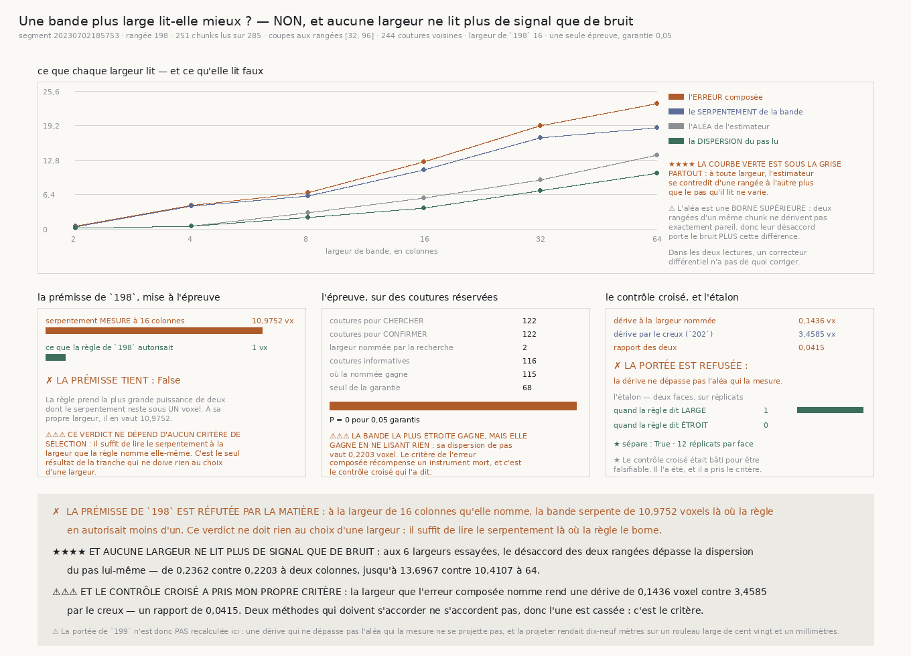

# `203` — Une bande de bord plus large lit-elle mieux ?

*La prémisse de `198` est réfutée par la matière, aucune largeur ne lit plus de signal que de bruit, et le contrôle croisé a pris mon propre critère.*

## 0. Pourquoi cette tranche

`R4-P51` la nomme, et elle a deux versants. `202` a mesuré que le pas du maillage porte
**3,4585 voxels** de dérive vraie pour **3,5189 voxels** de bruit d'estimateur : `199` mesure donc
sa propre erreur autant que le mouvement du feuillet. La largeur de bande qu'il emploie —
**16 colonnes** — vient d'une règle de `198` qui n'avait jamais été vérifiée sur la matière : une
bande de `w` colonnes serpente de `w·m/128`, et on prend la plus grande puissance de deux qui garde
cela sous **1 voxel**.

## 1. Deux quantités, sous deux noms — et un défaut payé pour les séparer

⚠⚠⚠ **La première version de cette tranche mesurait la mauvaise chose sous le bon nom.** Elle
coupait la bande en deux moitiés — celle qui touche la couture, celle qui est plus loin — et
appelait leur désaccord « bruit d'estimateur ». Mais la moitié loin compare deux endroits séparés de
`w` colonnes : son désaccord contient, **par construction**, la variation réelle de la profondeur
sur cette distance, et il croît avec `w` même quand l'estimateur est parfait. La courbe monotone qui
en sortait ne mesurait que sa propre définition.

⭐⭐⭐⭐ **Séparées, les deux quantités disent chacune quelque chose :**

- le **serpentement** — la coupe en colonnes, proche contre loin — est exactement ce que la règle
  de `198` borne, et rien ne l'avait mesuré sur une rangée ;
- l'**aléa** — la même bande lue sur **deux rangées** du chunk, au quart et aux trois quarts — porte
  sur les **mêmes colonnes** et la même couture, donc il ne peut pas croître avec `w` par
  construction. C'est ce qui rend les largeurs comparables.

⚠⚠ **L'aléa reste une borne supérieure** : deux rangées d'un même chunk ne dérivent pas exactement
pareil, donc leur désaccord porte le bruit **plus** cette différence réelle. Mais cette différence
ne dépend pas de la largeur : elle décale la courbe sans la pencher.

## 2. La ligne

| | |
|---|---:|
| segment | `20230702185753` |
| rangée **médiane** | **198** |
| colonnes lues | **251 colonnes** sur **285 colonnes** |
| rangées de coupe | la rangée **32 sur 128** et la rangée **96 sur 128** |
| coutures voisines | **244 coutures** |
| pour **chercher** | **122 coutures** |
| pour **confirmer** | **122 coutures** |
| largeur de `198` | **16 colonnes** |

⚠⚠⚠ **Le prix de chercher est séparé de celui de confirmer, comme `192` l'a imposé.** Les coutures
sont coupées par leur **parité** : les impaires tracent la courbe et nomment une largeur, les paires
l'éprouvent. La parité est choisie parce qu'elle ne regarde rien — deux moitiés contiguës seraient
deux morceaux de rouleau différents.

## 3. Les trois courbes, et la quatrième qui décide

| largeur | dispersion du pas | aléa | serpentement | erreur composée |
|---:|---:|---:|---:|---:|
| **2 colonnes** | **0,2203** | **0,2362** | **0,4545** | **0,5122** |
| **4 colonnes** | **0,567** | **0,532** | **4,3318** | **4,3643** |
| **8 colonnes** | **2,1835** | **2,9886** | **6,0889** | **6,7828** |
| **16 colonnes** | **3,8813** | **5,7835** | **10,9752** | **12,4058** |
| **32 colonnes** | **7,0929** | **9,0944** | **16,9073** | **19,198** |
| **64 colonnes** | **10,4107** | **13,6967** | **18,7653** | **23,2322** |

⭐ **L'erreur compose l'aléa et le serpentement en quadrature**, et ce n'est pas un choix : deux
sources d'erreur indépendantes ajoutent leurs **variances**. C'est la même arithmétique que la
décomposition de `202`.

★★★★ **Et la colonne qui décide est la première : à chacune des six largeurs, l'aléa dépasse la
dispersion du pas lui-même.** L'estimateur se contredit d'une rangée à l'autre plus que le pas qu'il
lit ne varie.

⚠⚠ **Deux lectures de ce fait, et les deux sont mauvaises pour un correcteur différentiel** : ou
bien l'estimateur est bruité à ce point, ou bien la surface varie tellement **à l'intérieur d'un
chunk** que le pas lu sur une rangée ne représente pas le chunk. La tranche ne tranche pas entre
les deux, et n'a pas à le faire.

## 4. Le verdict qui ne doit rien à un critère

★ **La prémisse de `198` se lit sans aucune sélection** : sa règle prend la plus grande puissance de
deux dont le serpentement reste sous **1 voxel**. À la largeur de **16 colonnes** qu'elle nomme,
le serpentement mesuré vaut **10,9752 voxels**.

| | |
|---|---:|
| serpentement mesuré à la largeur de `198` | **10,9752 voxels** |
| ce que la règle autorisait | **1 voxel** |
| **la prémisse de `198` tient** | **non** |

✗ **Elle est dépassée d'un facteur onze.** C'est le seul résultat de la tranche qui ne doive rien à
la façon dont une largeur est nommée — il suffit de lire le serpentement là où la règle le borne.

## 5. L'épreuve, et ce qu'elle gagne

| | |
|---|---:|
| largeur nommée par la recherche | **2 colonnes** |
| son erreur composée | **0,4635 voxel** |
| coutures vues | **121 coutures** |
| coutures **informatives** | **116 coutures** |
| où la nommée gagne | **115 coutures** |
| seuil de la garantie | **68 coutures** |
| valeur **P** | **0 pour 0,05 garantis** |

⭐ **Le test est apparié et exact** : chaque couture est lue aux deux largeurs, donc le nul est celui
d'un tirage à pile ou face sur les seules coutures qui **tranchent**. Une couture où les deux
largeurs se trompent d'autant ne désigne personne.

⚠⚠⚠ **Mais la bande la plus étroite gagne en ne lisant rien.** Sa dispersion de pas vaut
**0,2203 voxel** : deux colonnes voisines au bord d'une couture sont presque la même matière, donc
l'estimateur y rend presque toujours le même pas. Son aléa est minuscule et son serpentement aussi.

⭐⭐⭐⭐ **Le critère de l'erreur composée récompense un instrument mort.** C'est le défaut de cette
tranche, et il appartient à la tranche de le dire.

## 6. Le contrôle croisé a pris le critère

Le contrôle avait été bâti pour être **falsifiable** : la dérive tirée des deux rangées et celle que
`202` a tirée du creux sont deux méthodes sans rien de commun, donc leur accord est une prédiction
et non une identité.

| | |
|---|---:|
| dérive à la largeur nommée | **0,1436 voxel** |
| son aléa | **0,2362 voxel** |
| son signal sur bruit | **0,6081** |
| dérive par le creux (`202`) | **3,4585 voxels** |
| **rapport des deux** | **0,0415** |

✗ **Elles diffèrent d'un facteur vingt-quatre.** Deux méthodes qui doivent s'accorder ne s'accordent
pas, donc l'une est cassée — et c'est le critère qui a nommé la largeur.

⚠⚠⚠ **À la largeur de `198`, la dérive est refusée** : *les deux moitiés se désaccordent plus
qu'elles ne s'accordent, aucune dérive à extraire*. Le modèle additif se réfute par ses propres
nombres, et le code refuse alors de publier.

## 7. La portée n'est pas recalculée, et c'est un refus dérivé

✗ **`R4-P51` demandait de recalculer la portée de `199` sur la dérive. La tranche le refuse.**

⚠⚠⚠ **Le critère du refus est dérivé, pas choisi** : une dérive qui ne dépasse pas l'aléa qui la
mesure ne se projette pas. **0,1436** contre **0,2362**. Projeter quand même rendait
**dix-neuf mètres** sur un rouleau large de **121,44 mm** — un nombre que rien n'aurait contredit
s'il n'avait pas été absurde à l'œil nu.

⭐ **Et la question de `R4-P51` — où le nombre doit vivre — reçoit sa réponse par la négative** : pas
ici, et pas encore. Tant qu'aucune largeur ne lit plus de signal que de bruit, il n'y a pas de dérive
à projeter.

## 8. L'étalon

⭐⭐⭐⭐ **Les deux faces sont les deux régimes de la règle de `198`, et rien n'y est tapé.** Un
serpentement par colonne de `s` fait serpenter une bande de `w` colonnes de `s·racine(w)` :

- à **0,02 par colonne**, même la bande la plus large reste à **0,16 voxel** — la règle dit LARGE ;
- à **1 par colonne**, la plus étroite dépasse déjà **1,4142 voxel** — la règle dit ÉTROIT.

| | |
|---|---:|
| quand la règle dit **LARGE**, large gagne | **1** sur **12 réplicats** |
| quand la règle dit **ÉTROIT**, large gagne | **0** sur **12 réplicats** |
| **l'étalon sépare** | **oui** |

⚠⚠ **Les égalités comptent comme des échecs** : sur une matière si facile que les deux largeurs
lisent juste, élargir n'apporte rien, et le dire « mieux » ferait passer une absence d'effet pour un
gain. Une sonde l'exige, parce qu'un bris qui les comptait comme un gain était resté **vert**.

## 9. Les sondes, et trois défauts que seule la mesure a montrés

**53 sondes** pour le module, **37** pour la figure. **Dix-sept bris** posés, tous rouges après
réparation.

1. ⚠⚠⚠ **Une fixture en dent de scie.** Le premier « serpentement » repartait de zéro à chaque
   chunk : il fabriquait une discontinuité d'un pli entier à chaque couture, et l'estimateur lisait
   **-27 voxels** là où la vérité valait **-1,7**. Réparé par une profondeur **continue** le long
   des colonnes du rouleau, dont une sonde vérifie qu'elle ne saute pas à la couture.
2. ⚠⚠⚠ **Un instrument qui mesurait le serpentement et l'appelait bruit** — §1.
3. ⚠⚠⚠ **Un critère satisfait par un instrument mort** — §5, trouvé par le contrôle croisé.

Et deux bris restés verts, réparés :

- comparer une largeur à elle-même rend « indécidable » **pour une autre raison** que le garde qui
  le refuse ; la sonde lit désormais la **raison**, pas seulement le refus ;
- une fixture à une seule rangée faisait tomber la batterie **avant son verdict**, donc le défaut se
  lisait comme une erreur d'exécution.

## 10. Ce que ça ferme, ce que ça ouvre

✗ **La règle de `198` ne tient pas, et sa prémisse encore moins.** Toute la chaîne `199`–`202` a
mesuré avec une bande dont on sait maintenant qu'elle serpente onze fois plus que la règle ne
l'autorisait.

⚠⚠ **Mais cela ne réfute pas `199` à `202`** : leurs résultats portent sur ce que **cet estimateur**
rend, et ils restent vrais de lui. Ce qui change est l'espoir qu'on pouvait mettre dans un réglage
de largeur : il n'y en a pas.

⭐⭐⭐⭐ **Et le fait neuf est plus général que la largeur** : à **aucune** des six largeurs
l'estimateur différentiel ne lit plus de signal que de bruit. Ce n'est plus un problème de réglage,
c'est un problème de **forme de mesure** — un pas lu par corrélation sur une coupe d'une rangée ne
sépare pas le mouvement du feuillet du bruit de sa propre lecture, quelle que soit la largeur qu'on
lui donne.
