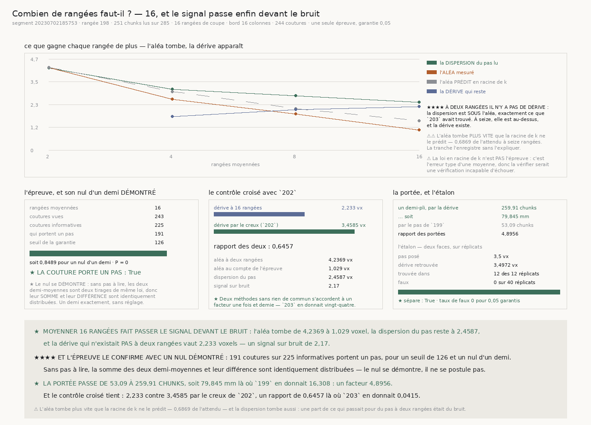

# `204` — Combien de rangées faut-il pour lire le pas ?

*Seize. Et le signal passe enfin devant le bruit : la portée passe de cinquante-trois chunks à deux cent soixante.*

## 0. Pourquoi cette tranche

`203` a établi qu'à **aucune** largeur de bande l'estimateur différentiel ne lit plus de signal que
de bruit : le désaccord de deux rangées d'un même chunk dépasse la dispersion du pas lui-même
partout. Ce n'est donc plus un problème de réglage mais de **forme** de mesure.

⭐⭐⭐⭐ **Et `203` a laissé deux lectures ouvertes, que cette tranche sépare.** Ou bien ce désaccord
est le **bruit** de l'estimateur — et alors moyenner plusieurs rangées doit le réduire — ou bien
c'est la **variation réelle** de la surface dans un chunk — et alors moyenner n'y fera rien.

⭐ **La prédiction est posée avant la mesure, et c'est la première fois de la chaîne** : si les
erreurs des rangées sont indépendantes, l'aléa d'une moyenne de `k` rangées vaut celui d'une rangée
divisé par $\sqrt{k}$, exactement.

⚠⚠ **Mais cette loi n'est PAS l'épreuve, et c'est délibéré** : c'est l'erreur type d'une moyenne,
donc la vérifier serait une vérification incapable d'échouer. Elle est publiée comme **description**,
et c'est son écart à la prédiction qui renseigne.

## 1. La ligne, et ce qu'elle coûte

| | |
|---|---:|
| segment | `20230702185753` |
| rangée **médiane** | **198** |
| colonnes lues | **251 colonnes** sur **285 colonnes** |
| rangées de coupe | **16 rangées**, de la rangée **4 sur 128** à la rangée **124 sur 128** |
| largeur de bord | **16 colonnes** |
| coutures voisines | **244 coutures** |

⭐ **Seuls les profils de bord sont gardés.** `un_pas` ne regarde que les colonnes du bord et il les
moyenne ; lui passer le profil déjà moyenné rend **exactement** le même nombre, et la rangée entière
tient alors dans quelques kilooctets au lieu de quelques mégaoctets. Une sonde le vérifie plutôt que
de le supposer.

## 2. Les quatre courbes

| rangées | aléa | prédit ($\sqrt{k}$) | observé / prédit | dispersion du pas | dérive | signal sur bruit |
|---:|---:|---:|---:|---:|---:|---:|
| **2 rangées** | **4,2369** | **4,2369** | **1 fois** | **4,2006** | *aucune* | *aucun* |
| **4 rangées** | **2,5969** | **2,9959** | **0,8668** | **3,1185** | **1,7265** | **0,6648** |
| **8 rangées** | **1,8483** | **2,1184** | **0,8725** | **2,783** | **2,0806** | **1,1257** |
| **16 rangées** | **1,029** | **1,498** | **0,6869** | **2,4587** | **2,233** | **2,17 fois** |

⭐⭐⭐⭐ **À deux rangées il n'y a AUCUNE dérive à extraire** : la dispersion du pas est **sous**
l'aléa, exactement ce que `203` avait trouvé. À seize, elle est au-dessus, et la dérive existe.

⭐ **L'aléa est le demi écart-type du désaccord, et c'est une identité** : chaque demi-moyenne porte
`k/2` rangées, donc son erreur vaut $s/\sqrt{k/2}$ ; leur différence vaut $2s/\sqrt{k}$ et la
moyenne entière $s/\sqrt{k}$. La division par deux n'est pas un réglage.

⚠⚠ **L'aléa tombe PLUS VITE que la racine de `k` ne le prédit** — **0,6869** de l'attendu à seize
rangées. La tranche l'enregistre sans l'expliquer : ce serait une cause supposée là où seul l'écart
est mesuré.

⚠⚠ **Et la dispersion tombe aussi**, de **4,2006** à **2,4587**. Si la dérive vraie était fixe, elle
devrait plafonner. Qu'elle baisse dit qu'une part de ce qui passait pour du pas à deux rangées était
du bruit — ce qui est cohérent, et qui est la raison pour laquelle la dérive doit être extraite
plutôt que lue directement.

## 3. L'épreuve, et son nul d'un demi DÉMONTRÉ

⭐⭐⭐⭐ **Le nul n'est pas posé, il se démontre.** Chaque couture rend deux demi-moyennes $A$ et $B$
de même taille. Le pas publié est leur moyenne, donc $2p = A+B$, et le désaccord est $d = A-B$. S'il
n'y a **aucun** pas à lire, $A$ et $B$ sont deux tirages indépendants de même loi symétrique, donc
$A+B$ et $A-B$ sont **identiquement distribués** : la probabilité que l'un dépasse l'autre en module
vaut exactement un demi. Aucun réglage, aucune hypothèse gaussienne.

⭐ **Et s'il y a un pas $T$**, alors $A+B = 2T + (e_1+e_2)$ grandit avec lui pendant que
$A-B = e_1-e_2$ ne bouge pas : l'épreuve a de la puissance exactement contre ce qu'elle cherche.

| | |
|---|---:|
| rangées moyennées | **16 rangées** |
| coutures vues | **243 coutures** |
| coutures **informatives** | **225 coutures** |
| qui portent un pas | **191 coutures** |
| seuil de la garantie | **126 coutures** |
| part observée | **0,8489** pour un nul d'un demi |
| valeur **P** | **0 pour 0,05 garantis** |
| **la couture porte un pas** | **oui** |

⚠ Le compte de rangées de l'épreuve est **posé d'avance** — le plus grand lu — donc aucune sélection
n'entre dans le verdict et il n'y a pas de prix de chercher à payer. La courbe entière est une
description.

## 4. Le contrôle croisé avec `202`

| | |
|---|---:|
| dérive à **16 rangées** | **2,233 voxels** |
| dérive par le creux (`202`) | **3,4585 voxels** |
| **rapport des deux** | **0,6457** |

★ **Deux méthodes sans rien de commun s'accordent à un facteur une fois et demie.** `203`, avec son
critère cassé, en donnait **0,0415** — un facteur vingt-quatre. L'écart qui reste est réel et n'est
pas expliqué ici ; il est publié.

## 5. La portée

| | |
|---|---:|
| un demi-pli, par la dérive | **259,91 chunks** |
| … soit | **79,845 mm** |
| par le pas de `199` | **53,09 chunks**, soit **16,308 mm** |
| **rapport des portées** | **4,8956** |

⭐ **La portée quintuple**, et le nombre est enfin physiquement plausible : **79,845 mm** sur un
rouleau large de **121,44 mm** déroulé. ⚠ Elle ne remplace pas celle de `199`, qui reste la portée de
**son** pas ; elle se met à côté.

⚠⚠⚠ **Et le refus de `203` est gardé** : une dérive qui ne dépasse pas l'aléa qui la mesure ne se
projette pas. Ici **2,233** contre **1,029**, donc elle se projette.

## 6. L'étalon

| | |
|---|---:|
| pas posé | **3,5 voxels** |
| bruit par rangée | **6 voxels** |
| coutures par réplicat | **60 coutures** |
| trouvée dans | **12 des 12 réplicats** |
| dérive retrouvée | **3,4972 voxels** |
| réplicats du refus | **40 réplicats** |
| faux | **0 faux** — taux **0 pour 0,05 garantis** |
| **l'étalon sépare** | **oui** |

⚠⚠⚠ **La face négative a davantage de réplicats, et le compte se dérive** — la leçon de `202` : avec
`n` réplicats le plus petit taux non nul vaut $1/n$, donc il en faut au moins $1/\text{garantie}$
pour qu'un seul faux ne dépasse pas déjà la garantie, et le double pour que deux ne la dépassent pas.

⭐ **La face négative pose un pas vrai nul et garde le même bruit** : c'est le refus difficile, et le
seul qui mesure quelque chose.

## 7. Les sondes

**38 sondes** pour le module, **46** pour la figure. **Quatorze bris** posés, tous rouges après
réparation. Deux étaient restés verts :

1. ⚠⚠ **Une dispersion constante passait**, parce que la sonde ne vérifiait que la **présence** de la
   clef et non sa valeur. C'est la garde que `203` avait imposée, prise en défaut sur sa propre
   vérification.
2. ⚠⚠ **Une fixture sans bruit par rangée tuait la batterie avant son verdict**, donc le défaut se
   lisait comme une erreur d'exécution et non comme une sonde rouge.

⭐ Et une sonde vérifie le nul d'un demi **empiriquement** plutôt que de le croire : sur quarante
mille tirages sans pas, elle exige que la somme dépasse la différence une fois sur deux à moins d'un
centième près.

## 8. Ce que ça ouvre

★ **`R4-P52` est répondue par l'affirmative**, et c'est la première réponse positive franche depuis
`202`. La forme de mesure qui sépare le mouvement du feuillet du bruit de sa lecture est de lire le
pas sur **plusieurs rangées** et d'en moyenner les estimations.

⚠⚠ **Mais la chaîne ne redevient pas facile pour autant.** La portée de **259,91 chunks** est une
portée de **marche au hasard** : elle dit après combien de coutures un demi-pli est perdu si rien ne
corrige, pas que quelque chose corrige. `199` avait établi que les pas se **compensent**, donc il n'y
a toujours aucun biais à retirer — ce qui change est que le pas est maintenant **mesurable**, donc
qu'un correcteur aurait enfin de quoi travailler.

⚠ **Et deux chiffres restent inexpliqués et sont publiés comme tels** : l'aléa tombe plus vite que la
racine de `k`, et la dérive reste à **0,6457** de celle que le creux donne.
