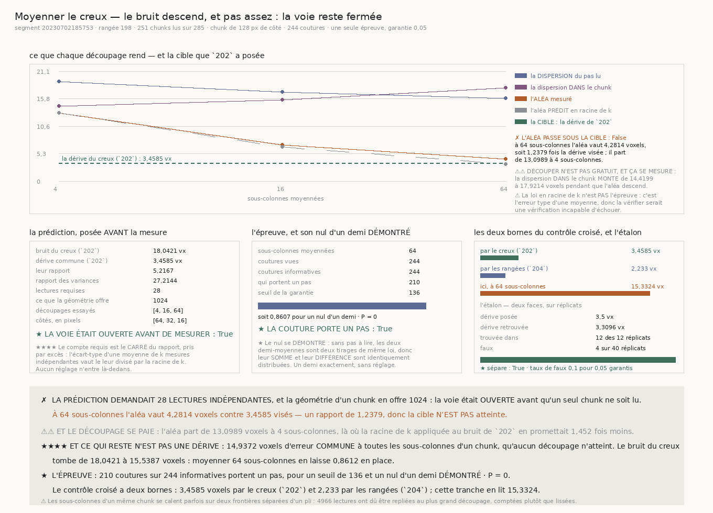

# `205` — Moyenner le creux réduit-il son bruit ?

*La voie était ouverte avant la mesure, et elle se referme ailleurs : le bruit du creux ne vit pas
où la prédiction le cherchait.*

## 0. Pourquoi cette tranche

`204` a établi que moyenner seize rangées met le signal devant le bruit pour le **maillage** :
l'aléa tombe de **4,2369 voxels** à **1,029 voxel** et la dérive vraie vaut **2,233 voxels**. La
même question se pose au **creux**, et elle ne s'était jamais posée : `200` lit sa couche sur UN
cube, sans moyenner quoi que ce soit, et `202` a mesuré que son bruit propre vaut **18,0421 voxels**
pour une dérive commune de **3,4585 voxels**.

⭐⭐⭐⭐ **Et le gain se prédit avant d'être mesuré.** Si les lectures d'un même chunk sont
indépendantes, l'écart-type de leur moyenne décroît comme la racine de leur nombre ; ramener le
bruit sous la dérive demande donc le **carré** de leur rapport. Ce nombre se calcule à partir de ce
que `202` publie, avant qu'un seul chunk ne soit lu — et c'est ce qui rend la tranche falsifiable
plutôt qu'exploratoire.

## 1. La prédiction, posée avant la mesure

| | |
|---|---:|
| bruit du creux (`202`) | **18,0421 voxels** |
| dérive commune (`202`) | **3,4585 voxels** |
| leur rapport | **5,2167** |
| rapport des variances | **27,2144** |
| **lectures requises** | **28 lectures** |

⚠⚠⚠ **Le compte se prend par EXCÈS, jamais au plus proche.** Le rapport des variances est un
plancher strict : au premier entier sous lui, le bruit vaut encore la dérive. `R4-P53` écrivait
« vingt-sept » en prose ; la loi demande le premier entier **strictement** au-dessus de **27,2144**,
donc **28 lectures**. C'est précisément pourquoi ce compte est calculé par le module et non tapé.

## 2. Ce qu'un chunk offre, et le plancher qui le borne

Une sous-colonne est un pavé du chunk : une grille de `g × g` en donne `g²`, chacune de
`128 / g` pixels de côté. ⚠⚠ **Le plancher est celui de l'OPÉRATEUR, pas un choix** :
`orientation_profile` dérive par différence centrée sur les deux axes du plan, donc il lui faut au
moins **3 pixels** par axe pour rendre un seul échantillon de gradient.

| | |
|---|---:|
| découpages essayés | **4**, **16**, **64** sous-colonnes |
| côtés correspondants | **64**, **32**, **16 pixels** |
| plancher de l'opérateur | **3 pixels** |
| ce que la géométrie offre au plus | **1024 sous-colonnes** |
| **la voie était-elle ouverte ?** | **oui** |

⚠⚠ **`R4-P53` avait tort sur ce point, et c'est mesuré :** la porte écrivait que vingt-sept lectures
étaient « plus que ce qu'un chunk peut offrir ». Un chunk en offre **1024** au-dessus du plancher de
l'opérateur, loin au-delà du compte requis. Ce n'est donc pas le NOMBRE de lectures qui limite.

⚠ L'échelle part de **4 sous-colonnes** et non d'une seule, pour la raison qui faisait partir `204`
de deux rangées : une lecture unique ne porte aucun désaccord, donc elle ne peut rendre aucun aléa.
Et elle s'arrête au premier découpage qui atteint le compte requis — aller plus loin ne répondrait à
aucune question, s'arrêter avant laisserait la question ouverte.

## 3. La ligne — la MÊME que `199` à `204`

| | |
|---|---:|
| segment | `20230702185753` |
| rangée **médiane** | **198** |
| chunks demandés | **285 colonnes** |
| chunks lus | **251 colonnes** |
| chunks sans surface au dépôt | **28 colonnes** |
| chunks écartés par le filtre du producteur | **6 colonnes** |
| coutures voisines | **244 coutures** |
| côté d'un chunk | **128 pixels** |

## 4. La courbe : l'aléa descend, et la sous-colonne se dégrade

| sous-colonnes | aléa | prédit ($\sqrt{k}$) | observé / prédit | dispersion du pas | dans le chunk | dérive | signal / bruit |
|---:|---:|---:|---:|---:|---:|---:|---:|
| **4** | **13,0989** | **13,0989** | — | **19,1964** | **14,4199** | **14,0328** | **1,0713** |
| **16** | **6,9477** | **6,5494** | **1,0608** | **17,1576** | **15,6146** | **15,688** | **2,258** |
| **64** | **4,2814** | **3,2747** | **1,3074** | **15,919** | **17,9214** | **15,3324** | **3,5812** |

⭐⭐⭐⭐ **Les deux colonnes qui comptent tirent en sens contraire, et c'est la mesure qui le dit.**
L'aléa — le désaccord entre les deux demi-moyennes d'un chunk — tombe de **13,0989** à **4,2814**.
Mais la dispersion **dans** le chunk, c'est-à-dire l'écart entre les sous-colonnes elles-mêmes,
**monte** de **14,4199** à **17,9214 voxels**. Découper n'est pas gratuit : une sous-colonne de
**16 pixels** de côté porte bien moins de pixels par couche qu'un chunk entier, donc son tenseur de
structure est bien plus pauvre.

⚠⚠ **C'est exactement la dette de `203`, et elle est payée d'avance ici** : un critère qui ne
regarderait que l'aléa qui tombe récompenserait un instrument mort. La dispersion de ce qui est lu
est publiée à côté de l'erreur, à chaque barreau.

⚠ **L'aléa tombe PLUS LENTEMENT que la racine de k** : **1,0608** de l'attendu à seize sous-colonnes,
**1,3074** à soixante-quatre. Les lectures d'un même chunk ne sont donc pas tout à fait
indépendantes — ou, ce qui revient au même dans les nombres, ce que chacune gagne en indépendance,
elle le reperd en petitesse.

⚠⚠ Et le découpage coûte dès le premier barreau : à quatre sous-colonnes l'aléa vaut **1,452** fois
ce que la racine de `k` appliquée au bruit de `202` promettait.

⚠⚠ **La loi en racine de `k` n'est PAS l'épreuve**, et c'est délibéré : c'est l'erreur type d'une
moyenne, donc la vérifier serait une vérification incapable d'échouer. Elle est publiée comme
description, et c'est son ÉCART à la prédiction qui renseigne.

## 5. Le verdict : la cible n'est pas atteinte

| | |
|---|---:|
| aléa à **64 sous-colonnes** | **4,2814 voxels** |
| la cible — dérive du creux (`202`) | **3,4585 voxels** |
| **leur rapport** | **1,2379** |
| **le bruit est-il passé sous la dérive ?** | **non** |

✗ **La voie se referme, et pas où la porte l'attendait.** Le compte requis était atteignable — la
géométrie en offre loin au-delà — et l'aléa s'arrête pourtant à **1,2379** fois la cible.

## 6. ⭐⭐⭐⭐ Ce qui reste n'est PAS une dérive

Le modèle additif est celui de `202`, lu à l'envers. Ce que la courbe extrait après avoir retiré le
désaccord entre sous-colonnes vaut **15,3324 voxels** ; or `202` a mesuré que la part de ce pas
**partagée avec le maillage** vaut **3,4585 voxels**. Ce qui reste est donc une erreur **commune à
toutes les sous-colonnes d'un chunk**, qu'aucun découpage ne peut atteindre.

| | |
|---|---:|
| erreur commune à un chunk | **14,9372 voxels** |
| erreur totale à **64 sous-colonnes** | **15,5387 voxels** |
| bruit du creux chez `202` | **18,0421 voxels** |
| **ce qu'il en reste** | **0,8612** |

★ **Moyenner soixante-quatre sous-colonnes laisse 0,8612 du bruit du creux en place.** Ce qui
reste ne vit pas entre les sous-colonnes, donc aucune subdivision ne l'atteindra jamais.

⚠⚠⚠ **Et c'est le contrôle croisé qui interdit de lire 15,3324 comme une dérive** : `202` donne
**3,4585 voxels** par le creux et `204` **2,233 voxels** par les rangées ; **15,3324** vaut
**6,8663** fois la première. Un nombre juste sous un mauvais nom est pire qu'un nombre absent, et
c'est pourquoi cette tranche **ne publie AUCUNE portée** — ce qu'elle projetterait n'est pas une
dérive.

## 7. L'épreuve, et son nul d'un demi DÉMONTRÉ

| | |
|---|---:|
| sous-colonnes moyennées | **64** |
| coutures vues | **244 coutures** |
| coutures informatives | **244 coutures** |
| qui portent un pas | **210 coutures** |
| seuil de la garantie | **136** |
| valeur P | **0 pour 0,05 garantis** |
| **la couture porte-t-elle un pas ?** | **oui** |

⭐⭐⭐⭐ **Le nul se démontre et ne se pose pas.** Chaque couture rend deux demi-pas $A$ et $B$ de
même compte ; le pas publié est leur moyenne, donc $2p = A + B$, et le désaccord est $d = A - B$.
Sans aucun pas à lire, $A$ et $B$ sont deux tirages indépendants de même loi symétrique, donc
$A + B$ et $A - B$ sont identiquement distribués : la probabilité que l'un dépasse l'autre en module
vaut exactement un demi. Avec un pas $T$, la somme grandit avec lui pendant que la différence ne
bouge pas — la puissance est dirigée vers ce que l'épreuve cherche.

⭐ **Le repli se retranche aux DEUX demi-pas, jamais au seul pas publié.** La couche du creux est
définie modulo un pli ; replier la somme sans replier ses deux moitiés romprait l'identité
$2p = A + B$ dont le nul est tiré. Retirer le même nombre entier de plis aux deux demi-pas laisse
leur différence inchangée au voxel près.

## 8. Les sous-colonnes d'un chunk sautent des plis, et c'est mesuré

| sous-colonnes | lectures repliées d'un pli |
|---:|---:|
| **4** | **278 lectures** |
| **16** | **1410 lectures** |
| **64** | **4966 lectures** |

⚠⚠ **Le repli est obligatoire, et c'est `200` qui l'impose** : deux sous-colonnes d'un même chunk
peuvent se caler sur deux frontières séparées d'un pli, et leur moyenne brute tomberait entre les
deux, là où il n'y a rien. La moyenne est donc prise autour de la MÉDIANE, chaque lecture repliée
dans la demi-période, et le compte des lectures effectivement repliées est publié plutôt que lissé.
⚠ Plus le découpage est fin, plus il y en a — ce qui est cohérent avec une sous-colonne dont la
courbe se dégrade.

## 9. L'étalon

| | |
|---|---:|
| dérive posée | **3,5 voxels** |
| bruit par sous-colonne | **6 voxels** |
| chunks par réplicat | **60 chunks** |
| trouvée dans | **12 des 12 réplicats** |
| dérive retrouvée | **3,3096 voxels** |
| réplicats du refus | **40 réplicats** |
| faux | **4 faux** |
| taux de faux | **0,1** |
| garantie | **0,05** |
| **l'étalon sépare** | **oui** |

⚠⚠ **La taille de l'étalon est celle de `204`, et elle n'est pas négociable à la baisse** : le seuil
du test apparié croît avec le nombre de coutures, donc un étalon plus court n'échoue pas parce que
l'instrument est mauvais, mais parce qu'il n'a pas la puissance de montrer qu'il est bon. Une
première version au tiers de cette taille a raté sa face positive pour cette seule raison, et la
raccourcir jusqu'à ce qu'elle passe aurait été un réglage choisi.

⚠ **Et c'est le point le plus faible de la tranche, dit plutôt que caché** : le taux de faux vaut
**0,1** pour **0,05** garantis. La règle de `202` admet jusqu'au double de la garantie sur
réplicats, donc l'étalon sépare — mais il sépare à la limite exacte de ce que la règle autorise.

## 10. Les sondes, et les vingt bris

Le module rend **61** contrôles, la figure **50**. Vingt bris ont été posés et **les vingt ont viré
au rouge**. Deux d'entre eux ont d'abord **tué la batterie avant son verdict** — le péché capital —
et les deux sondes fautives ont été réparées pour lire par `.get()` et tester la présence avant la
valeur.

⚠⚠⚠ **Mais deux vrais défauts ont été trouvés par la MESURE, pas par les sondes.** La première
version de `le_pas_dune_couture` ne transmettait rien de ce que ses deux chunks avaient lu : la
courbe annonçait « dispersion dans le chunk » et « plis sautés » et rendait `None` et zéro à tous
les barreaux. Deux nombres justes sous un mauvais nom, et la sonde ne l'avait pas vu **parce qu'elle
nourrissait la courbe avec des coutures écrites à la main qui portaient déjà ces clefs** — une
fixture complaisante, la famille que ce dépôt a déjà payée six fois. Réparé, et la sonde part
désormais des sous-colonnes et traverse toute la chaîne.

## 11. Ce que cette tranche ne dit pas

⚠ Elle porte sur **une** rangée d'**un** segment, la médiane, jamais choisie — la même que `199` à
`204`, pour que la comparaison en soit une. ⚠⚠ Elle ne dit pas que le creux est inutile : elle dit
que son erreur ne se décompose pas comme la prédiction le supposait, et que l'essentiel de cette
erreur ne vit pas entre les sous-colonnes d'un chunk. ⚠⚠⚠ Et elle ne dit RIEN de ce qui, dans un
chunk, fait que toutes ses sous-colonnes se trompent ensemble.

## 12. La porte

`R4-P53` est **répondue, et par la négative**, mais pas pour la raison qu'elle avançait.
`R4-P54` **s'ouvre**.
