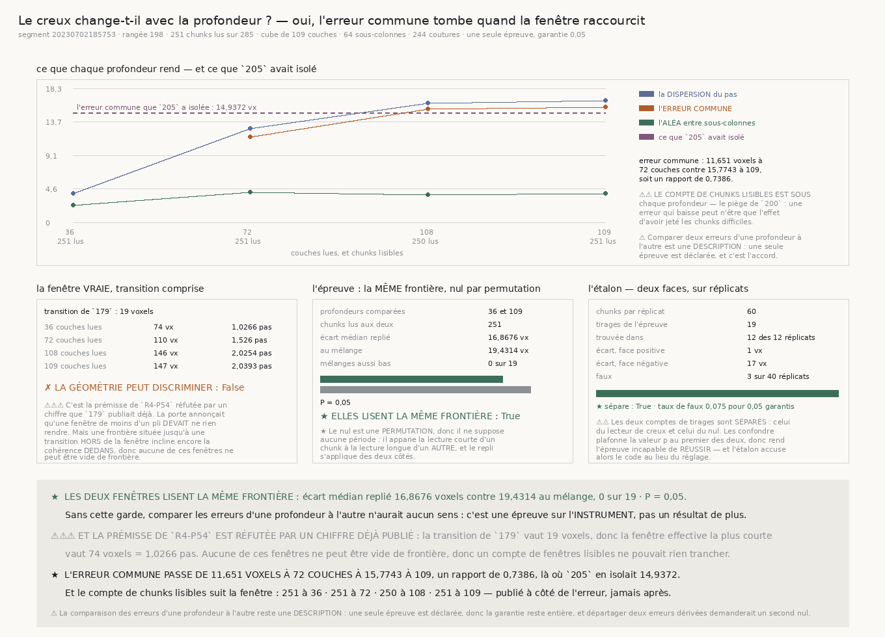

# `206` — Le creux change-t-il avec la profondeur lue ?

*Oui, l'erreur commune tombe quand la fenêtre raccourcit — mais le signal tombe plus vite qu'elle,
et la prémisse de la porte était fausse.*

## 0. Pourquoi cette tranche

`205` a isolé une quantité que rien n'avait encore nommée : l'erreur du creux porte une composante
**commune à un chunk**, de **14,9372 voxels**, qu'aucun découpage du **plan** n'atteint. C'est elle
qui interdit au repère absolu de servir, donc c'est elle qu'il faut expliquer.

⭐⭐⭐⭐ **Et la suite se coupe dans l'autre sens, par symétrie exacte.** `205` a découpé le chunk
dans le plan ; celle-ci le découpe en **profondeur**. Si l'erreur commune vient de ce que le creux
désigne UNE frontière parmi celles que la fenêtre contient, elle doit changer quand la fenêtre
raccourcit.

## 1. ⚠⚠⚠ La prémisse de `R4-P54` était fausse, et c'est un chiffre déjà publié qui la réfute

La porte annonçait qu'une sous-tranche de moins d'un pli **devait** ne rien rendre, en s'appuyant sur
le contrôle vide de `179`. Mais `179` a aussi mesuré la **transition** — le recouvrement juste
suffisant — et une frontière située jusqu'à cette distance **hors** de la fenêtre incline encore la
cohérence **dedans**.

| | |
|---|---:|
| transition mesurée par `179` | **19 voxels** (**45,6 µm**, soit **0,5278** fois un pli) |

| profondeur lue | fenêtre **effective** | en pas |
|---:|---:|---:|
| **36 couches** | **74 voxels** | **1,0266** |
| **72 couches** | **110 voxels** | **1,526** |
| **108 couches** | **146 voxels** | **2,0254** |
| **109 couches** | **147 voxels** | **2,0393** |

✗ **Aucune de ces fenêtres ne peut être vide de frontière** : même la plus courte couvre déjà plus
d'un pas. Une épreuve bâtie sur le compte de fenêtres lisibles n'aurait donc eu **aucun** pouvoir de
discriminer, quel que soit son résultat — et la mesure le confirme sans ambiguïté : à
**36 couches**, **251 chunks** rendent un creux, sur **251 chunks** lus.

⭐ C'est la deuxième porte d'affilée dont une prémisse chiffrée tombe devant le grounding, après
celle de `R4-P53` sur ce qu'un chunk peut offrir.

## 2. La ligne — la MÊME que `199` à `205`

| | |
|---|---:|
| segment | `20230702185753` |
| rangée **médiane** | **198** |
| chunks demandés | **285 colonnes** |
| chunks lus | **251 colonnes** |
| chunks sans surface au dépôt | **28 colonnes** |
| chunks écartés par le filtre du producteur | **6 colonnes** |
| coutures voisines | **244 coutures** |
| cube | **109 couches** · découpage du plan **64 sous-colonnes** |

⚠⚠ **L'échelle des profondeurs est celle du pli, pas un découpage choisi** : son pas est le
**demi-pli**, constante publiée de la chaîne, et ses barreaux sont ses multiples qui tiennent dans le
cube. Le cube entier est gardé en dernier même quand un multiple en est tout proche : deux
profondeurs qui ne diffèrent que d'une couche doivent rendre la même chose, et c'est un contrôle
gratuit — **108** et **109** rendent **15,5026** et **15,7743 voxels**.

⚠ Toutes les sous-tranches sont **centrées**. Une sous-tranche prise en haut du cube serait à la fois
plus courte ET ailleurs, donc un changement d'erreur ne dirait pas lequel des deux l'a produit.

## 3. L'épreuve : les deux profondeurs lisent-elles la même frontière ?

| | |
|---|---:|
| profondeurs comparées | **36 couches** et **109 couches** |
| chunks lus aux deux | **251 chunks** |
| écart médian replié | **16,8676 voxels** |
| au mélange | **19,4314 voxels** |
| mélanges au moins aussi bas | **0 sur 19** |
| valeur P | **0,05 pour 0,05 garantis** |
| **elles lisent la même frontière** | **oui** |

⭐⭐⭐⭐ **Le nul est une permutation, et c'est ce qui le rend valide ici.** Un nul uniforme aurait
demandé de savoir à quelle période les frontières se répètent — or `179` mesure un intervalle de
**36 couches** là où `200` replie par **72,0833 voxels**, et cette tranche n'a pas de quoi trancher.
Une permutation n'a besoin d'aucune période : elle apparie la lecture courte d'un chunk à la lecture
longue d'un **autre**, et le repli s'applique de la même façon des deux côtés.

⚠⚠⚠ **C'est une garde sur la description, pas un résultat de plus.** Si les deux profondeurs ne
marquaient pas la même frontière, comparer leurs erreurs n'aurait aucun sens.

⚠⚠ **Et elles s'accordent FAIBLEMENT.** Sur l'étalon, deux profondeurs qui lisent la même frontière
rendent un écart médian de **1 voxel** ; ici il vaut **16,8676 voxels**. L'accord est réel — zéro
mélange ne fait aussi bien — et il est loin d'être serré.

## 4. L'erreur commune tombe quand la fenêtre raccourcit

| profondeur | chunks lisibles | aléa | dispersion du pas | erreur commune | signal / bruit |
|---:|---:|---:|---:|---:|---:|
| **36** | **251** | **2,3725** | **3,9808** | *aucune* | *aucun* |
| **72** | **251** | **4,1002** | **12,8265** | **11,651** | **2,8416** |
| **108** | **250** | **3,7932** | **16,3303** | **15,5026** | **4,087** |
| **109** | **251** | **3,9386** | **16,6224** | **15,7743** | **4,0051** |

★ **La réponse à `R4-P54` est oui** : l'erreur commune passe de **15,7743 voxels** en pleine
profondeur à **11,651 voxels** à **72 couches**, un rapport de **0,7386**. Elle dépend donc bien de
la fenêtre, ce qu'une erreur d'instrument pure ne ferait pas.

⚠⚠⚠ **Mais la dispersion du pas tombe plus vite qu'elle**, de **16,6224** à **3,9808 voxels**, et à
**36 couches** le modèle additif est **réfuté par ses propres nombres** : ce que la dispersion laisse
une fois l'aléa retiré ne suffit plus à couvrir la dérive que `202` attribue au creux. Raccourcir la
fenêtre n'**isole** donc pas l'erreur — ça rétrécit tout, et le signal plus que le bruit.

⚠⚠ **Un confondant que cette tranche ne peut pas lever, et qui est dit plutôt que passé sous
silence** : une fenêtre courte et centrée confine toutes les lectures à la même bande centrale du
cube, donc elle comprime ensemble ce qu'on veut mesurer et ce qui le gêne. Le rapport **0,7386** est
publié comme ce qu'il est — une description — et non comme la preuve d'une cause.

⚠ **L'aléa entre sous-colonnes, lui, ne bouge presque pas** : **2,3725** / **4,1002** / **3,7932** /
**3,9386 voxels**. Le désaccord à l'intérieur d'un chunk est donc à peu près indifférent à la
profondeur lue, ce qui est cohérent avec `205` — il vit dans le plan.

⚠⚠ **Le compte de chunks lisibles est publié sous chaque profondeur, toujours** — le piège de `200`
écrit d'avance. Raccourcir la fenêtre change le filtre du producteur, donc une erreur qui baisse
pourrait n'être que l'effet d'avoir jeté les chunks difficiles. Ici elle ne l'est pas : **251**,
**251**, **250**, **251**.

## 5. Le contrôle croisé, gratuit et à trois bornes

| | |
|---|---:|
| erreur commune, en pleine profondeur (ici) | **15,7743 voxels** |
| erreur commune isolée par le plan (`205`) | **14,9372 voxels** |
| dérive partagée avec le maillage (`202`) | **3,4585 voxels** |

★ **Deux découpages sans rien de commun — le plan et la profondeur — rendent la même erreur de
chunk.** C'est le contrôle qui manquait à `205`, et il tient.

## 6. L'étalon

| | |
|---|---:|
| chunks par réplicat | **60 chunks** |
| tirages de l'épreuve | **19 tirages** |
| trouvée dans | **12 des 12 réplicats** |
| écart médian, face positive | **1 voxel** |
| écart médian, face négative | **17 voxels** |
| faux | **3 faux** sur **40 réplicats** |
| taux de faux | **0,075 pour 0,05 garantis** |
| **l'étalon sépare** | **oui** |

⭐ **La face positive est la matière honnête** : un seul réseau de plis, lu à deux profondeurs, qui
doit rendre la même frontière. **La face négative** donne à chaque profondeur son propre réseau, donc
deux lectures sans rapport — c'est le refus difficile, et le seul qui mesure quelque chose.

## 7. Les sondes, et les vingt-deux bris

Le module rend **46** contrôles, la figure **46**. Vingt-deux bris ont été posés et **les vingt-deux
ont viré au rouge** après réparation. Quatre y ont d'abord échappé, et chacun a coûté une vraie
correction :

⚠⚠⚠ **Un bris qui retirait l'offset de la sous-tranche est resté VERT.** La sonde disait « la couche
tombe dans la fenêtre **ou** elle est absente » — donc elle était satisfaite par l'**absence**.
Remplacée par un invariant qui ne peut pas l'être : la même frontière doit se lire à la même couche
du cube à **72** comme à **108 couches**.

⚠⚠ **Un bris qui prenait la racine d'une valeur absolue est resté vert** parce que la sonde du refus
employait une dispersion déjà sous l'aléa, donc n'atteignait jamais la soustraction de la dérive.
Deux refus différents, et seul le premier était exercé.

⚠⚠ **Un garde en cachait un autre** : « le cube est plus court qu'un demi-pli » était entièrement
couvert par « l'échelle est vide », donc aucun bris ne pouvait rendre le premier rouge. Un garde
qu'aucun bris ne peut rendre rouge n'est pas un garde, c'est du texte — les deux sont pliés en un.

⚠⚠⚠ **Et un vrai défaut de conception a été trouvé par l'ÉTALON**, avant toute mesure : la première
épreuve déclarée comptait les fenêtres courtes qui rendent un creux, contre une part **géométrique**
posée d'avance. Elle sur-déclenchait sur matière honnête, et la cause n'était pas un réglage mais la
transition de `179` — une frontière juste hors de la fenêtre creuse encore dedans, donc la part
géométrique était fausse. L'épreuve a été refondée sur une permutation.

⚠ **Enfin un défaut vu en REGARDANT l'image** : la figure écrivait « **11,651** voxels à
**36 couches** » alors que ce nombre est celui de **72** — la plus courte profondeur qui rend une
erreur n'est pas la plus courte de l'échelle. Réparé en lisant la liste que le producteur publie.

## 8. Ce que cette tranche ne dit pas

⚠ Elle porte sur **une** rangée d'**un** segment, la médiane, jamais choisie — la même que `199` à
`205`. ⚠⚠ Elle ne dit pas **pourquoi** l'erreur commune dépend de la fenêtre : le confondant du §4
reste entier. ⚠⚠⚠ Et elle ne dit rien de ce qui, dans la matière, fixe l'ordre de grandeur de cette
erreur.

## 9. La porte

`R4-P54` est **répondue par l'affirmative**, et sa prémisse chiffrée est **réfutée**.
`R4-P55` **s'ouvre**.
