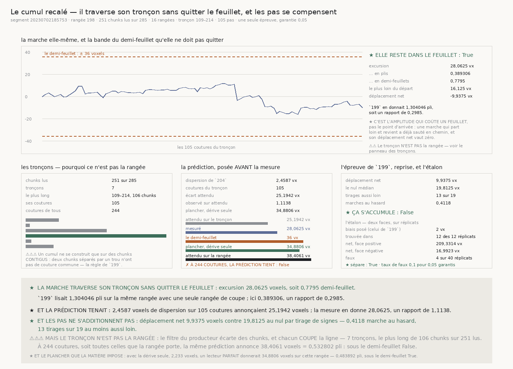

# `207` — Le cumul recalé traverse-t-il son tronçon ?

*Oui, et sans quitter le feuillet — mais le tronçon n'est pas la rangée, et la matière elle-même
pose un plancher qui tombe juste sous la limite.*

## 0. Pourquoi cette tranche, et pourquoi elle ne vient d'aucune porte nouvelle

La chaîne `201`–`206` a passé quatre tranches à diagnostiquer le **creux**, et les quatre disent la
même chose autrement : son erreur porte une composante de chunk d'environ quinze voxels que rien
n'atteint. C'est utile pour ne pas y revenir à l'aveugle, et ça n'avance pas d'un pas vers le
déroulage.

⭐⭐⭐⭐ **Le seul résultat positif de la chaîne est `204`, et il n'avait jamais été mis à l'épreuve
de ce qu'on lui demande.** Moyenner seize rangées met le signal devant le bruit et rend le pas
**mesurable** ; `204` le dit lui-même, sa portée est celle d'une marche au hasard, pas d'un
correcteur. La question qui sert l'objectif est donc celle-ci, et elle se tranche sur la rangée déjà
lue : **le cumul de ces pas-là traverse-t-il sans jamais s'éloigner d'un demi-feuillet de son
départ ?**

## 1. La prédiction, posée avant la mesure, et elle n'a qu'une pièce

Une marche de `n` pas indépendants de dispersion `s` s'éloigne de son départ d'environ `s √n`. La
dispersion vient de `204`, le compte vient de la ligne, et rien d'autre n'entre.

| | |
|---|---:|
| dispersion du pas à seize rangées (`204`) | **2,4587 voxels** |
| coutures du plus long tronçon | **105** |
| **écart attendu** | **25,1942 voxels** = **0,349515 pli** |
| le demi-feuillet | **36 voxels** |
| **elle tient sous le demi-feuillet** | **oui** |

⚠⚠ **Le demi-feuillet n'est pas un seuil choisi** : c'est la distance à laquelle la surface saute au
feuillet voisin, et c'est une constante publiée de la chaîne.

⚠ **C'est la DISPERSION qui est relue, pas l'aléa.** Un cumul ne sait pas séparer ce que la surface
fait de ce que le lecteur se trompe : il additionne les deux.

## 2. La ligne, et pourquoi ce n'est qu'un tronçon

| | |
|---|---:|
| segment | `20230702185753` |
| rangée **médiane** | **198** |
| chunks demandés | **285 colonnes** |
| chunks lus | **251 colonnes** |
| rangées de coupe | **16 rangées** |
| **tronçons** | **7** |
| **le plus long** | colonnes **109** à **214**, soit **106 chunks** |
| ses coutures | **105** |
| coutures de tous les tronçons | **244** |

⚠⚠⚠ **Un cumul ne se construit que sur des chunks CONTIGUS** — deux chunks séparés par un trou n'ont
pas de couture commune, et les recoller inventerait un déplacement que personne n'a mesuré. C'est la
règle que `199` avait déjà écrite, importée et non réécrite.

⚠⚠ **Et c'est ce qui limite la portée du verdict** : le filtre du producteur écarte quelques chunks,
et chacun **coupe** la ligne. `199`, qui lisait sur une seule rangée de coupe, n'avait qu'un tronçon
de **254 pas** ; ici la lecture à seize rangées en écarte d'autres, et le plus long tronçon tombe à
**105**.

## 3. ★ La marche traverse son tronçon sans quitter le feuillet

| | |
|---|---:|
| excursion | **28,0625 voxels** = **0,389306 pli** |
| … en demi-feuillets | **0,7795** |
| le plus loin du départ | **16,125 voxels** |
| déplacement net | **-9,9375 voxels** |
| **elle reste dans le feuillet** | **oui** |
| observé sur attendu | **1,1138** |

⭐⭐⭐⭐ **C'est l'AMPLITUDE qui coûte un feuillet, pas le point d'arrivée.** Une marche qui part loin
et revient a déjà sauté en chemin, et son déplacement net vaut zéro : la juger sur l'arrivée dirait
qu'elle n'a rien fait. `199` mesurait le déplacement **net** — c'est une autre question, et c'est
pourquoi celle-ci ne la refait pas.

★ **Et c'est trois fois mieux que `199`** : **1,304046 pli** là-bas contre **0,389306** ici, un
rapport de **0,2985**. Le pas lu sur seize rangées tient la marche dans le feuillet là où le pas lu
sur une seule l'en faisait sortir.

## 4. L'épreuve de `199`, reprise sur le pas de `204`

| | |
|---|---:|
| déplacement net | **9,9375 voxels** |
| le nul médian, par tirage de signes | **19,8125 voxels** |
| tirages au moins aussi loin | **13 sur 19** |
| marches au hasard | **0,4118** |
| **ça s'accumule** | **non** |

⭐ **Le nul par tirage de SIGNES est le seul qui réponde à cette question**, et `199` l'avait déjà
écrit : permuter les pas laisse leur somme inchangée, donc un nul par permutation serait vide par
construction. Tirer les signes garde les tailles et remplace la marche observée par une marche au
hasard.

⭐⭐ **Reprendre l'épreuve plutôt que d'en inventer une est ce qui rend les deux réponses
comparables** : `199` lisait **1,0032** marche au hasard sur le pas d'une seule rangée, cette
tranche **0,4118** sur celui de seize. Les pas ne s'additionnent pas — ils se compensent, et
davantage qu'avant.

⚠ Une première version de cette tranche déclarait une autre épreuve — l'excursion contre ses propres
pas remis dans un autre ordre — et **l'étalon l'a refusée** : cette statistique-là ne voit une
corrélation forte que dans dix réplicats sur douze, parce que l'excursion d'une seule réalisation est
très variable.

## 5. ⚠⚠⚠ Mais le tronçon n'est pas la rangée, et la matière pose un plancher

La même prédiction, à la longueur que la rangée porte réellement, et avec la seule dérive :

| | écart attendu | en plis | sous le demi-feuillet |
|---|---:|---:|---:|
| sur le tronçon, **105 coutures** | **25,1942 voxels** | **0,349515** | **oui** |
| sur la rangée, **244 coutures** | **38,4061 voxels** | **0,532802** | **non** |
| **avec la dérive seule** (**2,233 voxels**) | **34,8806 voxels** | **0,483892** | **oui** |

⭐⭐⭐⭐ **Le dernier barreau est le plus important de la tranche, et il est un PLANCHER.** `204`
sépare la dispersion du pas en un aléa de lecture et une dérive **vraie** ; un lecteur parfait ferait
tomber l'aléa à zéro et laisserait la dérive. **34,8806 voxels** est donc la meilleure excursion
qu'un instrument **puisse** atteindre sur cette rangée, et elle tombe juste sous les **36** du
demi-feuillet.

✗ **La voie différentielle a donc un plafond, et il est arithmétique** : mieux lire fait gagner de
**38,4061** à **34,8806 voxels**, et pas davantage. Une rangée se traverse de justesse ; ce qui est
plus long que la rangée ne se traverse pas, quel que soit le lecteur.

## 6. L'étalon

| | |
|---|---:|
| biais posé, celui de l'étalon de `199` | **2 voxels** |
| trouvée dans | **12 des 12 réplicats** |
| déplacement net, face positive | **209,3314 voxels** |
| déplacement net, face négative | **16,9923 voxels** |
| faux | **4 faux** sur **40 réplicats** |
| taux de faux | **0,1 pour 0,05 garantis** |
| **l'étalon sépare** | **oui** |

⚠⚠ **Le biais n'est pas choisi ici** : c'est celui que l'étalon de `199` avait posé, relu chez son
producteur. Cette tranche reprend l'**épreuve** de `199`, donc elle en reprend aussi la matière de
calibration — sinon « l'étalon sépare » voudrait dire autre chose des deux côtés.

⚠ **Et il sépare à la limite exacte que la règle autorise** : la règle de `202` admet jusqu'au double
de la garantie sur réplicats.

## 7. Où en est la chaîne `199`–`207`

| tranche | ce qu'elle a établi | sert l'objectif |
|---|---|---|
| `199` | les pas se compensent, mais la marche perd un demi-feuillet en seize millimètres | ★ oui |
| `200` | le creux est un repère **absolu**, lisible partout, mais défini **modulo un pli** | ★ oui |
| `201` | le dépliage de phase est **refusé** : la condition d'Itoh n'est pas réfutable par ce différentiel | ✗ ferme une voie |
| `202` | le creux **est** attaché au papyrus, et il est lu cinq fois moins bien que le maillage | ★ oui |
| `203` | aucune largeur de bande ne lit plus de signal que de bruit ; la prémisse de `198` tombe | ✗ ferme une voie |
| `204` | **seize rangées** mettent le signal devant le bruit ; le pas devient **mesurable** | ★★★★ oui |
| `205` | moyenner le plan n'atteint pas le bruit du creux : une erreur de chunk reste | ✗ ferme une voie |
| `206` | cette erreur **dépend** de la fenêtre, mais raccourcir rétrécit tout | ✗ ferme une voie |
| `207` | le cumul de `204` traverse un tronçon **sans quitter le feuillet**, et le plafond est nommé | ★★★★ oui |

⭐ **Trois tranches sur neuf avancent, six ferment une voie.** Fermer n'est pas perdre : `201`,
`203`, `205` et `206` sont ce qui empêche d'y revenir à l'aveugle.

## 8. Ce que cette tranche ne dit pas

⚠ Elle porte sur **un** tronçon d'**une** rangée d'**un** segment. ⚠⚠ Elle ne dit pas que la rangée
entière se traverse : la prédiction dit que non, et la mesure ne peut pas le vérifier puisque les
trous coupent la ligne. ⚠⚠⚠ Et le plancher est une prédiction, pas une mesure : il dit ce qu'un
lecteur parfait **donnerait**, pas ce qu'un lecteur réel donne.

## 9. Les portes

**Aucune porte nouvelle.** Ce que cette tranche établit est un **plafond** de la voie différentielle,
et la question qu'il pose — trouver une référence absolue au-delà d'une rangée — est celle que
`R4-P49` posait déjà et que `201`, `205` et `206` ont fermée pour le creux. En rouvrir une variante
ne ferait que redire ce qui est écrit.
