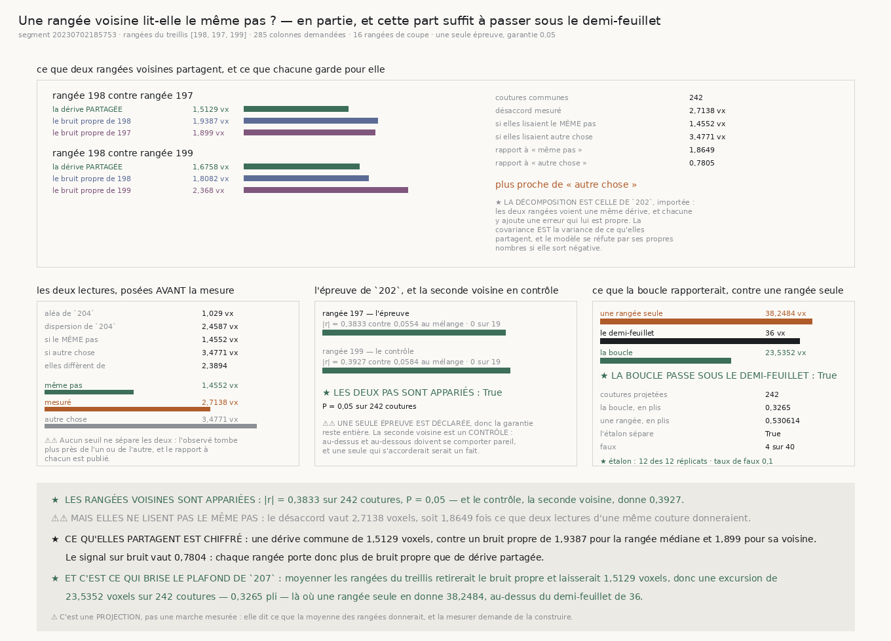

# `208` — Une rangée voisine lit-elle le même pas ?

*En partie, et cette part suffit à briser le plafond que `207` avait nommé.*

## 0. Pourquoi cette tranche

`207` a établi que le cumul des pas de `204` traverse son tronçon sans quitter le feuillet, et il a
nommé sa borne : avec la dérive seule, un lecteur **parfait** donnerait encore **34,8806 voxels** sur
une rangée, contre un demi-feuillet de **36**. Une rangée se traverse de justesse, et rien de plus
long ne se traverse, quel que soit l'instrument.

⭐⭐⭐⭐ **La seule chose qui batte une marche en racine de `n` est une référence qui ne dérive pas —
ou une fermeture de boucle.** Et le treillis en offre une, gratuite et jamais mesurée : la rangée
au-dessus et la rangée au-dessous traversent **les mêmes coutures**.

## 1. Les deux lectures, posées avant la mesure

`204` sépare le pas en un aléa de lecture et une dispersion entière. La différence de deux mesures
indépendantes d'une **même** quantité a pour écart-type la racine de deux fois celui d'une mesure.

| | |
|---|---:|
| aléa de `204` | **1,029 voxel** |
| dispersion de `204` | **2,4587 voxels** |
| **si les deux rangées lisent le MÊME pas** | **1,4552 voxels** |
| **si elles lisent autre chose** | **3,4771 voxels** |
| elles diffèrent d'un facteur | **2,3894** |

⚠⚠ **Les deux voisines sont lues, pas une** : en choisir une serait un choix, et les deux donnent en
prime un contrôle gratuit — au-dessus et au-dessous doivent se comporter pareil.

## 2. La ligne

| | |
|---|---:|
| segment | `20230702185753` |
| rangées du treillis | **198**, **197**, **199** |
| colonnes demandées | **285 colonnes** |
| chunks lus | **255**, **251**, **254** |
| pas lus | **253**, **243**, **250** |
| rangées de coupe par chunk | **16 rangées** |

## 3. ★ Les rangées voisines SONT appariées

| | rangée **197** | rangée **199** |
|---|---:|---:|
| coutures communes | **242** | **239** |
| \|r\| observé | **0,3833** | **0,3927** |
| \|r\| médian du mélange | **0,0554** | **0,0584** |
| mélanges au moins aussi forts | **0 sur 19** | **0 sur 19** |
| valeur P | **0,05 pour 0,05 garantis** | **0,05** |
| **appariés** | **oui** | **oui** |

⭐ **Le contrôle tient** : la seconde voisine rend **0,3927** là où l'épreuve rend **0,3833**.
Au-dessus et au-dessous se comportent pareil, ce qui écarte l'idée d'un accident d'une rangée.

⚠⚠ **Une seule épreuve est déclarée**, celle de la première voisine, donc la garantie reste entière ;
la seconde est publiée comme **description**.

## 4. ⚠⚠ Mais elles ne lisent pas le MÊME pas

| | |
|---|---:|
| désaccord mesuré | **2,7138 voxels** |
| rapport à « même pas » | **1,8649** |
| rapport à « autre chose » | **0,7805** |
| **de laquelle il est le plus proche** | **autre chose** |

Le désaccord tombe presque deux fois au-dessus de ce que deux lectures d'une même couture
donneraient. Une part du pas est partagée, l'autre non.

## 5. ⭐⭐⭐⭐ Ce qu'elles partagent est chiffré

La décomposition est celle de `202`, importée et non réécrite : les deux rangées voient une même
dérive, et chacune y ajoute une erreur qui lui est propre.

| | rangée **197** | rangée **199** |
|---|---:|---:|
| **dérive partagée** | **1,5129 voxels** | **1,6758 voxels** |
| bruit propre de la médiane | **1,9387 voxels** | **1,8082 voxels** |
| bruit propre de la voisine | **1,899 voxels** | **2,368 voxels** |
| signal sur bruit | **0,7804** | **0,9268** |

⚠⚠ **Le signal sur bruit est sous un** : chaque rangée porte plus de bruit propre que de dérive
partagée. Moyenner ne rend donc pas le pas *exact* — ça retire ce qui est propre à la rangée.

⚠ Et le modèle **se réfute par ses propres nombres** si la variance commune sort négative ou plus
grande que l'une des deux variances observées.

## 6. ★ Et c'est ce qui brise le plafond de `207`

Moyenner les rangées du treillis retirerait le bruit propre et laisserait ce qu'elles partagent. La
projection est celle de `207`, importée.

| | écart attendu | en plis | sous le demi-feuillet |
|---|---:|---:|---:|
| une rangée seule, **2,4587 voxels** | **38,2484 voxels** | **0,530614** | **non** |
| **la boucle**, **1,5129 voxels** | **23,5352 voxels** | **0,3265** | **oui** |

★ **La boucle passe sous le demi-feuillet là où une rangée seule n'y arrive pas** — et elle fait
mieux que le plancher de `207`, qui valait **34,8806 voxels** même avec un lecteur parfait. C'est le
premier résultat de la chaîne qui **brise** un plafond au lieu d'en nommer un.

⚠ **C'est une PROJECTION, pas une marche mesurée** : elle dit ce que la moyenne des rangées
donnerait, et la mesurer demande de la construire.

## 7. L'étalon

| | |
|---|---:|
| dérive posée, celle de `204` | **2,233 voxels** |
| aléa posé, celui de `204` | **1,029 voxel** |
| trouvée dans | **12 des 12 réplicats** |
| écart médian, face positive | **1,4493 voxels** |
| écart médian, face négative | **3,4382 voxels** |
| faux | **4 faux** sur **40 réplicats** |
| taux de faux | **0,1 pour 0,05 garantis** |
| **l'étalon sépare** | **oui** |

⚠⚠ **La dérive et l'aléa posés sont ceux que `204` a mesurés** : l'étalon exerce donc l'épreuve au
régime où elle va servir, et non à un régime plus facile. ⚠ Et il sépare à la limite exacte que la
règle de `202` autorise.

## 8. Les sondes, et les quatorze bris

Le module rend **40** contrôles, la figure **44**. Quatorze bris ont été posés et **les quatorze ont
viré au rouge** après réparation. Quatre y ont d'abord échappé :

⚠⚠⚠ **Une fixture complaisante** : la sonde du désaccord comparait deux suites décalées d'une
constante, où la différence des écarts-types **et** l'écart-type de la différence valent tous deux
zéro. Un bris qui remplaçait l'un par l'autre restait vert. Réparée par deux suites de même
écart-type mais de valeurs mélangées.

⚠⚠ **Un faux dépôt trop généreux** : il rendait un chunk pour n'importe quelle rangée, donc un bris
qui retirait le garde de bornes restait vert. Et la sonde se contentait de « ça refuse » alors que la
ligne refuse **aussi** quand elle n'a rien lu — elle asserte désormais la **raison**.

⚠⚠ **Un défaut par défaut** : l'étalon était toujours appelé avec ses arguments, donc ses valeurs
par défaut n'étaient exercées par rien.

## 9. Ce que cette tranche ne dit pas

⚠ Elle porte sur **trois** rangées d'**un** segment. ⚠⚠ Elle ne mesure pas la marche moyennée : elle
la projette. ⚠⚠⚠ Et elle ne dit pas d'où vient le bruit **propre** à une rangée, qui reste la moitié
du problème.

## 10. La porte

`R4-P56` **s'ouvre** : la marche construite sur la moyenne des rangées du treillis traverse-t-elle
vraiment ?
