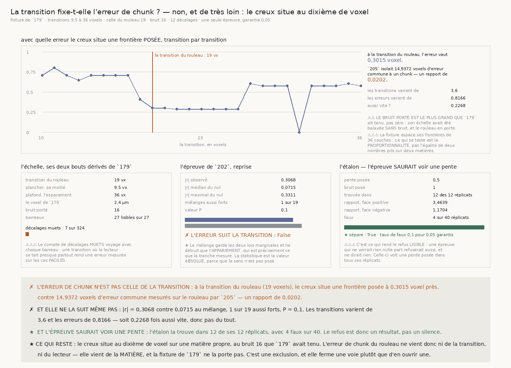

# `209` — La transition fixe-t-elle l'erreur de chunk ?

*Non, et de très loin : sur une matière propre et bruitée, le creux situe une frontière au dixième de
voxel. L'erreur du rouleau vient d'ailleurs.*

## 0. Pourquoi cette tranche

Deux découpages sans rien de commun ont mesuré la même quantité : **14,9372 voxels** par le plan
(`205`) et **15,7743 voxels** par la profondeur (`206`). Aucun des deux ne l'atteint, et aucun ne dit
d'où elle vient.

⭐ Or `179` a publié une longueur du même ordre, et c'est celle qui **fabrique** le creux : la
transition juste suffisante vaut **19 voxels**. Une frontière étalée sur cette longueur ne peut pas
être localisée mieux qu'elle — ce serait une borne de l'**instrument** et non du bruit, donc
irréductible par tout moyennage, ce qui expliquerait d'un coup les deux refus.

⭐⭐⭐⭐ **Et la prédiction se pose avant la mesure** : si l'erreur EST la transition, une matière à
transition plus étroite doit rendre une erreur plus petite, dans le même rapport. `179` porte
l'échelle entière, donc cette tranche peut **poser** la transition au lieu de la subir.

⚠ Cette tranche n'est **pas** sur le chemin le plus court vers le déroulage, et c'est assumé : elle
sert à **exclure**, pour ne pas y revenir à l'aveugle.

## 1. L'échelle, ses deux bouts dérivés de `179`

| | |
|---|---:|
| transition du rouleau | **19 voxels** |
| plancher, sa moitié | **9,5 voxels** |
| plafond, l'espacement des frontières de la fixture | **36 voxels** |
| pas de l'échelle, le voxel de `179` | **2,4 µm** |
| bruit porté | **16** |
| barreaux lisibles | **27 sur 27** |
| décalages muets | **7 sur 324** |

⚠⚠ **Le plafond est l'espacement des frontières** : au-delà, deux frontières se recouvrent et
« localiser une frontière » n'a plus de sens. ⚠⚠ **Et le bruit porté est le plus grand que `179` ait
tenu, pas zéro** : son échelle avait été balayée **sans** bruit, et le rouleau en porte. C'est le
piège que `R4-P55` avait écrit d'avance, et il est payé ici.

⚠⚠⚠ **Le compte de décalages muets voyage avec chaque barreau** : une transition où le lecteur se
tait presque partout rendrait une erreur mesurée sur les cas **faciles**.

## 2. ✗ L'erreur ne suit pas la transition

| | |
|---|---:|
| \|r\| observé | **0,3068** |
| \|r\| médian du mélange | **0,0715** |
| \|r\| maximal du mélange | **0,3311** |
| mélanges au moins aussi forts | **1 sur 19** |
| valeur P | **0,1** |
| **l'erreur suit la transition** | **non** |

| | |
|---|---:|
| les transitions varient de | **3,6** |
| les erreurs varient de | **0,8166** |
| **aussi vite ?** | **0,2268** |

✗ Les transitions varient d'un facteur **3,6** pendant que les erreurs varient de **0,8166** — donc
l'erreur **diminue** légèrement quand la transition grandit. Elle ne la suit pas, et elle ne la suit
même pas à l'envers de façon nette.

## 3. ⭐⭐⭐⭐ Et l'ordre de grandeur n'y est pas du tout

| | |
|---|---:|
| erreur à la transition du rouleau (**19 voxels**) | **0,3015 voxel** |
| erreur commune à un chunk, mesurée par `205` | **14,9372 voxels** |
| **leur rapport** | **0,0202** |

★ **Le creux situe une frontière posée au dixième de voxel**, sur une matière propre portant le bruit
**16** que `179` avait tenu. L'erreur de chunk du rouleau vaut **cinquante fois** cela.

✗ **Elle ne vient donc ni de la transition, ni du lecteur.** Elle vient de la **matière** du rouleau,
et la fixture de `179` ne la porte pas.

## 4. L'étalon — l'épreuve saurait voir une pente

| | |
|---|---:|
| pente posée | **0,5** |
| bruit posé | **1 pour une pente de 0,5** |
| trouvée dans | **12 des 12 réplicats** |
| rapport médian, face positive | **3,4639** |
| rapport médian, face négative | **1,1704** |
| faux | **4 faux** sur **40 réplicats** |
| taux de faux | **0,1 pour 0,05 garantis** |
| **l'étalon sépare** | **oui** |

⚠⚠⚠ **C'est ce qui rend le refus LISIBLE** : une épreuve qui ne verrait rien nulle part refuserait
aussi, et ne dirait rien. Celle-ci voit une pente posée dans tous ses réplicats.

## 5. Ce que cette tranche ne dit pas

⚠⚠⚠ **La portée est bornée, et elle est dite** : la fixture de `179` espace ses frontières de
**36 couches** là où le rouleau a un pas de **72,0833 voxels**. Ce qui se teste est donc la
**proportionnalité** entre la transition et l'erreur, pas l'égalité de deux nombres pris sur deux
matières différentes. ⚠⚠ Et elle ne dit pas **ce qui**, dans la matière du rouleau, produit
l'erreur — seulement que ce n'est ni la largeur de la transition, ni le bruit que `179` a testé.

## 6. La porte

`R4-P55` est **répondue par la négative**, et **aucune porte nouvelle** n'est ouverte : ce que cette
tranche produit est une **exclusion**, et la question qu'elle laisse — d'où vient l'erreur de la
matière — est déjà celle que `R4-P54` posait et que `206` a traitée.
