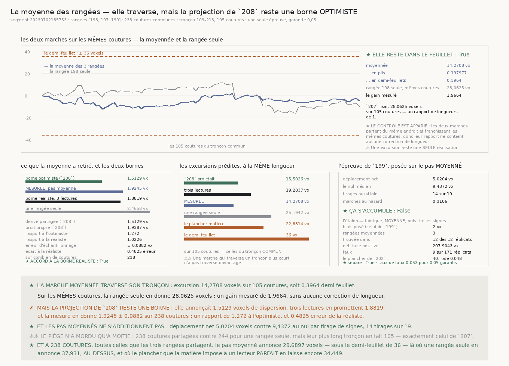

# `210` — La marche construite sur la moyenne des rangées traverse-t-elle vraiment ?

*Oui, et elle passe là où une rangée seule échoue — mais la projection de `208` était bien une borne
optimiste, et l'écart est exactement celui que trois lectures prédisent.*

## 0. Pourquoi cette tranche

`207` a nommé le plafond d'une rangée seule : même avec un lecteur **parfait**, la dérive seule
donne encore **34,8806 voxels** sur les **244 coutures** d'une rangée, contre un demi-feuillet de
**36**. `208` a mesuré qu'une fermeture de boucle existe — deux rangées voisines du treillis
partagent une dérive de **1,5129 voxels** pendant que chacune garde un bruit propre de **1,9387** et
**1,899** — et il en a tiré une excursion de **23,5352 voxels**, sous le demi-feuillet.

⚠⚠⚠ **Mais ce nombre est une projection, et une borne optimiste.** Il suppose que moyenner retire
**tout** le bruit propre ; trois lectures n'en retirent qu'une part en racine de trois. Cette
tranche construit la marche et la mesure.

## 1. Les deux bornes, posées avant la mesure

| | |
|---|---:|
| dérive partagée, lue chez `208` | **1,5129 voxels** |
| bruit propre de la médiane, lu chez `208` | **1,9387 voxels** |
| ce qu'une rangée seule porte | **2,4592 voxels** |
| **borne OPTIMISTE** — ce que `208` projetait | **1,5129 voxels** |
| **borne RÉALISTE** — trois lectures en racine de trois | **1,8819 voxels** |

⚠⚠ Le modèle suppose que les trois rangées portent le **même** bruit propre, ce que `208` n'a pas
mesuré — il n'a décomposé que des **paires**. Le bruit de la médiane est pris comme représentatif,
et une moyenne de bruits inégaux retire un peu moins que cette formule.

## 2. La ligne

| | |
|---|---:|
| segment | `20230702185753` |
| rangées du treillis | **198**, **197**, **199** |
| colonnes demandées | **285 colonnes** |
| chunks lus | **251**, **255**, **254** |
| pas lus par rangée | **243**, **253**, **250** |
| **coutures communes aux trois** | **238 coutures** |
| tronçons communs | **6 tronçons** |
| **le plus long** | **109–213**, **105 coutures** |

⚠⚠ **L'index est la COLONNE, jamais le rang** : trois rangées n'ont pas les mêmes trous, donc
moyenner par rang joindrait des coutures qui ne sont pas au même endroit du rouleau. C'est le défaut
que `201` a payé et que `202` a réparé.

## 3. ⚠⚠ Le piège écrit d'avance n'a mordu qu'à moitié

`R4-P56` annonçait que les tronçons communs seraient plus courts que ceux d'une rangée seule. La
mesure le confirme sur le **total** et le réfute sur le **plus long** :

| | trois rangées | une rangée seule (`207`) |
|---|---:|---:|
| coutures en tout | **238** | **244** |
| le plus long tronçon | **105** | **105** |

★ **Le plus long tronçon commun fait exactement celui de `207`.** La comparaison des excursions se
fait donc à longueur égale, sans aucune correction.

## 4. ✗ Ce que la moyenne a retiré — et la projection de `208` n'est PAS atteinte

| | |
|---|---:|
| dispersion de la rangée **198** | **2,4658 voxels** |
| dispersion de la rangée **197** | **2,4448 voxels** |
| dispersion de la rangée **199** | **2,9071 voxels** |
| **dispersion MESURÉE du pas moyenné** | **1,9245 voxels** |
| erreur d'échantillonnage | **± 0,0882 voxel** |
| rapport à la borne optimiste | **1,272** |
| rapport à la borne réaliste | **1,0226** |
| écart à la borne réaliste | **0,4825 erreur** |
| **elle s'accorde à la borne réaliste** | **oui** |
| **la projection de `208` est atteinte** | **non** |

⭐⭐⭐⭐ **C'est le résultat de la tranche, et il tranche dans les deux sens.** La moyenne retire bel
et bien quelque chose — **1,9245** contre **2,4658** pour la rangée médiane — mais elle ne retire
**pas tout le bruit propre** : elle en retire exactement la part que la racine de trois prédit, à
une demi-erreur d'échantillonnage près. Le modèle est validé, et la borne de `208` est réfutée
**comme borne atteignable**.

⚠ **L'erreur d'échantillonnage est publiée, et elle est dérivée** : l'écart-type d'un écart-type
estimé sur `n` tirages vaut lui-même divisé par la racine de deux fois `n`. Sans elle, un
dépassement de deux pour cent se lirait comme un modèle réfuté.

## 5. ★★★★ La marche, et son contrôle apparié

| | moyennée | rangée **198** seule |
|---|---:|---:|
| coutures | **105** | **105** |
| **excursion** | **14,2708 voxels** | **28,0625 voxels** |
| … en plis | **0,197977** | **0,389306** |
| … en demi-feuillets | **0,3964** | — |
| déplacement net | **-5,0208 voxels** | **-9,9375 voxels** |
| le plus loin du départ | **12,3958 voxels** | **16,125 voxels** |
| **traverse sous le demi-feuillet** | **oui** | **oui** |
| **le gain mesuré** | **1,9664** | — |

⭐⭐⭐⭐ **Le contrôle est apparié** : les deux marches partent du même endroit et franchissent les
**mêmes** coutures, donc leur rapport ne contient aucune correction de longueur.

⭐ **Et il recoupe `207` au chiffre près** : la rangée **198** seule rend **28,0625 voxels**,
exactement ce que `207` a publié sur le même tronçon. Deux courses indépendantes du dépôt, le même
nombre.

⚠ **Une excursion reste une SEULE réalisation**, très variable — `207` l'a payé en voyant son étalon
refuser une épreuve bâtie dessus. Ce qui décide est la **dispersion**, moyennée sur toutes les
coutures ; l'excursion répond à « traverse-t-elle », pas à « de combien ».

## 6. ⭐⭐⭐⭐ À l'échelle de la rangée, la moyenne passe là où une rangée seule échoue

Le tronçon **n'est pas** la rangée. La même prédiction, portée aux **238 coutures** que les trois
rangées partagent :

| | écart attendu | en plis | sous le demi-feuillet |
|---|---:|---:|---:|
| **le pas moyenné, dispersion MESURÉE** | **29,6897 voxels** | **0,411881** | **oui** |
| le plancher de la matière, dérive seule | **34,449 voxels** | **0,477906** | **oui** |
| une rangée seule, dispersion de `204` | **37,931 voxels** | **0,52621** | **non** |

⭐⭐⭐⭐ **La moyenne des rangées bat le lecteur PARFAIT d'une rangée seule.** `207` avait établi que
même en annulant tout l'aléa de lecture, une rangée laisse **34,8806 voxels** sur ses 244 coutures —
donc qu'elle se traverse de justesse et que rien de plus long ne se traverse. La moyenne de trois
rangées en laisse **29,6897**, avec un instrument **réel**.

Et les prédictions à la longueur du tronçon, pour que les quatre soient comparables :

| sur **105 coutures** | écart attendu |
|---|---:|
| `208` projetait | **15,5026 voxels** |
| trois lectures | **19,2837 voxels** |
| **mesuré** | **14,2708 voxels** |
| le plancher de la matière | **22,8814 voxels** |
| une rangée seule | **25,1942 voxels** |

⚠ L'observé tombe **sous** ce que sa propre dispersion annonce : **14,2708** contre **19,7203**
attendus, un rapport de **0,7237**. C'est cohérent avec la section suivante.

## 7. ✗ Les pas moyennés ne s'additionnent pas

| | |
|---|---:|
| déplacement net | **5,0204 voxels** |
| le nul médian par tirage de signes | **9,4372 voxels** |
| tirages au moins aussi loin | **14 sur 19** |
| marches au hasard | **0,3106** |
| **ça s'accumule** | **non** |

★ L'épreuve est celle de `199`, reprise sans changement et posée sur le pas moyenné. Le nul est le
tirage de **signes** et non la permutation : permuter laisse la somme **inchangée**, donc un nul par
permutation serait vide par construction.

## 8. L'étalon, et une règle de calibration qui ne décidait pas

| | |
|---|---:|
| biais posé, celui de `199` | **2 pour une pente de 0,5** |
| rangées moyennées par réplicat | **3 rangées** |
| dérive partagée posée, celle de `208` | **1,5129 voxels** |
| bruit propre posé, celui de `208` | **1,9387 voxels** |
| dispersion médiane du pas moyenné | **1,882 voxels** |
| trouvée dans | **12 des 12 réplicats** |
| net médian, face positive | **207,9043 voxels** |
| net médian, face négative | **13,2171 voxels** |
| **réplicats du refus** | **171 réplicats** |
| faux | **9 faux** |
| taux de faux | **0,0526 pour 0,05 garantis** |
| **l'étalon sépare** | **oui** |

⭐⭐⭐⭐ **L'étalon exerce toute la chaîne** : il fabrique les rangées, prend leurs coutures communes,
**moyenne**, puis tire les signes. Un étalon posé directement sur un pas moyenné ne dirait rien de la
moyenne, et c'est elle qui est neuve ici. ⚠⚠ Le biais est dans la part **partagée** : un biais propre
à une rangée serait divisé par trois en moyennant, donc la face positive mesurerait la moyenne et non
l'épreuve.

⚠⚠⚠ **Et le compte de réplicats du refus a dû changer, parce que celui de `202` ne DÉCIDE pas.**
`202` a posé le plancher — `int(2/garantie)` réplicats, soit **40 réplicats** — de sorte que deux faux
soient **attendus** et que la face ne soit pas vide. Mais une épreuve au niveau **exact** de la
garantie dépasse l'acceptation dans **0,048** des cas, et cette tranche est tombée dessus : sa
première course a rendu **6 faux** sur **40**, pour un niveau vrai qu'une sonde à quatre cents
réplicats situe autour de six pour cent.

Le compte publié ici met **trois erreurs d'échantillonnage** dans la marge que la règle laisse :
l'erreur d'un taux `g` sur `m` tirages vaut la racine de `g(1−g)/m`, la marge vaut `g`, donc `m` vaut
neuf fois `(1−g)/g` — soit **171 réplicats**. Aucun réglage n'entre là-dedans : le nombre se dérive
de la garantie, exactement comme le plancher de `202` s'en dérivait.

$$m \;=\; \left\lceil 9\,\frac{1-g}{g} \right\rceil$$

⚠ Cette règle ne vaut que pour cette tranche. Les tranches publiées gardent la leur, et corriger en
place un compte dont des résultats publiés dérivent serait pire que la fragilité qu'on répare.

## 9. Les sondes, et les vingt et un bris

Le module rend **70** contrôles, la figure **77**. Vingt et un bris ont été posés et **les vingt et
un ont viré au rouge** après réparation. Quatre y ont d'abord échappé.

⚠⚠⚠ **Le péché capital, et ce n'est pas une sonde qui l'a trouvé.** La rangée du contrôle était
déduite d'un `sorted(...)[0]`, ce qui rend la plus **petite** clef — donc la voisine **197**, jamais
la médiane **198** que le document nommait. La marche de contrôle était celle d'une voisine publiée
sous le nom de la rangée seule : **un nombre juste sous un mauvais nom**. C'est le recoupement avec
`207` qui l'a livré — ses **105** pas différaient **tous**, sur ce qui devait être la même rangée et
le même tronçon. La rangée du contrôle est désormais un **argument**, et trois sondes l'exercent sur
une fixture où le tri donne exprès une autre réponse.

⚠⚠ **Une sonde d'ordre qui ne traversait pas le chemin du verdict** : elle comparait deux listes
écrites à la main sans jamais passer par la marche, et la fixture avait des pas **monotones** — donc
les trier ne changeait rien. Le bris « les pas sont triés » restait vert des deux côtés.

⚠⚠ **Un défaut par défaut, une fois de plus** : le biais de l'étalon était passé **explicitement** à
`None` en cinquième position, donc la valeur par défaut du paramètre n'était exercée par rien. C'est
le défaut de `208`, un cran plus bas dans la même fonction.

⚠⚠ **Et deux sondes qui recopiaient la logique du code** — l'erreur d'échantillonnage et le seuil
d'acceptation au plancher — ont été remplacées par des **identités entre nombres publiés** : l'erreur
fois la racine de deux fois le compte doit rendre la dispersion, et le compte de faux admis doit être
le plus grand qui tienne sous deux fois la garantie. Une sonde qui recopie le producteur en est une
seconde définition.

⚠ Deux tolérances ont été **dérivées** plutôt que choisies : celle de l'accord à la borne réaliste
vient de l'erreur d'échantillonnage, et celle des identités vient de l'**arrondi à quatre décimales**
que le producteur publie. La première version exigeait une inégalité stricte sur un estimateur
bruité, et elle est passée par chance.

## 10. Ce que cette tranche ne dit pas

⚠ Elle porte sur **trois** rangées d'**un** segment, et sur le plus long tronçon commun — **105**
coutures sur les **238** que les trois partagent. ⚠⚠ L'excursion à **238** coutures est une
**projection**, pas une marche mesurée : les trous coupent la ligne, et rien ne traverse un trou.
⚠⚠⚠ Et elle ne dit rien de ce qui se passe **entre** les rangées du treillis : chaque rangée est
traversée pour elle-même, et **396** rangées traversées indépendamment ne font pas une surface.

## 11. Les portes

`R4-P56` **est répondue** : la marche moyennée traverse, avec un gain mesuré de **1,9664** à longueur
égale, et à l'échelle de la rangée elle bat le lecteur parfait d'une rangée seule.

`R4-P57` **s'ouvre** : les rangées traversées indépendamment s'accordent-elles entre elles ?
