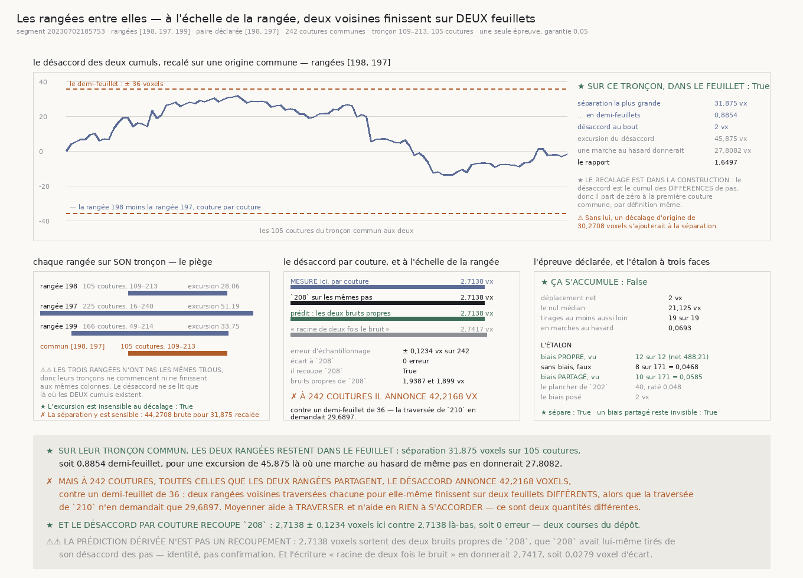

# `211` — Les rangées traversées indépendamment s'accordent-elles entre elles ?

*Non — et la prédiction que `R4-P57` avait posée d'avance est confirmée au voxel près.*

## 0. Pourquoi cette tranche

`210` a fait traverser **une** rangée, et c'est tout ce qu'il a fait. Le pas moyenné sur les rangées
**198**, **197** et **199** franchit ses **105 coutures** avec une excursion de **14,2708 voxels**,
et à **238 coutures** il annonce **29,6897 voxels** contre un demi-feuillet de **36 voxels** : une
rangée du treillis est traversable.

⭐⭐⭐⭐ **Mais le recto en porte 396, et 396 rangées traversées indépendamment ne font pas une
surface.** Rien dans la chaîne n'avait mesuré ce qui se passe ENTRE elles.

## 1. La prédiction, posée avant la mesure

`208` a séparé le pas en une part que deux rangées voisines PARTAGENT et une part PROPRE à chacune.
Dans la **différence** de deux cumuls, la part partagée s'annule terme à terme : il ne reste que les
deux bruits propres.

| | |
|---|---:|
| dérive partagée (`208`) | **1,5129 voxel** |
| bruit propre de la médiane (`208`) | **1,9387 voxel** |
| bruit propre de la voisine (`208`) | **1,899 voxel** |
| **désaccord prédit par couture** | **2,7138 voxels** |
| ce que « racine de deux fois le bruit » donnerait | **2,7417 voxels** |
| écart entre les deux écritures | **0,0279 voxel** |

⚠⚠ **La porte écrivait la prédiction « racine de deux fois le bruit propre »**, ce qui suppose que
les deux rangées en portent autant l'une que l'autre. `208` mesure qu'elles n'en portent pas tout à
fait autant, donc la prédiction honnête est la racine de la SOMME DES CARRÉS des deux. Les deux
écritures sont publiées côte à côte plutôt que l'une gommée : un nombre juste sous un mauvais nom est
pire qu'un nombre absent.

## 2. La ligne

| | |
|---|---:|
| segment | `20230702185753` |
| rangées du treillis | **198**, **197**, **199** |
| colonnes demandées | **285 colonnes** |
| pas lus | **243**, **253**, **250** |
| rangées de coupe par chunk | **16 rangées** |
| paire de l'épreuve, celle que `208` a déclarée | **198** et **197** |

⚠⚠ **Une seule épreuve est déclarée**, donc la garantie reste entière ; les deux autres paires sont
publiées comme **description**.

## 3. ⚠⚠ Les trois marches séparées — et elles ne traversent pas la même portion

Chaque rangée est traversée POUR ELLE-MÊME, sur SON propre tronçon. Avant toute soustraction, cela
dit déjà quelque chose.

| rangée | tronçons | le plus long | excursion |
|---|---:|---:|---:|
| **198** | **7 tronçons** | colonnes 109–213, **105 coutures** | **28,0625 voxels** = **0,389306 pli** |
| **197** | **2 tronçons** | colonnes 16–240, **225 coutures** | **51,1875 voxels** = **0,710116 pli** |
| **199** | **3 tronçons** | colonnes 49–214, **166 coutures** | **33,75 voxels** = **0,468208 pli** |

★ **Et la rangée 197 ne traverse PAS** : sur ses **225 coutures**, son excursion vaut **51,1875
voxels**, au-dessus du demi-feuillet de **36 voxels**. C'est le plafond de `207` retrouvé par une
mesure directe, sur la plus longue traversée d'une rangée seule que la chaîne ait construite.

⚠⚠ **Les trois rangées n'ont pas les mêmes trous**, donc leurs tronçons ne commencent ni ne
finissent aux mêmes colonnes. Le désaccord ne se lit que là où les DEUX cumuls existent.

## 4. ⭐⭐⭐⭐ Le désaccord des cumuls, recalé sur une origine commune

Le désaccord est le **cumul des différences de pas** sur le tronçon commun aux deux rangées : il part
donc de zéro à la première couture commune, par définition même. Recaler n'est pas une correction
après coup, c'est la construction.

| paire | coutures communes | désaccord par couture | tronçon | séparation la plus grande |
|---|---:|---:|---:|---:|
| **198**–**197** *(déclarée)* | **242 coutures** | **2,7138 ± 0,1234 voxel** | **105 coutures** | **31,875 voxels** |
| **198**–**199** | **239 coutures** | **2,9794 ± 0,1363 voxel** | **105 coutures** | **23,1875 voxels** |
| **197**–**199** | **246 coutures** | **3,4004 ± 0,1533 voxel** | **166 coutures** | **39,625 voxels** |

★ **Sur son tronçon commun, la paire déclarée reste dans le feuillet** : **31,875 voxels**, soit
**0,8854 demi-feuillet**. ✗ **Mais la paire 197–199 en sort déjà** : **39,625 voxels** sur ses
**166 coutures**, au-dessus de **36 voxels**.

⭐ **Et l'excursion du désaccord est celle d'une marche au hasard** : **45,875 voxels** mesurés
contre **27,8082 voxels** pour une marche au hasard de même pas, soit un rapport de **1,6497** —
ce qu'une marche au hasard donne. Rien ne retient les deux rangées l'une près de l'autre.

## 5. ⭐⭐⭐⭐ Et à l'échelle de la rangée, elles finissent sur DEUX feuillets

| paire | coutures | ce que le désaccord annonce | sous le demi-feuillet |
|---|---:|---:|---:|
| **198**–**197** | **242 coutures** | **42,2168 voxels** | **non** |
| **198**–**199** | **239 coutures** | **46,0604 voxels** | **non** |
| **197**–**199** | **246 coutures** | **53,3332 voxels** | **non** |

⭐⭐⭐⭐ **Les trois paires dépassent le demi-feuillet de 36 voxels**, et la prédiction de la porte —
« environ 42 voxels sur 238 coutures » — tombe sur **42,2168 voxels**.

⚠⚠⚠ **Et la comparaison qui décide est celle avec `210`** : la traversée d'une surface moyennée ne
demande que **29,6897 voxels** sur la même échelle, quand le désaccord de deux rangées voisines en
réclame **42,2168**. **Moyenner aide à TRAVERSER et n'aide en RIEN à S'ACCORDER** — ce sont deux
quantités différentes, et c'est pour cela qu'une tranche ne pouvait pas répondre aux deux.

## 6. ⭐ Ce qui recoupe `208`, et ce qui n'en est pas un recoupement

★ **Le désaccord des pas relu ici retombe sur celui de `208` au chiffre** : **2,7138 voxels** sur
**242 coutures** contre **2,7138** là-bas, soit **0 erreur** d'échantillonnage. Deux courses
indépendantes du dépôt rendent le même nombre.

⚠⚠⚠ **Mais la prédiction dérivée, elle, n'est PAS un recoupement, et il faut le dire plutôt que
l'encaisser.** `208` a tiré ses deux bruits propres de son désaccord des pas ; la racine de la somme
de leurs carrés le redonne donc **par construction**. C'est une identité, pas une confirmation. Le
seul recoupement qui vaille est celui de la MATIÈRE, ci-dessus.

⚠ Les deux voisines ne se comportent pas tout à fait pareil : **0 erreur** pour la paire déclarée,
**1,949 erreur** pour **198**–**199**, **4,4787 erreurs** pour **197**–**199**. La dernière paire
porte un désaccord franchement plus grand, et c'est une description, pas une épreuve.

## 7. ⚠⚠ La règle réfutée, portée comme contrôle nommé

Soustraire deux cumuls bâtis chacun sur son propre tronçon ajoute une CONSTANTE : la distance que
chacun a parcourue avant la première colonne partagée.

| paire | colonnes partagées | décalage d'origine | séparation sans recalage | avec recalage |
|---|---:|---:|---:|---:|
| **198**–**197** | **105 colonnes** | **30,2708 voxels** | **44,2708 voxels** | **31,875 voxels** |
| **198**–**199** | **105 colonnes** | **25,25 voxels** | **45,125 voxels** | **23,1875 voxels** |
| **197**–**199** | **166 colonnes** | **24,3333 voxels** | **37,0208 voxels** | **39,625 voxels** |

⚠⚠⚠ **Le décalage d'origine est du même ordre que le demi-feuillet lui-même** — **30,2708 voxels**
pour **36**. Sans recalage, la paire déclarée paraîtrait séparée de **44,2708 voxels** au lieu de
**31,875**.

⚠⚠ **Et la faute ne se voit pas partout, ce qui la rend dangereuse.** Une constante ne change pas
l'EXCURSION d'une différence — mesuré vrai sur les trois paires — donc une tranche qui n'aurait
publié que l'excursion aurait rendu le bon nombre **par accident**. Elle change la SÉPARATION, et
c'est la séparation qui décide du feuillet.

⚠ Le décalage peut aussi **masquer** une divergence au lieu d'en fabriquer une : pour **197**–**199**
la séparation brute vaut **37,0208 voxels** quand la recalée en vaut **39,625**.

## 8. ✗ Le désaccord ne s'accumule pas — et c'est la mauvaise nouvelle

| | |
|---|---:|
| déplacement net | **2 voxels** |
| le nul médian, par tirage de signes | **21,125 voxels** |
| tirages au moins aussi loin | **19 sur 19** |
| en marches au hasard | **0,0693** |
| **ça s'accumule** | **non** |

⚠⚠⚠ **Aucune des deux rangées ne lit systématiquement plus long que l'autre.** Le désaccord est une
marche au hasard pure, sans biais. Ce n'est pas un soulagement : **une dérive systématique se
corrigerait**, un bruit irréductible non. Il n'y a rien à retrancher.

## 9. L'étalon, et le zéro qu'il ne fallait pas exiger

| | |
|---|---:|
| coutures par réplicat | **242 coutures** |
| dérive partagée posée, celle de `208` | **1,5129 voxel** |
| bruit propre posé, celui de `208` | **1,9387 voxel** |
| biais propre posé, celui de `199` | **2 voxels** |
| **face positive** — biais PROPRE à une rangée | **12 sur 12**, net médian **488,212 voxels** |
| **face négative** — aucun biais | **8 faux sur 171** = **0,0468 pour 0,05 garantis** |
| **contrôle aveugle** — biais PARTAGÉ par les deux | **10 sur 171** = **0,0585** |
| le plancher de `202` | **40 réplicats**, raté **0,048** |
| **l'étalon sépare** | **oui** |

⭐⭐⭐⭐ **Le contrôle aveugle est l'exact inverse de celui de `210`.** Là-bas, un biais que seule une
rangée aurait porté se serait divisé par trois en moyennant, donc la fixture devait le mettre dans la
part PARTAGÉE. Ici, un biais partagé s'annule dans la différence et l'épreuve ne peut pas le voir :
c'est dans la part propre qu'il doit vivre. Les deux tranches emploient la même fixture avec le biais
à deux endroits différents, et chacune ne voit que le sien.

⚠⚠⚠ **Et la première version de ce contrôle a REFUSÉ un étalon parfaitement sain.** Elle exigeait
qu'AUCUN de **12 réplicats** ne tire — or chacun porte la garantie de l'épreuve, donc en attendre
zéro, c'est attendre du nul ce qu'il ne peut pas donner. La mesure a rendu un tirage là où la sonde en exigeait
zéro, et le verdict est tombé sur du code juste. Le contrôle se juge désormais **au même taux et sur le même compte dérivé** que
l'autre face négative, et les deux tombent au même niveau : **0,0468** sans biais, **0,0585** avec un
biais partagé. C'est le piège de `178` repayé ici.

## 10. Les sondes, et les vingt-quatre bris

Le module rend **62 contrôles**, la figure **77**. Vingt-quatre bris ont été posés et **les
vingt-quatre ont viré au rouge** après réparation. Quatre y ont d'abord échappé :

⚠⚠⚠ **La règle composée n'était exercée par rien** : retirer le contrôle aveugle du verdict de
l'étalon restait vert, parce que sur du code juste les trois conditions sont vraies ensemble et que
la sonde ne lisait que ce que chaque face dit SÉPARÉMENT. Réparé par un paramètre qui rend le
contrôle VOYANT : les deux autres faces ne bougent pas, et le verdict DOIT cesser de séparer.
⚠ Au passage, un contrôle qui ne peut jamais se déclencher ne prouve rien non plus.

⚠⚠ **Le `.get()` du verdict n'était exercé par rien** : tous les appels de la batterie passaient des
dictionnaires qui PORTENT la clef, donc un bris qui les indexait directement ne mourait sur aucun.
Réparé par deux appels sur un dictionnaire qui ne la porte pas.

⚠⚠ **Trois sondes MOURAIENT au lieu de rougir** quand un bris prenait l'union des coutures au lieu
de leur intersection. Une batterie qui meurt avant son verdict ne dit rien : l'exception est
désormais comptée comme un contrôle en échec, et nommée.

⚠⚠⚠ **Et un péché capital a été attrapé en écrivant la figure, pas par une sonde** : la clef de la
paire déclarée était rebâtie en `min`-`max` — donc « 197-198 » quand la paire est rangée
« 198-197 » — et retombait sur la bonne paire par le seul ordre du dictionnaire. Un nombre juste pour
la mauvaise raison. Le jour où la médiane cesse d'être la première rangée lue, le verdict porterait
sur une AUTRE paire sous le nom de celle-ci.

⚠ La figure a livré trois défauts de plus, tous vus en REGARDANT l'image : une légende que la trace
TRAVERSAIT, un libellé collé à sa valeur, et un verdict de panneau qui annonçait « elles restent dans
le feuillet » sans dire qu'il ne parlait que du tronçon — ce que la bande contredit plus bas.

## 11. Ce que cette tranche ne dit pas

⚠ Elle porte sur **3 rangées** d'**un** segment. ⚠⚠ Elle mesure le désaccord de deux
rangées prises deux à deux, pas la cohérence d'une nappe entière, et rien ne dit que le désaccord le
plus grand du recto soit celui de deux voisines. ⚠⚠⚠ Et elle ne dit pas ce qui
POURRAIT tenir deux rangées ensemble — elle mesure que rien ne le fait aujourd'hui.

## 12. La porte

`R4-P57` est **répondue**, et par l'affirmative sur sa prédiction la plus sombre. `R4-P58`
**s'ouvre** : qu'est-ce qui tient deux rangées voisines sur le même feuillet ?
