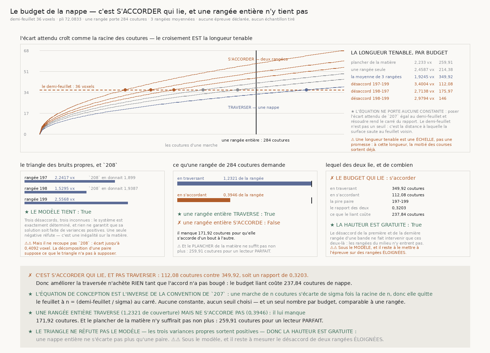
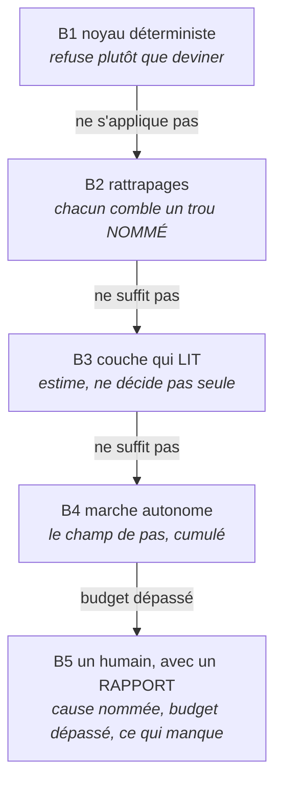

# 213 — Le pipeline, version deux : ce que soixante tranches ont changé depuis `151`

> ⭐⭐⭐⭐ **LA RÉPONSE À LA QUESTION POSÉE EST OUI, ET L'ÉCART EST PLUS GRAND QUE PRÉVU.** `151` a
> monté le pipeline complet à partir de cent cinquante documents ; il recensait alors **220 faits**,
> **93 lois** et **82 portes**. Le dépôt en porte aujourd'hui **448**, **101** et **113** — soit
> **228 faits** et **8 lois** de plus. Et surtout : **l'étage qui était le maillon ouvert n'existe
> plus.** `151` marchait avec une pince ; `198` à `211` ont construit un **champ de pas sur un
> treillis**, qu'on intègre. Ce n'est pas une amélioration de `E4`, c'est un autre `E4`.
>
> ⭐⭐⭐⭐ **ET LE PIPELINE A MAINTENANT UNE ÉQUATION DE CONCEPTION, CE QUI LUI MANQUAIT LE PLUS.**
> `212` la pose : une nappe quitte son feuillet au bout de $n_{\max}=(\delta/\sigma)^2$ coutures.
> Elle rend **un seul nombre par budget**, comparable à la largeur d'une rangée — donc pour la
> première fois, « jusqu'où ça va » est une question à laquelle le dépôt répond par un calcul plutôt
> que par une course.
>
> ⭐⭐⭐⭐ **ET ELLE A RÉVÉLÉ QUE LA CHAÎNE OPTIMISAIT LE MAUVAIS BUDGET.** Il y en a deux — traverser
> et s'accorder — ils ne se déduisent pas l'un de l'autre (`R4-L16`), et c'est **s'accorder** qui lie
> (`R4-F341`). Tout l'effort depuis `204` a poussé l'autre.
>
> ⚠ **CE DOCUMENT NE MESURE RIEN.** Il n'ajoute **aucun fait** et **aucune porte** : tout ce qu'il
> avance est cité par son identifiant de registre. C'est un **montage**, pas une tranche — la même
> règle que `151` s'est donnée.

## 1. Ce qui a changé, en une page

| | `151` | aujourd'hui |
|---|---|---|
| l'objet qui avance | une **pince** à deux mâchoires | un **champ de pas** sur le treillis des chunks |
| ce qu'on mesure | une pose, un transfert | un **pas par couture**, puis son **cumul** |
| le maillon ouvert | `E4`, **0 transfert sur 36** (`R4-F108`) | `E6`, **l'accord entre rangées** (`R4-F341`) |
| ce qui borne | rien de chiffré | $n_{\max}=(\delta/\sigma)^2$ (`R4-F340`) |
| la question ouverte | « quelle direction pour les mâchoires ? » | « le bruit propre croît-il avec la distance ? » (`R4-P59`) |

⚠⚠ **La pince n'est pas réfutée, elle est CONTOURNÉE.** `161` à `171` ont fini de la mesurer : la
pose **dit** qu'elle a sauté (`R4-F151`), écouter ce qu'elle dit multiplie par **5,404** ce qu'un
marcheur livre d'utilisable (`R4-F157`) — et la matière du rouleau reste malgré tout à **zéro
transfert** sous les quatre instruments (`R4-F132`). Puis les réfutations se sont enchaînées :
réessayer ailleurs, la croix qui coûte plus et livre moins, le vrillage qui ne rapproche pas. Ce que `172`–`179` ont trouvé en cherchant ailleurs
est une observable qui ne demande **aucune pose** : la cohérence en profondeur. Le reste a suivi.

## 2. L'axe horizontal — les étages, et le nouveau

| | étage | ce qui a changé depuis `151` | état |
|---|---|---|---|
| **E0** | choisir l'objet | rien | ⚠ contraint |
| **E1** | lire le volume | rien — le lecteur par chunk tient | ✅ |
| **E2** | poser l'échelle | rien — le pas du pli reste la constante | ✅ |
| **B** | **budgéter** | ⭐⭐⭐⭐ **NOUVEAU** (`212`) | ✅ |
| **E3** | trouver une graine | ⭕ **sans objet** dans cette voie — le treillis est régulier et jamais choisi (`176`) | — |
| **E4** | **lire le pas** | ⭐⭐⭐⭐ **REMPLACÉ** — plus de pince, un pas par couture | ✅ |
| **E5** | couper aux trous | un trou coupe la marche, il ne se recolle pas (`199`) | ✅ |
| **E6** | **accorder les rangées** | ⛔ **le maillon ouvert** (`R4-F333`) | ⛔ |
| **E7** | juger sans vérité | rien | ✅ |
| **E8** | rendre, valider par l'encre | rien | ✅ |
| **E9** | emballer | rien | ✅ |

⭐⭐⭐⭐ **Le maillon ouvert a DÉMÉNAGÉ, et c'est la meilleure nouvelle du lot.** `151` était bloqué à
`E4` : rien ne traversait. Aujourd'hui `E4` traverse — une rangée du treillis se franchit
(`R4-F326`, `R4-F329`) — et ce qui bloque est un étage **plus haut**, celui qui met les rangées
ensemble. Un blocage qui monte d'un étage est un projet qui avance.

### B — Budgéter : l'étage que `151` n'avait pas

Avant de marcher, on calcule jusqu'où le budget permet d'aller. C'est arithmétique, donc gratuit, et
ça évite de lancer une course dont on sait déjà qu'elle sortira du feuillet.

⚠⚠⚠ **Et c'est ce qui a montré que la chaîne dépensait au mauvais endroit.** Les deux budgets sont
chiffrés, ils diffèrent d'un facteur trois (`R4-F341`), et **seul le plus petit compte**. Nouvelle
règle du pipeline, à mettre à côté de l'invariant de l'échelle :

> **On ne dépense pas sur le budget qui ne lie pas.**

### E4 — Lire le pas : ce qui a remplacé la pince

Un pas est la translation entre deux chunks voisins, lue sur leurs bords. La chaîne l'a construit en
quatre temps, et chacun a une raison mesurée :

| | ce qui a été fait | pourquoi |
|---|---|---|
| `202` | vérifier que le creux est **attaché au papyrus** (`R4-F281`) | sinon on suit un artefact de lecture |
| `203` | ✗ élargir la bande **ne marche pas** — à aucune largeur plus de signal que de bruit (`R4-F288`) | la largeur n'était pas le problème |
| `204` | ⭐ **moyenner seize rangées** fait passer le signal devant le bruit (`R4-F293`) | le nombre de rangées l'était |
| `207` | **cumuler** les pas : la marche traverse son tronçon sans quitter le feuillet (`R4-F314`) | un pas n'est pas une marche |

⚠⚠ **Et le cumul a immédiatement montré son plafond** (`R4-F318`) : la voie différentielle est
arithmétique, pas instrumentale. C'est ce plafond que `208` a brisé par la **fermeture verticale**
(`R4-F322`), et que `210` a mesuré (`R4-F329`).

### E6 — Accorder les rangées : le maillon ouvert

⭐⭐⭐⭐ **C'est ici que tout se joue maintenant.** Deux rangées traversées chacune pour elle-même
finissent sur **deux feuillets différents** (`R4-F333`), et leur désaccord **ne s'accumule pas**
(`R4-F335`) — donc il n'y a **aucune dérive systématique à retrancher**. Ce n'est pas un réglage
manquant, c'est un bruit irréductible.

⚠⚠ Le rattrapage évident est déjà mesuré et il a un coût connu : le **lien latéral** de `127`
supprime toutes les déchirures et **fausse un décrochement réel** de **1,1561 feuille** (`R4-F55`).
Une contrainte verticale qui empêche deux rangées de diverger empêche aussi la surface de suivre un
vrai décrochement — c'est le même arbitrage, un cran plus haut.

## 3. L'axe vertical — l'échelle d'escalade, relue

L'invariant est inchangé, et il a tenu soixante tranches :

> **Un barreau baisse la PRÉTENTION du résultat, jamais la BARRE, et jamais en silence.**

### B1 — Ce que le noyau sait rendre exact

| mécanisme | l'énoncé | source |
|---|---|---|
| l'intersection des coutures | une couture qu'une rangée n'a pas lue **n'est pas moyennable** | `210` |
| le tronçon | un trou **coupe** la marche, il ne se recolle pas | `R4-F264` |
| le recalage | le désaccord est le cumul des **différences**, donc il part de zéro | `R4-F337` |
| l'index par colonne | jamais par rang — deux rangées n'ont pas les mêmes trous | `R4-F280` |
| la longueur tenable | $n_{\max}=(\delta/\sigma)^2$, **calculée** | `R4-F340` |

### B2 — Les rattrapages, avec leur verdict

| rattrapage | le trou qu'il comble | verdict |
|---|---|---|
| moyenner **k** rangées | l'aléa de lecture domine la dérive | ✅ signal devant bruit à seize rangées (`R4-F293`) |
| moyenner les rangées du **treillis** | le bruit propre d'une rangée | ✅ excursion divisée par deux (`R4-F326`) |
| recaler sur une origine commune | deux tronçons ne commencent pas au même endroit | ✅ exact par construction (`R4-F337`) |
| moyenner le **creux** | le bruit du repère absolu | ⛔ ne passe pas sous sa dérive (`R4-F300`) |
| couper le chunk en **profondeur** | l'erreur commune à un chunk | ⚠ elle en dépend, mais le modèle se réfute (`R4-F310`) |
| le **dépliage de phase** | composer l'absolu et le différentiel | ⛔ dérive **2,5×** plus (`R4-F277`) |
| le **lien latéral** | la nappe se déchire | ⚠ marche, mais fausse un vrai décrochement (`R4-F55`) |

⭐⭐⭐ **Trois tiennent, deux sont réfutés, deux sont bornés — et c'est la valeur du barreau.** Une
échelle dont aucune couche n'a jamais échoué est une échelle qu'on n'a pas mesurée.

### B3 — La couche qui lit

| lecture | sa limite mesurée |
|---|---|
| le creux de cohérence (`179`, `180`) | ✅ le rouleau creuse partout, plus profond qu'une frontière construite (`R4-F198`) |
| le repère absolu (`200`) | ⚠ lisible presque partout, mais **ne borne rien** (`R4-F271`) |
| le transfert de fibre (`190`) | ⚠ tient une feuille dans une **minorité** de chunks (`R4-F223`) |
| le détecteur d'encre | ⚠ hallucine sur du vide — reste au **troisième** barreau |

### B5 — Le rapport, enrichi

Une nappe qui s'arrête rend désormais, en plus de sa cause : **le budget qu'elle avait**
(`R4-F340`), **lequel des deux l'a liée** (`R4-F341`), et **de combien de coutures elle est courte**
(`R4-F342`). L'état de l'art n'en publie aucun (`R6-F04`).

## 4. ⭐⭐⭐⭐ Le formulaire de la nappe

Notation : $\delta$ le demi-feuillet, $\hat s_c$ le pas lu à la couture $c$, $n$ un nombre de
coutures, $k$ un nombre de rangées moyennées, $T$ un tronçon de coutures contiguës.

**[N1] La décomposition du pas** (`208`, `R4-F321`). Le pas lu sur la rangée $i$ porte une part que
les rangées voisines partagent et une part qui lui est propre :

$$\sigma_i^{2} \;=\; \sigma_p^{2} \;+\; \sigma_{b,i}^{2}$$

**[N2] Moyenner $k$ rangées** (`210`, `R4-F328`). La moyenne ne divise que la part propre :

$$\sigma_k \;=\; \sqrt{\sigma_p^{2}+\frac{\sigma_b^{2}}{k}}$$

**[N3] Différencier deux rangées** (`211`, `R4-F334`). La différence **annule** la part partagée :

$$\sigma_\Delta(i,j) \;=\; \sqrt{\sigma_{b,i}^{2}+\sigma_{b,j}^{2}}$$

**[N4] La marche, et son excursion** (`207`). Le cumul des pas d'un tronçon, et l'écart attendu d'une
marche de pas indépendants :

$$C(n)=\sum_{c\,\in\,T,\ c\le n}\hat s_c \qquad\qquad \mathbb{E}\bigl[\lvert C(n)-C(0)\rvert\bigr]\;\simeq\;\sigma\sqrt{n}$$

**[N5] L'équation de conception** (`212`, `R4-F340`). Poser l'écart attendu égal au demi-feuillet :

$$\boxed{\;n_{\max}\;=\;\left(\frac{\delta}{\sigma}\right)^{2}\;}$$

**[N6] Le recalage sur une origine commune** (`211`, `R4-F337`). Le désaccord est le cumul des
différences, donc nul à la première couture commune **par définition** :

$$d_{ij}(n)\;=\;\sum_{c\,\in\,T,\ c\le n}\bigl(\hat s^{(i)}_c-\hat s^{(j)}_c\bigr) \qquad\Longrightarrow\qquad d_{ij}(0)=0$$

**[N7] Le triangle des bruits propres** (`212`, `R4-F343`). Trois rangées, trois équations, trois
inconnues — et une **inégalité sur la matière**, puisque rien ne garantit la positivité :

$$\sigma_{b,i}^{2}\;=\;\frac{\sigma_\Delta^{2}(i,j)+\sigma_\Delta^{2}(i,k)-\sigma_\Delta^{2}(j,k)}{2}$$

**[N8] La hauteur d'une nappe** (`212`, `R4-F345`, **borné**). Seules les deux rangées extrêmes
entrent dans le désaccord d'une bande :

$$d_{1,r}(n)=W_1(n)-W_r(n) \qquad\Longrightarrow\qquad \mathrm{Var}\bigl[d_{1,r}(n)\bigr]=\bigl(\sigma_{b,1}^{2}+\sigma_{b,r}^{2}\bigr)\,n$$

### Le formulaire de la décision — il gouverne tous les barreaux

**[D1] L'erreur d'échantillonnage d'une dispersion** (`210`, `211`). Elle se **dérive**, et sans elle
une inégalité stricte contre une borne ne passe que par chance :

$$\mathrm{se}(\hat\sigma)\;=\;\frac{\hat\sigma}{\sqrt{2n}}$$

**[D2] Le compte décisif d'une face négative** (`R5-L21`). Mettre trois erreurs d'échantillonnage
dans la marge que la garantie $g$ laisse :

$$m\;=\;\left\lceil\,\frac{9\,(1-g)}{g}\,\right\rceil$$

**[D3] Le prix de famille.** $N$ épreuves déclarées divisent la garantie ; une tranche qui ne tire
aucun échantillon n'en déclare **aucune** et n'en consomme rien (`212`).

**[D4] Le plancher de détection** (`R5-L22`). Il dépend du **compte** et de la longueur de la liste
déclarée, pas de la matière — et chercher coûte plus cher que confirmer (`R4-F233`).

## 5. Le cimetière — ce que soixante tranches ont enterré

Garder les formules fausses écrites est ce qui empêche de les repayer.

| ce qui est tombé | pourquoi | source |
|---|---|---|
| le **dépliage de phase** comme ordinal | excursion **2,5×** pire que le différentiel seul | `R4-F277` |
| le **repère absolu** comme borne | lisible presque partout, mais ne borne rien | `R4-F271` |
| **moyenner le creux** | ne passe pas sous sa propre dérive, à aucun découpage | `R4-F300` |
| la **transition** comme cause de l'erreur de chunk | exclusion nette | `R4-F324` |
| la projection de `208` comme borne **atteignable** | c'était une borne **optimiste** | `R4-F328` |
| **élargir la bande** | à aucune largeur plus de signal que de bruit | `R4-F288` |
| une surface qui **choisit sa couche** | tient sa feuille dans une minorité de chunks | `R4-F223` |
| les **19 observables** de texture, puis les **12** d'adresse | aucun ne sépare | `R4-F228`, `R4-F236` |
| l'**empilement périodique** au pas d'une feuille | ne se répète pas ; ce qui porte est la contiguïté | `R4-F220` |
| la **bascule recto/verso** lisible en profondeur | l'ordre existe mais n'a pas l'amplitude d'un quart de tour | `R4-F186` |

## 6. Ce que le livrable contiendrait aujourd'hui

Une image Docker montée sur ce dépôt, **honnêtement décrite**, ferait ceci — et chaque ligne nomme
son barreau :

1. **prendre un objet et un segment** (B1) ;
2. **lire le volume à distance** (B1), chunk par chunk, sur le treillis régulier ;
3. **poser son échelle** (B1) depuis le pas du pli ;
4. ⭐ **budgéter** (B1) : calculer $n_{\max}$ pour les deux budgets, et **refuser de lancer** une
   course que l'arithmétique donne perdante ;
5. **lire un pas par couture** (B4) en moyennant les rangées de coupe, puis les rangées du treillis ;
6. **couper aux trous** (B1) et cumuler sur chaque tronçon ;
7. **accorder les rangées** (B2) — et **s'arrêter là**, parce que c'est le maillon ouvert ;
8. **juger sa propre nappe** (B3) sans vérité terrain ;
9. **rendre**, **valider par l'encre** (B3), et **refuser de publier** (B1) ce que son juge n'accepte
   pas.

⚠⚠ **Ce qu'elle ne ferait pas** : assembler une nappe plus large que **112,08 coutures** sans sortir
du feuillet (`R4-F341`) — soit **0,3946** d'une rangée (`R4-F342`). Et elle **le dirait avant de
commencer**, ce qui est la seule chose que `151` ne pouvait pas faire.

⭐ **Et cette honnêteté reste soumissible.** Les Progress Prizes paient explicitement les résultats
négatifs, et l'état de l'art ne publie **aucun** taux d'erreur de traçage (`R6-F04`).

## 7. Ce qui reste, dans l'ordre

1. ⭐⭐⭐⭐ **`R4-P59`** — le bruit propre croît-il avec la distance entre rangées ? Toute la gratuité
   de la hauteur en dépend, et c'est la mesure la moins chère de la chaîne.
2. **`R4-P58`** — qu'est-ce qui tient deux rangées voisines sur le même feuillet ? Deux candidats
   déjà mesurés : le repère absolu de `200`, qui ne dérive pas par construction, et le lien latéral
   de `127`, dont le coût est connu.
3. **`R4-P27`**, **`134`**, les **trois pertes du bruit 16** de `156`, la **contradiction
   irréparable** de `167`, **`R4-P50`** — ouvertes, et aucune ne bloque les deux premières.

---

⚠ **Ce document ne publie aucun nombre qui lui soit propre.** Chaque valeur est celle de son fait,
recalculable par le producteur que `REGISTRE_faits.tsv` nomme. La forme de l'échelle vient du skill
`concevoir-avant-coder` (`~/LplCraftSkills`), §8 — *pipeline adaptatif : option, mode, télémétrie*.
