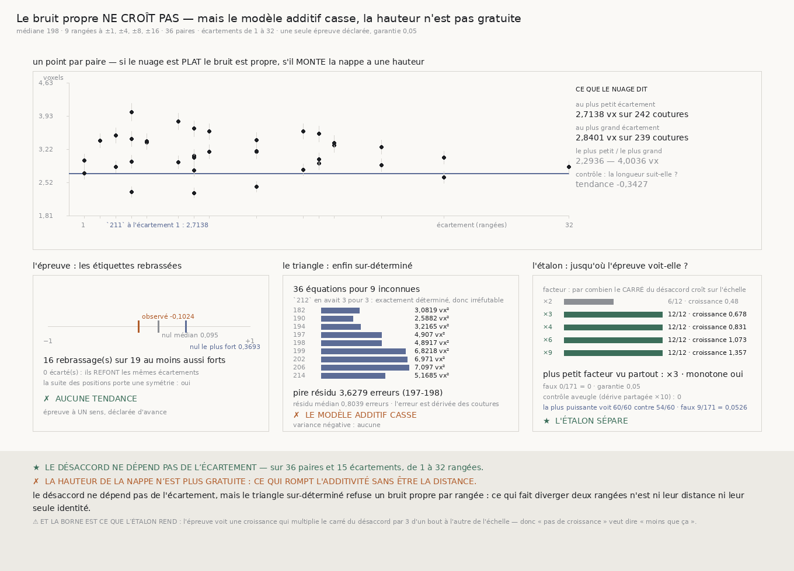

# `214` — Le bruit propre croît-il avec l'écartement ? Non, et le triangle casse quand même

*La distance n'est pas ce qui rend la hauteur payante — mais quelque chose la rend payante.*

## 0. Pourquoi cette tranche

`212` a établi que le budget qui lie la nappe est l'**accord** et non la traversée, et il en a tiré
une conclusion confortable : la hauteur d'une bande est **gratuite**. L'argument tient en une ligne
de modèle. Le désaccord de deux rangées $i$ et $j$ est

$$\sigma_\Delta^{2}(i,j) \;=\; \sigma_{b,i}^{2} + \sigma_{b,j}^{2}$$

donc il ne fait intervenir que **ces deux rangées**. Empiler douze rangées entre elles ne coûte rien,
puisque les rangées du milieu n'entrent pas dans la formule : seules la première et la dernière
paient. C'est cela, « la hauteur est gratuite ».

⚠⚠⚠ **Et `212` savait que cette conclusion reposait sur un point que personne n'avait mesuré.** Il
l'a écrit dans sa propre porte, `R4-P59` : si le bruit propre d'une rangée **croît avec la distance à
l'autre**, ce qu'une matière réelle fait volontiers, alors la formule ci-dessus est fausse, la
hauteur cesse d'être gratuite, et **le modèle ne le verrait pas**. Le triangle de `212` ne prouvait
qu'une chose : le modèle tient sur les **3 rangées** qu'il avait mesurées, toutes à une ou deux
rangées d'écart les unes des autres.

Cette tranche fait la mesure que la porte demandait, sur des rangées **écartées**.

## 1. La prédiction, posée d'avance

`R4-P59` a posé sa prédiction avant la mesure, et c'est ce qui la rend réfutable : *sous le modèle,
le désaccord par couture doit rester PLAT en fonction de la distance, autour de* **2,7138 voxels**
*; s'il croît, la nappe a une largeur ET une hauteur tenables, et le recto se découpe en dalles au
lieu de se lire d'un bloc.*

**Une seule épreuve est déclarée**, « le désaccord par couture croît-il avec l'écartement », pour une
garantie de **0,05**.

Le dispositif est celui de `211`, sur un treillis plus large. La médiane des rangées lues est la
rangée **198** ; on lit les rangées à $\pm 1$, $\pm 4$, $\pm 8$ et $\pm 16$ **des deux côtés**, soit
neuf rangées : **182, 190, 194, 197, 198, 199, 202, 206, 214**. Aucun écartement n'est perdu au bord.

⭐ **Et les paires ne sont pas les paires déclarées : ce sont TOUTES les paires.** Neuf rangées
donnent $\binom{9}{2} = 36$ paires, dont les écartements **dérivés** couvrent **15** valeurs de **1**
à **32** rangées — bien au-delà des quatre écartements posés. Une échelle de un à trente-deux n'est
pas la même affirmation qu'une tendance cherchée sur trois écartements voisins, et le verdict publie
l'échelle avant sa conclusion.

## 2. Pourquoi des RANGS, et pas une droite

La question de la porte est *est-ce que ça croît*, pas *est-ce que ça croît linéairement*. Les deux
ne se mesurent pas avec le même outil, et se tromper d'outil ici coûterait le résultat.

⭐⭐ **Un champ qui se décorrèle SATURE.** Si les rangées portent un champ de pas qui se décorrèle
avec la distance, le désaccord croît d'abord vite puis se stabilise, parce que deux rangées assez
éloignées sont simplement indépendantes et ne peuvent pas l'être davantage. Une droite ajustée sur
une courbe qui sature rend une pente faussement petite ; une corrélation **de rangs** répond à la
question posée, monotone ou non.

La corrélation de rangs est donc celle de Spearman, ex aequo moyennés.

## 3. La mesure sur le rouleau

Les neuf rangées sont lues sur le segment `20230702185753`, grille **396 × 285**, chunk
**109 × 128 × 128**, **zéro** reprise de réseau sur les neuf. Chaque paire rend son désaccord par
couture et, à côté, la **longueur** du tronçon commun — le piège que la porte avait nommé.

| | écartement | désaccord | coutures |
|---|---:|---:|---:|
| la paire la plus serrée | 1 | **2,7138** vx | 242 |
| la paire la plus écartée | 32 | **2,8401** vx | 239 |
| le plus petit désaccord vu | 8 | **2,2936** vx | 240 |
| le plus grand désaccord vu | 4 | **4,0036** vx | 241 |

⭐⭐⭐⭐ **Les extrêmes ne tombent pas aux extrêmes de l'écartement**, et c'est la façon la plus simple
de lire le nuage. Le désaccord le plus **faible** des trente-six paires est à huit rangées d'écart,
le plus **fort** à quatre. Le désaccord médian vaut **3,121** voxels.

L'épreuve chiffre ce que l'œil voit. La corrélation de rangs entre écartement et désaccord vaut
**−0,1024** — négative. Sur **19** rebrassages des étiquettes de rangées, **16** rendent une tendance
au moins aussi forte ; le rebrassage médian rend **0,095** et le plus fort **0,3693**. Aucun
rebrassage ne refait les écartements observés, et la suite des positions porte bien une symétrie,
calculée et non supposée.

> ✗ **LE DÉSACCORD NE DÉPEND PAS DE L'ÉCARTEMENT.**

⚠ La règle réfutée de `211` est portée comme **contrôle nommé** plutôt que jetée : rebrasser les
valeurs au lieu des étiquettes rend un nul le plus fort de **0,4421** et **15** tirages au moins
aussi forts, donc la même conclusion. Les deux lectures s'accordent, ce qui ne prouve rien, mais leur
désaccord aurait été un fait.

## 4. ⭐⭐⭐⭐ Le négatif est une BORNE, parce que l'étalon dit jusqu'où l'épreuve voit

Un « non » ne vaut que ce que vaut le pouvoir de l'épreuve. Une épreuve aveugle rend « non » sur
toute matière, et sa conclusion est alors un énoncé sur l'épreuve et non sur le rouleau.

L'étalon pose donc une matière **fabriquée** qui porte exactement le défaut cherché : un champ qui se
décorrèle entre rangées, construit comme une marche au hasard **en travers** du treillis, dont
l'incrément entre deux positions vaut $\sqrt{p_i - p_{i-1}}$ fois une croissance posée. Les neuf
positions sont celles du rouleau, les longueurs sont celles mesurées (**239** coutures par
réplicat), la dérive partagée est celle de `208` (**1,5129** voxel) et — ⚠⚠⚠ **c'est le point qui a
failli truquer l'examen** — les bruits propres par rangée sont ceux que le triangle de `212` a
**mesurés**, et non un bruit uniforme.

La croissance n'est pas choisie : elle est **dérivée** du facteur par lequel on veut que le carré du
désaccord croisse d'un bout à l'autre de l'échelle,

$$c \;=\; \sigma_{211}\,\frac{\sqrt{f-1}}{\sqrt{e_{\max}}}$$

ce qui annonce $\sigma_{211}\sqrt{f}$ au plus grand écartement.

| facteur | croissance posée | ce qu'elle annonce à 32 | vu |
|---:|---:|---:|---:|
| ×2 | 0,4797 vx | 3,8379 vx | **6/12** |
| ×3 | 0,6784 vx | 4,7004 vx | **12/12** |
| ×4 | 0,8309 vx | 5,4276 vx | 12/12 |
| ×6 | 1,0727 vx | 6,6474 vx | 12/12 |
| ×9 | 1,3569 vx | 8,1414 vx | 12/12 |

⭐⭐⭐⭐ **L'échelle est monotone et son plus petit barreau vu partout est ×3.** C'est cela, la borne :
l'épreuve voit sans faute une croissance qui **triple le carré du désaccord** d'un bout à l'autre de
l'échelle, et ne la voit qu'une fois sur deux à ×2. Donc « pas de croissance » veut dire, très
exactement, **« moins que ×3 »** — et ce n'est pas un seuil choisi, c'est le dernier barreau d'une
échelle dérivée.

⚠⚠ **Et cette borne est celle de la règle DÉCLARÉE, pas la meilleure atteignable.** Une statistique
plus puissante, portée à côté comme contrôle nommé et détaillée au §8, voit le facteur **2** à
**12/12** sur cette même échelle et tient sa garantie. La borne de cette tranche est donc
conservatrice d'un cran, et c'est le prix de n'avoir pas changé de règle après avoir vu les
données — chiffré, plutôt que passé sous silence.

La face négative est mesurée sur **171** réplicats, ce qui n'est pas un chiffre rond : pour qu'un
taux de faux garanti à $g$ soit décidable avec la même confiance sur $k$ faces positives, il en faut

$$m \;=\; \Bigl\lceil \frac{k\,(1-g)}{g} \Bigr\rceil \;=\; \Bigl\lceil \frac{9 \times 0{,}95}{0{,}05} \Bigr\rceil \;=\; 171$$

Le taux de faux mesuré est **0/171**, pour une garantie de **0,05**. Et un **contrôle aveugle** — une
dérive partagée multipliée par dix, qui n'est pas ce que l'épreuve cherche — reste invisible
**0/171** fois : l'épreuve ne répond pas oui à n'importe quelle perturbation.

## 5. Le piège de la porte pousse dans l'AUTRE sens

`R4-P59` avait nommé son piège : deux rangées éloignées ont moins de trous en commun, donc leur
tronçon commun raccourcit, et un désaccord estimé sur moins de coutures est estimé plus
**bruyamment**.

Mesuré : la corrélation de rangs entre écartement et nombre de coutures communes vaut **−0,3427**.
Les coutures communes vont de **224** à **247**, médiane **239**.

⭐ **Le piège est réel et il pousse contre le résultat, pas avec lui.** Moins de coutures veut dire un
désaccord estimé plus haut, donc si la longueur fabriquait quelque chose, elle fabriquerait une
croissance apparente. On n'en observe aucune. L'absence de croissance n'est donc pas un artefact de
longueur : elle survit à un biais qui aurait dû la masquer.

## 6. ⭐⭐⭐⭐ Le triangle SUR-DÉTERMINÉ, et il casse

`212` avait tiré trois variances propres de trois désaccords par le triangle

$$\sigma_{b,i}^{2} \;=\; \tfrac12\bigl(\sigma_\Delta^{2}(i,j) + \sigma_\Delta^{2}(i,k) - \sigma_\Delta^{2}(j,k)\bigr)$$

⚠⚠ **et ce triangle-là ne pouvait rien réfuter.** Trois équations pour trois inconnues : le système
est exactement déterminé, donc il rend toujours une solution, et la seule chose qui pouvait le
contredire était une variance **négative**. `212` a vérifié la positivité et s'est arrêté là, ce qui
était tout ce qu'il pouvait faire.

Neuf rangées changent la nature de l'objet. Trente-six paires pour neuf inconnues : le modèle
additif **n'a plus nulle part où se cacher**. Sous le modèle, les résidus d'un ajustement au moindre
carré sont nuls aux erreurs d'échantillonnage près, et l'erreur d'une variance estimée sur $n$
coutures est **dérivée** et non posée :

$$\mathrm{se}(V) \;=\; V\sqrt{\frac{2}{n-1}}$$

Les neuf variances propres sortent toutes **positives**, de **2,5882** à **7,097** voxels carrés —
donc la réfutation que `212` guettait n'a pas lieu, et le contrôle gratuit de la porte passe dans la
forme exacte où elle l'avait demandé.

| rangée | variance propre |
|---:|---:|
| 182 | **3,0819** vx² |
| 190 | **2,5882** vx² |
| 194 | **3,2165** vx² |
| 197 | **4,907** vx² |
| 198 | **4,8917** vx² |
| 199 | **6,8218** vx² |
| 202 | **6,971** vx² |
| 206 | **7,097** vx² |
| 214 | **5,1685** vx² |

⚠ Elles ne sont pas plates : la plus bruyante, la rangée **206**, porte près de trois fois la
variance de la plus calme, la rangée **190**. C'est de l'hétérogénéité entre rangées, et c'est
exactement celle que l'étalon injecte plutôt que de poser un bruit uniforme.

> ✗ **MAIS LE PIRE RÉSIDU VAUT 3,6279 ERREURS**, sur la paire
> **197-198**, pour un résidu médian de
> **0,8039** erreur. Le modèle additif **ne tient pas**.

⚠⚠⚠ **DEUX « PIRES » COHABITENT ICI, ET LES CONFONDRE A COÛTÉ UN NOM FAUX À CE DOCUMENT.** Le plus
grand résidu **brut** vaut **-3,0166 voxels carrés** et tombe sur
**206-214** ; le plus grand une fois **divisé par son erreur**
tombe sur **197-198**. Les deux ne coïncident pas, parce que
l'erreur d'échantillonnage vaut $V\sqrt{2/(n-1)}$ et croît donc avec la **valeur** de la paire
autant qu'avec sa longueur. Le verdict lit les **erreurs** : c'est cette paire-là qui compte. La
première version de ce document nommait l'autre, avec un nombre pourtant juste — c'est `R4-L19`, et
seule une sonde construite sur une matière où les deux diffèrent pouvait l'attraper.

Les quatre plus gros résidus, en erreurs, **avec leur signe** :

| paire | résidu |
|---|---:|
| **197-198** | **−3,6279** |
| **206-214** | **−3,5052** |
| **198-199** | **−3,486** |
| **198-214** | **2,1362** |

⚠ **Le signe dit de quel côté le modèle se trompe** : un résidu positif est une paire qui désaccorde
PLUS que la somme de ses deux bruits propres ne le prédit, un négatif une paire qui s'accorde mieux
qu'elle ne devrait. Publier les seules amplitudes effacerait cette moitié de l'information.

⚠⚠ **Et les lectures qui sautent aux yeux ne sont PAS payées.** Les trois plus gros résidus sont
tous **négatifs** — ce sont des paires qui s'accordent MIEUX que le modèle ne le prédit, et non des
paires qui divergent —, et la rangée **198** est dans deux des trois. Ce sont des coupables
désignés après coup. Chaque rangée entre dans huit des trente-six
paires, donc en voir une deux fois dans un tête de liste de trois n'a rien d'extraordinaire. C'est
une hypothèse pour la tranche suivante, pas un résultat de celle-ci, et `R4-P60` dit comment la
payer.

⭐⭐⭐⭐ **C'est le résultat le plus lourd de la tranche, et la porte ne l'avait pas prévu.** Elle
demandait si la distance rendait la hauteur payante ; la réponse est non. Mais la hauteur cesse
d'être gratuite quand même, pour une raison que la distance n'explique pas — puisque la même mesure
montre que le désaccord ne dépend pas de l'écartement. Ce qui fait diverger deux rangées n'est **ni
leur distance ni leur seule identité**.

## 7. Ce que cette tranche ne dit pas

⚠ Elle ne dit pas ce qui rompt l'additivité. Un résidu à
**3,6279** erreurs sur une paire est une réfutation, pas un
diagnostic ; il nomme la paire **197-198** et rien de plus.

⚠ Elle ne dit rien au-delà de **32 rangées** d'écartement, ni en deçà d'une croissance de facteur
**3**. Une croissance de facteur deux existe peut-être : la règle déclarée ne la voit qu'une fois sur
deux, et c'est écrit plutôt que masqué. ⚠⚠ La règle plus puissante du §8, elle, la verrait — donc ce
que cette tranche ne dit pas à ce facteur relève de sa DISCIPLINE et non de sa matière.

⚠ Elle ne mesure qu'une **bande** autour de la rangée 198 d'un seul segment. Rien ne dit que le
treillis se comporte pareil ailleurs sur le rouleau.

⚠ Enfin, les bruits propres du triangle ne recoupent toujours pas la décomposition de `208` —
`R4-F344` reste ouvert, et cette tranche ne le referme pas.

## 8. Les sondes, et les bris

La batterie du module porte **125** contrôles, celle de la figure **24**. Les contrôles n'ont pas été
écrits puis constatés verts : ils ont été vérifiés **en cassant le code**, par quarante-neuf bris
successifs dont chacun devait rougir. Cinq tours ont été nécessaires, et la batterie a grandi à
chacun en bouchant les trous que les bris exposaient.

⚠⚠⚠ **Trois défauts réels ont été trouvés par ces bris, et aucun par relecture.**

Le premier : le nul **comptait les égalités structurelles**. Retourner la suite des positions laisse
tous les écartements identiques, donc ce tirage refait exactement l'observé et comptait comme « au
moins aussi fort ». Sur cinq rangées cela arrive deux fois sur cent vingt, et la face positive de
l'étalon tombait à **3/6** sur du code sain. Les tirages qui refont l'observé sont désormais écartés
et **comptés**, et la symétrie de la suite est **calculée** plutôt qu'affirmée.

Le deuxième : **l'étalon était truqué**. Avec un bruit propre uniforme, la seule différence entre
paires est leur distance, donc l'épreuve la voit sans effort. En injectant l'hétérogénéité que `212`
a mesurée, la détection du facteur deux est tombée de **12/12** à **6/12**. Choisir la difficulté de
son propre examen est la forme la plus discrète de la fixture complaisante.

Le troisième : **une statistique plus puissante existe, et le premier compte rendu qu'en faisait ce
document était faux.** Corréler l'écartement avec le résidu **signé** de l'ajustement additif retire
des données tout ce que les bruits propres expliquent, donc le bruit de fond contre lequel une
croissance doit ressortir s'effondre. Elle avait été refusée en développement au motif qu'elle ne
tenait pas sa garantie, et ce document a d'abord publié pour cela un taux de faux que **le code
livré ne reproduit pas**.

⭐⭐⭐⭐ **Elle est donc portée comme CONTRÔLE NOMMÉ, mesurée sur les MÊMES réplicats et les MÊMES
graines que la règle gardée**, et ce qu'elle rend est publié en entier. Elle voit le facteur deux
**12/12** là où la règle gardée n'en voit que **6/12** ; au-delà les deux sont à douze sur douze.
Son taux de faux vaut **9/171**, soit **0,0526** contre une garantie de **0,05** — c'est-à-dire neuf
faux là où la garantie en prédit environ neuf. **Elle tient donc sa garantie**, et la raison que ce
document donnait pour l'écarter était fausse.

⚠⚠⚠ **LA VRAIE RAISON DE GARDER LE σ BRUT EST AILLEURS, ET ELLE NE DÉPEND D'AUCUN CHIFFRE** : c'est
la statistique **déclarée d'avance**. La tranche a déclaré une épreuve et une seule avant de mesurer ;
adopter après coup une règle qui voit mieux serait choisir sa statistique en regardant son résultat,
et aucune garantie ne survit à ce geste. La règle plus puissante voyage donc à côté du verdict, avec
ses nombres, et ne le décide jamais.

⚠⚠ **Et cette discipline a un COÛT, qui se chiffre plutôt que de se taire** : la borne publiée au §4
est **×3** parce que c'est ce que la règle déclarée voit partout. La règle plus puissante voit **×2**.
La borne de cette tranche est donc **conservatrice d'un cran**, et c'est le prix de ne pas avoir
choisi sa règle après coup.

⭐ **Sur le rouleau, les deux règles s'accordent**, et c'est ce qui rend le résultat robuste au choix
de la statistique : la règle gardée rend **−0,1024** avec **16** rebrassages sur **19** au moins aussi
forts, la plus puissante **0,1285** avec **4** sur **19**. Aucune des deux ne déclare de croissance.

⚠⚠ **Deux règles composées n'étaient exercées par rien**, et le vrai rouleau occupait précisément la
case qu'elles manquaient. Le champ « ce qui reste à mesurer » ne branchait que sur la tendance : il
répondait « rien de cette porte » en justifiant par *seules les deux rangées extrêmes coûtent quelque
chose* — l'énoncé même du modèle additif — pendant que le triangle réfutait ce modèle. Et les deux
nombres que l'étalon emprunte à `211` et à `208` étaient **tapés en repli**. Ils se trouvaient justes,
ce qui est la pire façon d'avoir raison : un producteur qui ne tourne pas laissait l'étalon se poser
sur des nombres que rien ne rattachait à une mesure. Le repli est devenu un **refus nommé**.

⚠ Une limite est écrite plutôt qu'inventée : la **monotonie** de l'échelle de sensibilité est un
conjoint que du code sain n'exerce jamais. Aucune graine ni aucun compte de réplicats balayés ne rend
une échelle qui régresse. Elle est sondée directement, comme règle pure, et le bris qui débranche le
facteur de la croissance produit bien une échelle non monotone.

## 9. La porte

`R4-P59` est **répondue, et par la négative**. La distance n'est pas ce qui rend la hauteur payante.

Mais elle laisse derrière elle une question que sa propre mesure a ouverte, et qui est plus précise
que celle qu'elle posait : **qu'est-ce qui rompt l'additivité sans être la distance ?**
