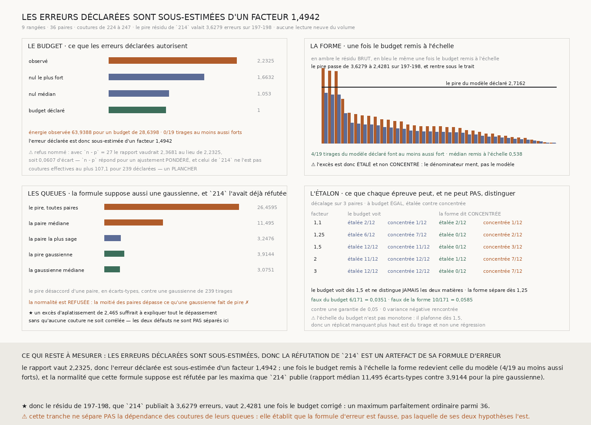

# `216` — Les erreurs déclarées rendent-elles compte des résidus ? Non, et la réfutation de `214` tombe avec elles

*Un résidu « en erreurs » est un rapport, et toute la chaîne n'avait interrogé que le numérateur.*

## 0. Pourquoi cette tranche

`214` a réfuté le modèle additif de `212` par les résidus de son triangle sur-déterminé, et c'est
cette réfutation qui a ouvert `R4-P60`, puis conduit `215`. Elle repose sur **un** nombre :

> le pire résidu vaut **3,6279 erreurs** sur la paire `197-198`, contre un résidu médian de
> **0,8039**.

⚠⚠⚠ **« En erreurs » est un rapport, donc il a deux moitiés, et personne n'avait regardé la
seconde.** Le dénominateur est l'erreur d'échantillonnage déclarée

$$\mathrm{se}(V) \;=\; V\sqrt{\frac{2}{n-1}}$$

où $n$ est le nombre de coutures communes à la paire. Cette formule n'est pas une mesure : c'est le
résultat d'un calcul qui suppose que les $n$ différences par couture sont **indépendantes** et
**gaussiennes**. Ni l'une ni l'autre de ces deux hypothèses n'a jamais été vérifiée sur cette
matière. Si l'une des deux est fausse, l'erreur déclarée est trop petite, **tous** les résidus en
erreurs sont gonflés du même facteur, et la réfutation est un artefact.

Cette tranche met le dénominateur en procès. ⭐ Et elle le fait **sans aucune lecture neuve du
volume**, parce que l'ajustement porte sa propre prédiction.

## 1. ⚠⚠⚠ La statistique est déclarée avant d'être calculée

Le module de cette tranche a été **écrit avant que ses nombres ne soient connus** : l'épreuve, le
nul et les trois issues du verdict sont posés dans son en-tête, puis la mesure a tourné. C'est la
contrainte que `215` a identifiée comme la seule qui compte, et la seule façon honnête de la tenir
est celle-là.

**Deux épreuves sont déclarées**, et la garantie se partage entre elles. ⚠ Le partage la met **sous**
le plancher du nul — dix-neuf tirages ne peuvent pas descendre au-dessous d'un vingtième — et c'est
dit plutôt que masqué : la première épreuve ne consomme **aucun** tirage, puisque son attendu est
**calculé**, donc la seconde porte la garantie entière du nul.

## 2. Le budget exact, et pourquoi ce n'est pas $n-p$

Pour une projection au moindre carré **non pondérée** $H = A A^{+}$, le résidu vaut $r = (I-H)y$,
donc

$$\mathbb{E}[r_i^{2}] \;=\; \sum_k (I-H)_{ik}^{2}\,\sigma_k^{2}
\qquad\text{et}\qquad
\mathbb{E}[\Lambda] \;=\; \sum_i \sum_k \frac{(I-H)_{ik}^{2}\,\sigma_k^{2}}{\sigma_i^{2}}$$

Aucun seuil n'entre là : la matrice est celle du treillis, les $\sigma_k$ sont les erreurs que `214`
a déclarées, et la somme se calcule.

⚠⚠ **Et ce n'est pas $n-p$.** Ce dernier est l'espérance du khi-deux d'un ajustement **pondéré** ;
celui de `214` minimise la somme des carrés bruts en voxels carrés, sans pondérer. La trace du
projecteur vaut bien **27**, c'est-à-dire exactement $n-p$, mais l'énergie standardisée attendue vaut
**28,6398**. Le refus est porté comme **refus nommé** avec son coût chiffré : employer $n-p$ aurait
rendu **2,3681** au lieu de **2,2325**, soit **0,0607** d'écart relatif.

⭐ La batterie le vérifie dans les deux sens : quand toutes les erreurs sont **égales**, l'attendu
exact **rejoint** la trace ; quand elles diffèrent, il s'en écarte. C'est ce qui montre que l'écart
vient de la pondération et de rien d'autre.

## 3. ⭐⭐⭐⭐ Première épreuve : les résidus portent plus du double du budget

| | |
|---|---:|
| énergie observée | **63,9388** |
| énergie que les erreurs déclarées autorisent | **28,6398** |
| **rapport $\Lambda$** | **2,2325** |
| tirages du modèle déclaré au moins aussi forts | **0** / **19** |
| rapport médian du nul | **1,053** |
| rapport du nul le plus fort | **1,6632** |

Le nul tire sous l'additivité avec les erreurs déclarées, **réajuste à chaque tirage**, et rend un
rapport médian de **1,053** — donc le budget calculé est bien celui que le modèle produit. Aucun de
ses dix-neuf tirages n'atteint **2,2325**.

**L'erreur déclarée est sous-estimée d'un facteur $\sqrt{\Lambda} =$ 1,4942.**

## 4. ⭐⭐⭐⭐ Seconde épreuve : l'excès est ÉTALÉ, pas CONCENTRÉ

Deux mondes rendent le même $\Lambda$, et les séparer est tout l'enjeu :

- les erreurs déclarées sont sous-estimées d'un facteur commun, et l'excès est **étalé** — tous les
  résidus gonflent ensemble et leur forme reste celle du modèle ;
- le modèle additif casse sur quelques paires, et l'excès est **concentré**.

La statistique déclarée est le **plus grand résidu standardisé après remise à l'échelle par
$\sqrt{\Lambda}$**. La remise à l'échelle force le budget total à tomber juste dans les deux mondes
et ne laisse donc que la **forme**.

| | |
|---|---:|
| le pire résidu brut, sur `197-198` | **3,6279** |
| **le même, une fois le budget remis à l'échelle** | **2,4281** |
| résidu médian remis à l'échelle | **0,538** |
| forme médiane du nul | **2,0018** |
| forme du nul la plus forte | **2,7162** |
| tirages au moins aussi forts | **4** / **19** |

⭐⭐⭐⭐ **Le pire résidu rentre sous ce que le modèle déclaré produit couramment.** Un maximum de
**2,4281** parmi trente-six, contre un nul dont la médiane est **2,0018** et le pire **2,7162**, est
un maximum parfaitement ordinaire.

⚠⚠⚠ **La remise à l'échelle serait circulaire si on ne la payait pas des deux côtés**, et c'est le
piège que cette épreuve devait éviter : trois gros résidus gonflent $\Lambda$, donc se rapetissent
eux-mêmes. Le nul subit **exactement** le même traitement — son propre $\Lambda$ est recalculé sur
chacun de ses tirages et sa forme rapetissée de la même façon — donc le biais est identique des deux
côtés. Un bris qui retire la remise à l'échelle du seul nul fait rougir la batterie.

## 5. ⭐⭐⭐⭐ Les queues, et `214` les avait déjà publiées

La formule a **deux** hypothèses, et la seconde se vérifie sans rien mesurer de neuf.

En général, la variance d'une variance échantillonnale vaut $(\kappa+2)\sigma^4/n$, où $\kappa$ est
l'excès d'aplatissement ; la formule déclarée est le cas $\kappa = 0$. Un excès d'aplatissement de
$2\Lambda - 2 =$ **2,465** suffirait donc à expliquer **tout** le dépassement, **sans qu'aucune
couture ne soit corrélée**.

⚠⚠ **Et la preuve était déjà dans le JSON de `214`, publiée et jamais lue ainsi** : chaque paire y
porte son **désaccord le plus grand** à côté de son désaccord par couture. Le rapport des deux dit
combien d'écarts-types le pire échantillon atteint.

| | en écarts-types |
|---|---:|
| la paire la plus sage | **3,2476** |
| **la paire médiane** | **11,495** |
| la paire la plus extrême | **26,4595** |
| une gaussienne de **239** tirages, médiane | **3,0751** |
| la pire de dix-neuf gaussiennes | **3,9144** |

**La moitié des paires dépasse ce qu'une gaussienne fait de pire.** Aucun seuil n'entre là : on
compare la **médiane observée** au **maximum** de la référence simulée.

⚠ La référence est tirée sur le nombre **médian** de coutures, parce que les paires n'en portent pas
toutes autant — de **224** à **247**. L'écart est trop petit pour changer le maximum d'une gaussienne,
et le prendre paire par paire aurait fait trente-six références là où une suffit.

⭐ La batterie vérifie que ce contrôle sait aussi **accepter** : sur une matière réellement
gaussienne, il ne refuse rien. Un contrôle qui refuserait tout ne protégerait de rien.

## 6. Ce que cette tranche fait à `214` et à `215`

⚠⚠⚠ **La réfutation du modèle additif par `214` est un artefact de sa formule d'erreur.** Le résidu
de `197-198`, publié à **3,6279 erreurs**, vaut **2,4281** une fois le budget corrigé. `214` n'a pas
mesuré faux : il a mesuré juste et divisé par un nombre trop petit.

Ce qui **reste vrai** de `214`, intégralement :

- le désaccord ne croît pas avec l'écartement — **-0,1024**, **16**/**19** ;
- la borne de ce négatif, que l'étalon a payée ;
- les neuf variances propres, toutes **positives**, donc le contrôle gratuit de `212` tient ;
- et sa propre prudence : le document dit déjà que les lectures de ses plus gros résidus sont **post
  hoc** et **non payées**.

Ce qui **reste vrai** de `215`, intégralement aussi, et c'est ce qui rend la tranche utile plutôt que
perdue :

- la somme par rangée des résidus est **identiquement nulle** par les équations normales, donc un
  agrégat de position ne peut pas échouer ;
- un ajustement additif **absorbe** tout ce qui agit additivement, dans les proportions que `215`
  publie membre par membre ;
- la rangée `198` n'est **pas payée** — et `216` explique pourquoi elle ne pouvait pas l'être.

⚠ Ce qui **tombe**, c'est la question de `R4-P60` : *qu'est-ce qui rompt l'additivité sans être la
distance ?* La mesure dit qu'il n'est pas établi que quoi que ce soit la rompe.

## 7. La borne : ce que chaque épreuve peut, et ne peut pas

L'étalon fabrique deux matières **de même budget** : l'une aux erreurs sous-estimées d'un facteur,
l'autre dont le modèle casse sur trois paires. ⚠⚠ L'amplitude du décalage est **dérivée** du budget
visé et non choisie — l'énergie qu'un décalage unitaire laisse après projection se calcule, et
l'amplitude en est la racine du rapport. Choisir l'amplitude à la main aurait fait une fixture
complaisante, puisque c'est elle qui décide si l'épreuve voit.

| facteur | le budget voit étalée | le budget voit concentrée | la forme dit CONCENTRÉE sur l'étalée | sur la concentrée |
|---:|---:|---:|---:|---:|
| ×1,1 | 2/12 | 1/12 | 2/12 | 1/12 |
| ×1,25 | 6/12 | 7/12 | **0/12** | **2/12** |
| ×1,5 | **12/12** | 11/12 | **0/12** | **3/12** |
| ×2 | 11/12 | **12/12** | **1/12** | **7/12** |
| ×3 | **12/12** | **12/12** | **0/12** | **7/12** |

⭐⭐ **Le budget voit les deux matières également et ne les distingue JAMAIS** — c'est sa limite, par
construction, et c'est pour cela que la seconde épreuve existe. **La forme sépare dès le facteur
1,25** et ne se trompe jamais dans l'autre sens.

- taux de faux du budget : **6/171** = **0,0351** ;
- taux de faux de la forme : **10/171** = **0,0585** ;
- contre une garantie de **0,05**, et **0** variance négative rencontrée.

⚠ L'échelle du budget n'est **pas monotone** : il plafonne dès **1,5**, donc le réplicat manquant à
**2** est du tirage et non une régression de sensibilité. C'est publié tel quel plutôt que lissé.

## 8. Ce que cette tranche ne dit pas

- ⚠⚠⚠ **Elle ne sépare PAS la dépendance des coutures de leurs queues.** Elle établit que la formule
  d'erreur est fausse, pas **laquelle** de ses deux hypothèses l'est. Les séparer demande la série
  **par couture**, que personne ne publie, donc une lecture neuve.
- Elle ne dit donc pas combien de coutures sont réellement indépendantes. Le nombre **107,1** pour
  **239** déclarées est un **plancher** et non une estimation : il ne vaut que si l'excès est étalé
  **et** que les queues n'y sont pour rien, or elles y sont manifestement pour quelque chose.
- ⚠ Elle ne dit pas que le modèle additif est **vrai**. Elle dit qu'une fois les erreurs remises à
  l'échelle, rien dans ces trente-six paires ne le réfute. Un modèle non réfuté n'est pas un modèle
  démontré, et `212` le disait déjà de son triangle à trois rangées.
- ⚠ Le nul paramétrique ne teste **que ce qu'il simule** : des tirages gaussiens indépendants autour
  du modèle additif. Il répond « cette forme est-elle celle du modèle déclaré », jamais « le modèle
  déclaré est-il le bon ».

## 9. Les sondes, et les bris

La batterie du module et celle de la figure sont enregistrées par `temoins.sh`. **Seize bris** ont été
appliqués un par un, et **les seize rougissent**, sans qu'aucun ne tue la batterie ni ne lui fasse
perdre un contrôle.

| ce qu'on casse | ce que ça ferait si personne ne le voyait |
|---|---|
| le budget attendu redevient $n-p$ | un attendu juste pour un ajustement qui ne tourne pas |
| le budget compte les équations | le rapport perdrait tout sens |
| l'erreur déclarée perd sa racine | on jugerait une formule qui n'a jamais tourné |
| le facteur sur l'erreur devient le rapport | on annoncerait un facteur au carré |
| le budget tranche par $\Lambda > 1$ | il tirerait une fois sur deux sur du code sain |
| la forme n'est pas remise à l'échelle | elle mesurerait le budget au lieu de la forme |
| le nul ne subit pas la remise à l'échelle | la circularité ne serait payée que d'un côté |
| le nul tire sans refaire l'ajustement | il rendrait des écarts au modèle, pas des résidus |
| les deux épreuves tirent chacune leur nul | on comparerait deux hasards au lieu de deux propriétés |
| l'amplitude du décalage est choisie | la fixture déciderait elle-même si l'épreuve voit |
| un mode inconnu se replie sur `declaree` | une matière jamais demandée entrerait dans l'étalon |
| les queues se comparent à la gaussienne médiane | le refus de normalité deviendrait bon marché |
| l'excès d'aplatissement devient le rapport | la seconde hypothèse serait mal chiffrée |
| le verdict nomme l'indépendance des coutures | il affirmerait ce que la mesure ne sépare pas |
| le lecteur accepte une paire sans ses coutures | on inventerait le nombre qu'on met en procès |
| les coutures effectives cessent de se dire plancher | un plancher se lirait comme une estimation |

⚠⚠ **Deux de mes propres sondes ne pouvaient pas échouer, et seuls les bris l'ont dit.**

La première vérifiait que les deux épreuves lisent le même nul **en comparant leurs nombres de
tirages** — or deux nuls tirés séparément en ont tout autant. Le nul publie désormais une
**empreinte**, les deux épreuves l'échoent, et la batterie vérifie qu'elles sont égales *et* que deux
graines différentes en donnent de différentes.

La seconde vérifiait que le nul réajuste **en regardant la médiane de ses rapports** — or un nul qui
sauterait l'ajustement rend une médiane de l'ordre de $n/(n-p)$, qui tombait dans la fenêtre que
j'avais écrite. Le nul publie maintenant l'**orthogonalité** de ses résidus au treillis, $A^{\mathsf T}r = 0$,
qui est la signature d'un ajustement et que rien d'autre ne satisfait.

⚠ Et une troisième sonde a échoué au premier lancement pour une raison bête et réelle : elle
cherchait `pondér` dans une phrase qui écrit `PONDÉRÉ` en capitales.

La mesure a été **reproduite à l'identique trois fois**, sur tous les nombres publiés.

## 10. Ce qui reste

`R4-P61` est **répondue dans sa forme la moins chère**, et par la négative : il n'est pas établi
qu'il y ait une rupture d'additivité à expliquer. `R4-P60` perd sa prémisse.

⭐ Ce qui s'ouvre à la place est plus utile et plus près du graal : **la formule d'erreur de toute la
chaîne `208`–`215` est fausse, et personne ne sait de combien.** Chaque borne que ces tranches ont
publiée en « erreurs » est à relire à la lumière d'un facteur d'au moins **1,4942** sur cette
matière-ci, et ce facteur n'a aucune raison d'être le même ailleurs. ⚠ La mesure qui le donne demande
la **série par couture** d'au moins une paire — une lecture neuve, mais la plus petite de toutes :
deux rangées voisines, une fois.
