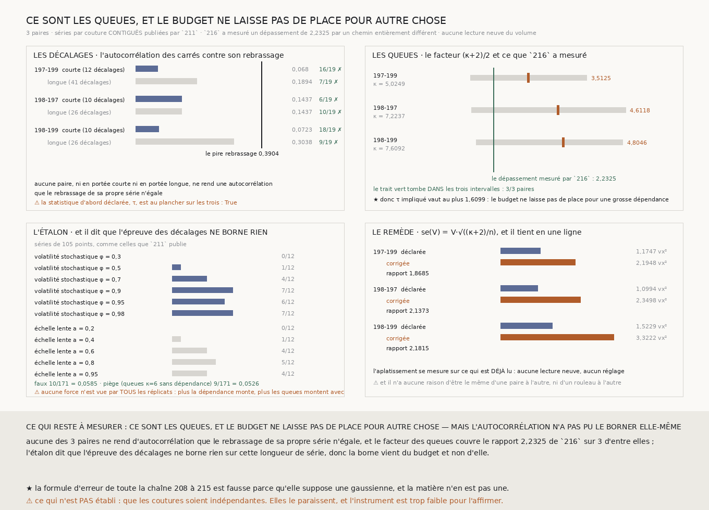

# `217` — Pourquoi l'erreur déclarée est trop petite : ce sont les QUEUES, et la série était déjà publiée

*La formule d'erreur de toute la chaîne suppose une gaussienne, et la matière n'en est pas une — `211` le montrait depuis le premier jour.*

## 0. Pourquoi cette tranche

`216` a établi que l'erreur déclarée par `212`–`214`,

$$\mathrm{se}(V) = V\sqrt{\frac{2}{n-1}}$$

sous-estime la vraie erreur d'un facteur **1,4942** sur la matière de `214`, et que la réfutation du
modèle additif était donc un artefact. Mais il n'a **pas** dit laquelle de ses deux hypothèses est
fausse, et il a écrit pourquoi : **les deux suffisent séparément**. Un excès d'aplatissement de
**2,465** expliquerait tout le dépassement sans qu'aucune couture ne soit corrélée, et une
dépendance le long de la rangée l'expliquerait sans aucune queue lourde.

⭐⭐⭐⭐ **Et la série qu'il faut est publiée depuis `211`.** Son JSON porte
`les_ecarts_de_pas_du_troncon_en_voxels` pour **trois** paires : la suite des désaccords **couture
par couture** le long d'un tronçon **contigu**. C'est exactement la matière de la question, et la
contiguïté est ce qui rend une autocorrélation lisible — un jeu de coutures éparpillées aurait
mélangé des voisines et des non-voisines sous un seul décalage. `R4-P62` ne demande donc **aucune
lecture neuve du volume**.

⚠⚠ **La série est vérifiée contre le nombre que `211` publie à côté d'elle** : son écart-type doit
valoir `lecart_type_des_pas_du_troncon_en_voxels`. Sans ce contrôle, lire une autre suite sous ce
nom serait `R4-L19` une fois de plus, et la batterie le sonde en doublant la série.

## 1. La décomposition, posée d'avance

La variance d'une variance échantillonnale n'a pas une seule cause. Pour une suite $d$ centrée, de
variance $\sigma^2$ et d'excès d'aplatissement $\kappa$ :

$$\mathrm{var}(V) = \frac{(\kappa+2)\,\sigma^4}{n}\ \text{(termes indépendants)}
\qquad
\mathrm{var}(V) = \frac{(\kappa+2)\,\sigma^4\,\tau}{n}\ \text{(en général)}$$

où $\tau = 1 + 2\sum_k \rho_k$ et $\rho_k$ est l'autocorrélation de la suite des **carrés** — car
c'est $d^2$ qu'une variance somme, et non $d$. La formule déclarée est le cas $\kappa = 0,\ \tau = 1$.

⭐⭐⭐⭐ **Le facteur de sous-estimation se décompose donc exactement en deux :**

$$\Lambda_{\text{prédit}} \;=\; \underbrace{\frac{\kappa+2}{2}}_{\text{les QUEUES}}\;\cdot\;\underbrace{\tau}_{\text{la DÉPENDANCE}}$$

⚠⚠⚠ **C'est une prédiction falsifiable, pas une description.** `216` a mesuré $\Lambda =$ **2,2325**
sur les résidus de `214` **sans jamais regarder une série par couture** ; cette tranche calcule la
même quantité par un chemin entièrement différent.

⚠⚠ **La comparaison n'est pas exacte, et c'est dit d'avance.** `216` agrège **36** paires sur toutes
leurs coutures communes ; `211` publie **3** paires sur un tronçon contigu. Un accord est une
confirmation forte ; un désaccord ne dirait pas lequel des deux a tort.

## 2. ⚠⚠⚠ La statistique d'abord déclarée est refusée, et la raison est un PLANCHER

Cette tranche avait déclaré $\tau$, sommé par la règle de la **suite initiale positive** — sommer
les paires $\rho_{2k} + \rho_{2k+1}$ tant qu'elles sont positives — qui a le mérite de ne demander
aucun réglage.

⚠⚠ **Mais cette règle est plancher à un par construction.** Quand la première paire est négative la
somme est vide et $\tau$ vaut exactement **1**. Son nul par rebrassage s'empile donc au même
plancher, et la comparaison est **dégénérée** : l'épreuve ne peut pas se déclencher, quelle que soit
la matière. C'est le péché de la vérification incapable d'échouer, dans l'autre sens.

⭐ **Le refus se démontre sans regarder la moindre série**, et c'est ce qui le rend légitime : ce
n'est pas une statistique écartée pour ce qu'elle a rendu. Elle est portée comme **refus nommé**,
avec sa valeur — et sur les trois paires elle est effectivement **au plancher**, ce qui la confirme.

La statistique déclarée devient donc ce que $\tau$ sommait : la **famille** des autocorrélations
elles-mêmes, $\max_k |\rho_k|$ sur les $K$ premiers décalages, avec le nul pris sur la **même**
famille. Le choix d'un décalage parmi $K$ est ainsi payé — le remède de `179` — et
$K = \lfloor\sqrt{n}\rfloor$ n'affecte que la **puissance**, jamais la validité, puisque les deux
côtés le subissent.

## 3. Aucune dépendance, ni courte ni longue

⚠⚠ **Le nul rebrasse la série observée, et rien d'autre.** Un rebrassage garde exactement les mêmes
valeurs — donc exactement les mêmes queues, y compris la plus extrême — et ne détruit que l'ordre.
C'est indispensable : la matière n'est pas gaussienne, c'est le point de départ, donc tout nul
paramétrique répondrait pour une loi qu'elle n'a pas.

| paire | portée | la plus forte | rebrassages au moins aussi forts |
|---|---:|---:|---:|
| `197-199` | courte, **12** décalages | **0,068** | **16** / **19** |
| `197-199` | longue, **41** décalages | **0,1894** | **7** / **19** |
| `198-197` | courte, **10** décalages | **0,1437** | **6** / **19** |
| `198-197` | longue, **26** décalages | **0,1437** | **10** / **19** |
| `198-199` | courte, **10** décalages | **0,0723** | **18** / **19** |
| `198-199` | longue, **26** décalages | **0,3038** | **9** / **19** |

⚠⚠⚠ **La portée longue est portée comme CONTRÔLE NOMMÉ et non comme verdict**, parce que la famille
déclarée ne peut pas voir une dépendance dont la portée dépasse $\lfloor\sqrt{n}\rfloor$ — et le
suspect physique est justement de **longue** portée : `208` a mesuré une dérive **partagée** le long
de la rangée, et une dérive n'a pas de raison de s'éteindre en dix coutures. Elle ne voit rien non
plus.

## 4. ⭐⭐⭐⭐ Les queues, et elles rendent compte du dépassement

| paire | $\kappa$ | facteur $(\kappa+2)/2$ | intervalle par blocs |
|---|---:|---:|---|
| `197-199` | **5,0249** | **3,5125** | [**1,3867** ; **5,6621**] |
| `198-197` | **7,2237** | **4,6118** | [**1,4355** ; **7,0958**] |
| `198-199` | **7,6092** | **4,8046** | [**1,6015** ; **6,99**] |

⭐⭐⭐⭐ **Le dépassement que `216` a mesuré, 2,2325, tombe dans les trois intervalles.** La
prédiction posée d'avance est donc confirmée : **les queues seules suffisent**.

⚠⚠ **L'incertitude n'est pas décorative.** Un aplatissement estimé sur une centaine de points à
queues lourdes est très bruité et une seule valeur extrême le déplace beaucoup ; les intervalles
sont larges, et c'est le message autant que le point. ⚠ Le point estimé dépasse d'ailleurs **2,2325**
sur les trois paires, ce qui veut dire que ces trois paires — les plus serrées du treillis — ont des
queues plus lourdes que la moyenne des trente-six.

⭐ Le bootstrap est fait **par blocs** et aussi **ordinaire** : le second détruit la dépendance, le
premier la garde. Leur accord est le contrôle gratuit de l'épreuve précédente, et ils s'accordent.

## 5. ⚠⚠⚠ L'étalon dit que l'épreuve des décalages NE BORNE RIEN

Un négatif sans étalon est un silence — la règle de ce dépôt depuis `214`. L'étalon a donc été
construit, et **il refuse de donner une borne**.

| dépendance injectée | vue |
|---|---:|
| volatilité stochastique φ = **0,3** | **0/12** |
| volatilité stochastique φ = **0,5** | **1/12** |
| volatilité stochastique φ = **0,7** | **4/12** |
| volatilité stochastique φ = **0,9** | **7/12** |
| volatilité stochastique φ = **0,95** | **6/12** |
| volatilité stochastique φ = **0,98** | **7/12** |
| échelle lente a = **0,2** | **0/12** |
| échelle lente a = **0,4** | **1/12** |
| échelle lente a = **0,6** | **4/12** |
| échelle lente a = **0,8** | **5/12** |
| échelle lente a = **0,95** | **4/12** |

**Aucune force n'est vue par tous les réplicats**, et la suite n'est pas monotone. ⭐⭐⭐⭐ **La raison
est structurelle et c'est un résultat, pas un défaut** : plus la dépendance injectée monte, plus les
queues montent avec elle, et **les queues détruisent la puissance à détecter une dépendance**. Le nul
rebrasse la série observée, donc il hérite de ses valeurs extrêmes, et une seule paire de valeurs
extrêmes à n'importe quel décalage rend $|\rho|$ grand par hasard.

La seconde échelle existe pour séparer ces deux effets : une échelle lente corrèle les carrés **sans**
faire exploser les queues. Elle ne borne pas davantage.

- taux de faux : **10/171** = **0,0585** ;
- ⚠⚠ **le piège**, qui est le contrôle qui compte ici : une série à queues lourdes ($\kappa = $ **6**)
  **sans aucune dépendance** ne doit pas faire tirer la règle. Mesuré : **9/171** = **0,0526**. La
  règle résiste au piège, donc son silence n'est pas celui d'une règle qui tire sur tout.

## 6. ⭐⭐⭐⭐ La borne existe, mais elle vient du BUDGET

La décomposition posée au §1 s'inverse : $\tau = \Lambda / [(\kappa+2)/2]$. `216` a mesuré $\Lambda$,
cette tranche mesure le facteur des queues, donc le quotient **est** $\tau$, avec son intervalle.
⚠ C'est une inversion des deux épreuves déclarées et non une troisième.

| paire | $\tau$ impliqué | au plus |
|---|---:|---:|
| `197-199` | **0,6356** | **1,6099** |
| `198-197` | **0,4841** | **1,5552** |
| `198-199` | **0,4647** | **1,394** |

⚠⚠ **Un $\tau$ inférieur à un n'a pas de sens physique** — une dépendance ne peut que gonfler
l'erreur — donc il dit que l'aplatissement mesuré sur ces tronçons **surestime** celui des
trente-six paires de `214`. C'est exactement ce qu'on attend d'un aplatissement estimé sur une
centaine de points à queues lourdes. **Le borner par le haut reste valide** : il n'y a pas de place
pour une dépendance au-delà d'un facteur **1,6099** en plus des queues, et c'est la borne que
l'épreuve des décalages n'a pas su donner.

## 7. Le remède, et il tient en une ligne

$$\mathrm{se}(V) \;=\; V\sqrt{\frac{\kappa+2}{n}}$$

La formule déclarée est le cas $\kappa = 0$. La remplacer par la forme générale ne demande que
l'aplatissement de la série, qui se mesure sur ce qui est **déjà lu**. Aucune lecture neuve, aucun
réglage.

| paire | erreur déclarée | erreur corrigée | rapport |
|---|---:|---:|---:|
| `197-199` | **1,1747** vx² | **2,1948** vx² | **1,8685** |
| `198-197` | **1,0994** vx² | **2,3498** vx² | **2,1373** |
| `198-199` | **1,5229** vx² | **3,3222** vx² | **2,1815** |

⭐ La batterie vérifie que le remède est bien une **généralisation** : à $\kappa = 0$ il rejoint la
formule déclarée, et à $\kappa = 6$ il vaut exactement le double, comme $\sqrt{(6+2)/2}$ le prédit.

⚠ Et il n'a **aucune raison** d'être le même d'une paire à l'autre, ni d'un rouleau à l'autre :
c'est une propriété de la matière lue, pas une constante.

## 8. Ce que cette tranche ne dit pas

- ⚠⚠⚠ **Elle n'établit PAS que les coutures sont indépendantes.** Elles le paraissent — aucune
  autocorrélation, ni courte ni longue, ne dépasse son rebrassage — mais l'étalon dit que
  l'instrument est trop faible pour l'affirmer. Ce qui est établi est plus étroit : **il n'y a pas
  de place**, dans le budget, pour une dépendance au-delà de **1,6099**.
- ⚠ Elle mesure trois paires, toutes **voisines** sur le treillis (197, 198, 199). Rien ne dit que
  l'aplatissement est le même pour des rangées écartées, et `214` publie des maxima par paire qui
  varient d'un facteur huit.
- ⚠ Elle ne dit pas **d'où** viennent les queues. Un désaccord par couture à vingt-six écarts-types
  est un événement physique, pas une fluctuation, et le nommer demanderait de regarder où il se
  produit — ce que la série seule ne permet pas.
- ⚠ Le tronçon n'est pas l'ensemble des coutures communes : **105** contiguës sur **242** pour
  `198-197`, réparties en **7** tronçons. L'aplatissement d'un tronçon peut différer de celui de
  l'ensemble.

## 9. Les sondes, et les bris

**Seize bris** ont été appliqués un par un au code, et **les seize rougissent**, sans qu'aucun ne
tue la batterie.

| ce qu'on casse | ce que ça ferait si personne ne le voyait |
|---|---|
| l'autocorrélation divise par $n-k$ au lieu de $n$ | la suite cesserait d'être semi-définie positive |
| la famille prend le premier décalage au lieu du plus fort | le choix parmi $K$ cesserait d'être payé |
| le nul ne prend pas le maximum sur la famille | le nul serait trop étroit, donc l'épreuve tirerait |
| la famille regarde la série et non les carrés | elle répondrait à une autre question |
| le nombre de décalages devient $n/2$ | chaque autocorrélation reposerait sur trop peu de couples |
| le facteur des queues oublie le $+2$ | une gaussienne rendrait zéro au lieu de un |
| le facteur des queues ne divise pas par deux | le facteur serait le double partout |
| l'erreur corrigée garde le deux du cas gaussien | le remède cesserait d'être un remède |
| le $\tau$ impliqué n'inverse pas son intervalle | la borne haute deviendrait la basse |
| le refus de $\tau$ ne se déclare plus au plancher | la raison du refus disparaîtrait |
| le lecteur ne vérifie plus la série contre son écart-type | on lirait une autre suite sous ce nom |
| le mode `queues` gagne une dépendance | le piège cesserait d'être un piège |
| un mode inconnu se replie sur `gaussienne` | une matière jamais demandée entrerait dans l'étalon |
| la famille longue ne regarde pas plus loin | la limite de portée resterait invisible |
| l'étalon ne publie qu'une seule échelle | on ne saurait pas que la saturation vient des queues |
| le verdict cache que l'épreuve n'a rien borné | un silence se lirait comme une réponse |

⚠⚠ **Trois de mes propres sondes ne pouvaient pas échouer, et seuls les bris l'ont dit.**

La première épinglait l'autocorrélation d'une suite alternée à « environ un » — or l'estimateur
divise par $n$ et non par $n-k$, donc il rend exactement $(n-k)/n$. La sonde exige maintenant cette
valeur, qui est **dérivée**, et un estimateur non biaisé la fait rougir.

La deuxième vérifiait que le verdict dit si l'épreuve a borné quelque chose — en vérifiant seulement
que le champ **existe**. Un bris qui l'affirme à *vrai* passait. Elle le compare désormais à ce que
l'étalon a rendu.

⚠⚠⚠ La troisième est la plus instructive, et elle a demandé **trois tentatives**. Il fallait une
matière où la règle TIRE, sinon rien ne prouve qu'elle le peut. La première plantait la dépendance
**hors de la portée** de la famille — elle mesurait l'aveuglement de la règle, pas sa sensibilité.
La deuxième la plantait si fort que le contraste fabriquait lui-même des queues, lesquelles gonflent
le nul autant que l'observé. Il a fallu un contraste **modéré** (quatre pour un sur les carrés) et
une série **longue**, et c'est la seule fenêtre où la sonde passe sur du code juste. **Cette
difficulté EST le résultat du §5**, rencontrée une seconde fois du côté des sondes.

La mesure a été **reproduite à l'identique trois fois**.

## 10. Ce qui reste

`R4-P62` est **répondue** : c'est la **normalité** qui est fausse, pas l'indépendance — et il n'y a
pas de place pour une dépendance importante en plus. Le remède est écrit et ne coûte rien.

⭐ Ce qui s'ouvre est la relecture : **chaque borne publiée « en erreurs » par `208`–`215` se relit
avec un facteur qui vaut ici de 1,87 à 2,18**, et qui n'a aucune raison d'être le même ailleurs.
⚠ Et une question neuve, qui n'existait pas avant cette mesure : **d'où vient un désaccord de
couture à vingt-six écarts-types ?** C'est **26,4595** que `216` publie pour la pire paire, contre
**3,9144** pour la pire gaussienne, et la paire médiane est déjà à **11,495**. Un tel événement n'est pas une fluctuation.
Ce sont probablement des **sauts** — un recalage qui manque une couture — et s'ils le sont, ils ne
sont pas du bruit du tout : **ils sont le phénomène que le graal doit corriger**, et les compter
comme du bruit est exactement ce qui rend la borne de `214` trop optimiste.
