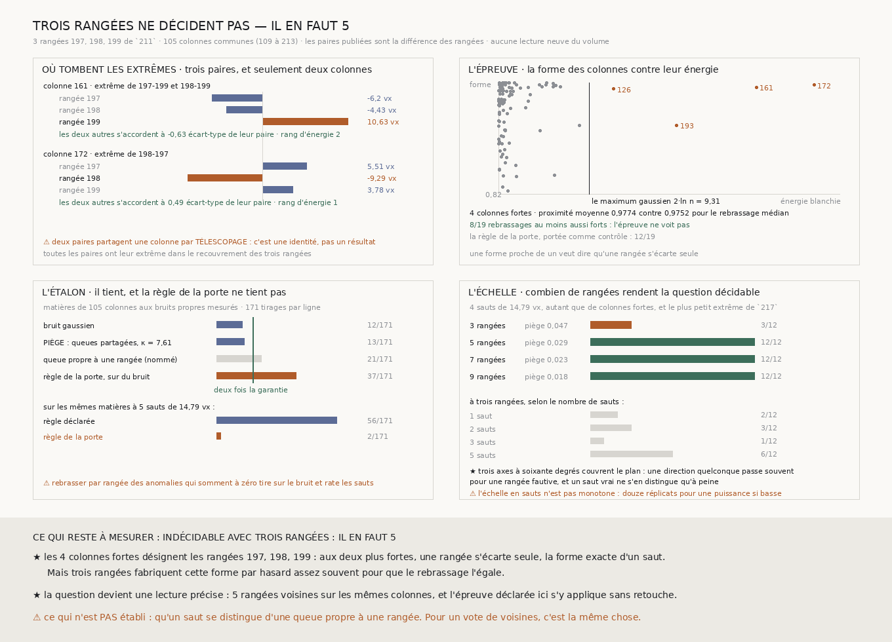

# `218` — L'écart extrême est-il porté par une rangée ? Trois rangées ne décident pas, et il en faut cinq

*Aux deux colonnes où tombent les extrêmes de `217`, une rangée s'écarte seule pendant que les deux autres s'accordent : la forme exacte d'un saut. Mais trois rangées fabriquent cette forme par hasard, et l'étalon dit combien il en faut pour trancher.*

## 0. Pourquoi cette tranche

`217` a mesuré que le pire écart **par couture** vaut **5,2539** écarts-types là où le pire de
dix-neuf échantillons gaussiens n'atteint que **3,4904**, et `R4-P63` demande d'où il vient.
L'hypothèse à mettre en procès est un **saut** : un recalage qui manque une couture dans **une**
rangée, c'est-à-dire exactement le transfert que le graal doit corriger sans humain. Si c'est le cas,
les rangées voisines le désignent — deux s'accordent, une s'écarte — et **un vote de voisines
remplace l'humain à cet endroit**.

⭐⭐⭐⭐ **Aucune lecture neuve du volume.** `211` publie, pour chacune de ses trois rangées, la colonne
de chaque couture et le cumul de ses pas : la différence de deux positions consécutives **est** le
pas de la couture. Les trois rangées se recouvrent sur **105** colonnes, de **109** à **213**, que
l'intersection des trois marches rend — elles ne sont pas tapées.

⚠ Le champ que `217` et la porte citaient, `les_colonnes_du_troncon`, **n'est pas publié** : `211` le
calcule puis le retire de son JSON. Ce qui est publié est `le_plus_long_troncon` de chaque paire —
première colonne, dernière, compte — et `les_colonnes` de chaque marche séparée. La matière est là,
sous d'autres noms.

⚠⚠ **Le télescopage sert à ce à quoi il peut servir, et à rien d'autre.** Les trois séries de paires
que `211` publie doivent être **exactement** la différence des pas de rangées aux mêmes colonnes. Elles
le sont — le plus grand écart est au dernier bit du flottant —, et une paire qui ne le serait pas est
refusée par son nom. C'est une identité arithmétique, donc elle **vérifie la lecture** ; elle ne
conclut rien.

## 1. ⚠⚠⚠ La porte se trompait deux fois, et c'est écrit avant de mesurer

**D'abord, « du bruit indépendant répartit l'anomalie » est faux dès que le bruit a des queues.** Une
queue lourde propre à une rangée tombe, elle aussi, sur une seule rangée à la fois : elle est
concentrée exactement comme un saut. Ce que la forme d'une colonne peut séparer n'est donc **pas** un
saut d'une queue, mais un écart porté par **une** rangée d'un écart porté par **toutes** — une colonne
difficile pour la matière entière, où chaque rangée se trompe à sa façon.

⭐ C'est aussi la seule distinction qui compte pour le graal : **un vote de voisines corrige la première
et ne peut rien contre la seconde.**

**Ensuite, le nul qu'elle prescrivait ne tient pas.** Rebrasser les colonnes indépendamment par rangée
suppose trois séries libres. Or les anomalies de trois rangées **somment à zéro** à chaque colonne,
parce que la part partagée n'est connue que par leur moyenne. Les rebrasser séparément fabrique des
triplets d'une autre loi, même quand rien n'est localisé. La règle est portée comme **contrôle nommé**
et mesurée sur l'étalon (§5) : elle tire **37/171** = **0,2164** sur du bruit pur, et ne voit que
**2/171** des matières où la règle déclarée en voit **56/171**.

## 2. L'épreuve, déclarée

À chaque colonne commune $c$, les pas $p_r(c)$ des trois rangées sont centrés par rangée, puis par
colonne :

$$a_r(c) \;=\; p_r(c) - \frac{1}{3}\sum_{q} p_q(c)$$

La part partagée — la géométrie que les trois lisent — s'annule **exactement**, et il reste un vecteur
dans le plan des sommes nulles. Les bruits propres se tirent des seules différences, où la part
partagée n'entre pas :

$$\mathrm{var}(p_i - p_j) \;=\; \sigma_i^2 + \sigma_j^2$$

| rangée | `197` | `198` | `199` |
|---|---:|---:|---:|
| bruit propre | **2,1405** vx | **1,8293** vx | **2,7633** vx |

⚠⚠ **Le vecteur est blanchi par la covariance que ces bruits lui donnent**, $z = C^{-1/2}U^{\top}a$
avec $C = U^{\top}\mathrm{diag}(\sigma^2)\,U$ et $U$ une base du plan. Sans ce blanchiment, la rangée
`199`, plus bruitée que les autres, étirerait le nuage vers son propre axe, et le bruit gaussien
passerait pour des écarts localisés sur elle.

⭐⭐⭐⭐ **Un écart porté par une rangée a une direction précise** : l'image $w_r$ de l'axe de cette
rangée, blanchie comme l'anomalie. La **proximité** d'une colonne est

$$g(c) \;=\; \max_r \big|\langle \hat z(c),\, w_r\rangle\big|$$

et une colonne est **forte** quand son énergie blanchie dépasse ce que le maximum de $n$ tirages
gaussiens atteint : le quantile $1-1/n$ d'un khi-deux à deux degrés, soit $2\ln n$ = **9,3079** pour
**105** colonnes. Le seuil est **dérivé**, jamais choisi.

⭐⭐⭐⭐ **La statistique** est la proximité moyenne des colonnes fortes. **Le nul** rebrasse les
proximités entre les colonnes et rien d'autre : il garde l'énergie de chaque colonne et la loi des
directions, et ne détruit que le lien entre la **taille** d'un écart et sa **forme**. C'est
exactement l'hypothèse nulle — une direction indépendante de la taille —, que le bruit gaussien et la
colonne difficile satisfont tous deux.

## 3. Ce que la matière rend

**4** colonnes sont fortes, l'énergie la plus forte vaut **32,4671**.

| colonne | énergie | proximité | rangée désignée |
|---:|---:|---:|---:|
| 126 | **11,8666** | **0,9899** | `197` |
| 161 | **26,5235** | **0,9925** | `199` |
| 172 | **32,4671** | **0,9962** | `198` |
| 193 | **18,3201** | **0,9312** | `199` |

La proximité moyenne vaut **0,9774** contre **0,9752** pour le rebrassage médian et **0,992** pour le
plus fort : **8** rebrassages sur **19** font au moins aussi bien. **L'épreuve ne voit pas.** La règle
de la porte, calculée à côté, rend **12**/**19**.

## 4. Où tombent les extrêmes de `217`

⚠⚠⚠ **Les trois paires n'ont que deux colonnes**, et c'est le télescopage : l'extrême de `197-199` et
celui de `198-199` sont à la même colonne parce qu'un seul écart de `199` entre dans les deux. C'est
une identité, pas une observation.

| colonne | extrême de | `197` | `198` | `199` | les deux autres |
|---:|---|---:|---:|---:|---:|
| 161 | `197-199`, `198-199` | -6,2014 | -4,4323 | **10,6337** | **-0,6283** σ |
| 172 | `198-197` | 5,5069 | **-9,2865** | 3,7796 | **0,4942** σ |

(anomalies en voxels ; « les deux autres » est leur désaccord à cette colonne, en écarts-types de
**leur propre** paire sur les colonnes communes.)

⭐⭐⭐ **À chacune, une rangée s'écarte seule** — `199` à la colonne **161**, `198` à la colonne
**172** — pendant que les deux autres s'accordent à moins d'un écart-type de leur désaccord ordinaire.
C'est la forme exacte d'un saut, et ce sont les deux colonnes les plus énergiques du recouvrement.

⭐ **Et la forme exclut une explication sans rien prouver.** Si la géométrie partagée variait d'une
rangée à l'autre, sa courbure fuirait dans les anomalies et accuserait **toujours** la rangée du
milieu, `198`. Les colonnes fortes désignent `197`, `198` et `199` : aucune rangée n'est privilégiée.

⚠⚠ **Mais c'est une description, pas une preuve**, et le §5 dit pourquoi.

## 5. L'étalon, et pourquoi trois rangées ne suffisent pas

Les matières fabriquées ont **105** colonnes et les bruits propres mesurés ; les sauts ont la taille du
**plus petit** extrême de `217`, **14,7935** voxels, relu et jamais retapé ; le piège a le **plus
grand** aplatissement de `217`, **7,6092**.

| matière | tirs | taux |
|---|---:|---:|
| bruit gaussien | **12/171** | **0,0702** |
| **piège** : queues partagées par la colonne | **13/171** | **0,076** |
| queue propre à une rangée (contrôle nommé) | **21/171** | **0,1228** |
| règle de la porte, sur du bruit | **37/171** | **0,2164** |

L'étalon **tient** : sur le bruit comme sur le piège, le taux reste sous deux fois la garantie. ⚠ La
queue propre tire davantage, et c'est attendu : elle **est** localisée. La règle de la porte ne tient
pas, et sur les mêmes matières à cinq sauts elle rend **2/171** = **0,0117** là où la règle déclarée
rend **56/171** = **0,3275** — **elle tire sur le bruit et rate les sauts**.

⭐⭐⭐⭐ **L'échelle qui conclut est celle du nombre de rangées**, tirée à **4** sauts — autant que de
colonnes fortes — de **14,7935** voxels :

| rangées | vus | piège |
|---:|---:|---:|
| 3 | **3/12** | 0,0468 |
| 5 | **12/12** | 0,0292 |
| 7 | **12/12** | 0,0234 |
| 9 | **12/12** | 0,0175 |

**Trois rangées ne voient pas ce que la matière pourrait porter ; cinq le voient à chaque fois**, et
le piège est repassé à chaque nombre de rangées, parce qu'une puissance sans taux de faux ne dit rien.

⭐⭐ **La raison est géométrique.** Avec trois rangées, les trois axes sont des droites à soixante
degrés dans un plan, donc toute direction est à moins de trente degrés de l'une d'elles. Pour du
bruit isotrope, l'angle $\delta$ à l'axe le plus proche est uniforme :

$$P(\delta \le \delta_0) \;=\; \frac{\delta_0}{30^\circ}$$

Un saut vrai, noyé dans son bruit, s'écarte de son axe d'environ $\arctan(\sigma/J)$ — assez pour que
le hasard fasse aussi bien une fois sur quelques-unes. Avec $k$ rangées l'espace a $k-1$ dimensions,
$k$ axes n'en couvrent plus qu'une fraction qui s'effondre, et un saut ressort.

⚠ À trois rangées, l'échelle en nombre de sauts n'est pas monotone — **2/12**, **3/12**, **1/12**,
**6/12** pour un, deux, trois et cinq sauts. Douze réplicats pour une puissance de cet ordre rendent
cette dispersion ; l'échelle en rangées, elle, est monotone.

## 6. Le verdict

**INDÉCIDABLE AVEC TROIS RANGÉES : IL EN FAUT 5.**

Les écarts extrêmes de `217` viennent de deux colonnes, **161** et **172**, et à chacune une rangée
s'écarte seule. Trois rangées ne peuvent pas dire si c'est un saut ou le hasard ; cinq le diraient.

## 7. Ce que cette tranche ne dit pas

- ⚠⚠⚠ **Elle ne distingue pas un saut d'une queue propre à une rangée**, et aucune forme de colonne ne
  le peut : les deux sont portés par une seule rangée. Pour un vote de voisines, c'est la même chose.
- ⚠⚠ **L'échelle en rangées suppose les bruits propres mesurés, répétés** : `197`, `198`, `199`,
  `197`, `198`… Deux rangées nouvelles auront leurs propres bruits, et le nombre de cinq vaut pour une
  matière de ce genre, pas pour toute matière.
- ⚠ Elle suppose les colonnes échangeables — le rebrassage l'exige —, ce que `217` rend plausible
  (aucune autocorrélation ne dépasse le rebrassage) sans pouvoir l'affirmer.
- ⚠ Les **105** colonnes communes sont celles du tronçon de `198`, le plus court des trois. Les deux
  autres rangées ont davantage de coutures qu'aucune épreuve à trois ne peut utiliser.

## 8. Les sondes, et les bris

**Vingt-quatre bris** ont été appliqués un par un au code, et **les vingt-quatre rougissent**, sans
qu'aucun ne tue la batterie.

| ce qu'on casse | ce que ça ferait si personne ne le voyait |
|---|---|
| le télescopage ne vérifie plus la lecture | on lirait d'autres séries sous ces noms |
| le cumul n'exige plus une position de plus | un cumul tronqué décalerait toutes les coutures |
| le pas est lu comme la position du cumul | on mesurerait la marche au lieu de ses pas |
| les colonnes communes deviennent l'union | une rangée absente entrerait dans chaque colonne |
| une variance propre négative est écrêtée | une matière hors du modèle passerait |
| le centrage par colonne est oublié | la géométrie partagée dominerait tout |
| le blanchiment est oublié | la rangée la plus bruitée passerait pour fautive |
| les axes ne sont pas blanchis | un saut pur cesserait de pointer sur sa rangée |
| le seuil prend un degré de trop | les colonnes fortes ne seraient plus les écarts inexpliqués |
| le nul ne rebrasse plus rien | l'épreuve comparerait à un nombre fixe |
| la règle de la porte rebrasse les colonnes ensemble | le contrôle nommé deviendrait l'identité |
| l'extrême est pris par le signe | les extrêmes négatifs disparaîtraient |
| un extrême hors du recouvrement est décomposé | une rangée absente serait lue |
| l'accord des deux autres n'est pas rapporté à leur paire | il dépendrait des unités |
| le piège tire son échelle par rangée | le piège cesserait d'être un piège |
| le saut touche toute la colonne | il deviendrait une colonne difficile |
| un nombre de rangées qui tire sur le piège compte | l'échelle désignerait n'importe quelle queue |
| l'étalon est valide sans le piège | un étalon qui prend des queues pour des sauts passerait |
| la puissance est lue à neuf rangées | le verdict dirait « partagé » là où rien n'a vu |
| un étalon invalide ne retient plus le verdict | un instrument faux conclurait |
| l'étalon injecte le plus grand extrême | la puissance serait celle d'écarts plus grands que réels |
| l'échelle en rangées est tirée à un saut | elle ne répondrait pas pour cette matière |
| la mesure injecte l'aplatissement à la place de l'extrême | les sauts auraient une taille absurde |
| le lecteur de `217` prend le plus petit aplatissement | le piège serait le plus doux au lieu du plus dur |

⚠⚠ **Quatre de mes propres sondes ne pouvaient pas échouer, et seuls les bris l'ont dit.**

La première vérifiait que les axes sont blanchis avec des bruits propres `1`, `1`, `9`. Avec deux
bruits égaux, l'axe de la troisième rangée est un axe propre de la covariance, et le blanchiment le
laisse en place : la sonde passait sur du code qui ne blanchissait pas les axes. Elle prend désormais
trois bruits tous différents.

La deuxième voulait prouver qu'un extrême négatif est trouvé — et construisait un extrême
**positif**. Corrigée.

⚠⚠⚠ La troisième est le piège de la porte, rencontré une seconde fois du côté des sondes. Pour
vérifier que la colonne difficile partage son échelle, elle corrélait les carrés de deux différences
« disjointes » — or avec trois rangées **aucune paire n'est disjointe d'une autre**, elles partagent
toujours une rangée. La différence entre les deux modes se lit désormais sur la **forme** des
colonnes fortes.

La quatrième exigeait un écart fixe de **0,015** entre les deux modes et échouait à **0,0145** : elle
disait le seuil, pas la matière. La marge est devenue quatre erreurs-types de l'estimation elle-même.

⚠ Et la figure avait tracé le face-à-face des deux règles sur une échelle de zéro à un pendant que les
taux au-dessus étaient sur zéro à quatre dixièmes : la règle déclarée paraissait plus faible que la
porte sur du bruit, alors qu'elle tire davantage. Une seule échelle, et une sonde qui l'épingle.

La mesure a été **reproduite à l'identique trois fois**, et la figure aussi, octet pour octet.

## 9. Ce qui reste

`R4-P63` est **conclue** : les extrêmes viennent de deux colonnes, chacune portée en apparence par une
seule rangée, et **trois rangées ne peuvent pas trancher**. La porte prescrivait une méthode qui ne
tient pas, et c'est mesuré.

⭐⭐⭐⭐ **Ce qui s'ouvre est une lecture précise, et c'est la plus petite qui décide** : **5** rangées
voisines sur les mêmes colonnes — `211` en a lu trois, il en manque deux, `196` et `200` —, et
l'épreuve déclarée ici s'y applique **sans retouche**, statistique, seuil, nul et étalon compris. Si
elle voit, les écarts extrêmes sont des événements d'**une** rangée, qu'un vote de voisines désigne et
corrige : c'est exactement ce qui remplace l'humain qui corrige le transfert. Si elle ne voit pas, ils
sont portés par la colonne, et le vote n'y peut rien.
