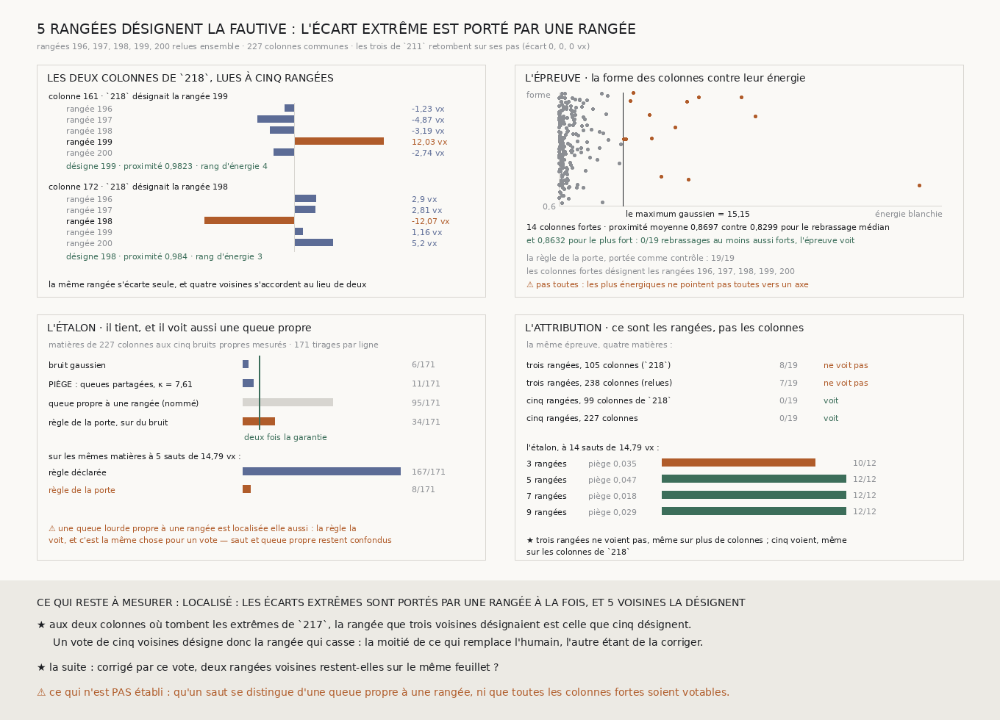

# `219` — Cinq rangées désignent-elles la fautive ? Oui, et ce sont les rangées qui ont fait la différence

*Là où trois voisines ne pouvaient pas dire si une rangée s'écartait seule par hasard, cinq le disent : les écarts de couture extrêmes sont portés par une rangée à la fois, et c'est la même rangée que trois voisines désignaient déjà.*

## 0. Pourquoi cette tranche

`218` a trouvé qu'aux deux colonnes où tombent les extrêmes de `217`, **161** et **172**, une rangée
s'écarte seule pendant que les deux autres s'accordent — la forme exacte d'un saut —, mais que trois
rangées fabriquent cette forme par hasard : son épreuve ne voyait pas, et son étalon disait que cinq
rangées trancheraient. `R4-P64` demande donc la plus petite lecture neuve qui décide.

⚠⚠⚠ **L'épreuve n'est pas réécrite : elle est importée de `218`**, statistique, seuil, nul et étalon
compris. Le fichier ne pose que ce qui change, et il a été écrit avant que la moindre rangée nouvelle
ne soit lue.

## 1. Ce qui est dérivé, jamais choisi

- **Le nombre de rangées** est celui que l'étalon de `218` rend — **5** —, relu dans son JSON.
- **Les rangées** sont la médiane du treillis de `211`, **198**, relue elle aussi, et ses voisines de
  part et d'autre : `196` à `200`.
- **Les colonnes** sont celles où les cinq rangées ont toutes lu un pas : **227**, de **18** à
  **270**. ⚠ Elles ne sont plus limitées au plus long tronçon de chaque rangée, parce que `218` ne
  disposait que de ce que `211` avait publié ; l'épreuve n'exige aucune contiguïté puisque son nul
  rebrasse les colonnes.

## 2. ⚠⚠⚠ Cinq rangées lues aujourd'hui, trois lues hier : la relecture

Mélanger des pas publiés hier à des pas lus aujourd'hui supposerait que rien n'a changé entre-temps,
ni le code, ni le dépôt. **Les cinq rangées sont donc lues ensemble, par le lecteur de `211` avec ses
paramètres, et les trois qu'il avait déjà lues sont RELUES.** Sur les colonnes que `211` publie, les
pas relus devaient retomber sur les siens à l'arrondi près du cumul — deux dix-millièmes.

Ils retombent **exactement** : l'écart le plus grand vaut **0** sur `197`, `198` et `199`. Le lecteur
est stable, et les cinq rangées sont comparables. Aucun chunk n'a été perdu par le réseau ; chaque
rangée en a lu de **251** à **255** sur **285**, les autres étant absents du dépôt ou trop peu
texturés.

| rangée | `196` | `197` | `198` | `199` | `200` |
|---|---:|---:|---:|---:|---:|
| bruit propre | **2,5057** vx | **2,3326** vx | **1,9866** vx | **2,42** vx | **2,4842** vx |

⚠ Ils diffèrent de ceux de `218` (**2,1405**, **1,8293**, **2,7633**) parce qu'ils sont tirés de
cinq rangées et de deux fois plus de colonnes ; c'est ce qui est attendu d'une estimation, pas une
contradiction.

## 3. L'épreuve voit

Le seuil est le maximum de **227** tirages gaussiens pour un khi-deux à **quatre** degrés,
**15,1473**. **14** colonnes le dépassent, la plus énergique à **85,2674**.

| colonne | énergie | proximité | rangée désignée |
|---:|---:|---:|---:|
| 32 | **85,2674** | **0,6689** | `197` |
| 19 | **46,4834** | **0,9151** | `199` |
| 172 | **43,1374** | **0,984** | `198` |
| 161 | **33,0426** | **0,9823** | `199` |
| 267 | **30,765** | **0,6896** | `198` |
| 131 | **30,2468** | **0,9681** | `200` |
| 21 | **27,5351** | **0,8757** | `200` |
| 59 | **24,2733** | **0,7003** | `197` |
| 103 | **21,9011** | **0,8369** | `196` |
| 193 | **21,4874** | **0,9197** | `199` |
| 168 | **17,7212** | **0,9974** | `196` |
| 151 | **16,9566** | **0,9707** | `200` |
| 28 | **15,9253** | **0,8343** | `200` |
| 102 | **15,4564** | **0,8328** | `198` |

La proximité moyenne des colonnes fortes vaut **0,8697**, contre **0,8299** pour le rebrassage médian
et **0,8632** pour le plus fort : **0** rebrassage sur **19** n'y arrive. ⭐⭐⭐⭐ **L'épreuve voit : les
écarts extrêmes sont portés par une rangée à la fois.**

⭐ Les colonnes fortes désignent **les cinq** rangées, `196` à `200` : aucune n'est privilégiée, et les
deux rangées du bord n'en portent pas plus que leur part.

⚠⚠ **Pas toutes, et c'est dit.** La colonne la plus énergique, **32**, a une proximité de **0,6689** :
son énergie n'est pas portée par une seule rangée. **267** et **59** non plus. Ce sont des colonnes où
plusieurs rangées se trompent à la fois, et un vote n'y peut rien.

## 4. Aux deux colonnes de `218`, la même rangée

| colonne | `196` | `197` | `198` | `199` | `200` | désignée | `218` |
|---:|---:|---:|---:|---:|---:|---:|---:|
| 161 | -1,226 | -4,8738 | -3,1927 | **12,0336** | -2,7411 | `199` | `199` |
| 172 | 2,899 | 2,8137 | **-12,0677** | 1,1586 | 5,1964 | `198` | `198` |

(anomalies en voxels)

⭐⭐⭐⭐ **À chacune, la rangée que trois voisines désignaient est celle que cinq désignent**, avec une
proximité de **0,9823** et **0,984** : quatre voisines s'accordent désormais au lieu de deux. La forme
que `218` décrivait sans pouvoir la prouver tient avec deux témoins de plus.

## 5. ⚠⚠⚠ Ce sont les rangées, pas les colonnes

Cinq rangées lues sur toutes leurs colonnes diffèrent de `218` par **deux** choses à la fois : plus de
rangées, et plus de colonnes. Deux contrôles séparent les deux, et le second a été **ajouté après la
mesure**, ce qui est dit : il ne change pas le verdict, il attribue le gain.

| matière | colonnes | rebrassages au moins aussi forts | |
|---|---:|---:|---|
| trois rangées, `218` | 105 | **8/19** | ne voit pas |
| trois rangées, relues sur toutes leurs colonnes | 238 | **7/19** | ne voit pas |
| cinq rangées, sur les colonnes de `218` | 99 | **0/19** | voit |
| cinq rangées, sur toutes leurs colonnes | 227 | **0/19** | voit |

**Trois rangées ne voient pas, même sur deux fois plus de colonnes ; cinq voient, même sur les
colonnes de `218`.** Sur ces dernières la proximité moyenne vaut **0,9425** contre **0,8161** pour le
rebrassage médian ; à trois rangées sur toutes leurs colonnes, **0,9644** contre **0,9543**. C'est
exactement ce que l'étalon de `218` annonçait, et c'est pourquoi `R4-L21` fait du nombre de voisines
un paramètre de la lecture.

## 6. L'étalon

Les matières fabriquées ont **227** colonnes et les cinq bruits propres mesurés ; les sauts ont la
taille du plus petit extrême de `217`, **14,79** voxels, et le piège son plus grand aplatissement.

| matière | tirs | taux |
|---|---:|---:|
| bruit gaussien | **6/171** | **0,0351** |
| **piège** : queues partagées par la colonne | **11/171** | **0,0643** |
| queue propre à une rangée (contrôle nommé) | **95/171** | **0,5556** |
| règle de la porte, sur du bruit | **34/171** | **0,1988** |

L'étalon **tient**. Sur les mêmes matières à cinq sauts, la règle déclarée voit **167/171** =
**0,9766** et celle de la porte **8/171** = **0,0468**.

À **14** sauts — autant que de colonnes fortes —, l'échelle en rangées voit **10/12** à trois rangées
et **12/12** à cinq, sept et neuf, le piège restant à **0,0468** à cinq.

⚠⚠⚠ **La queue propre à une rangée fait tirer la règle plus d'une fois sur deux**, et c'est ce que
`218` disait d'avance : une queue lourde propre à une rangée est localisée, comme un saut. Ce que
l'épreuve établit est donc « **une rangée à la fois** », pas « un saut ». Pour un vote de voisines,
c'est la même chose.

⚠ À cinq rangées, l'échelle en nombre de sauts n'est pas monotone — **5/12**, **6/12**, **10/12**,
**9/12** pour un, deux, trois et cinq sauts —, ce que douze réplicats rendent à ces puissances.

## 7. Le verdict

**LOCALISÉ : LES ÉCARTS EXTRÊMES SONT PORTÉS PAR UNE RANGÉE À LA FOIS, ET 5 VOISINES LA DÉSIGNENT.**

⭐⭐⭐⭐ **C'est la tranche du graal qui désigne le transfert faux qui bouge.** Un vote de cinq rangées
voisines sait où une rangée casse — à la colonne où elle s'écarte seule pendant que quatre voisines
s'accordent. C'est la moitié de ce qui remplace l'humain qui corrige le transfert ; l'autre moitié est
de le corriger, et elle n'est pas mesurée ici.

## 8. Ce que cette tranche ne dit pas

- ⚠⚠⚠ **Elle ne distingue pas un saut d'une queue propre à une rangée**, et l'étalon le montre.
- ⚠⚠ **Elle ne dit pas que toutes les colonnes fortes sont votables** : trois des quatorze, dont la
  plus énergique, ne pointent vers aucun axe.
- ⚠⚠ **Elle ne corrige rien.** Savoir quelle rangée casse n'est pas la ramener sur son feuillet.
- ⚠ Elle suppose les colonnes échangeables, comme `218`.
- ⚠ Cinq rangées d'un seul segment, autour d'une seule médiane.

## 9. Les sondes, et les bris

**Dix-huit bris** ont été appliqués un par un au code, et **les dix-huit rougissent**, sans qu'aucun ne
tue la batterie.

| ce qu'on casse | ce que ça ferait si personne ne le voyait |
|---|---|
| le nombre de rangées est tapé | la lecture ne suivrait plus l'étalon de `218` |
| les rangées ne sont pas centrées sur la médiane | on lirait un autre voisinage |
| la médiane est tapée | idem, par l'autre bout |
| la relecture ne vérifie plus l'écart | deux lecteurs différents seraient comparés |
| la relecture ignore les colonnes manquantes | une rangée relue partielle passerait |
| la tolérance est relâchée | l'arrondi cesserait d'être la seule marge |
| une panne de réseau passe | des trous du fil passeraient pour la matière |
| une rangée vide passe | une rangée absente entrerait dans chaque colonne |
| les colonnes communes deviennent l'union | une rangée absente serait lue |
| la restriction aux colonnes de `218` est ignorée | le contrôle cesserait d'en être un |
| l'analyse saute la relecture | la vérification disparaîtrait en silence |
| la puissance est lue à trois rangées | le verdict lirait la mauvaise ligne de l'étalon |
| une puissance qui tire sur le piège compte | un silence deviendrait « partagé » sans raison |
| un étalon invalide ne retient plus le verdict | un instrument faux conclurait |
| le contrôle prend toutes les colonnes | il ne dirait plus rien de la matière de `218` |
| un `218` sans nombre de rangées est défauté | on lirait cinq rangées sans que rien ne le demande |
| le contrôle à trois rangées prend les cinq | l'attribution disparaîtrait |
| le rejeu ne relit pas les pas publiés | l'analyse sans réseau cesserait d'être la même |

⚠⚠ **Trois de mes sondes faisaient mourir la batterie au lieu de rougir** : elles appelaient le code
sous test hors du garde qui transforme une levée en échec, et un bris levait donc avant le verdict.
Elles passent désormais par ce garde. ⚠ Et une quatrième demandait cent cinq colonnes à une fixture
qui n'en portait que deux cents à partir de zéro : l'erreur était dans la sonde, pas dans le code.

⭐ **L'analyse se rejoue sans relire le volume** : le JSON publie les pas de chaque rangée, colonne par
colonne, et `--depuis` rejoue tout depuis eux. Le rejeu a rendu, clé pour clé, la mesure faite en
lisant le volume.

## 10. Ce qui reste

`R4-P64` est **répondue** : les écarts de couture extrêmes sont portés par une rangée à la fois, et un
vote de cinq voisines la désigne — la même que trois voisines désignaient déjà aux deux colonnes de
`218`.

⭐⭐⭐⭐ **Ce qui s'ouvre est l'autre moitié : corriger.** `211` a établi que deux rangées voisines
traversées chacune pour elle-même finissent à plus d'un demi-feuillet l'une de l'autre. La question
est maintenant de savoir si, une fois chaque colonne désignée ramenée à ce que ses quatre voisines
disent, elles restent sur le même feuillet. ⚠⚠ Le piège est écrit d'avance : remplacer une valeur par
celle de ses voisines rapproche forcément les rangées entre elles, donc la correction se juge contre
la même correction appliquée aux mêmes colonnes **à une autre rangée que celle que le vote désigne** —
c'est le seul nul qui demande si le vote a désigné la bonne.
