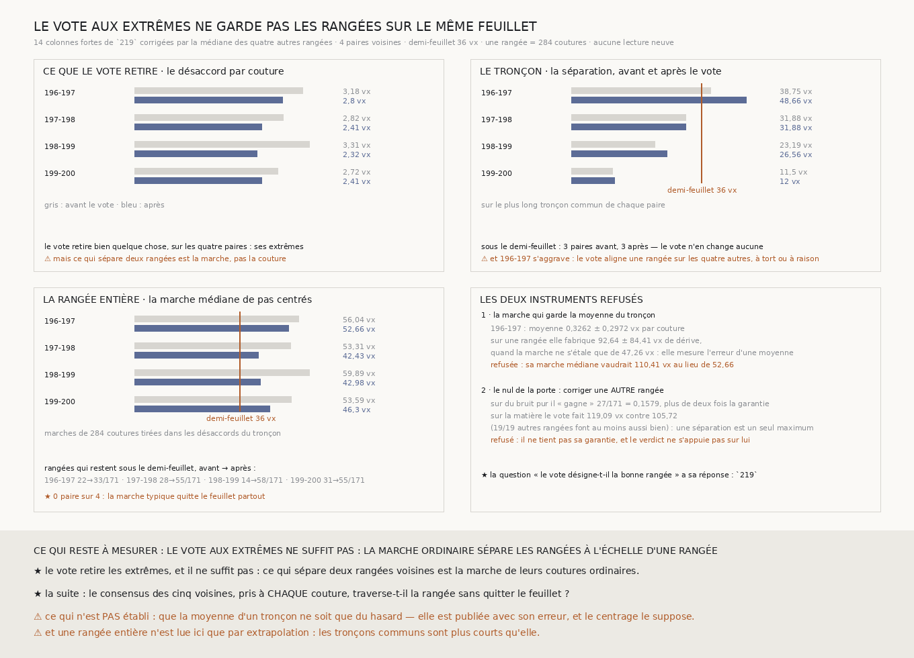

# `220` — Le vote ramène-t-il les rangées sur le même feuillet ? Non : il retire les extrêmes, et c'est la marche ordinaire qui les sépare

*Corriger les quatorze colonnes où une rangée s'écarte seule baisse le désaccord par couture sur les quatre paires voisines, et ne garde aucune d'elles sur le même feuillet à l'échelle d'une rangée.*

## 0. Pourquoi cette tranche

`219` établit que les écarts de couture extrêmes sont portés par une rangée à la fois et qu'un vote de
cinq voisines la désigne. C'est la moitié de ce qui remplace l'humain qui corrige le transfert ;
l'autre est de corriger. `R4-P65` demande si, corrigées par ce vote, deux rangées voisines restent sur
le même feuillet. **Aucune lecture neuve** : `219` publie les pas des cinq rangées colonne par colonne,
ses colonnes fortes et la rangée que le vote y désigne — relues, jamais recalculées.

## 1. La correction, déclarée

À chacune des **14** colonnes fortes de `219`, le pas de la rangée désignée est remplacé par la
**médiane** des pas des quatre autres. La médiane et non la moyenne : si une seconde rangée s'écarte
aussi, la moyenne l'emporterait avec elle. Toutes les colonnes fortes sont corrigées, y compris celles
que `219` dit mal portées par une seule rangée : c'est le vote tel qu'il est.

Pour chaque paire **voisine**, sur son plus long tronçon commun contigu, la mesure est la
**séparation**

$$\max_k |S_k|, \qquad S_k = \sum_{i \le k} \big(p_a(i) - p_b(i)\big),\ S_0 = 0$$

la quantité de `211` : deux rangées partent alignées, et c'est leur distance qui dit si elles finissent
sur le même feuillet. Le seuil est le demi-feuillet, **36** voxels, qui n'est pas choisi.

## 2. ⚠⚠⚠ Deux instruments refusés, et la raison de chacun

**Le nul que la porte prescrivait.** `R4-P65` proposait de juger le vote contre la même correction
appliquée aux mêmes colonnes à une **autre** rangée. Ce nul partage la décision qu'il juge : le vote
désigne la rangée la plus déviante. Il n'était pourtant pas démontrable d'avance qu'il gagnerait sur du
bruit, parce qu'une séparation est un maximum le long d'une marche et qu'un pas retiré peut la
rapprocher ou l'éloigner. Son taux a donc été **mesuré** : sur **171** matières gaussiennes aux cinq
bruits propres de `219`, il « gagne » **27/171** = **0,1579** — plus de deux fois la garantie. Il est
refusé, publié, et le verdict ne s'appuie pas sur lui. ⭐ La question qu'il voulait poser a sa réponse,
qui est `219`.

**La marche de la rangée déclarée d'abord.** Pour parler d'une rangée entière avec un tronçon plus
court qu'elle, la déclaration tirait avec remise les désaccords du tronçon jusqu'à la longueur d'une
rangée, **284** coutures. ⚠⚠ Ce tirage garde leur **moyenne**, et une marche de $N$ pas tirés ainsi
dérive de $N$ fois cette moyenne. Or la moyenne de $n$ désaccords n'est connue qu'à $\sigma/\sqrt{n}$
près, donc la dérive qu'elle fabrique vaut

$$\sigma \frac{N}{\sqrt{n}} \quad\text{quand la marche ne s'étale que de}\quad \sigma\sqrt{N}$$

et dès que la rangée est plus longue que le tronçon — toujours ici —, l'erreur sur la moyenne
l'emporte : la référence mesure l'échantillonnage d'une moyenne au lieu du feuillet. Sur `196-197`,
la moyenne vaut **0,3262** ± **0,2972** voxel par couture, et la marche refusée en fabrique
**92,639** ± **84,4147** voxels de dérive quand la marche elle-même ne s'étale que de **47,2557**. Sa
marche médiane vaudrait **110,4062** voxels au lieu de **52,6643**.

⚠⚠⚠ **L'ordre est dit : ce défaut a été VU sur la mesure avant d'être démontré.** Il se démontre sans
elle, ce qui rend le remplacement légitime — le précédent est le refus de τ par `217` —, et la
statistique refusée est publiée avec ses valeurs. Elle est remplacée par ce que la déclaration voulait
dire : une marche de pas **centrés**, c'est-à-dire une rangée typique de pas indépendants de même
dispersion. ⚠ Ce que le centrage suppose — que la moyenne d'un tronçon ne soit que du hasard — est
écrit à côté : sur les quatre paires elle est à moins de deux erreurs de zéro (**1,0974**,
**-0,5207**, **0,2693**, **0,4691** erreurs).

## 3. Ce que le vote retire

| paire | désaccord par couture avant | après |
|---|---:|---:|
| `196-197` | **3,178** vx | **2,8041** vx |
| `197-198` | **2,8157** vx | **2,4133** vx |
| `198-199` | **3,3139** vx | **2,3218** vx |
| `199-200` | **2,7183** vx | **2,413** vx |

Le vote retire bien quelque chose, sur les quatre paires : leurs extrêmes.

## 4. Le tronçon : il ne change pas qui reste

| paire | tronçon | corrigées | séparation avant | après |
|---|---|---:|---:|---:|
| `196-197` | 93–181 | 2 | **38,75** | **48,6562** |
| `197-198` | 109–213 | 1 | **31,875** | **31,875** |
| `198-199` | 109–213 | 3 | **23,1875** | **26,5625** |
| `199-200` | 64–143 | 1 | **11,5** | **12** |

**Trois paires sur quatre sont sous le demi-feuillet avant le vote, et les mêmes trois après.** Le
vote n'en fait passer aucune.

⚠⚠ Et `196-197` **s'aggrave**, de **38,75** à **48,6562** voxels. Ses deux corrections portent sur la
rangée `196`, aux colonnes **103** et **168**. À la **168**, elle s'écarte seule ; à la **103**, elle est
la seule des cinq à ne pas monter avec les quatre autres, et le vote l'aligne sur elles. Un vote aligne
une rangée sur la majorité, à tort ou à raison : il corrige les erreurs d'une rangée, et il importe
celles que la majorité partage.

## 5. ⭐⭐⭐⭐ La rangée entière : la marche typique quitte le feuillet partout

Marches de **284** coutures tirées dans les désaccords centrés du tronçon, **171** par paire :

| paire | marche médiane avant | après | rangées sous le demi-feuillet |
|---|---:|---:|---:|
| `196-197` | **56,0449** | **52,6643** | 22 → **33**/171 |
| `197-198` | **53,3054** | **42,4345** | 28 → **55**/171 |
| `198-199` | **59,8875** | **42,9762** | 14 → **58**/171 |
| `199-200` | **53,5852** | **46,2953** | 31 → **55**/171 |

Le vote fait gagner la rangée entière sur les quatre paires, parfois de beaucoup — `198-199` passe de
**14** à **58** rangées sur **171** qui tiennent. **Mais aucune marche typique ne reste sous le
demi-feuillet** : la meilleure est à **42,4345** voxels.

⭐⭐⭐⭐ **C'est la tranche du graal qui corrige le transfert qui bouge, et elle bouge en disant où il
faut aller.** Ce qui sépare deux rangées voisines à l'échelle d'une rangée n'est pas leurs extrêmes :
c'est la marche de leurs coutures **ordinaires**, que le vote ne touche pas. Un vote aux seules colonnes
fortes ne remplace pas l'humain ; il faudrait que le consensus des voisines porte sur **chaque**
couture.

## 6. Le verdict

**LE VOTE AUX EXTRÊMES NE SUFFIT PAS : LA MARCHE ORDINAIRE SÉPARE LES RANGÉES À L'ÉCHELLE D'UNE
RANGÉE.**

C'est la prédiction que la porte avait écrite avant la mesure.

## 7. Ce que cette tranche ne dit pas

- ⚠⚠ **Une rangée entière n'est lue que par extrapolation** : les tronçons communs font de **80** à
  **105** coutures sur **284**, et les cinq rangées ensemble n'en partagent jamais plus de quelques
  dizaines d'affilée. Les trous sont des chunks absents du dépôt ou trop peu texturés, et une vraie
  traversée devrait les franchir.
- ⚠⚠ **Le centrage suppose que la moyenne d'un tronçon n'est que du hasard.** Une dérive relative
  systématique entre deux rangées ferait pire que ce que la marche centrée annonce.
- ⚠ Elle ne dit pas qui a raison à la colonne **103** : la rangée seule ou les quatre autres.
- ⚠ Une séparation est **une seule** réalisation, très variable ; ce qui décide est la marche médiane.

## 8. Les sondes, et les bris

**Seize bris** ont été appliqués un par un au code, et **les seize rougissent**, sans qu'aucun ne tue
la batterie : les colonnes fortes recalculées sans vérification, la longueur d'une rangée tapée, la
moyenne à la place de la médiane, une colonne incomplète corrigée, l'original écrasé, un tronçon non
contigu, la séparation devenue l'étendue, les marches de la rangée gardant la longueur du tronçon, une
paire qui « tient » dès qu'une marche chanceuse tient, la rangée jugée avant le vote, des paires non
voisines, l'issue « aucune paire » confondue, le taux du nul oubliant les matières sans colonne forte,
le nul de la porte corrigeant la même rangée, la marche retenue non centrée, la dérive fabriquée mal
chiffrée.

⚠⚠ **Trois de mes sondes ne pouvaient pas échouer, et seuls les bris l'ont dit.** Deux fixtures de
bruit, l'une très faible et l'autre très forte, tranchaient pareil sous la médiane et sous le meilleur
tirage : une règle « tient si une seule marche tient » passait. Une fixture de bruit intermédiaire, où
les deux lectures divergent, la fait rougir. La sonde « la rangée se juge après le vote » ne comparait
que deux médianes, et passait une fois sur deux par hasard ; elle épingle désormais la marche tirée
dans les désaccords corrigés. Et la sonde du nul de la porte vérifiait qu'il tourne, pas qu'il corrige
une **autre** rangée ; elle le vérifie sur de vrais sauts.

⚠⚠⚠ **Et le fichier affirmait d'abord, avant de mesurer, que le nul de la porte « gagnerait sur du
bruit pur ».** La batterie l'a démenti sur douze matières (**1/12**) : la raison que je donnais — le
vote désigne la rangée la plus déviante — ne suffit pas, parce que la séparation est un maximum. L'en-tête
a été réécrit pour dire que son sort se mesure, et c'est l'étalon de **171** matières qui l'a refusé.

La mesure est déterministe et a été reproduite à l'identique.

## 9. Ce qui reste

`R4-P65` est **répondue** : le vote aux extrêmes retire les extrêmes et ne garde pas les rangées sur le
même feuillet.

⭐⭐⭐⭐ **Ce qui s'ouvre est le consensus à chaque couture.** Si chaque rangée prend, à chaque couture, ce
que disent ses cinq voisines, les rangées ne se séparent plus — par construction, et c'est pourquoi la
question ne peut plus être leur accord. Elle devient celle de `210` : **le consensus, lui, traverse-t-il
la rangée sans quitter le feuillet ?** `219` a de quoi y répondre sans lecture neuve, et le piège est
déjà connu : une marche extrapolée ne se tire jamais en gardant la moyenne d'un tronçon.
