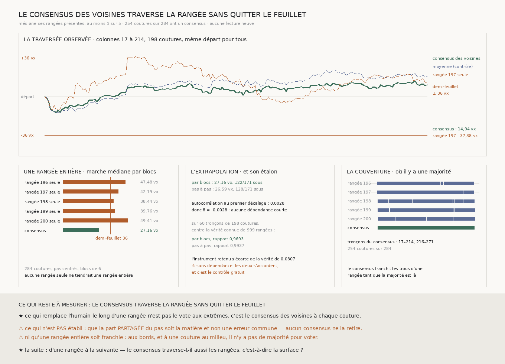

# `221` — Le consensus des voisines traverse-t-il la rangée ? Oui : là où une rangée seule sort du feuillet, cinq voisines restent dedans

*À chaque couture, la médiane des rangées présentes ; sur cent quatre-vingt-dix-huit coutures d'affilée, le consensus ne s'éloigne jamais de plus de quinze voxels de son départ, quand la rangée seule qui couvre le même tronçon dépasse le demi-feuillet.*

## 0. Pourquoi cette tranche

`220` établit que le vote aux seules colonnes fortes retire les extrêmes sans garder les rangées
ensemble : ce qui les sépare est la marche des coutures ordinaires. Si chaque rangée prend, à
**chaque** couture, ce que disent ses voisines, les rangées ne se séparent plus, par construction. La
question devient celle de `210` : **la marche du consensus reste-t-elle à moins d'un demi-feuillet de
son départ ?** C'est `R4-P66`. **Aucune lecture neuve** : `219` publie les pas des cinq rangées colonne
par colonne.

⚠⚠ Le fichier a été écrit avant que le consensus ne soit calculé. La seule chose regardée avant
d'écrire est la couverture — combien de colonnes ont assez de rangées pour voter —, jamais un pas.

## 1. Le consensus, déclaré

À chaque couture, la **médiane** des pas des rangées présentes, pourvu qu'elles soient au moins
**trois** — la majorité de cinq, sans quoi il n'y a pas de vote. La moyenne, que `210` utilisait, est
portée comme contrôle nommé.

⭐⭐⭐ **C'est ce qui rend la traversée possible.** Chaque rangée seule a des trous — chunks absents du
dépôt ou trop peu texturés — là où ses voisines lisent : ses plus longs tronçons font de **80** à
**225** coutures. Le consensus les franchit tant que la majorité est là : **254** coutures sur **284**
en ont un, en deux tronçons, **17–214** et **216–271**.

## 2. ⭐⭐⭐⭐ La traversée observée

Sur **17–214**, **198** coutures d'affilée, depuis le même départ :

| marche | distance au départ | dispersion du pas | reste sous le demi-feuillet |
|---|---:|---:|---|
| **consensus des voisines** | **14,9375** vx | **1,3724** vx | **oui** |
| moyenne des rangées présentes (contrôle) | **24,775** vx | **1,5821** vx | oui |
| **rangée `197` seule** | **37,375** vx | **2,6079** vx | **non** |

⭐⭐⭐⭐ **Le contrôle est apparié** : `197` est la seule rangée qui couvre ce tronçon sans un trou, donc
les deux marches partent du même endroit et franchissent exactement les mêmes coutures. **La rangée
seule sort du feuillet ; le consensus des voisines ne s'éloigne jamais de plus de 14,9375 voxels.**

⭐ La médiane fait mieux que la moyenne, pour la raison que `219` et `220` ont mesurée : les écarts
extrêmes sont portés par une rangée à la fois, et la moyenne les suit là où la médiane les ignore.

⚠ La moyenne des pas du consensus vaut **0,0545** ± **0,0975** voxel par couture : aucune dérive au-delà
du hasard.

## 3. ⭐⭐ Une rangée entière, par extrapolation

Des marches de **284** coutures, pas **centrés** (`R4-L22`), tirés par blocs mobiles de **6** — la règle
de `217`, pour garder la dépendance courte que `220` a vue :

| | marche médiane | sous le demi-feuillet |
|---|---:|---:|
| **consensus, par blocs** | **27,1553** vx | **122/171** |
| consensus, pas à pas (contrôle) | **26,5876** vx | 128/171 |
| rangée `196` seule | **47,4803** vx | 45/171 |
| rangée `197` seule | **42,1904** vx | 59/171 |
| rangée `198` seule | **38,4357** vx | 76/171 |
| rangée `199` seule | **39,7568** vx | 66/171 |
| rangée `200` seule | **49,4078** vx | 35/171 |

**Aucune rangée seule ne tiendrait une rangée entière ; le consensus, si.**

### L'étalon de l'extrapolation

⚠⚠⚠ Une extrapolation n'est pas une mesure, et elle se vérifie sur une matière dont on connaît la
réponse : des séries $s_i = e_i - \theta\, e_{i-1}$ — la forme d'un chunk mal recalé qui déplace une
couture et rend le déplacement à la suivante —, dont le $\theta$ est **dérivé** de l'autocorrélation
au premier décalage que le consensus montre, **0,0028**. D'où $\theta =$ **-0,0028** : **aucune
dépendance courte**. Sur **60** tronçons de **198** coutures, contre la vérité connue de **999**
rangées entières, l'extrapolation par blocs rend **0,9693** fois la vérité et le tirage pas à pas
**0,9937**. L'instrument retenu s'écarte de la vérité de **0,0307** ; sans dépendance les deux
s'accordent, et c'est le contrôle gratuit. ⭐ La batterie vérifie en plus, sur une matière qui revient
sur elle-même, que les blocs s'approchent de la vérité là où le tirage pas à pas la surestime.

## 4. Le verdict

**LE CONSENSUS TRAVERSE LA RANGÉE SANS QUITTER LE FEUILLET.**

⭐⭐⭐⭐ **C'est la tranche du graal qui corrige le transfert qui bouge.** `210` avait **prédit**, par la
dispersion de ses pas, qu'une moyenne de trois rangées passerait là où une rangée seule échoue ; ici la
rangée seule **sort effectivement** du feuillet sur le tronçon observé, et le consensus de cinq voisines
reste dedans, depuis le même départ. Ce qui remplace l'humain le long d'une rangée n'est pas un vote aux
extrêmes : c'est le consensus des voisines à **chaque** couture.

## 5. Ce que cette tranche ne dit pas

- ⚠⚠⚠ **Elle ne retire pas la part PARTAGÉE du pas.** `208` l'a mesurée, et aucun consensus ne la
  touche : c'est la géométrie de la matière ou une erreur commune aux cinq rangées, et rien de local
  ne le dit. Ce qui est établi est que les erreurs **propres** se compensent assez pour que ce qui reste
  tienne dans le feuillet.
- ⚠⚠ **Une rangée entière n'est pas franchie d'un seul tenant** : aux bords, et à la couture **215**, il
  n'y a pas de majorité pour voter. La rangée entière n'est donc lue que par extrapolation.
- ⚠ Le départ est pris comme référence du feuillet ; une traversée qui partirait déjà décalée hériterait
  de ce décalage.
- ⚠ Cinq rangées d'un seul segment, autour d'une seule médiane.

## 6. Les sondes, et les bris

**Quatorze bris** ont été appliqués un par un au code, et **les quatorze rougissent** : la moyenne à la
place de la médiane, une rangée seule acceptée comme consensus, un minimum qui n'est plus la majorité,
des tronçons non contigus, des blocs non centrés, des blocs réduits à un pas, la mauvaise racine de
$\theta$, la matière de l'étalon sans dépendance, la distance au départ remplacée par l'étendue,
l'extrapolation jugée sur le tirage pas à pas, un contrôle apparié qui accepte une rangée trouée,
l'issue « sort sur ce qu'on lit » qui ne prime plus, un tronçon retenu qui n'est pas le plus long, un
étalon jugé sans la vérité.

⚠⚠ **Deux de mes sondes ne pouvaient pas échouer, et seuls les bris l'ont dit.** Celle du plus long
tronçon ne testait qu'une égalité, où « le premier » et « le plus long » coïncident ; elle le teste
maintenant sur une suite où ils diffèrent. Et rien ne vérifiait que la rangée entière se juge sur les
blocs plutôt que sur le tirage pas à pas : une sonde construit une alternance que seuls des blocs de six
gardent, et où le tirage pas à pas s'enfuit.

⚠ Et j'avais d'abord publié un booléen « les blocs sont validés par l'étalon », qui valait **faux** sur la
matière — parce que, sans dépendance, le tirage pas à pas s'approche un peu plus de la vérité. Il ne
disait donc rien de la justesse des blocs. Il est remplacé par l'écart à la vérité de l'instrument
retenu.

La mesure est déterministe et a été reproduite à l'identique.

## 7. Ce qui reste

`R4-P66` est **répondue** : le consensus de cinq voisines, pris à chaque couture, traverse ce qu'il lit
sans quitter le feuillet, et une rangée entière par extrapolation.

⭐⭐⭐⭐ **Ce qui s'ouvre est la surface.** Ce que cette lignée de tranches (`199`–`221`) a mesuré est une
traversée **le long** d'une rangée : les coutures entre deux chunks voisins d'une même rangée de chunks.
Une surface demande aussi de traverser **d'une rangée à la suivante**, et cette lignée ne les a pas
lues. C'est une lecture neuve — les bords haut et bas des chunks —, et elle porte un contrôle gratuit :
autour de quatre chunks, les quatre pas d'une boucle doivent sommer à zéro si la surface est cohérente.
