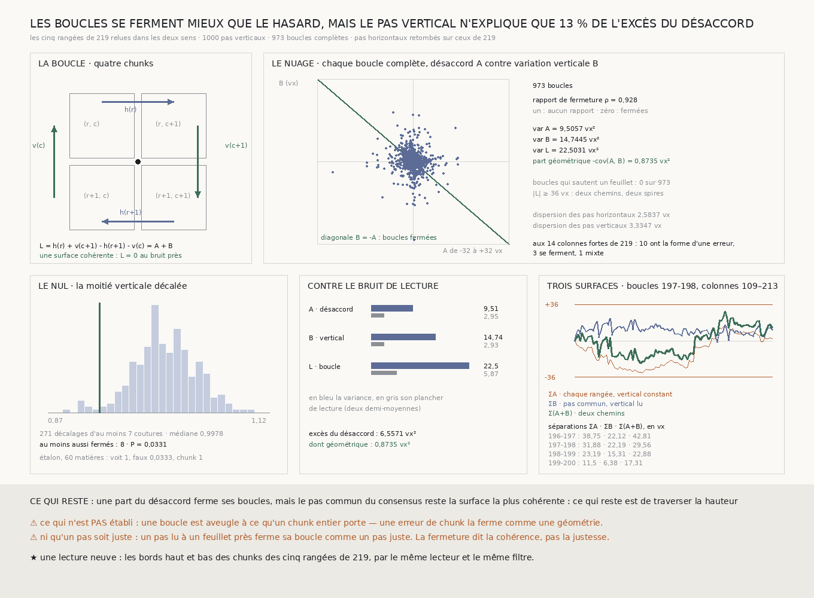

# `222` — Autour de quatre chunks, les boucles se ferment-elles ? Mieux que le hasard, et de peu : le pas commun reste la surface la plus cohérente

*Première lecture des coutures entre deux rangées de chunks. Le pas vertical explique une part réelle mais petite du désaccord de deux rangées voisines, et une surface qui donne à toutes les rangées le même pas horizontal reste, sur les quatre rangées de boucles, la plus cohérente avec ce que le pas vertical lit.*

## 0. Pourquoi cette tranche

La lignée `199`–`221` n'a mesuré que des coutures **le long** d'une rangée de chunks, et `221` a établi
que le consensus de cinq rangées voisines les traverse sans quitter le feuillet. Une surface demande
aussi de passer d'une rangée de chunks à la suivante, et ces coutures-là, entre le bord bas d'un chunk
et le bord haut de celui du dessous, n'avaient jamais été lues. C'est `R4-P67`, et c'est une **lecture
neuve**.

⚠⚠⚠ Le fichier a été écrit avant que le moindre bord vertical ne soit lu : la question, l'épreuve, son
nul, son étalon, les descriptions et les issues y sont posés d'avance. Ce qui a été ajouté après la
mesure est dit au §8.

## 1. La boucle

Autour de quatre chunks, deux pas horizontaux $h$ et deux verticaux $v$ :

$$L_r(c) = h_r(c) + v_{c+1}(r) - h_{r+1}(c) - v_c(r) = A_r(c) + B_r(c)$$

avec $A = h_r(c) - h_{r+1}(c)$, le **désaccord** de deux rangées voisines à une couture — exactement ce
que `211` et `220` cumulaient et lisaient comme une erreur —, et $B = v_{c+1}(r) - v_c(r)$, la variation
du pas vertical d'un chunk au suivant. Si les pas mesurent une même surface, deux chemins vers le même
chunk y arrivent au même endroit et $L$ est nul au bruit près. ⭐⭐⭐ Une surface qui **tourne** fait
varier le pas horizontal d'une rangée à l'autre, et c'est alors le pas vertical qui en rend compte :
les dérivées croisées se compensent, exactement pour tout champ de profondeur jusqu'au troisième degré.

C'est donc la question que la tranche tranche : **le désaccord de deux rangées voisines est-il en partie
la géométrie d'une surface que le pas vertical voit ?** Et la réponse décide du consensus de `221`, qui
donne à toutes les rangées le même pas horizontal : il efface le désaccord, à bon droit si c'est de
l'erreur, à tort si c'est de la géométrie.

## 2. La lecture neuve

Les cinq rangées de `219`, **196** à **200**, relues par le **même** lecteur : `la_ligne` gagne un
drapeau, faux par défaut, qui garde en plus les bords haut et bas de chaque chunk, coupés en
`(couche, rangée)` à seize colonnes réparties comme les seize rangées, avec la même largeur de bande. Le
pas vertical est la même estimation que l'horizontal, moyennée sur ces seize coupes. La lecture n'a
perdu aucun chunk par le réseau.

⚠⚠⚠ **Les pas horizontaux relus retombent exactement sur ceux de `219`** : écart **0** sur les cinq
rangées, sur exactement les mêmes colonnes. La tolérance admise était l'arrondi de la quatrième décimale
publiée ; elle n'a pas servi.

| | |
|---|---:|
| pas horizontaux | **1245** |
| pas verticaux | **1000** (**252**, **249**, **248**, **251** par rangée de boucles) |
| boucles complètes | **973** |
| dispersion des pas horizontaux | **2,5837** vx |
| dispersion des pas verticaux | **3,3347** vx |

⚠ Le pas vertical varie davantage que l'horizontal : c'est le premier fait qu'apporte cette lecture.

## 3. L'épreuve : les boucles se ferment mieux que le hasard

Le rapport de fermeture, sur toutes les boucles complètes, chaque série centrée par rangée de boucles :

$$\rho = \frac{\mathrm{var}(A+B)}{\mathrm{var}A + \mathrm{var}B}$$

Des pas verticaux sans rapport avec le désaccord le laissent autour de un ; des pas qui en rendent compte
le font descendre.

⚠⚠⚠ **Le nul rebrasse des boucles, jamais des pas** — le piège que `R4-P67` écrivait d'avance. Deux
boucles voisines partagent un pas, et deux rangées de boucles voisines partagent une rangée ; tirer les
pas un à un jugerait sur une variance qui n'est pas celle de la matière. Le nul décale donc la moitié
verticale des boucles contre leur moitié horizontale, circulairement, du même décalage pour les quatre
rangées de boucles : tous les décalages d'au moins **7** coutures dans chaque sens, soit **271** — la
règle de `217`. Le nul est exhaustif et n'a pas de graine.

| | |
|---|---:|
| rapport de fermeture observé | **0,928** |
| médiane du nul | **0,9978** |
| le plus petit du nul | **0,8903** |
| décalages au moins aussi fermés | **8** sur **271** |
| valeur P | **0,0331** pour **0,05** garantis |

**Les boucles se ferment mieux que le hasard.** L'étalon tient : sur **60** matières dont on connaît la
réponse, bâties sur le motif exact de présence des pas lus avec le bruit de lecture de chaque sorte de
pas, l'épreuve voit une torsion de la taille que la matière permet **1** fois sur une, et se trompe
**0,0333** fois sur une matière incohérente.

## 4. ⭐⭐⭐ Combien : treize pour cent de l'excès

Le bruit de lecture d'un pas se tire de ses deux demi-moyennes alternées, $\mathrm{var}(\bar m) =
d^2\, n_a n_b / n^2$ : **1,2142** vx pour un pas horizontal, **1,2095** pour un vertical.

| | variance | plancher de lecture |
|---|---:|---:|
| $A$ · désaccord des rangées | **9,5057** vx² | **2,9486** vx² |
| $B$ · variation du pas vertical | **14,7445** vx² | **2,926** vx² |
| $L$ · la boucle | **22,5031** vx² | **5,8746** vx² |

Le désaccord dépasse son plancher de **6,5571** vx² : il y a quelque chose à expliquer. La part que le pas
vertical en explique, $-\mathrm{cov}(A, B)$, vaut **0,8735** vx², soit **0,1332** de cet excès.

⭐⭐⭐ **C'est le fait qui compte, plus que la valeur P.** Le désaccord de deux rangées voisines n'est pas
seulement de l'erreur, mais la géométrie que le pas vertical voit n'explique que **0,1332** de son
excès : le reste est de l'erreur de couture. ⚠⚠ Et le pas vertical lui-même varie bien au-delà de son
bruit, presque tout sans rapport avec le désaccord : ce qu'il porte en plus est de l'erreur de couture
verticale, ou une géométrie que le pas horizontal ne voit pas.

## 5. ⭐⭐⭐⭐ Trois surfaces, et la plus cohérente est le pas commun

Sur le plus long tronçon de boucles complètes de chaque rangée de boucles, la séparation $\max_k |S_k|$
de trois cumuls, contre le demi-feuillet de **36** voxels :

- $\Sigma A$ — chaque rangée son pas, le pas vertical supposé constant : la séparation de `211` ;
- $\Sigma B$ — un pas horizontal **commun** aux rangées, dont le consensus de `221`, et le pas vertical tel
  qu'il est lu : ce que le consensus laisse d'incohérent ;
- $\Sigma(A+B)$ — chaque rangée son pas **et** le pas vertical lu : deux chemins vers le même chunk.

| rangée de boucles | tronçon | $\Sigma A$ | $\Sigma B$ | $\Sigma(A+B)$ |
|---|---|---:|---:|---:|
| `196-197` | 93–181 | **38,75** | **22,125** | **42,8125** |
| `197-198` | 109–213 | **31,875** | **22,1875** | **29,5625** |
| `198-199` | 109–213 | **23,1875** | **15,3125** | **22,875** |
| `199-200` | 64–143 | **11,5** | **6,375** | **17,3125** |

⭐ Les tronçons sont exactement ceux de `220`, et $\Sigma A$ retombe exactement sur ses séparations
« avant le vote » : aucun pas vertical ne manque sur eux, et la lecture neuve reproduit l'ancienne.

⭐⭐⭐⭐ **Le pas commun est la surface la plus cohérente sur les quatre rangées de boucles, et il reste
partout sous le demi-feuillet.** Ajouter le pas vertical lu aux pas propres de chaque rangée ne sauve pas
`196-197` et aggrave `199-200` : le pas vertical est trop bruité pour corriger le désaccord qu'il
n'explique que pour une petite part. ⚠ La victoire de $\Sigma B$ est en partie **structurelle** :
$\Sigma B$ vaut $v_k - v_{\text{départ}}$, la différence de deux lectures, donc elle ne s'accumule pas
comme une marche. Ce qu'elle mesure est que le pas vertical ne dérive pas le long de la rangée de plus de **22,1875**
voxels — que deux rangées voisines, sous le consensus, restent à moins d'un demi-feuillet de ce que la
couture qui les joint lit.

**C'est la tranche du graal qui passe de la ligne à la surface** : pour la première fois, le transfert
d'une rangée de chunks à la suivante est lu, et le consensus de `221` reste dans le feuillet de ce
transfert sur tout ce qui a été lu.

## 6. Les colonnes fortes de `219`, relues par leurs boucles

À chaque colonne forte, l'écart $\delta$ de la rangée désignée à la médiane des quatre autres, et les deux
boucles qui contiennent son pas. Une **erreur** de cette rangée ouvre sa boucle du dessous de $+\delta$ et
celle du dessus de $-\delta$ ; une **géométrie** que le pas vertical voit les ferme.

| colonne | rangée | $\delta$ | boucle dessous | boucle dessus | forme |
|---:|---:|---:|---:|---:|---|
| 19 | `199` | -15,6875 | -15,625 | 15,125 | erreur |
| 21 | `200` | -12,9062 | — | 11,875 | erreur |
| 28 | `200` | -8,625 | — | 5,5 | erreur |
| 32 | `197` | 17,8438 | 8,3125 | -30,5 | mixte |
| 59 | `197` | 11,6875 | 3,125 | -3 | fermée |
| 102 | `198` | 7,2812 | 5,6875 | -13,625 | erreur |
| 103 | `196` | -9,9062 | -1,625 | — | fermée |
| 131 | `200` | 15,1875 | — | -11,3125 | erreur |
| 151 | `200` | 11,3438 | — | -12,875 | erreur |
| 161 | `199` | 15 | 13,5625 | -17 | erreur |
| 168 | `196` | -11,6875 | -14,25 | — | erreur |
| 172 | `198` | -14,875 | -10,1875 | 16,25 | erreur |
| 193 | `199` | -10,7188 | -9,125 | 26,9375 | erreur |
| 267 | `198` | 10,4062 | -0,125 | -3,875 | fermée |

⭐⭐⭐ **À dix colonnes sur quatorze, les boucles ont la forme exacte d'une erreur de la rangée que le
vote désigne** : `219` désignait la bonne rangée, et la boucle le confirme par une lecture qu'il n'avait
pas. **Trois se ferment** — **59**, **103**, **267** —, **une est mixte**, **32**.

⚠⚠ **Et la colonne 103 était la question que `220` laissait ouverte** : la rangée `196` y est la seule
des cinq à ne pas monter avec les quatre autres, le vote l'aligne sur elles, et `196-197` s'en aggrave.
Sa boucle du dessous se ferme : le pas vertical rend compte de l'écart de `196`, et le vote y a
vraisemblablement effacé de la géométrie. ⚠ Une seule boucle, et une fermeture ne distingue pas une
géométrie d'une erreur portée par un chunk entier : c'est une indication, pas un verdict.

Aucune des **973** boucles ne saute un feuillet : aucune ne s'ouvre d'un demi-feuillet ou plus.

## 7. Ce que cette tranche ne dit pas

- ⚠⚠⚠ **Une boucle est aveugle à ce qu'un chunk entier porte.** Un chunk dont toute la lecture est
  déplacée déplace ses quatre pas de façon cohérente et ferme ses boucles comme une géométrie : l'étalon
  le montre, l'épreuve voit une telle erreur **1** fois sur une. La part « géométrique » de **0,8735** vx²
  est donc de la géométrie **ou** de l'erreur de chunk.
- ⚠⚠ **Elle ne dit pas qu'un pas soit juste.** Un pas lu à un feuillet près ferme sa boucle comme un pas
  juste : la fermeture établit la cohérence des pas entre eux, jamais leur justesse.
- ⚠⚠ **Elle ne traverse pas la hauteur.** Quatre coutures verticales par colonne ne font pas une
  traversée : ce qui est établi est la cohérence du pas commun avec le transfert d'une rangée à la
  suivante, sur ce qui a été lu, pas une surface de toute la hauteur du segment.
- ⚠ La part **partagée** du pas (`208`) reste hors de portée, comme dans toute la lignée.
- ⚠ Cinq rangées d'un seul segment.

## 8. Les sondes, les bris, et ce qui a été ajouté après la mesure

**Trente bris** ont été appliqués un par un au code, et **les trente rougissent** : le pas vertical lu à
l'envers, le bord bas pris en haut du chunk, la coupe verticale faite le long d'une rangée, le drapeau
actif par défaut, $A$ ou $B$ à l'envers, la reproduction qui accepte des colonnes en plus ou une
tolérance lâche, le bruit d'un pas toujours $d^2/4$, le nul qui rebrasse les pas un à un, prend les
petits décalages ou se compte lui-même, les moitiés non centrées, l'étalon qui voit toujours, la matière
incohérente qui garde la même torsion, la torsion de l'étalon prise sur toute la variance, le bruit d'un
pas pris pour celui d'une moitié, le verdict sans étalon, $\Sigma B$ remplacé par le plus grand $B$, les
surfaces sur toutes les boucles plutôt que le plus long tronçon, le saut d'un feuillet au-delà du
demi-feuillet seulement, dessous et dessus inversés, le pas vertical rangé sous la rangée du bas, une
rangée dont le fil est tombé acceptée, l'erreur de chunk deux fois trop forte, la lecture publiée à deux
décimales, la forme d'erreur sans le signe, la surface la plus cohérente prise la plus grande, ce qui
reste ne lisant que l'issue, la part expliquée rapportée à toute la variance.

⚠⚠ **Quatre bris passaient d'abord, et seuls les bris l'ont dit.** Les chunks fabriqués étaient
uniformes dans le plan, donc leurs quatre bords rendaient le même profil : ni un bord pris du mauvais
côté, ni une coupe dans le mauvais sens ne se voyaient. Les chunks de la sonde portent désormais une
moitié droite et une moitié basse déplacées. Une rangée dont le fil était tombé était refusée par une
exception et non par sa raison, et une sonde lisait un pas absent au lieu de rougir.

⚠ **La graine d'une sonde a été changée, et c'est dit** : la première tirait sept faux sur soixante sur
la matière incohérente, un tirage rare pour un nul dont le taux, sondé à part sur plusieurs milliers de
matières pleines et trouées, est celui de sa garantie.

⚠⚠⚠ **Trois choses ont été ajoutées après la mesure.**
- La phrase « ce qui reste » que le fichier avait écrite d'avance pour des boucles qui se ferment disait
  que « la surface se bâtit sur les boucles ». Les descriptions déclarées la démentent : le pas commun est
  la surface la plus cohérente sur les quatre rangées de boucles. Une épreuve dit **si** le pas vertical
  explique une part du désaccord, pas **combien** ni quelle surface l'emporte ; la phrase lit désormais la
  surface la plus cohérente. De même, le titre de la figure disait que le pas vertical « rend compte du
  désaccord » sans dire de quelle part ; il la chiffre.
- La part expliquée de l'excès, **0,1332**, rapporte deux descriptions déclarées l'une à l'autre.
- La règle qui donne sa forme à une colonne forte — ouverte du signe d'une erreur d'au moins la moitié de
  $\delta$, ou fermée à moins de la moitié — n'était pas écrite : la déclaration publiait les boucles sans
  dire comment les lire.

La mesure est déterministe, et elle se rejoue à l'octet près depuis sa propre lecture publiée.

## 9. Ce qui reste

`R4-P67` est **répondue**. Les boucles se ferment mieux que le hasard, et de peu : le pas vertical
explique **0,1332** de l'excès du désaccord de deux rangées voisines, et à dix des quatorze colonnes
fortes de `219` les boucles confirment l'erreur que le vote désignait. Le pas commun du consensus reste
la surface la plus cohérente avec le transfert d'une rangée à la suivante, sous le demi-feuillet sur tout
ce qui a été lu.

⭐⭐⭐⭐ **Ce qui s'ouvre est la hauteur.** Ce qui a été traversé est une rangée de chunks, et ce qui est
établi est que le pas commun reste cohérent avec la couture qui la joint à ses voisines. Une surface
entière demande de traverser aussi les **396** rangées du segment, colonne par colonne : c'est `221`
transposé, cinq colonnes de chunks voisines lues sur toute la hauteur, et le consensus des colonnes pour
le pas vertical. ⚠ Et cette lecture a déjà dit ce qui l'attend : le pas vertical varie davantage que
l'horizontal, donc le consensus aura plus à compenser.
