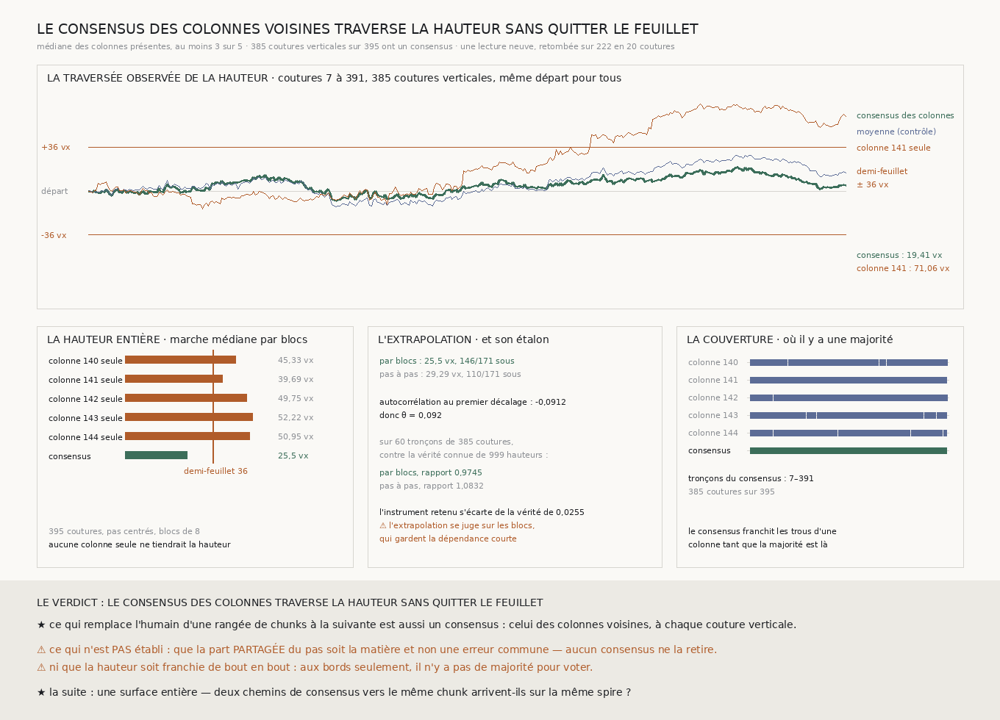

# `223` — Le consensus des colonnes voisines traverse-t-il la hauteur ? Oui : sur presque toute la hauteur du segment, observée et non extrapolée

*Cinq colonnes de chunks voisines, lues du haut en bas : leur médiane, à chaque couture verticale, traverse 385 coutures sur 395 sans s'éloigner de plus de 19,41 voxels de son départ, quand chaque colonne seule sort du feuillet — la seule qui couvre tout le tronçon, de presque une spire entière.*

## 0. Pourquoi cette tranche

`221` a établi que le consensus de cinq rangées voisines traverse une rangée de chunks sans quitter le
feuillet, et `222` que ce consensus reste cohérent, sous le demi-feuillet, avec le transfert d'une
rangée de chunks à la suivante. Une surface entière demande aussi de traverser la **hauteur** du
segment, colonne par colonne. C'est `R4-P68`, et c'est `221` transposé : la médiane de cinq colonnes
voisines à chaque couture verticale, le long d'une colonne.

⚠⚠⚠ Le fichier a été écrit avant que la moindre colonne ne soit lue. La seule chose regardée avant était
la **présence**, dans la lecture de `222`, des pas verticaux aux colonnes choisies — pour savoir si la
relecture pourrait se contrôler —, jamais une valeur.

## 1. Ce qui est dérivé, et ce qui est lu

- **Les colonnes** : cinq, le nombre de rangées de `219`, centrées sur la colonne médiane de la grille de
  chunks par la fonction même de `219` : **140** à **144**.
- **Le lecteur** : le même chunk, le même filtre du producteur, la même bande et la même estimation que
  `222`. Le filtre et la coupe des bords haut et bas sont désormais **écrits une fois** dans le lecteur de
  `204` et appelés par les deux marches ; seul change le sens de la marche. Une sonde vérifie que la
  marche en colonne et la marche en rangée lisent exactement les mêmes pas sur une grille fabriquée.
- **La lecture** : chaque colonne a lu de **378** à **386** chunks sur **396**, les autres absents du dépôt
  ou trop peu texturés ; aucun chunk perdu par le réseau.

⚠⚠⚠ **La relecture retombe exactement.** Les cinq colonnes croisent les rangées que `222` a lues : sur
les **20** coutures verticales communes, les pas relus par la marche en colonne valent ceux de `222`,
écart **0**, sur exactement les mêmes coutures. Deux lecteurs, deux sens de marche, un seul pas.

## 2. ⭐⭐⭐⭐ La traversée observée : presque toute la hauteur

Le consensus — la médiane des colonnes présentes, au moins trois sur cinq — existe sur **385** coutures
verticales des **395** d'une colonne, **d'un seul tenant**, de **7** à **391** : il ne manque que les bords
du segment. Depuis le même départ :

| marche | distance au départ | dispersion du pas | reste sous le demi-feuillet |
|---|---:|---:|---|
| **consensus des colonnes** | **19,4062** vx | **1,4267** vx | **oui** |
| moyenne des colonnes présentes (contrôle) | **29,4271** vx | **1,5875** vx | oui |
| **colonne `141` seule** | **71,0625** vx | **2,1235** vx | **non** |

⭐⭐⭐⭐ **Le contrôle est apparié** : `141` est la seule colonne qui couvre le tronçon sans un trou, donc les
deux marches partent du même endroit et franchissent les mêmes coutures. **La colonne seule s'éloigne de
presque une spire entière — le pli fait 72 voxels ; le consensus des voisines ne s'éloigne jamais de plus
de 19,4062.** C'est exactement l'erreur que corrige l'humain qui suit une surface : arriver au bout de la
hauteur sur la spire voisine.

⚠ La moyenne des pas du consensus vaut **0,0124** ± **0,0727** voxel par couture : aucune dérive au-delà
du hasard. La médiane fait mieux que la moyenne, comme chez `221`.

## 3. Aucune colonne seule ne tient

Chaque colonne seule, sur son propre plus long tronçon :

| colonne | tronçon | distance observée | marche médiane par blocs, hauteur entière |
|---|---|---:|---:|
| `140` | 81–257 | **42,6875** | **45,3302** |
| `141` | 7–391 | **71,0625** | **39,6927** |
| `142` | 80–255 | **40,25** | **49,7518** |
| `143` | 137–302 | **37,8125** | **52,2188** |
| `144` | 187–319 | **60,6875** | **50,9525** |

**Toutes sortent du feuillet sur ce qu'elles lisent, et aucune ne tiendrait la hauteur.** Le consensus,
extrapolé de même, tient : marche médiane **25,4987** voxels par blocs de **8**, **146/171** sous le
demi-feuillet. Mais ce chiffre compte moins qu'en `221` : la traversée est ici **observée** sur
**385** coutures sur **395**, et l'extrapolation n'ajoute que les dix coutures des bords.

### L'étalon de l'extrapolation

L'autocorrélation du consensus au premier décalage vaut **-0,0912**, d'où $\theta =$ **0,092** : une
légère dépendance, du signe d'un chunk mal recalé qui rend à la couture suivante ce qu'il a pris à la
précédente. Sur **60** tronçons de **385** coutures contre la vérité connue de **999** hauteurs, les blocs
rendent **0,9745** fois la vérité et le tirage pas à pas **1,0832** : ici, les blocs s'en approchent le
plus, et l'instrument retenu s'en écarte de **0,0255**.

## 4. Le verdict

**LE CONSENSUS DES COLONNES VOISINES TRAVERSE LA HAUTEUR SANS QUITTER LE FEUILLET.**

⭐⭐⭐⭐ **C'est la tranche du graal qui passe à la seconde dimension.** `221` traversait une rangée de
chunks ; `223` traverse la hauteur du segment, et pas par extrapolation : sur **385** des **395** coutures,
d'un seul tenant. Ce qui remplace l'humain d'une rangée de chunks à la suivante est le même instrument
que le long d'une rangée : le consensus des voisines, à chaque couture.

⚠ **Ce que `222` annonçait ne s'est pas vu** : le pas vertical varie davantage que l'horizontal, mais le
consensus des colonnes n'en porte presque rien — sa dispersion, **1,4267** voxel par couture, est celle du
consensus des rangées de `221`, à quelques centièmes près.

## 5. Ce que cette tranche ne dit pas

- ⚠⚠⚠ **La part partagée du pas reste hors de portée**, dans ce sens comme dans l'autre : ce que les cinq
  colonnes partagent, aucun consensus ne le retire.
- ⚠⚠ **Deux traversées ne font pas encore une surface.** `221` traverse une bande de rangées, `223` une
  bande de colonnes ; elles se croisent en un seul bloc de cinq chunks sur cinq. Qu'un chunk quelconque
  du segment reçoive la même profondeur par le chemin des rangées puis des colonnes et par le chemin
  inverse n'est pas mesuré.
- ⚠ Aux bords du segment, sept coutures en haut et trois en bas, il n'y a pas de majorité pour voter.
- ⚠ Le départ est pris comme référence du feuillet ; une traversée qui partirait décalée en hériterait.
- ⚠ Cinq colonnes d'un seul segment.

## 6. Les sondes et les bris

**Dix-sept bris** ont été appliqués un par un au code, et **les dix-sept rougissent** : les colonnes
décentrées de la médiane, le pas d'une colonne lu à l'envers ou rangé sous la rangée du bas, une couture
tirée par-dessus un chunk absent, le filtre du producteur contourné, le bord bas pris en haut, une colonne
dont le fil est tombé acceptée, la relecture qui tolère une couture lue d'un seul côté ou un écart
au-delà de l'arrondi, la mesure qui accepte d'autres colonnes que les colonnes dérivées, le consensus en
moyenne ou d'une seule colonne, le contrôle apparié qui accepte une colonne trouée, l'extrapolation à la
longueur du tronçon au lieu de la hauteur, l'issue « sort sur ce qu'on lit » qui ne prime plus, les
coutures d'une colonne comptées comme ses chunks, l'étalon sans la dépendance dérivée.

⚠⚠ **Avant de casser quoi que ce soit, trois sondes manquaient, et elles ont été ajoutées avant la
mesure** : le filtre du producteur était remplacé dans la sonde, donc rien ne vérifiait qu'il fût appelé ;
l'étalon n'était vérifié que présent, pas au $\theta$ dérivé ; et rien ne faisait passer une lecture
entière par la mesure. ⚠⚠ **Puis le premier passage des bris en a laissé passer un et en a tué deux** :
rien ne vérifiait que l'extrapolation portât sur la hauteur entière, et les sondes de l'analyse étaient
posées sous une condition de succès, si bien qu'un bris qui faisait lever l'analyse les retirait au lieu
de les rougir. Elles tournent désormais toutes, et une sonde de l'extrapolation a été ajoutée — après la
mesure, et c'est dit.

⚠ **Un de mes attendus était faux, pas le code** : dans la matière fabriquée, le premier tronçon était le
plus long. La fixture a été corrigée pour que le tronçon retenu porte à la fois le trou d'une colonne et
l'écart d'une autre, et la longueur de bloc attendue a suivi : **5** pour **87** coutures.

La mesure est déterministe et se rejoue à l'octet près depuis sa propre lecture publiée.

## 7. Ce qui reste

`R4-P68` est **répondue** : le consensus des colonnes voisines traverse la hauteur du segment sans
quitter le feuillet, sur **385** coutures observées.

⭐⭐⭐⭐ **Ce qui s'ouvre est la surface entière.** Les deux traversées sont deux chemins ; une surface exige
que tous les chemins vers un même chunk arrivent sur la même spire. `222` l'a vérifié à l'échelle de
quatre chunks, où les boucles se ferment à peine mieux que le hasard. À l'échelle du segment, une boucle
de consensus — une bande de rangées, une bande de colonnes, et deux bandes de plus pour fermer le
rectangle — dit si deux chemins arrivent au même endroit à moins d'un demi-feuillet. C'est une lecture
neuve, et ses bandes se dérivent, jamais ne se choisissent.
