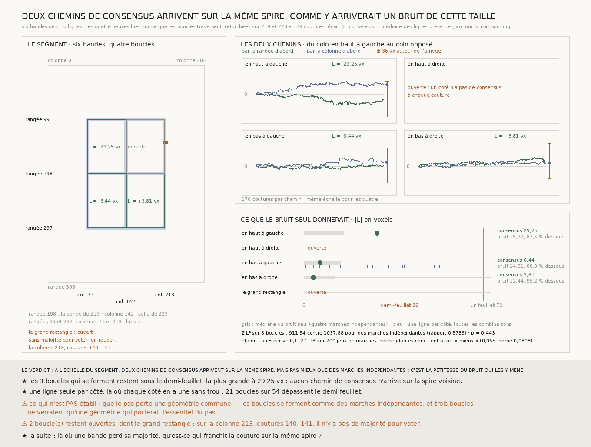

# `224` — Deux chemins de consensus arrivent-ils sur la même spire ? Oui, à l'échelle du quart de segment, mais pas mieux que ne le ferait un bruit de cette taille

*Six bandes de cinq lignes ferment quatre boucles autour de la croix centrale du segment. Les trois qui se ferment restent sous le demi-feuillet, la plus grande à 29,25 voxels. Elles ne se ferment pas mieux que quatre marches indépendantes : le bruit du consensus est assez petit, et c'est lui qui les y mène. La quatrième boucle et le grand rectangle restent ouverts, faute de majorité à deux coutures.*

## 0. Pourquoi cette tranche

`221` traverse une bande de rangées, `223` une bande de colonnes, et elles ne se croisent qu'en un bloc de
cinq chunks sur cinq. Une surface exige plus : que tous les chemins vers un même chunk y arrivent au même
endroit. `222` l'a mesuré autour de quatre chunks ; c'est `R4-P69` à l'échelle du segment. Le chemin par
la rangée d'abord et le chemin par la colonne d'abord, d'un coin à l'autre d'un rectangle, arrivent-ils à
moins d'un demi-feuillet l'un de l'autre ?

⚠⚠⚠ Le fichier a été écrit avant que la moindre bande nouvelle ne soit lue. La seule chose regardée avant
était la **présence** du consensus sur les deux bandes déjà publiées — jamais une valeur.

## 1. Ce qui est dérivé, et ce qui est lu

- **Les bandes** : celles de `219` et de `223` sont au centre de la grille (rangée **198**, colonne
  **142**). Les nouvelles sont à mi-chemin entre ce centre et chaque bord, de part et d'autre, `m ± m // 2`.
  Cela donne les rangées **99** et **297** et les colonnes **71** et **213**, cinq lignes chacune, centrées
  par la fonction de `219`. ⚠ Deux bandes de chaque sorte et non une, comme la porte le disait : une seule
  aurait fermé un seul rectangle, dans un quadrant que la grille ne désigne pas. Deux ferment les
  **quatre** rectangles congruents autour de la croix, et un grand rectangle, leur somme, qui ne passe que
  par les bandes nouvelles.
- **La portion lue** : une bande de rangées entre les colonnes 71 et 213, une bande de colonnes entre les
  rangées 99 et 297, ce que les boucles traversent. Les lecteurs de `222` et de `223` ont gagné une
  portion, et le lecteur de colonnes coupe désormais aussi les bords gauche et droit, par la coupe même
  de la marche en rangée, écrite une fois pour les deux.
- **La lecture** : de **139** à **143** chunks sur **143** par rangée, de **190** à **198** sur **199** par
  colonne. Aucun chunk n'est perdu par le réseau, aucun n'est absent du dépôt, seuls quelques-uns sont trop
  peu texturés.

⚠⚠⚠ **Chaque bande nouvelle est contrôlée par une bande publiée.** Une bande de rangées coupe les colonnes
140–144 de `223` et relit leurs pas verticaux ; une bande de colonnes coupe les rangées 196–200 de `219` et
relit leurs pas horizontaux. Sur les **79** coutures croisées, les pas relus retombent sur ce qui est
publié à l'écart **0**, sur exactement les mêmes coutures.

## 2. La fermeture

Pour un rectangle de coins $(r_0, c_0)$ et $(r_1, c_1)$, chaque côté est la somme des pas du consensus le
long de sa bande, la médiane des lignes présentes, au moins trois sur cinq :

$$L = H(r_0 ; c_0 \to c_1) + V(c_1 ; r_0 \to r_1) - H(r_1 ; c_0 \to c_1) - V(c_0 ; r_0 \to r_1)$$

$L$ est l'écart entre le chemin par la rangée d'abord et le chemin par la colonne d'abord. Une géométrie
la ferme exactement ; ce qui reste est l'erreur accumulée des quatre côtés, **170** coutures par chemin.

| boucle | fermeture | la moyenne (contrôle) | le bruit seul : médiane | le bruit seul sous le demi-feuillet |
|---|---:|---:|---:|---:|
| en haut à gauche | **−29,25** vx | −25,1573 | 15,7187 | 0,8749 |
| en haut à droite | ouverte | | | |
| en bas à gauche | **−6,4375** vx | 18,425 | 14,8125 | 0,8829 |
| en bas à droite | **3,8125** vx | −18,6365 | 12,4375 | 0,952 |
| le grand rectangle | ouvert | | | |

⭐⭐⭐⭐ **Les trois boucles qui se ferment restent sous le demi-feuillet**, la plus grande à **29,25**
voxels : aucun chemin de consensus n'arrive sur la spire voisine de l'autre, à l'échelle d'un quart de
segment dans chaque sens.

⚠ La plus grande fermeture doit l'essentiel à un seul côté : la colonne **71**, des rangées 99 à 198,
monte de **22,625** voxels quand les trois autres côtés de sa boucle ne font que quelques voxels.

## 3. Ce que le bruit seul aurait donné

⚠⚠⚠ **Le piège que la porte nommait** : chaque côté est une marche, donc une fermeture n'a pas zéro pour
nul. L'épreuve compare $T = \sum L^2$ sur les trois boucles fermées à ce que donneraient les mêmes côtés
tirés **indépendamment**, chacun par blocs de ses propres pas centrés, les boucles partageant les
demi-côtés qu'elles partagent.

- $T$ vaut **911,5391**, contre **1037,877** pour des marches indépendantes, un rapport de **0,8783**, et
  **442** tirages sur **999** se ferment au moins aussi bien : $p =$ **0,443**. **Les boucles ne se
  ferment pas mieux que des marches indépendantes.**
- **L'étalon tient** : sur des demi-côtés indépendants fabriqués, au $\theta =$ **0,1127** dérivé de
  l'autocorrélation commune des demi-côtés lus (**−0,1113**), l'épreuve conclut à tort « mieux » **13**
  fois sur **200**, soit **0,065**, sous sa borne **0,0808**. ⚠ Et l'étalon voit l'épreuve se tromper là
  où elle se trompe : une sonde lui donne des pas qui se rendent à la couture suivante, et il refuse.
- Pour chaque boucle, le bruit seul reste sous le demi-feuillet dans **0,8749** à **0,952** des tirages :
  passer le demi-feuillet n'était pas une épreuve difficile à cette échelle.

**Une ligne seule par côté**, le contrôle nommé : seule la boucle en bas à gauche a sur chacun de ses
côtés une ligne sans trou. Ses **54** combinaisons ont une fermeture médiane de **28,5** voxels, et **21**
dépassent le demi-feuillet, jusqu'à **71,375**, presque une spire entière. Le consensus de la même boucle ferme à
**6,4375**. La moyenne des lignes présentes, elle, ferme plus mal que la médiane sur deux boucles sur trois.

## 4. Le verdict

**À L'ÉCHELLE DU SEGMENT, DEUX CHEMINS DE CONSENSUS ARRIVENT SUR LA MÊME SPIRE, MAIS PAS MIEUX QUE DES
MARCHES INDÉPENDANTES : C'EST LA PETITESSE DU BRUIT QUI LES Y MÈNE.**

⭐⭐⭐⭐ **C'est la tranche où deux traversées deviennent une surface qui se tient.** `221` et `223`
montraient chacune un chemin qui ne quitte pas le feuillet ; ici, deux chemins différents vers le même
coin y arrivent ensemble, là où une ligne seule par côté dépasse le demi-feuillet dans **21** boucles sur
**54**.

⚠⚠ **Mais ce qui les fait arriver ensemble n'est pas une géométrie qu'ils partagent.** L'erreur du
consensus est petite et elle s'accumule comme une marche : c'est assez pour un quart de segment, et rien
ici ne dit ce qu'elle devient sur un chemin deux fois plus long.

## 5. Ce que cette tranche ne dit pas

- ⚠⚠⚠ **Que le pas porte une géométrie commune.** Les boucles se ferment comme des marches indépendantes,
  et trois boucles ne verraient qu'une géométrie qui porterait l'essentiel du pas. La part du pas que les
  lignes d'une bande partagent reste hors de portée, comme dans `221` et `223`.
- ⚠⚠ **Le grand rectangle.** La bande de la colonne **213** n'a pas de majorité aux coutures **140** et
  **141** : trois de ses cinq lignes, `211`, `212` et `214`, n'y lisent aucun pas, faute de chunks assez
  texturés. La boucle en haut à droite et le grand rectangle, la seule boucle qui couvre la moitié du
  segment dans chaque sens, restent ouverts. Elles sont comptées, jamais comblées.
- ⚠ Une seule ligne sans trou par côté n'existe que sur une boucle : le contrôle d'une ligne porte sur
  elle seule.
- ⚠ Un seul segment, et les coins des boucles sont les centres des bandes.

## 6. Les sondes et les bris

**Trente-sept bris** ont été appliqués un par un au code, et **les trente-sept rougissent** : les bandes
décentrées ou lues sur toute la largeur, le pas horizontal lu en colonne à l'envers ou rangé sous la
colonne de droite, une colonne dont le fil est tombé acceptée, les pas en travers d'une bande de rangées
pris dans le mauvais sens, une reprise de lecture qui relit tout ou ne vérifie plus la définition d'une
bande, la reproduction qui tolère un voxel, une couture lue d'un seul côté, une bande sans croisement ou
une ligne de trop, un côté compté à l'envers ou pris sur la mauvaise rangée, les boucles du bas qui partent
du haut, une couture sans consensus comptée zéro, le consensus en moyenne ou d'une seule ligne, le grand
rectangle compté dans $\sum L^2$, le nul tiré sans centrer, pas à pas ou à la même graine pour tous les
côtés, la valeur $p$ sans le plus un, l'étalon qui tient toujours ou au $\theta$ nul, l'épreuve qui tranche
sans son étalon, le demi-feuillet doublé, l'issue qui ne fait plus primer le dépassement, un verdict sans
aucune boucle fermée, la mesure qui accepte d'autres bandes ou des bandes publiées hors du centre, le
contrôle d'une ligne qui comble les trous, le chemin qui prend la rangée du bas, et les deux lecteurs qui
ignorent la portion demandée ou ne coupent pas les bords gauche et droit.

⚠⚠ **Avant la mesure, six de mes attendus étaient faux, pas le code.** Une géométrie quelconque ne ferme
pas une boucle de consensus : la médiane d'une bande n'est sa ligne centrale que si le pas est affine dans
l'indice de la ligne, et la sonde de bout en bout lit désormais un champ bilinéaire. Des bandes de trois
lignes perdent leur majorité au premier trou, et les sondes de l'analyse ont des bandes de cinq. Une
autocorrélation calculée à la main était fausse. Des rangées dites hors du centre étaient le centre d'une
petite grille. Et la variance d'une somme tirée par blocs n'est pas celle d'une série indépendante : c'est
celle que les blocs de la série lui donnent, et la sonde la calcule. ⚠ Puis quatre sondes ont été ajoutées
pour que la liste des bris puisse rougir, et un bris qui tuait la batterie au lieu de la rougir l'a fait
garder. Tout cela avant la moindre bande lue ; après la mesure, seul un libellé de la figure a changé.

La mesure est déterministe et se rejoue à l'octet près depuis sa propre lecture publiée.

## 7. Ce qui reste

`R4-P69` est **répondue** : à l'échelle d'un quart de segment dans chaque sens, deux chemins de consensus
vers le même chunk arrivent sur la même spire, par la petitesse du bruit.

⭐⭐⭐ **Ce qui s'ouvre est le trou de majorité** (`R4-P70`). Le grand rectangle reste ouvert parce qu'une
bande perd sa majorité à deux coutures ; `221` avait un trou de ce genre au milieu d'une rangée, et les
bords du segment en ont dans `221` comme dans `223`. Le prix demande **100 %** du recto : là où les chunks trop peu texturés
privent une bande de sa majorité, qu'est-ce qui franchit la couture sur la même spire ? ⚠ Et le piège est
mesuré ici : une ligne seule par côté dépasse le demi-feuillet dans **21** boucles sur **54**.
