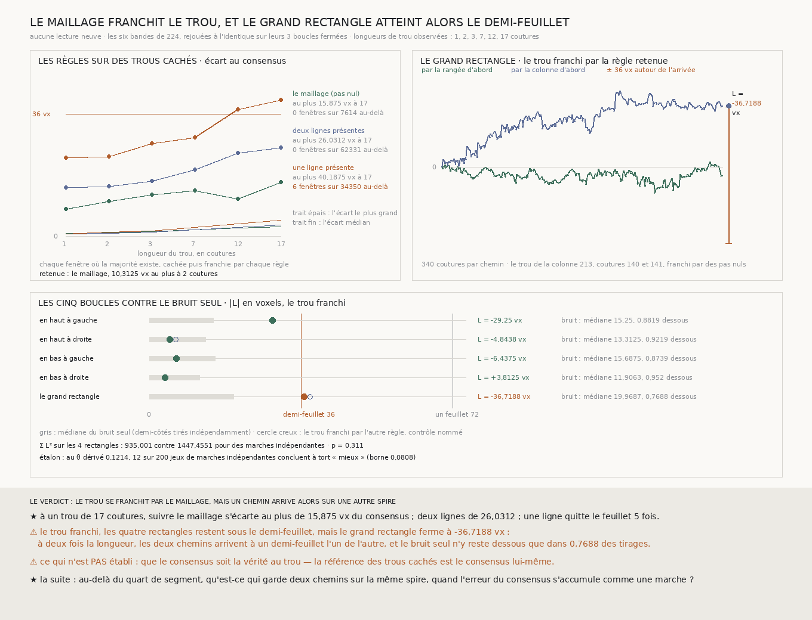

# `225` — Qu'est-ce qui franchit le trou de majorité ? Le maillage lui-même, et le grand rectangle ferme alors au demi-feuillet

*Là où une bande n'a plus trois lignes pour voter, suivre le maillage, un pas nul, franchit toutes les longueurs de trou que le segment montre, de 1 à 17 coutures, et au pire s'écarte moins du consensus que les lignes qui y lisent encore. Le trou de `224` ainsi franchi, les quatre rectangles restent sous le demi-feuillet, mais le grand rectangle, deux chemins de 340 coutures, ferme à −36,7188 voxels : juste au-delà.*

## 0. Pourquoi cette tranche

`224` a fermé trois boucles sur quatre ; la quatrième et le grand rectangle restaient ouverts parce que
la bande de la colonne 213 n'a pas de majorité aux coutures 140 et 141. `221` a un trou de ce genre au
milieu d'une rangée, et les bords du segment en ont. C'est `R4-P70` : le prix demande 100 % du recto, donc
il faut franchir ces trous, par une règle **dérivée et contrôlée sur des coutures où la majorité existe**,
jamais choisie au trou.

⚠⚠⚠ Le fichier a été écrit avant qu'aucune règle ne soit essayée sur la matière. La seule chose regardée
avant était la **présence** : où le consensus manque, et quelles lignes restent au trou de `224`. Aucune
lecture neuve : les six bandes de `224` suffisent.

## 1. Les trous que le segment montre

Le consensus, la médiane des lignes présentes à condition qu'il y en ait au moins trois sur cinq, manque :

| bande | trous (première couture, longueur) |
|---|---|
| rangée 198, celle de `219`, sur toute la largeur | 0 sur **17**, 215 sur **1**, 272 sur **12** |
| colonne 142, celle de `223`, sur toute la hauteur | 0 sur **7**, 392 sur **3** |
| colonne 213, lue par `224` | 140 sur **2** |
| rangées 99 et 297, colonne 71 | aucun |

Les longueurs de trou observées sont donc 1, 2, 3, 7, 12 et 17 coutures. Ce sont elles que la tranche
essaie, et aucune autre. ⚠ Les trous des deux bandes centrales sont exactement le complément des tronçons
que `221` et `223` publient : une sonde le vérifie.

## 2. Les règles, sur des trous cachés

Deux règles, déclarées avant :

- **le maillage** : un pas nul à chaque couture du trou. Dans ce volume, qui est la surface du segment
  aplatie, c'est continuer le feuillet à la profondeur du maillage, sans rien lire ;
- **les lignes présentes** : la médiane des lignes qui lisent encore au trou, deux ou une, le vote d'une
  minorité.

Pour chaque longueur, chaque fenêtre de coutures consécutives où la majorité existe est cachée, puis
franchie : par des pas nuls, par chaque paire et par chaque ligne seule de la bande. L'écart est celui de
la somme franchie à la somme du consensus.

| trou | le maillage : au plus | deux lignes : au plus | une ligne : au plus | une ligne au-delà du demi-feuillet |
|---:|---:|---:|---:|---:|
| 1 | 8 | 14,375 | 23,1875 | 0 sur 6386 |
| 2 | 10,3125 | 14,6562 | 23,5 | 0 sur 6256 |
| 3 | 12,25 | 16,2188 | 27,25 | 0 sur 6134 |
| 7 | 13,4375 | 19,625 | 29,125 | 0 sur 5674 |
| 12 | 10,9062 | 24,4375 | **37,3125** | **1** sur 5178 |
| 17 | 15,875 | 26,0312 | **40,1875** | **5** sur 4722 |

⭐⭐⭐⭐ **Le maillage franchit toutes les longueurs de trou observées, et c'est lui dont le pire écart au
consensus est le plus petit, à chaque longueur** : au plus **15,875** voxels sur un trou de 17 coutures.
Deux lignes présentes franchissent aussi, avec un pire écart plus grand ; une ligne seule quitte le
feuillet dès 12 coutures. ⚠ L'écart **médian**, lui, est plus petit pour deux lignes sur les trous courts,
de 1 à 7 coutures : l'écart typique de deux lignes est plus petit, leur pire écart plus grand.

⚠⚠ **Ce que cela dit** : sur 17 coutures, le consensus lui-même bouge moins que ne se trompe, au pire, la
minorité qui lit encore. Là où la matière est trop pauvre pour voter, c'est le pire cas qui décide de la
spire, et au pire, la lire à deux lignes coûte plus que ne pas la lire.

Par le critère posé avant, la règle qui franchit toutes les longueurs avec le plus petit écart maximal à la
longueur du trou réel, **2** coutures, est retenue : **le maillage**, **10,3125** voxels au plus, contre
**14,6562** pour les deux lignes qui lisent au trou de `224` (213 et 215).

## 3. Le trou franchi, les boucles fermées

⚠⚠ Avant tout, l'analyse de `224` est rejouée sans rien remplir et retombe sur ses fermetures publiées, à
l'identique. Puis le maillage écrit des pas nuls aux coutures 140 et 141 de la colonne 213, et la même
analyse, appelée, ferme toutes les boucles :

| boucle | fermeture | le bruit seul : médiane | le bruit seul sous le demi-feuillet | contrôle : les lignes présentes |
|---|---:|---:|---:|---:|
| en haut à gauche | −29,25 | 15,25 | 0,8819 | −29,25 |
| en haut à droite | **−4,8438** | 13,3125 | 0,9219 | −6,25 |
| en bas à gauche | −6,4375 | 15,6875 | 0,8739 | −6,4375 |
| en bas à droite | 3,8125 | 11,9063 | 0,952 | 3,8125 |
| **le grand rectangle** | **−36,7188** | **19,9687** | **0,7688** | −38,125 |

⭐⭐⭐⭐ **Les quatre rectangles restent sous le demi-feuillet**, la boucle en haut à droite comprise, à
**−4,8438** voxels.

⚠⚠⚠ **Mais le grand rectangle ferme à −36,7188 voxels, juste au-delà du demi-feuillet.** Ses deux
chemins, de **340** coutures chacun, arrivent à un demi-feuillet l'un de l'autre : par le critère déclaré
de `224`, ils arrivent sur des spires différentes. La règle de contrôle ferme à **−38,125** : le choix de
la règle au trou ne déplace la fermeture que d'un voxel et demi.

**Et c'est ce que le bruit seul ferait à cette échelle.** Des marches indépendantes de même dispersion ne
restent sous le demi-feuillet que dans **0,7688** des tirages pour le grand rectangle, contre **0,8739** à
**0,952** pour les rectangles. Sur les quatre rectangles, $\sum L^2$ vaut **935,001** contre **1447,4551**
pour des marches indépendantes, $p =$ **0,311** : les boucles ne se ferment toujours pas mieux que des
marches indépendantes. L'étalon tient : au $\theta =$ **0,1214** dérivé des demi-côtés lus, l'épreuve
conclut à tort « mieux » **12** fois sur **200**, sous sa borne **0,0808**.

## 4. Le verdict

**LE TROU SE FRANCHIT PAR LE MAILLAGE, MAIS UN CHEMIN ARRIVE ALORS SUR UNE AUTRE SPIRE.**

⭐⭐⭐⭐ **`R4-P70` est répondue** : là où une bande perd sa majorité, suivre le maillage franchit la
couture sur la même spire, et au pire mieux que la minorité qui y lit encore, jusqu'aux 17 coutures des
bords.

⭐⭐⭐⭐ **Et la limite du consensus est trouvée : elle est à la moitié du segment.** À l'échelle d'un
quart de segment dans chaque sens, deux chemins de consensus arrivent ensemble ; à l'échelle de la moitié,
ils arrivent à un demi-feuillet l'un de l'autre. L'erreur du consensus s'accumule comme une marche, et une
marche deux fois plus longue atteint le demi-feuillet.

## 5. Ce que cette tranche ne dit pas

- ⚠⚠⚠ **Que le consensus soit la vérité au trou.** La référence des trous cachés est le consensus
  lui-même ; une règle qui s'en écarte peu le reproduit. Si la matière avait, à un trou, un pas que le
  consensus n'aurait pas vu, rien ici ne le dirait.
- ⚠⚠ **Que le maillage soit bon ailleurs.** Suivre le maillage franchit un trou de ce segment ; un
  maillage qui quitterait lui-même son feuillet au trou y serait suivi aussi.
- ⚠⚠ **Lequel des deux chemins du grand rectangle quitte la spire.** La fermeture dit leur écart, pas
  lequel se trompe ; et elle est au demi-feuillet à moins d'un voxel près, ce que le critère déclaré
  tranche et que la matière ne tranche pas.
- ⚠ Les fenêtres cachées se recouvrent : leurs écarts ne sont pas indépendants, et le tableau les
  décrit, il ne les teste pas.

## 6. Les sondes et les bris

**Vingt-deux bris** ont été appliqués un par un au code, et **les vingt-deux rougissent** : les trous qui
perdent leur suite finale ou comptent une couture de trop, une fenêtre qui enjambe un trou, la bande de
`219` prise sur sa seule portion, une ligne qui manque tolérée dans une paire, le demi-feuillet compté
strictement, le maillage jugé sur une seule couture, les lignes seules jamais essayées ou les lignes
présentes toujours jugées en paires, une fenêtre hors du feuillet ou une longueur sans fenêtre qui
n'empêchent plus de retenir une règle, l'égalité tranchée pour les lignes, la règle au plus grand écart, le
maillage qui écrit un pas non nul, les lignes présentes qui écrivent zéro là où aucune ne lit, `224` qui
n'est plus rejoué, les trous comptés sur le seul périmètre ou cherchés sur toute la grille, l'issue où
dépasser ne prime plus, et, dans l'analyse de `224`, un remplissage par-dessus un consensus, un
remplissage qui ne s'applique pas ou qui ne se dit pas.

⚠ **Avant la mesure, un de mes attendus était faux** : une suite de consensus de quatre coutures portait
deux fenêtres de trois que j'avais oubliées. Puis deux sondes ont été ajoutées pour que deux bris puissent
rougir : l'écart du maillage sur une fenêtre de plusieurs coutures, et les trous des bandes centrales,
dans la mesure, égaux à ceux que `221` et `223` publient. ⚠ L'analyse de `224` a gagné une option,
`remplir`, qui vaut rien par défaut : la mesure de `224` se rejoue à l'octet près après l'ajout. Après la
mesure, seuls des libellés de la figure ont changé.

La mesure est déterministe et se rejoue à l'octet près.

## 7. Ce qui reste

⭐⭐⭐ **Ce qui s'ouvre** (`R4-P71`) : au-delà du quart de segment, qu'est-ce qui garde deux chemins de
consensus sur la même spire, quand l'erreur du consensus s'accumule comme une marche ? Un segment entier
est plus long que le grand rectangle. ⚠⚠⚠ Et le piège est connu d'avance : un ajustement qui répartit la
fermeture entre les côtés ferme les boucles par construction, donc il ne se juge que sur des boucles qu'il
n'a pas vues.
