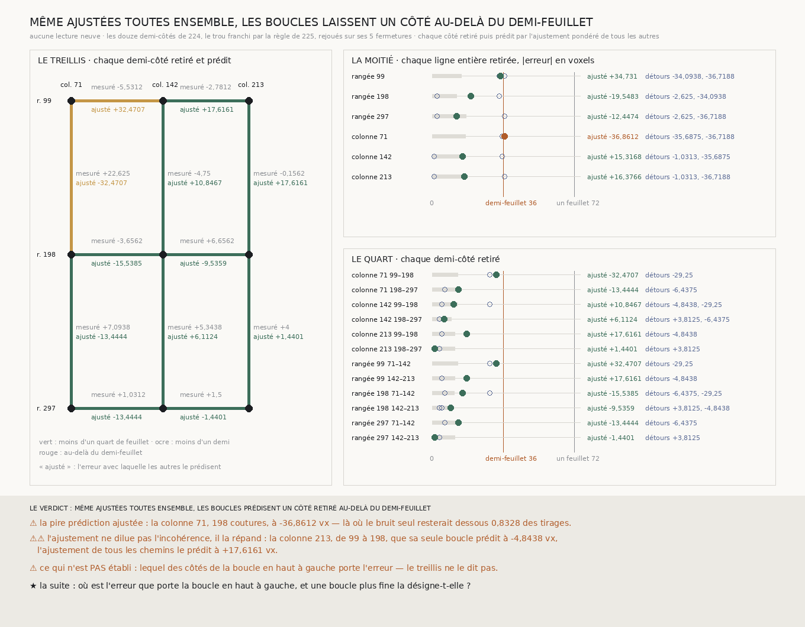

# `226` — L'ajustement de toutes les boucles garde-t-il la spire ? Non : il répand l'erreur au lieu de la diluer

*Les douze demi-côtés du treillis, ajustés tous à la fois, prédisent chaque côté qu'on leur retire. Au quart de segment, tous restent sous le demi-feuillet ; à la moitié, la colonne 71 entière est prédite à −36,8612 voxels, au-delà. Et sur plusieurs côtés l'ajustement fait moins bien qu'un seul détour : l'incohérence de la boucle en haut à gauche se répand dans les prédictions de côtés qu'elle ne touche pas.*

## 0. Pourquoi cette tranche

`225` a trouvé la limite du consensus : un chemin accumule son erreur comme une marche, et à la moitié du
segment les deux chemins du grand rectangle arrivent à un demi-feuillet l'un de l'autre. `R4-P71` demande
ce qui ne s'accumule pas, et nomme un candidat avec son piège : **ajuster toutes les boucles à la fois**,
en sachant qu'un ajustement ferme les boucles par construction et ne se juge donc que sur des côtés qu'il
n'a pas vus.

⚠⚠⚠ Le fichier a été écrit avant qu'aucun ajustement ne soit calculé sur la matière. Aucune lecture
neuve : les sommes sont celles de `224`, le trou franchi par la règle de `225`, et les cinq fermetures de
`225` sont d'abord rejouées depuis ces sommes, à l'identique.

## 1. L'ajustement, et comment il est jugé

Les six bandes forment un treillis de neuf nœuds et de douze demi-côtés, chacun portant la somme des pas
du consensus le long de lui. L'ajustement donne à chaque nœud la profondeur $D$ qui minimise

$$\sum_{e} w_e \left(D_{\text{tête}(e)} - D_{\text{queue}(e)} - s_e\right)^2, \qquad w_e = \frac{1}{\mathrm{var}(s_e)}$$

où $\mathrm{var}(s_e)$ est la variance que les blocs des pas centrés du demi-côté donnent à sa somme,
l'instrument du nul de `224`. Puis **validation croisée à deux échelles** : chaque demi-côté (71 ou 99
coutures) est retiré, puis chaque ligne entière (142 ou 198 coutures), et l'ajustement des autres prédit la
profondeur entre ses deux bouts. L'erreur est comparée au demi-feuillet, et à celle d'un seul détour, qui
est exactement la fermeture de la boucle qui contient le côté retiré.

## 2. Le quart : tout reste sous le demi-feuillet

Les douze demi-côtés retirés sont prédits sous le demi-feuillet, le pire à **32,4707** voxels. ⚠ Mais ce
pire est porté deux fois, au signe près, par les deux côtés extérieurs de la boucle en haut à gauche : la
colonne 71 de 99 à 198 (mesurée à **22,625**, prédite à **−32,4707**) et la rangée 99 de 71 à 142 (prédite
à **32,4707**). Le treillis voit que cette boucle se ferme mal ; il ne voit pas lequel de ses côtés se
trompe.

## 3. La moitié : la colonne 71 entière passe au-delà

| ligne retirée | coutures | mesurée | ajustée | un seul détour | le bruit seul : médiane | le bruit seul sous le demi-feuillet |
|---|---:|---:|---:|---|---:|---:|
| rangée 99 | 142 | −8,3125 | **34,731** | −34,0938 ; −36,7188 | 14,9973 | 0,9209 |
| rangée 198 | 142 | 3 | −19,5483 | −2,625 ; −34,0938 | 12,4097 | 0,9479 |
| rangée 297 | 142 | 2,5312 | −12,4474 | −2,625 ; −36,7188 | 17,102 | 0,8458 |
| **colonne 71** | 198 | 29,7188 | **−36,8612** | −35,6875 ; −36,7188 | 17,0673 | 0,8328 |
| colonne 142 | 198 | 0,5938 | 15,3168 | −1,0313 ; −35,6875 | 14,5753 | 0,9089 |
| colonne 213 | 198 | 3,8438 | 16,3766 | −1,0313 ; −36,7188 | 16,2839 | 0,8949 |

⭐⭐⭐⭐ **Même ajustées toutes ensemble, les boucles prédisent la colonne 71 entière à −36,8612 voxels,
au-delà du demi-feuillet.** Des côtés de bruit indépendant, ajustés de même, n'y resteraient dessous que
dans **0,8328** des tirages : ce n'est pas une rareté, c'est ce qu'une erreur de cette taille fait à cette
échelle.

⚠⚠⚠ **Et l'ajustement ne dilue pas l'incohérence, il la répand.** La colonne 213 de 99 à 198, que sa seule
boucle prédit à **−4,8438**, l'ajustement de tous les chemins la prédit à **17,6161** : la boucle en haut à
gauche, qui ne la touche pas, tire sa prédiction. De même, les deux lignes de la croix, que la moitié basse et
la moitié droite prédisent à **−2,625** et **−1,0313**, l'ajustement les prédit à **−19,5483** et **15,3168**.
Moyenner tous les chemins, c'est aussi moyenner le chemin qui se trompe.

## 4. Le verdict

**MÊME AJUSTÉES TOUTES ENSEMBLE, LES BOUCLES PRÉDISENT UN CÔTÉ RETIRÉ AU-DELÀ DU DEMI-FEUILLET.**

⭐⭐⭐⭐ **`R4-P71` est répondue par la négative pour le candidat qu'elle nommait** : un ajustement de toutes
les boucles à la fois ne garde pas la spire à la moitié du segment. L'erreur n'est pas un bruit réparti
également entre les côtés, qu'une moyenne effacerait ; elle est **concentrée** dans la boucle en haut à
gauche, et une moyenne la propage.

## 5. Ce que cette tranche ne dit pas

- ⚠⚠⚠ **Lequel des côtés de la boucle en haut à gauche porte l'erreur.** Ses deux côtés extérieurs sont
  prédits à la même erreur au signe près : le treillis n'a qu'une boucle pour les juger.
- ⚠⚠ **Qu'un meilleur ajustement échouerait aussi.** Seul l'ajustement pondéré par moindres carrés est
  mesuré ; un ajustement qui écarterait un côté incohérent au lieu de le moyenner n'est pas essayé, faute
  de boucles pour dire lequel écarter.
- ⚠ Quatre boucles seulement : ce que ferait un treillis dense n'est pas mesuré.

## 6. Les sondes et les bris

**Seize bris** ont été appliqués un par un au code, et **les seize rougissent** : une rangée ou une colonne
prise à l'envers dans le treillis, les poids ignorés ou pris comme la variance au lieu de son inverse, le
côté retiré laissé dans l'ajustement ou sa mesure oubliée dans l'erreur, un treillis coupé qui prédit quand
même, une ligne entière réduite à un demi-côté ou prédite vers le mauvais bout, un détour pris dans toute
boucle, une moitié qui ne somme qu'une boucle, le nul tiré à une seule graine, le demi-feuillet doublé,
l'issue où dépasser après l'ajustement ne prime plus, les fermetures de `225` qui ne sont plus rejouées, et
un pas de `225` écrit par-dessus un consensus.

⚠ **Deux bris ont d'abord passé**, et deux sondes ont été ajoutées avant la mesure : rien ne vérifiait que
les poids **utilisés** étaient l'inverse des variances publiées, ni qu'une erreur entre le demi-feuillet et
le feuillet entier soit dite au-delà. Une sonde nommait plus qu'elle ne vérifiait : elle compare désormais
la prédiction par les trois autres côtés d'une boucle à sa fermeture. Après la mesure, seuls des libellés
de la figure ont changé.

La mesure est déterministe et se rejoue à l'octet près.

## 7. Ce qui reste

⭐⭐⭐ **Ce qui s'ouvre** (`R4-P72`) : où est l'erreur que porte la boucle en haut à gauche ? Une boucle
plus fine la désigne-t-elle ? Une bande de rangées et une bande de colonnes de plus, au milieu de ce
quadrant, le couperaient en quatre boucles qui ne partagent chacune qu'une partie de ses côtés. ⚠⚠ C'est
une lecture neuve, ses bandes se dérivent par la même règle que celles de `224`, et le piège de `219` vaut
ici : une boucle qui désigne un côté ne dit pas encore si c'est la matière ou la lecture qui se trompe.
