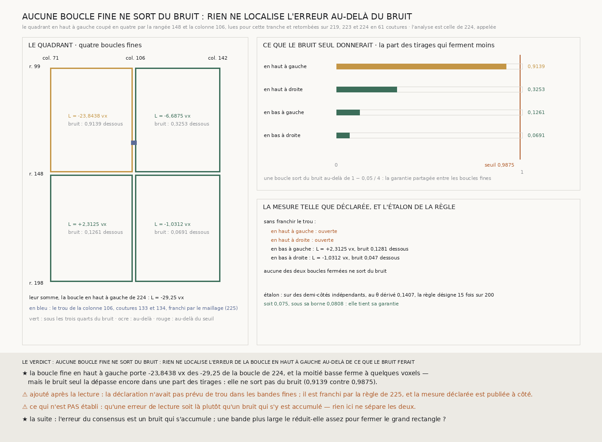

# `227` — Où est l'erreur de la boucle en haut à gauche ? Surtout dans son coin en haut à gauche, mais pas au-delà de ce que le bruit ferait

*Le quadrant en haut à gauche, coupé en quatre par deux bandes lues pour cette tranche, montre où sa fermeture se loge : la boucle fine en haut à gauche porte −23,8438 des −29,25 voxels, et la moitié basse ferme à quelques voxels. Mais des demi-côtés de bruit indépendant fermeraient plus fort qu'elle dans une part de leurs tirages : aucune boucle fine ne sort du bruit, et rien ne localise l'erreur au-delà.*

## 0. Pourquoi cette tranche

`226` a montré qu'ajuster toutes les boucles à la fois répand l'erreur au lieu de la diluer : la boucle en
haut à gauche ferme à −29,25 voxels quand les trois autres ferment à quelques voxels, et le treillis de
`224` n'a qu'une boucle pour juger ses côtés. C'est `R4-P72` : une boucle plus fine désigne-t-elle où
l'erreur se trouve ?

⚠⚠⚠ Le fichier a été écrit avant que les bandes nouvelles ne soient lues.

## 1. Les boucles fines, et la lecture

Le quadrant — rangées 99 à 198, colonnes 71 à 142 — est coupé en quatre au milieu entier de ses côtés :
une bande de rangées autour de la rangée **148** et une bande de colonnes autour de la colonne **106**,
cinq lignes chacune, lues sur le seul quadrant. Les côtés extérieurs des boucles fines sont des moitiés des
côtés de la boucle en haut à gauche, déjà lus par `219`, `223` et `224`.

La lecture a rendu de **70** à **72** chunks sur **72** par rangée et de **94** à **100** sur **100** par
colonne, sans une perte réseau. Partout où les bandes nouvelles et les bandes publiées lisent la même
couture, elles retombent : **61** coutures, écart **0**.

⭐⭐ L'analyse est celle de `224`, **appelée** sur le treillis fin. Son grand rectangle est la boucle en haut
à gauche, et il retombe exactement sur la fermeture que `224` publie : **−29,25**.

## 2. ⚠⚠⚠ Un trou que la déclaration n'avait pas prévu

La bande de la colonne 106 n'a pas de majorité aux coutures **133** et **134**. **Telle que déclarée, la
mesure laisse donc deux boucles fines ouvertes** : les deux du haut. Les deux du bas se ferment, à
**+2,3125** et **−1,0312** voxels, et aucune ne sort du bruit.

Le trou est franchi par **la règle que `225` a retenue**, le maillage, lue dans sa mesure publiée et non
choisie ici, et la mesure déclarée est publiée à côté. C'est une décision prise **après** la lecture, et
elle est dite comme telle.

## 3. Les quatre boucles fines

| boucle fine | fermeture | le bruit seul : médiane | la part des tirages qui ferment moins |
|---|---:|---:|---:|
| **en haut à gauche** | **−23,8438** | 8,875 | **0,9139** |
| en haut à droite | −6,6875 | 10,6875 | 0,3253 |
| en bas à gauche | 2,3125 | 9,7187 | 0,1261 |
| en bas à droite | −1,0312 | 9,6875 | 0,0691 |
| *leur somme : la boucle en haut à gauche de `224`* | *−29,25* | | |

⭐⭐⭐ **La fermeture se loge dans le coin en haut à gauche.** La boucle fine en haut à gauche porte
**−23,8438** voxels de la fermeture, la moitié basse du quadrant ferme à quelques voxels.

⚠⚠⚠ **Mais elle ne sort pas du bruit.** La règle déclarée fait sortir une boucle quand sa fermeture dépasse
celle de demi-côtés tirés indépendamment dans au moins $1 - 0{,}05/4 =$ **0,9875** des tirages ; la boucle
fine en haut à gauche en est à **0,9139**. L'étalon de la règle tient : sur des demi-côtés indépendants
fabriqués, au $\theta =$ **0,1407** dérivé des demi-côtés lus, elle désigne **15** fois sur **200**, soit
**0,075**, sous sa borne **0,0808**.

⚠ Les quatre boucles fines ne se ferment pas non plus mieux que des marches indépendantes : $\sum L^2$ vaut
**619,6582** contre **686,3535**, $p =$ **0,446**.

## 4. Le verdict

**AUCUNE BOUCLE FINE NE SORT DU BRUIT : RIEN NE LOCALISE L'ERREUR DE LA BOUCLE EN HAUT À GAUCHE AU-DELÀ DE
CE QUE LE BRUIT FERAIT.**

⭐⭐⭐⭐ **`R4-P72` est répondue** : une boucle plus fine montre où la fermeture se loge, mais ne la désigne
pas. Le coin en haut à gauche du quadrant porte l'essentiel de l'erreur, et c'est ce qu'un bruit qui
s'accumule y ferait assez souvent pour qu'on ne puisse pas l'en distinguer.

⭐⭐⭐⭐ **La suite de `224` à `227` se lit d'un trait** : les chemins de consensus arrivent sur la même
spire au quart du segment ; leur erreur s'accumule comme une marche et atteint le demi-feuillet à la
moitié ; l'ajuster d'un coup la répand ; la chercher plus finement ne la trouve pas au-delà du bruit. **Ce
qui reste à essayer, pour garder la spire à l'échelle du segment, est de réduire le bruit du pas lui-même.**

## 5. Ce que cette tranche ne dit pas

- ⚠⚠⚠ **Qu'une erreur de lecture soit là plutôt qu'un bruit qui s'y est accumulé** : rien ici ne sépare
  les deux, et une boucle fine désigne une région, pas un côté.
- ⚠⚠ **L'issue telle que déclarée disait l'erreur « répartie »** : elle a été corrigée après la mesure,
  parce que ne pas sortir du bruit ne dit pas qu'une erreur est répartie, et la boucle fine en haut à
  gauche en porte l'essentiel.
- ⚠ Une seule boucle de `224` coupée, et un seul niveau de coupe.

## 6. Les sondes et les bris

**Dix-huit bris** ont été appliqués un par un au code, et **les dix-huit rougissent** : le treillis fin
hors du milieu, la bande de rangées lue sur toute la largeur, le domaine d'une bande amputé, les pas le
long d'une colonne non transposés, la reproduction qui tolère un voxel, une couture lue d'un seul côté ou
une bande sans croisement, la garantie non partagée entre les boucles fines, sortir strictement au-delà du
seuil, l'étalon qui tient toujours ou tiré au $\theta$ nul, une règle qui ne tient pas et désigne quand
même, le grand rectangle fin qui n'est plus comparé à `224`, la reproduction qui n'est plus exigée, les
bandes de `224` absentes des sources, le trou des bandes fines non franchi, la mesure déclarée remplacée
par la franchie, et l'étalon tiré sur des demi-côtés non franchis.

⚠⚠ **Avant la lecture, deux de mes sondes d'étalon étaient fausses.** L'une était trop grossière : à
quarante réplicats de cent quatre-vingt-dix-neuf tirages, la résolution du nul suffisait à passer la
borne ; elle tourne désormais aux tailles de la mesure. L'autre éprouvait le mauvais sens : un nul trop
large rend la règle prudente, pas trop prompte, et ce qui la rend trop prompte est une dépendance
**positive** des pas, que l'étalon voit. ⚠⚠ **Après la lecture**, le franchissement du trou et les cinq
sondes qui l'éprouvent ont été ajoutés, et l'issue « répartie » corrigée : c'est dit en §2 et §5.

La mesure est déterministe et se rejoue à l'octet près depuis sa lecture publiée.

## 7. Ce qui reste

⭐⭐⭐ **Ce qui s'ouvre** (`R4-P73`) : l'erreur du consensus est un bruit qui s'accumule. **Une bande plus
large le réduit-elle assez pour que le grand rectangle se ferme sous le demi-feuillet ?** Cinq lignes,
c'est le nombre que `219` a pris ; plus de lignes par bande réduisent la part de l'erreur que chaque ligne porte seule.
⚠⚠⚠ Et le piège est connu depuis `208` : la part que les lignes voisines **partagent** ne se réduit par
aucune largeur de bande.
