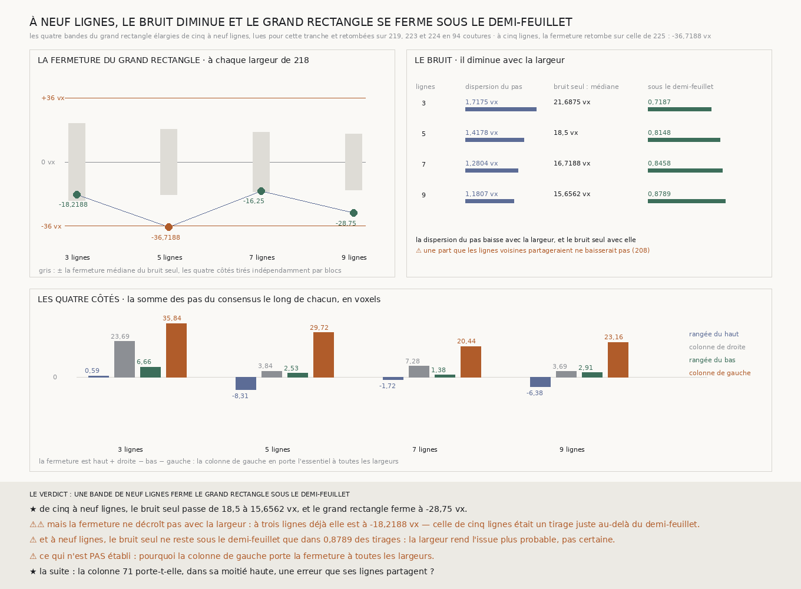

# `228` — Une bande plus large ferme-t-elle le grand rectangle ? À neuf lignes, oui, et le bruit diminue ; mais la fermeture ne suit pas la largeur

*Les quatre bandes du grand rectangle, élargies de cinq à neuf lignes, montrent le bruit du consensus diminuer à chaque largeur de l'échelle de `218`, et le grand rectangle fermer à −28,75 voxels à neuf lignes, sous le demi-feuillet. Mais la fermeture ne décroît pas avec la largeur : à trois lignes elle est déjà à −18,2188, et celle de cinq lignes, −36,7188, était un tirage juste au-delà. La colonne de gauche porte la fermeture à toutes les largeurs.*

## 0. Pourquoi cette tranche

De `224` à `227` : les chemins de consensus arrivent sur la même spire au quart du segment ; leur erreur
s'accumule comme une marche, et le grand rectangle ferme à −36,7188 voxels, juste au-delà du demi-feuillet
(`225`) ; l'ajuster d'un coup la répand (`226`) ; la chercher plus finement ne la trouve pas au-delà du
bruit (`227`). C'est `R4-P73` : ce qui reste à essayer est de réduire le bruit du pas lui-même, par des
bandes plus larges.

⚠⚠⚠ Le fichier a été écrit avant que la moindre ligne nouvelle ne soit lue.

## 1. La largeur, dérivée ; la lecture, contrôlée

Cinq lignes, c'est le plus petit nombre que `218` a trouvé pour voir une rangée qui saute, pas une largeur
choisie contre le bruit. `218` a déclaré son échelle, **3, 5, 7 et 9** lignes, et cette tranche la reprend
telle quelle. Seules les quatre bandes du grand rectangle sont élargies : deux lignes de plus de chaque côté,
lues comme huit bandes de deux lignes consécutives, sur la portion que le grand rectangle traverse ; les cinq
lignes du milieu sont celles de `224`. À chaque largeur $k$, le consensus est la médiane des lignes présentes
pourvu qu'elles soient une majorité, $\lfloor k/2 \rfloor + 1$, et un trou de majorité est franchi par la
règle de `225`, le maillage.

Partout où les lignes nouvelles et les bandes publiées lisent la même couture, elles retombent : **94**
coutures, écart **0**. Et à cinq lignes, la fermeture retombe exactement sur celle que `225` publie,
**−36,7188**.

## 2. Largeur par largeur

| lignes | fermeture | dispersion du pas | bruit seul : médiane | bruit seul sous le demi-feuillet |
|---:|---:|---:|---:|---:|
| 3 | −18,2188 | 1,7175 | 21,6875 | 0,7187 |
| 5 | **−36,7188** | 1,4178 | 18,5 | 0,8148 |
| 7 | −16,25 | 1,2804 | 16,7188 | 0,8458 |
| 9 | **−28,75** | 1,1807 | 15,6562 | 0,8789 |

⭐⭐⭐⭐ **Le bruit du consensus diminue avec la largeur, à chaque pas de l'échelle** : la dispersion du pas
passe de **1,7175** à **1,1807** voxels, et la fermeture médiane de côtés tirés indépendamment de
**21,6875** à **15,6562**. À neuf lignes, le grand rectangle ferme à **−28,75** voxels, sous le
demi-feuillet.

⚠⚠⚠ **Mais la fermeture elle-même ne suit pas la largeur.** À trois lignes, les plus bruitées, elle est déjà
à **−18,2188** ; à sept, à **−16,25** ; seule celle de cinq lignes passe le demi-feuillet. La fermeture d'une
boucle est **un tirage** : celui de cinq lignes était juste au-delà, ceux des autres largeurs en deçà. Ce que
la largeur change, c'est la loi de ce tirage : à neuf lignes, le bruit seul reste sous le demi-feuillet dans
**0,8789** des tirages, contre **0,8148** à cinq. L'issue devient plus probable, pas certaine.

## 3. La colonne de gauche

| lignes | rangée du haut | colonne de droite | rangée du bas | colonne de gauche |
|---:|---:|---:|---:|---:|
| 3 | 0,5938 | 23,6875 | 6,6562 | **35,8438** |
| 5 | −8,3125 | 3,8438 | 2,5312 | **29,7188** |
| 7 | −1,7188 | 7,2812 | 1,375 | **20,4375** |
| 9 | −6,375 | 3,6875 | 2,9062 | **23,1562** |

⚠⚠ La fermeture vaut haut + droite − bas − gauche, et **la colonne de gauche en porte l'essentiel à toutes
les largeurs**, de **20,4375** à **35,8438** voxels ; à cinq, sept et neuf lignes, les trois autres côtés se
compensent à quelques voxels, et à trois lignes seulement la colonne de droite en porte une part. Une erreur que les lignes d'une bande partagent ne se réduit par aucune largeur, c'est le piège de
`208` ; ce tableau en a l'allure, sans le prouver. Et `227` a déjà montré où, dans le quadrant en haut à
gauche : la moitié basse de la colonne 71 est compensée par la colonne 106, la moitié haute ne l'est pas.

## 4. Le verdict

**UNE BANDE DE NEUF LIGNES FERME LE GRAND RECTANGLE SOUS LE DEMI-FEUILLET.**

⭐⭐⭐⭐ **`R4-P73` est répondue** : la largeur réduit le bruit du consensus, et à neuf lignes le grand
rectangle, deux chemins de la moitié du segment, arrive sur la même spire. ⚠⚠ Mais ce n'est pas la largeur
qui l'y fait arriver à coup sûr : la fermeture de chaque largeur est un tirage, et l'erreur qu'elle porte
vient surtout d'un seul côté, qui ne s'amenuise pas comme le bruit.

## 5. Ce que cette tranche ne dit pas

- ⚠⚠⚠ **Pourquoi la colonne de gauche porte la fermeture à toutes les largeurs.** Une erreur partagée par
  ses lignes, ou une géométrie que les autres chemins ne voient pas : rien ici ne sépare les deux.
- ⚠⚠ Les largeurs sont emboîtées : les lignes de trois sont dans celles de cinq, et ainsi de suite. Leurs
  fermetures ne sont pas des tirages indépendants.
- ⚠ Une boucle, un segment ; et une fermeture sous le demi-feuillet dit que deux chemins s'accordent, pas
  lequel est sur la bonne spire.

## 6. Les sondes et les bris

**Dix bris** ont été appliqués un par un au code, et **les dix rougissent** : l'échelle de `218` tronquée,
la majorité d'une ligne de moins, une bande de plus qui reprend une ligne publiée, une largeur qui garde
toutes les lignes, un trou de majorité laissé ouvert, la fermeture sans les signes, l'issue où ne pas
réduire le bruit ne prime plus, cinq lignes qui ne sont plus comparées à `225`, la reproduction qui n'est
plus exigée, et les lignes lues ici qui n'entrent pas dans la bande.

⚠ **Un bris a d'abord passé** : les lignes lues ici laissées hors de la bande, parce que ma sonde regardait la
dispersion, qui change aussi quand neuf lignes n'en ont que cinq. Chaque largeur dit désormais combien de
lignes vote sur chaque côté, et la sonde exige neuf à neuf lignes. Avant la lecture. Après la mesure, seul un
libellé de la figure a changé : une comparaison de rythme de décroissance que la mesure ne produisait pas a
été retirée.

La mesure est déterministe et se rejoue à l'octet près depuis sa lecture publiée.

## 7. Ce qui reste

⭐⭐⭐ **Ce qui s'ouvre** (`R4-P74`) : la colonne 71 porte-t-elle, dans sa moitié haute, une erreur que ses
lignes partagent ? C'est le côté qui porte la fermeture du grand rectangle à toutes les largeurs, et celui que
la boucle fine en haut à gauche de `227` ne compense pas. ⚠⚠ Une erreur partagée ne se voit pas par le vote
des lignes qui la partagent : il faudra un chemin qui ne passe pas par elles.
