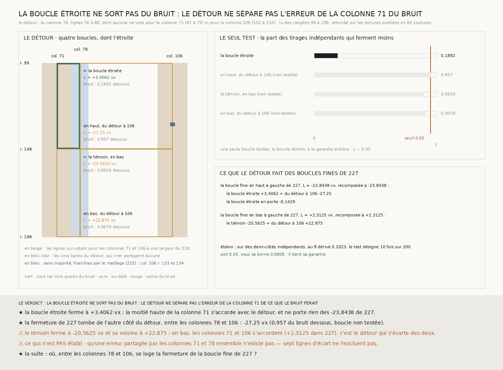

# `229` — Un détour sépare-t-il l'erreur de la colonne 71 ? Il s'accorde avec elle, et la fermeture tombe de l'autre côté du détour

*Une colonne lue pour cette tranche, la 78, dont aucune ligne ne vote pour la colonne 71, coupe en deux la boucle fine en haut à gauche de `227`. La boucle étroite entre la moitié haute de la colonne 71 et ce détour ferme à +3,4062 voxels, loin du bruit : elle ne porte rien des −23,8438 de `227`, qui tombent de l'autre côté du détour, à −27,25.*

## 0. Pourquoi cette tranche

`228` a trouvé que la colonne de gauche du grand rectangle en porte l'essentiel de la fermeture à toutes les
largeurs, et `227` que la moitié basse de cette colonne est compensée par la colonne 106, pas la moitié haute.
C'est `R4-P74` : la colonne 71 porte-t-elle, dans sa moitié haute, une erreur que ses lignes partagent ? Une
telle erreur ne se voit pas par le vote des lignes qui la partagent. Il faut un chemin qui ne passe pas par
elles.

⚠⚠⚠ Le fichier a été écrit avant que la moindre ligne nouvelle ne soit lue.

## 1. Le détour, dérivé ; la lecture, contrôlée

Les lignes de la colonne 71 sont toutes celles qui votent pour elle à une largeur de l'échelle de `218` :
de **67** à **75**. Le détour est la bande de cinq lignes la plus proche d'elle dont aucune ligne n'est une
des siennes ni une de celles de la colonne 106 (**102** à **110**) : la colonne **78**, lignes **76** à
**80**. Il est cherché vers l'intérieur de la boucle fine, le seul côté où les trois autres côtés de la
boucle étroite sont déjà lus, et lu des rangées 99 à 198, l'étendue du treillis fin de `227`.

Partout où le détour et une lecture publiée lisent la même couture, ils retombent : **82** coutures, écart
**0**, contre `219`, `224`, `227` et `228`. Le détour a une majorité à chacune de ses **99** coutures ; la
colonne 106 garde les deux trous que `227` y a trouvés, aux coutures 133 et 134, franchis par la règle de
`225`, cette fois déclarée avant la lecture. Et recomposées sur le treillis du détour, les deux boucles fines
de gauche de `227` retombent exactement sur ce qu'il publie, **−23,8438** et **2,3125**.

## 2. La boucle étroite

| boucle du détour | fermeture | le bruit seul : médiane | la part des tirages qui ferment moins |
|---|---:|---:|---:|
| **la boucle étroite**, colonnes 71 à 78, en haut | **+3,4062** | 9,1875 | **0,1892** |
| colonnes 78 à 106, en haut | −27,25 | 8,1875 | 0,957 |
| le témoin, colonnes 71 à 78, en bas | −20,5625 | 8,2188 | 0,8919 |
| colonnes 78 à 106, en bas | 22,875 | 9,1875 | 0,9079 |

⭐⭐⭐⭐ **La moitié haute de la colonne 71 s'accorde avec le détour.** La boucle étroite ferme à
**+3,4062** voxels : moins que le bruit seul dans **0,1892** des tirages, loin du seuil de **0,95**, le seul
test déclaré. Sur les **−23,8438** voxels de la boucle fine en haut à gauche de `227`, elle en porte une
part de **−0,1429** : rien.

L'étalon du test tient : sur des demi-côtés indépendants fabriqués, au $\theta =$ **0,2023** dérivé des
demi-côtés lus, il désigne **10** fois sur **200**, soit **0,05**, sous sa borne **0,0808**.

## 3. De l'autre côté du détour

⭐⭐⭐ **La fermeture de `227` tombe entre les colonnes 78 et 106** : la boucle du détour à la colonne 106, en
haut, ferme à **−27,25** voxels. ⚠⚠ Elle dépasse le bruit seul dans **0,957** des tirages, au-delà du seuil
du test, mais elle n'était pas déclarée : la tester maintenant serait la choisir après l'avoir regardée. À la
garantie partagée entre les quatre boucles, aucune ne sortirait.

⚠⚠ **Le témoin ne ferme pas comme prévu.** En bas, où `227` a trouvé les colonnes 71 et 106 d'accord, à
**2,3125**, la boucle étroite ferme à **−20,5625** et sa voisine à **22,875** : c'est le détour qui s'écarte
des deux, d'écarts presque opposés, comme un côté commun le ferait. Ni l'une ni l'autre ne dépasse le
bruit au seuil du test.

## 4. Le verdict

**LA BOUCLE ÉTROITE NE SORT PAS DU BRUIT : LE DÉTOUR NE SÉPARE PAS L'ERREUR DE LA COLONNE 71 DE CE QUE LE
BRUIT FERAIT.**

Le verdict déclaré est gardé tel quel, et ce qu'il dit ici est plus net que sa phrase : la boucle étroite
n'est pas au bord du seuil, elle ferme à quelques voxels et ne porte rien de la fermeture de `227`. Ce que
la question soupçonnait de la moitié haute de la colonne 71, un chemin qui ne passe par aucune de ses lignes
ne le voit pas.

⭐⭐⭐⭐ **`R4-P74` est répondue** : la moitié haute de la colonne 71 s'accorde avec un détour qui ne partage
aucune de ses lignes, et la fermeture de la boucle fine en haut à gauche tombe de l'autre côté de ce détour.

## 5. Ce que cette tranche ne dit pas

- ⚠⚠⚠ **Qu'aucune erreur ne soit partagée par les colonnes 71 et 78 ensemble.** Sept lignes d'écart ne
  l'excluent pas : un détour qui s'accorde avec une colonne ne dit pas qu'elle est juste.
- ⚠⚠ **Lequel des côtés entre les colonnes 78 et 106 porte la fermeture** : la moitié haute de la colonne
  106, avec ses deux coutures franchies par des pas nuls, ou les rangées 99 et 148 entre ces colonnes. Une
  boucle désigne une région, pas un côté.
- ⚠ Pourquoi le détour s'écarte des colonnes 71 et 106 dans la moitié basse : rien ici ne sépare une erreur
  de sa lecture d'un bruit qui s'y est accumulé.

## 6. Les sondes et les bris

**Vingt et un bris** ont été appliqués un par un au code, et **les vingt et un rougissent** : les lignes de la
colonne réduites à une seule largeur, le détour qui ignore la colonne intérieure, cherché dans un seul sens ou
pris le plus loin, le treillis coupé contre la colonne extérieure, le détour lu sur la seule moitié haute, la
boucle fine du bas recomposée de travers, le trou laissé ouvert, le test pris sur les quatre boucles, l'étalon
tiré au $\theta$ nul, la part rapportée à la mauvaise boucle, la boucle étroite prise à droite, le verdict qui
ignore l'étalon, l'étalon qui ne prime plus, les boucles de `227` qui ne sont plus comparées, la reproduction
qui n'est plus exigée, les lectures de `227` et `228` absentes des sources, le treillis de `227` qui n'est plus
vérifié, la définition de la lecture qui ne l'est plus, le détour lu à neuf lignes, et le consensus du test
sans le franchissement.

⚠ **Deux bris ont d'abord passé** : la part rapportée à la boucle fine du bas, parce que ma sonde n'en
bornait qu'un côté, et le verdict qui ignore l'étalon, parce qu'aucun étalon fabriqué ne manquait sa
garantie ; la part est désormais comparée à sa définition, et un étalon qui ne tient pas est forcé. ⚠ Une
sonde a aussi échoué sur un tirage malchanceux du bruit fabriqué, pas sur le code : les sondes qui éprouvent
la logique tournent sur un bruit fabriqué plus faible que l'erreur qu'elles injectent. Tout cela avant la
lecture. Après la mesure, seule la bande de la figure a été écrite, et une phrase qui y lisait des boucles
d'autres tranches, que la mesure ne produit pas, en a été retirée.

La mesure est déterministe et se rejoue à l'octet près depuis sa lecture publiée.

## 7. Ce qui reste

⭐⭐⭐ **Ce qui s'ouvre** (`R4-P75`) : la rangée 99, entre les colonnes 78 et 106, porte-t-elle la fermeture
que `228` voyait du côté de la colonne 71 ? Le long de la rangée 99, à cinq lignes, les boucles qui
ferment à quelques voxels l'évitent toutes — la boucle étroite (**+3,4062**), la boucle fine en haut à droite
de `227` (**−6,6875**), le rectangle en haut à droite de `225` (**−4,8438**) — et celles qui manquent de plus
de vingt voxels la traversent toutes : la boucle du détour à la colonne 106 (**−27,25**), la boucle fine en
haut à gauche (**−23,8438**), le rectangle en haut à gauche (**−29,25**) et le grand rectangle
(**−36,7188**). ⚠⚠ C'est une incidence, pas un test : il faudra un détour de la rangée, dérivé comme
celui-ci, par des lignes qui ne votent pas pour elle.
