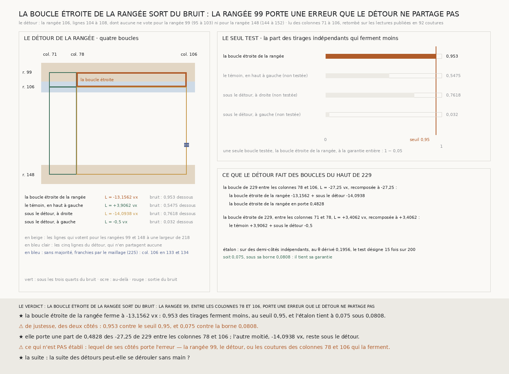

# `230` — Un détour sépare-t-il l'erreur de la rangée 99 ? Oui, de justesse, pour la moitié de la fermeture

*Une rangée lue pour cette tranche, la 106, dont aucune ligne ne vote pour la rangée 99, coupe en deux la boucle de `229` entre les colonnes 78 et 106. La boucle étroite entre la rangée 99 et ce détour ferme à −13,1562 voxels et sort du bruit, au seuil de son seul test, de justesse : c'est la première boucle à sortir du bruit depuis que `227` en a posé la règle. Elle porte une part de 0,4828 des −27,25 de `229` ; l'autre moitié reste sous le détour.*

## 0. Pourquoi cette tranche

`229` a montré que la moitié haute de la colonne 71 s'accorde avec un détour qui ne partage aucune de ses
lignes, et que la fermeture de la boucle fine en haut à gauche de `227` tombe de l'autre côté de ce détour,
entre les colonnes 78 et 106, à **−27,25** voxels. Le long de la rangée 99, les boucles qui ferment à quelques
voxels évitent ce segment, et celles qui manquent de plus de vingt voxels le traversent toutes. C'est
`R4-P75` : la rangée 99, entre les colonnes 78 et 106, porte-t-elle cette fermeture ? L'incidence n'est pas
un test.

⚠⚠⚠ Le fichier a été écrit avant que la moindre ligne nouvelle ne soit lue.

## 1. Le détour de la rangée, dérivé comme celui de `229`

Les lignes de la rangée 99 sont toutes celles qui votent pour elle à une largeur de l'échelle de `218` : de
**95** à **103**. Le détour est la bande de cinq lignes la plus proche d'elle dont aucune ligne n'est une des
siennes ni une de celles de la rangée 148 (**144** à **152**) : la rangée **106**, lignes **104** à **108**.
C'est la fonction de `229`, appelée sur les rangées, cherchée vers l'intérieur de sa boucle, et le détour est
lu sur les colonnes de son treillis, de 71 à 106.

Partout où le détour et une lecture publiée lisent la même couture, ils retombent : **92** coutures, écart
**0**, contre `224`, `227`, `228` et `229`. Le détour a une majorité à chacune de ses **35** coutures. Et
recomposées sur le treillis de la rangée, les deux boucles du haut de `229` retombent exactement sur ce qu'il
publie, **+3,4062** et **−27,25**.

## 2. La boucle étroite de la rangée

| boucle du treillis de la rangée | fermeture | le bruit seul : médiane | la part des tirages qui ferment moins |
|---|---:|---:|---:|
| **la boucle étroite de la rangée**, rangées 99 à 106, colonnes 78 à 106 | **−13,1562** | 4,375 | **0,953** |
| le témoin, rangées 99 à 106, colonnes 71 à 78 | +3,9062 | 3,5312 | 0,5475 |
| sous le détour, colonnes 78 à 106 | −14,0938 | 7,9688 | 0,7618 |
| sous le détour, colonnes 71 à 78 | −0,5 | 9 | 0,032 |

⭐⭐⭐⭐ **La boucle étroite de la rangée sort du bruit.** Elle ferme à **−13,1562** voxels, plus que le bruit
seul dans **0,953** des tirages, au-delà du seuil de **0,95** de son seul test ; et l'étalon du test tient :
sur des demi-côtés indépendants fabriqués, au $\theta =$ **0,1956** dérivé des demi-côtés lus, il désigne
**15** fois sur **200**, soit **0,075**, sous sa borne **0,0808**.

⚠⚠⚠ **De justesse, des deux côtés** : **0,953** contre **0,95**, et **0,075** contre **0,0808**. Le
témoin, qui longe la rangée 99 entre les colonnes 71 et 78, ferme à **+3,9062**, comme la boucle étroite
de `229` le laissait attendre.

## 3. La moitié qui reste

La boucle étroite de la rangée porte une part de **0,4828** des **−27,25** de `229`. ⚠⚠ L'autre moitié reste
sous le détour : la boucle entre les rangées 106 et 148, sur les mêmes colonnes, ferme à **−14,0938** voxels,
sans sortir du bruit, **0,7618** ; elle n'était pas testée.

## 4. Le verdict

**LA BOUCLE ÉTROITE DE LA RANGÉE SORT DU BRUIT : LA RANGÉE 99, ENTRE LES COLONNES 78 ET 106, PORTE UNE ERREUR
QUE LE DÉTOUR NE PARTAGE PAS.**

⭐⭐⭐⭐ **`R4-P75` est répondue**, pour la moitié : la boucle étroite de la rangée sort du bruit au seuil
de son seul test, et c'est la première boucle à le faire depuis que `227` en a posé la règle. ⚠⚠ Mais de
justesse, et elle ne porte qu'une moitié de la fermeture qu'elle devait expliquer.

## 5. Ce que cette tranche ne dit pas

- ⚠⚠⚠ **Lequel des côtés de la boucle étroite porte l'erreur** : la rangée 99, le détour lui-même, ou les
  sept coutures des colonnes 78 et 106 qui la ferment. Une boucle qui désigne désigne une région ; le verdict
  déclaré nomme la rangée 99, et la mesure ne l'en sépare pas du reste de la boucle.
- ⚠⚠ Ce que porte la moitié qui reste sous le détour : la moitié haute de la colonne 106, avec ses deux
  coutures franchies par des pas nuls, la rangée 148, ou la colonne 78 sous le détour.
- ⚠ Et le piège de `219` vaut : une boucle qui désigne ne dit pas si c'est la matière ou la lecture qui se
  trompe.

## 6. Les sondes et les bris

**Quinze bris** ont été appliqués un par un au code, et **les quinze rougissent** : le détour cherché depuis
la rangée intérieure, le treillis coupé contre la rangée extérieure, le détour lu sur la seule moitié
gauche, la boucle de droite de `229` recomposée de travers, la boucle étroite prise à gauche, le verdict qui
ignore l'étalon, l'étalon qui ne prime plus, la part rapportée à la boucle de gauche, les boucles de `229`
qui ne sont plus comparées, la reproduction qui n'est plus exigée, la lecture de `229` absente des sources, le
treillis de `229` qui n'est plus vérifié, la définition de la lecture qui ne l'est plus, le détour lu à neuf
lignes, et le détour remplacé par la rangée 99 elle-même.

⚠ **Un bris a d'abord passé** : le détour remplacé par la rangée 99 dans l'analyse, parce qu'une rangée
commune aux deux boucles se retire de leur somme, donc la recomposition de `229` ne pouvait pas le voir ; la
somme du détour est désormais comparée à la lecture neuve. Avant la lecture. Pour la partager avec cette
tranche, le test de `229` a été sorti dans une fonction appelée par les deux, et `229` se rejoue à l'octet
près après ce changement. Après la mesure, seule la bande de la figure a été écrite.

La mesure est déterministe et se rejoue à l'octet près depuis sa lecture publiée.

## 7. Ce qui reste

⭐⭐⭐ **Ce qui s'ouvre** (`R4-P76`) : la suite des détours peut-elle se dérouler sans main ? Deux détours
dérivés ont écarté la colonne 71 et désigné une boucle au-delà du bruit, mais chacun a été écrit à la main,
une tranche par détour, et la moitié de la fermeture reste sous le dernier. ⚠⚠ Une procédure qui, devant une
boucle qui ne ferme pas, dérive son détour, le lit, le teste et recommence, doit d'abord retrouver `229` et
`230` sans qu'on les lui indique. ⚠ Et sa règle d'arrêt se déclare avant qu'elle ne tourne.
