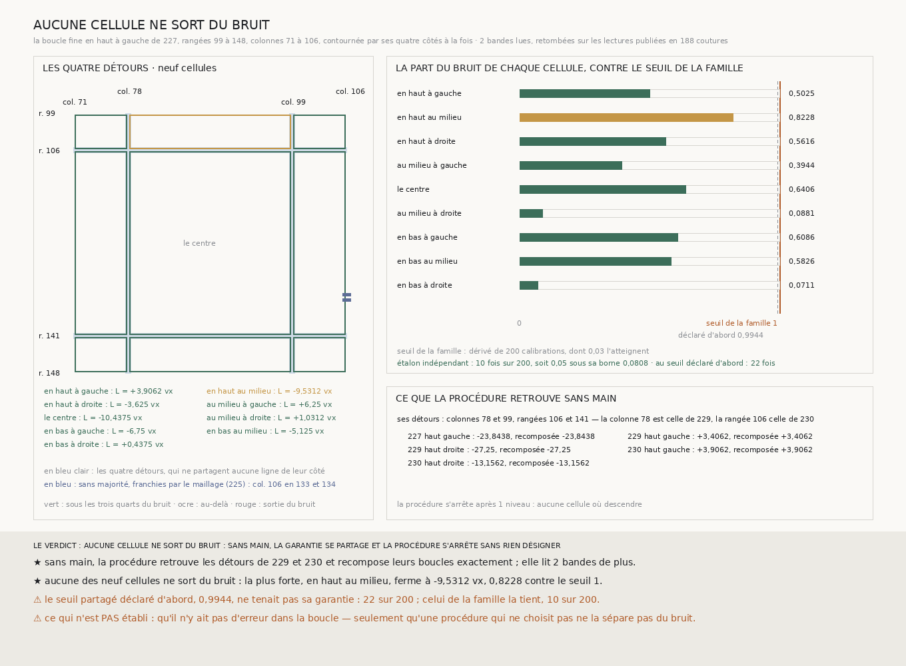

# `231` — La suite des détours peut-elle se dérouler sans main ? Elle retrouve `229` et `230`, mais ne désigne plus rien

*Une procédure qui ne choisit aucun côté contourne la boucle fine en haut à gauche de `227` par ses quatre côtés à la fois. Elle retrouve sans qu'on les lui indique les détours de `229` et `230`, et recompose exactement leurs boucles. Mais sans main pour déclarer une seule boucle, la garantie porte sur neuf cellules : le seuil qui la tient est au haut de l'échelle, et la plus forte cellule n'en approche pas, à 0,8228.*

## 0. Pourquoi cette tranche

`229` et `230` ont chacun dérivé un détour, et le second a fait sortir une boucle du bruit. Mais chaque fois,
une main a choisi le côté à contourner : la colonne 71 parce que `228` la désignait, la rangée 99 par une
incidence lue à l'œil. C'est `R4-P76` : la suite des détours peut-elle se dérouler sans main ?

⚠⚠⚠ Le fichier a été écrit avant que la moindre ligne nouvelle ne soit lue.

## 1. La procédure, déclarée

Devant une boucle qui ne ferme pas, la procédure contourne ses quatre côtés à la fois, chacun par le détour
de `229`. Les quatre côtés et les quatre détours font un treillis de neuf cellules, dont la somme est la
boucle. Chaque cellule est jugée par l'instrument de `224` ; la procédure descend dans une cellule qui sort
du bruit si elle a la place de ses propres détours, et s'arrête quand plus aucune n'y descend. Elle commence
là où la main a commencé en `229`.

⚠⚠⚠ **Déclaré d'abord, et remplacé avant la lecture.** Une cellule devait sortir au-delà de
$1 - 0{,}05/9$, la garantie partagée de `227`. Sur des pas fabriqués indépendants, avant toute lecture,
l'étalon de `227` ne tenait pas ce seuil : la plus forte des neuf cellules le passait trop souvent, et pas
seulement sur des côtés courts. Le seuil a été **dérivé** : la plus petite part que la plus forte cellule de
demi-côtés indépendants fabriqués n'atteint que dans au plus **0,05** de ses calibrations, et un second
étalon, sur d'autres tirages, le vérifie. Le seuil déclaré d'abord reste publié à côté.

## 2. Ce que la procédure retrouve

Ses quatre détours sont les colonnes **78** et **99** et les rangées **106** et **141** : la colonne 78 est
celle de `229`, la rangée 106 celle de `230`, et la procédure les reprend telles que publiées. Elle ne lit
que les **2** bandes qui manquent, et elles retombent sur les lectures publiées en **188** coutures, écart
**0**. Son treillis recompose exactement les cinq boucles de `227`, `229` et `230` : **−23,8438**,
**+3,4062**, **−27,25**, **+3,9062** et **−13,1562**.

## 3. Les neuf cellules

| cellule | fermeture | le bruit seul : médiane | la part des tirages qui ferment moins |
|---|---:|---:|---:|
| en haut à gauche | +3,9062 | 3,875 | 0,5025 |
| **en haut au milieu** | **−9,5312** | 4,625 | **0,8228** |
| en haut à droite | −3,625 | 3,1875 | 0,5616 |
| au milieu à gauche | +6,25 | 8,1562 | 0,3944 |
| le centre | −10,4375 | 7,5 | 0,6406 |
| au milieu à droite | +1,0312 | 6,5 | 0,0881 |
| en bas à gauche | −6,75 | 5,375 | 0,6086 |
| en bas au milieu | −5,125 | 4,25 | 0,5826 |
| en bas à droite | +0,4375 | 3,0312 | 0,0711 |

⭐⭐⭐⭐ **Aucune cellule ne sort du bruit.** Le seuil de la famille est au haut de l'échelle, **1** : il
faut qu'une cellule ferme au moins autant que tous les tirages du nul. **0,03** des calibrations l'atteignent déjà, et
**0,055** le cran d'en dessous. Son étalon indépendant le tient : **10** fois sur **200**, soit **0,05**, sous
sa borne **0,0808**, au $\theta =$ **0,2098**. La plus forte cellule, en haut au milieu, ferme à
**−9,5312** voxels, avec **0,8228** des tirages sous elle.

⚠⚠⚠ **Le seuil déclaré d'abord ne tient pas sa garantie sur la matière non plus** : à **0,9944**, son étalon
désigne **22** fois sur **200**. Une procédure qui l'aurait gardé aurait désigné plus souvent que sa garantie
ne le permet.

La région que `230` a désignée se partage entre deux cellules : **−9,5312** en haut au milieu, **−3,625** en
haut à droite.

## 4. Le verdict

**AUCUNE CELLULE NE SORT DU BRUIT : SANS MAIN, LA GARANTIE SE PARTAGE ET LA PROCÉDURE S'ARRÊTE SANS RIEN
DÉSIGNER.**

⭐⭐⭐⭐ **`R4-P76` est répondue** : la suite des détours se déroule sans main, elle retrouve `229` et `230`
sans qu'on les lui indique, mais elle ne désigne plus rien. Ce qu'une main déclarait en une seule boucle, une
procédure qui ne choisit pas doit le déclarer sur toutes, et à cette échelle aucune fermeture n'est assez
grande devant le bruit pour passer le seuil que la famille exige.

## 5. Ce que cette tranche ne dit pas

- ⚠⚠⚠ **Qu'il n'y ait pas d'erreur dans la boucle**, seulement qu'une procédure qui ne choisit pas ne la
  sépare pas du bruit.
- ⚠⚠ Qu'une main qui choisit bien soit à éviter : `230` a désigné parce qu'une seule boucle était déclarée.
  Cette tranche mesure ce que coûte de ne plus choisir.
- ⚠ La procédure commence où la main avait commencé ; commencer plus haut est une autre question.

## 6. Les sondes et les bris

**Dix-neuf bris** ont été appliqués un par un au code, et **les dix-neuf rougissent** : un détour cherché du
mauvais côté, deux détours qui se touchent acceptés, le treillis rangé à l'envers, une bande voulue sur une
partie de la boucle, les cellules aux coins permutés, une cellule qui a toujours la place, le seuil dérivé sur
les tirages de son étalon ou à deux fois la garantie, sortir strictement au-delà du seuil, la procédure qui
descend sans que l'étalon tienne, un seuil absent qui ne prime plus, la région de `230` réduite à une
cellule, les boucles publiées et les détours de `229` et `230` qui ne sont plus comparés, la lecture qui
n'est plus exigée exacte, la reproduction qui ne l'est plus, le registre qui oublie `229` et `230`, la
couverture d'une bande publiée qui n'est plus vérifiée, et un trou laissé ouvert.

⚠ **Deux bris ont d'abord fait mourir la batterie** au lieu de la faire rougir : deux appels de la procédure
n'étaient pas gardés ; ils le sont. ⚠ Et deux sondes de la descente passent désormais par un étalon forcé à
tenir ou à ne pas tenir : à sept coutures d'un côté, là où tombe tout détour, les pas fabriqués mettent déjà
le seuil de la famille au haut de l'échelle, et c'est aussi publié comme sonde. Tout cela avant la lecture.
Après la mesure, seule la figure a été écrite.

La mesure est déterministe et se rejoue à l'octet près depuis sa lecture publiée.

## 7. Ce qui reste

⭐⭐⭐ **Ce qui s'ouvre** (`R4-P77`) : à l'échelle du segment entier, les chemins de consensus à neuf lignes
restent-ils sur la même spire ? Sans main, les détours ne séparent plus du bruit les erreurs d'une dizaine de
voxels que portent ces cellules ; ce qu'une procédure sans main peut encore vérifier, c'est le critère
lui-même, le demi-feuillet, et `228` ne l'a mesuré qu'à la moitié du segment. ⚠⚠ Le rectangle se dérive
comme celui de `224`, jamais ne se choisit.
