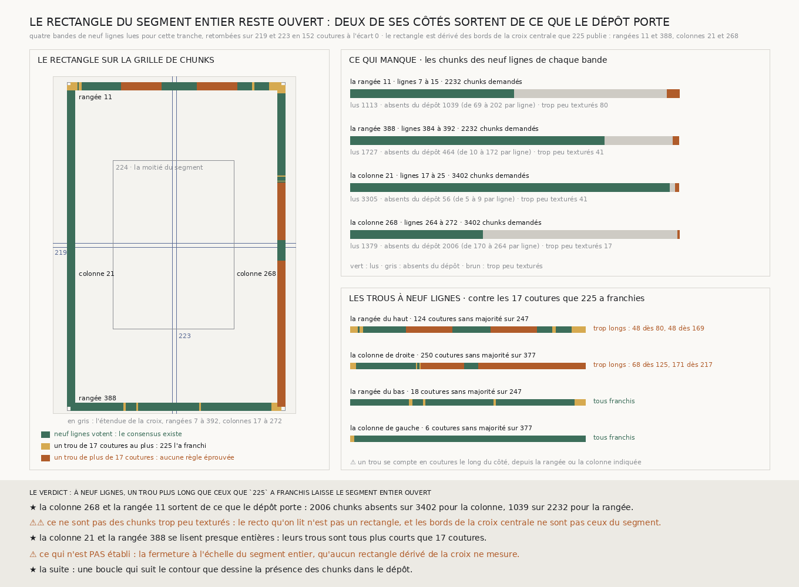

# `232` — Deux chemins du segment entier arrivent-ils sur la même spire ? Le rectangle reste ouvert : deux de ses côtés sortent de ce que le dépôt porte

*Le rectangle du segment entier, dérivé des bords de la croix centrale, a été lu à neuf lignes sur ses quatre côtés. La colonne de gauche et la rangée du bas se lisent presque entières. La rangée du haut et la colonne de droite perdent leur majorité sur des tronçons de 48 à 171 coutures, bien au-delà des 17 que `225` a franchies : il y manque des chunks absents du dépôt, pas des chunks trop peu texturés. Le recto qu'on lit n'est pas un rectangle, et aucune fermeture n'est mesurée.*

## 0. Pourquoi cette tranche

Sans main, `231` ne sépare plus du bruit les erreurs d'une dizaine de voxels que portent ses cellules. Ce
qu'une procédure sans main peut encore vérifier, c'est le critère lui-même, le demi-feuillet ; et `228` ne
l'a mesuré qu'à la moitié du segment, où le grand rectangle ferme à **−28,75** voxels à neuf lignes. C'est
`R4-P77` : à l'échelle du segment entier, les chemins de consensus à neuf lignes restent-ils sur la même
spire ?

⚠⚠⚠ Le fichier a été écrit avant que la moindre ligne nouvelle ne soit lue. La seule chose regardée avant
était la **présence** : les trous que `225` publie sur les deux bandes centrales.

## 1. Le rectangle, dérivé

`225` publie les trous du consensus de la colonne 142 de `223`, sur toute la hauteur, et de la rangée 198
de `219`, sur toute la largeur. Les trous qui touchent un bord de la grille ont été pris pour les bords du
segment : entre eux, la croix centrale se lit des rangées **7** à **392** et des colonnes **17** à **272**.
Les bandes du rectangle entier sont les plus extérieures dont les neuf lignes tombent toutes dans cette
étendue : les rangées **11** et **388**, les colonnes **21** et **268**. C'est l'échelle suivante de `224`,
dont les bandes étaient à mi-chemin du bord.

Chaque bande croise une bande publiée : les deux rangées coupent les colonnes de `223`, les deux colonnes les
rangées de `219`. Sur ces croisements les pas relus retombent, **152** coutures à l'écart **0**. Un trou de
majorité se franchit par la règle de `225`, le maillage, et seulement jusqu'à la plus longue longueur qu'elle
a essayée, **17** coutures.

## 2. Ce qui s'est lu

| bande | lignes | chunks demandés | lus | absents du dépôt | trop peu texturés |
|---|---|---:|---:|---:|---:|
| la rangée 11 | 7 à 15 | 2232 | 1113 | **1039** | 80 |
| la rangée 388 | 384 à 392 | 2232 | 1727 | 464 | 41 |
| la colonne 21 | 17 à 25 | 3402 | 3305 | 56 | 41 |
| la colonne 268 | 264 à 272 | 3402 | 1379 | **2006** | 17 |

⭐⭐⭐⭐ **Ce qui manque est absent du dépôt, pas trop peu texturé.** Sur la rangée 11, de **69** à **202**
chunks par ligne sont absents ; sur la colonne 268, de **170** à **264**. Les chunks refusés parce que trop
peu texturés ne sont jamais plus de **80** par bande.

## 3. Les trous à neuf lignes

| côté | coutures sans majorité | trous plus longs que 17 coutures |
|---|---:|---|
| la rangée du haut | 124 sur 247 | **48** dès la colonne 80, **48** dès la colonne 169 |
| la colonne de droite | 250 sur 377 | **68** dès la rangée 125, **171** dès la rangée 217 |
| la rangée du bas | 18 sur 247 | aucun |
| la colonne de gauche | 6 sur 377 | aucun |

La colonne de gauche et la rangée du bas se lisent presque entières, et leurs trous sont tous franchis. La
rangée du haut et la colonne de droite perdent leur majorité sur des tronçons que rien d'éprouvé ne franchit ;
la colonne de droite n'a plus de majorité de la rangée 217 jusqu'au coin. Il en va de même aux quatre
largeurs de l'échelle de `218`.

## 4. Le verdict

**À NEUF LIGNES, UN TROU PLUS LONG QUE CEUX QUE `225` A FRANCHIS LAISSE LE SEGMENT ENTIER OUVERT.**

⭐⭐⭐⭐ **Le recto qu'on lit n'est pas un rectangle.** Les bords de la croix centrale ne sont pas ceux du
segment : à la hauteur de la rangée 11 et à la largeur de la colonne 268, le dépôt ne porte pas de chunks sur
de longs tronçons. Un rectangle dérivé de la croix sort donc du segment par deux côtés, et le critère du
demi-feuillet ne s'y mesure pas.

⭐⭐⭐⭐ **`R4-P77` est conclue sans fermeture** : à l'échelle du segment entier, aucun rectangle dérivé de
la croix centrale ne porte deux chemins de consensus d'un coin à l'autre.

## 5. Ce que cette tranche ne dit pas

- ⚠⚠⚠ **La fermeture à l'échelle du segment entier.** Elle n'est pas au-delà du demi-feuillet ni en deçà :
  elle n'est pas mesurée.
- ⚠⚠ **Où passe le contour du segment.** Quatre bandes disent où le dépôt manque sur quatre lignes, pas le
  contour entier.
- ⚠ La dérivation supposait que les bords de la croix centrale sont ceux du segment ; la lecture montre
  qu'ils ne le sont pas, et c'est ce que la tranche publie.

## 6. Les sondes et les bris

**Vingt-six bris** ont été appliqués un par un au code, et **les vingt-six rougissent** : le bord de début
ignoré ou compté en coutures, le bord de fin décalé d'un chunk, tout trou pris pour un bord, une bande dont
seul le centre tombe dans l'étendue, les bandes extérieures sautées, le rectangle dérivé pour cinq lignes,
les deux sens permutés, une couture de trop dans la hauteur, une rangée lue sur toute la largeur, une colonne
sur la moitié de la hauteur, les trous comptés à la majorité de cinq lignes, la garde qui refuse la plus
longue longueur franchie ou qui ne garde plus rien, la plus courte longueur de `225` au lieu de la plus
longue, le rectangle de `228` fermé sur des colonnes permutées, un trou non franchi qui ne prime plus, les
deux issues fermées permutées, le verdict jugé à cinq lignes ou sans le demi-feuillet, les deux chemins
tracés à cinq lignes, les pas pris en travers de la bande, la reproduction qui n'est plus exigée, la
définition des bandes lues qui n'est plus vérifiée, la règle de `225` remplacée, et la moitié du segment
relue à la mauvaise largeur.

⚠ **Au premier passage, cinq bris ont fait mourir la batterie et deux ont passé** : une sonde nommait une
bande au lieu de la prendre dans ce qui est dérivé, la règle appliquée n'était pas publiée, et la moitié du
segment n'était comparée qu'à elle-même. La sonde prend désormais la bande dérivée, la règle appliquée est
publiée et comparée à celle de `225`, et la moitié du segment est comparée au fichier de `228`. Tout cela
avant la lecture.

⚠ La lecture a été interrompue une fois par un redémarrage de l'éditeur, après la première bande ; elle a
repris à la bande suivante, chaque bande étant écrite entière ou pas du tout. Après la mesure, seule la
figure a été écrite. La mesure est déterministe et se rejoue à l'octet près depuis sa lecture publiée.

## 7. Ce qui reste

⭐⭐⭐ **Ce qui s'ouvre** (`R4-P78`) : où s'arrête le segment, et une boucle qui suit son contour ferme-t-elle
sous le demi-feuillet ? La présence d'un chunk dans le dépôt ne dit rien de sa valeur ; ⚠⚠ le contour se
dérive d'elle, jamais ne se choisit.
