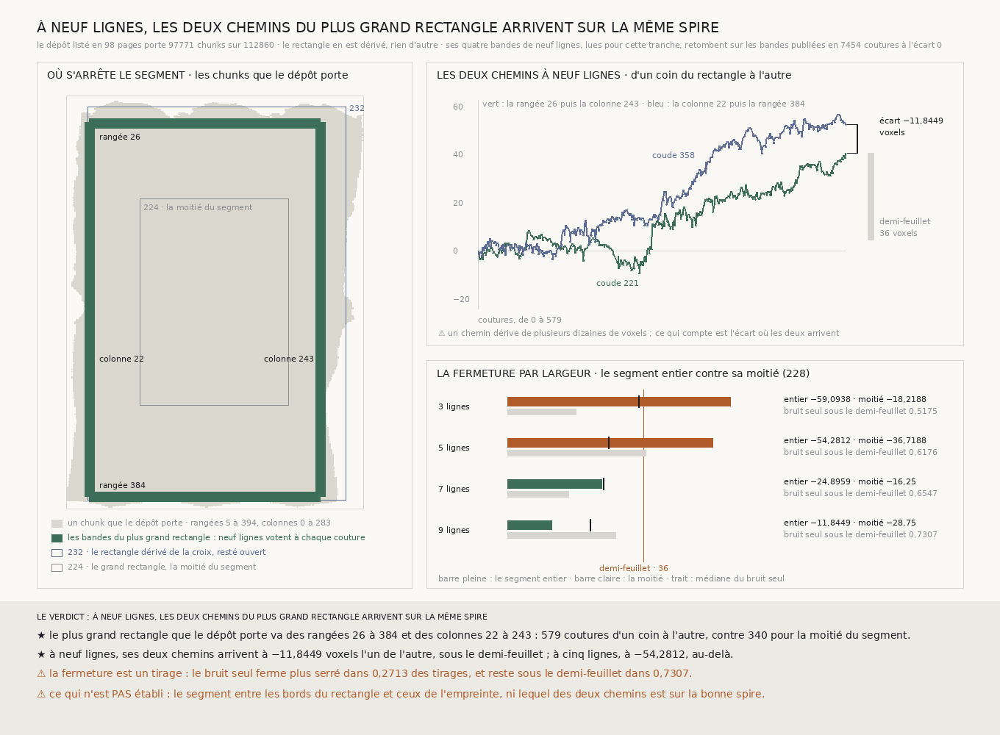

# `233` — Où s'arrête le segment, et le plus grand rectangle que le dépôt porte ferme-t-il sous le demi-feuillet ? Il ferme : à neuf lignes, ses deux chemins arrivent à −11,8449 voxels l'un de l'autre

*La liste des clés du dépôt dit où le segment porte des chunks sans en lire une valeur : 97771 chunks sur 112860, des rangées 5 à 394 et des colonnes 0 à 283. Le plus grand rectangle dont les quatre bandes de neuf lignes y tiennent va des rangées 26 à 384 et des colonnes 22 à 243, 579 coutures d'un coin à l'autre contre 340 pour la moitié du segment. Lues à neuf lignes, ses deux chemins arrivent à −11,8449 voxels l'un de l'autre, sous le demi-feuillet. À trois et cinq lignes, ils le dépassent.*

## 0. Pourquoi cette tranche

`232` a dérivé le rectangle du segment entier des bords de la croix centrale, et il est resté ouvert : la
rangée 11 et la colonne 268 perdent leur majorité sur des tronçons de **48** à **171** coutures, là où le
dépôt ne porte pas de chunks. Les bords de la croix ne sont pas ceux du segment. C'est `R4-P78` : où
s'arrête le segment, et une boucle qu'il porte tout entière ferme-t-elle sous le demi-feuillet ?

⚠⚠⚠ Le fichier a été écrit avant que le dépôt ne soit listé et que la moindre ligne nouvelle ne soit lue.
La seule chose regardée avant était que le dépôt se liste, et la forme de ses clés.

## 1. La présence, listée

Le tableau du niveau 0 est découpé en chunks de 128 sur 128, sur toute sa profondeur, et le dépôt n'écrit
pas un chunk vide. La liste de ses clés, **98** pages, dit donc chunk par chunk où le segment porte quelque
chose : **97771** chunks sur les **112860** de la grille,
des rangées **5** à **394** et des colonnes **0** à **283**.

⚠⚠⚠ La liste est contrôlée par ce que `232` a lu : sur chacune de ses **36** lignes, les chunks qu'elle dit
absents sont exactement ceux que la lecture a comptés « absents du dépôt ».

## 2. Le rectangle, dérivé

Une bande de neuf lignes tient à une couture quand ses neuf lignes y ont leurs deux chunks dans le dépôt.
La présence ne dit rien de la texture : les neuf présentes laissent aux chunks trop peu texturés la marge de
quatre lignes que la majorité accorde. Le rectangle est le plus grand dont les quatre bandes tiennent
partout : le plus long chemin d'un coin à l'autre, puis la plus grande aire, puis la plus petite rangée et la
plus petite colonne.

Il va des rangées **26** à **384** et des colonnes **22** à **243** : **579** coutures d'un coin à l'autre,
contre **340** pour le grand rectangle de `224`, la moitié du segment.

⚠ La règle a changé avant que le dépôt ne soit listé. Elle n'exigeait d'abord que la majorité, cinq lignes
présentes sur neuf ; sur une empreinte fabriquée pour la batterie, le rectangle longeait alors les bords où
cinq lignes seulement sont présentes, et un seul chunk trop peu texturé l'aurait ouvert.

## 3. Ce qui s'est lu

Les quatre bandes, neuf lignes chacune, par le lecteur de `224`. Partout où elles croisent une bande publiée,
de `219`, `223` ou `232`, les pas relus retombent : **7454** coutures, écart **0**. Et sur leurs **36**
lignes, les chunks que la lecture compte absents du dépôt sont ceux que la liste dit absents.

## 4. La fermeture, largeur par largeur

| lignes | segment entier | moitié (`228`) | dispersion du pas | bruit seul : médiane | bruit seul sous le demi-feuillet | bruit seul sous la fermeture |
|---:|---:|---:|---:|---:|---:|---:|
| 3 | **−59,0938** | −18,2188 | 1,7261 | 34,6562 | 0,5175 | 0,7387 |
| 5 | **−54,2812** | −36,7188 | 1,4794 | 26,75 | 0,6176 | 0,8208 |
| 7 | −24,8959 | −16,25 | 1,3959 | 25,375 | 0,6547 | 0,4855 |
| 9 | **−11,8449** | −28,75 | 1,2679 | 21,8569 | 0,7307 | 0,2713 |

À trois et cinq lignes, quelques trous de majorité de **5** coutures au plus, tous franchis par le maillage ;
à sept et neuf lignes, aucun.

⭐⭐⭐⭐ **À neuf lignes, le plus grand rectangle ferme à −11,8449 voxels, sous le demi-feuillet de 36.** Ses
deux chemins dérivent chacun de plusieurs dizaines de voxels, **+40,6324** par la rangée d'abord et
**+52,4774** par la colonne d'abord, et arrivent à la fermeture près l'un de l'autre. Les colonnes en
portent l'essentiel : **45,1715** voxels à droite, **34,4111** à gauche, contre **−4,539** pour la rangée du
haut et **18,0663** pour celle du bas.

⚠⚠⚠ **La fermeture reste un tirage.** À trois lignes elle est à **−59,0938**, à cinq à **−54,2812**,
au-delà du demi-feuillet ; à sept et neuf lignes, en deçà. Le bruit seul ferme plus serré que la mesure dans
**0,2713** des tirages à neuf lignes : la boucle ne s'écarte pas de ce que le bruit seul produit.

⚠⚠ **La marge du critère diminue avec la longueur de la boucle.** À neuf lignes, la fermeture médiane du
bruit seul passe de **15,6562** voxels à la moitié du segment à **21,8569** au segment entier, et la part des
tirages sous le demi-feuillet de **0,8789** à **0,7307**.

## 5. Le verdict

**À NEUF LIGNES, LES DEUX CHEMINS DU PLUS GRAND RECTANGLE ARRIVENT SUR LA MÊME SPIRE.**

⭐⭐⭐⭐ **`R4-P78` est répondue pour le plus grand rectangle.** Le segment s'arrête où le dépôt cesse de
porter des chunks, et c'est une liste qui le dit, pas une lecture. Le plus grand rectangle qui y tient, 579
coutures d'un coin à l'autre, ferme sous le demi-feuillet à neuf lignes : c'est la première boucle au-delà
de la moitié du segment qui ferme.

## 6. Ce que cette tranche ne dit pas

- ⚠⚠⚠ **Le segment au-delà du rectangle.** L'empreinte va des rangées 5 à 394 et des colonnes 0 à 283 ; les
  bandes du rectangle s'arrêtent aux rangées 26 et 384 et aux colonnes 22 et 243. Entre les deux, aucune
  boucle ne passe.
- ⚠⚠ **Une boucle qui suit le contour lui-même.** Le rectangle est la plus grande boucle droite dont les
  quatre bandes tiennent, pas le contour.
- ⚠⚠ Une fermeture sous le demi-feuillet dit que deux chemins s'accordent, pas lequel est sur la bonne
  spire, ni ce que porte l'intérieur du rectangle.
- ⚠ Les largeurs sont emboîtées : leurs fermetures ne sont pas des tirages indépendants.

## 7. Les sondes et les bris

**Vingt-sept bris** ont été appliqués un par un au code, et **les vingt-sept rougissent** : la liste
arrêtée à sa première page, le jeton de continuation passé brut, une page qui ne répond pas comptée en
absents, un second chunk de profondeur accepté, les métadonnées prises pour des chunks, une page tronquée
sans jeton acceptée, les absents d'une rangée comptés sans sa dernière colonne, ceux d'une colonne comptés
le long de la rangée, la présence qui tolère un chunk d'écart, une ligne sans lecture passée sous silence,
la majorité seule pour qu'une bande tienne, les colonnes du rectangle sans leur bande, une seule des deux
rangées qui doit tenir, l'aire qui ne départage plus, la recherche élaguée sur la seule hauteur, un chemin
égal à celui de `224` compté comme plus grand, le chemin de `224` sans ses colonnes, la présence qui n'est
plus contrôlée par `232` ni par la lecture, la grille listée qui n'est plus comparée, les bandes de `232`
hors des sources, un rectangle trop petit qui fait lire quand même, l'absence d'échelle qui ne prime plus, la
présence rejouée ignorée, l'empreinte qui compte les absents, la définition des bandes lues qui n'est plus
vérifiée, et la reproduction qui n'est plus exigée.

⚠ **Au premier passage, un bris était introuvable et trois ont passé** : un bris ne désignait pas un seul
endroit du code, une recherche arrêtée à l'égalité ne changeait rien au rectangle, et ni la définition des
bandes lues ni la reproduction n'étaient mises à l'épreuve. Le premier désigne désormais un seul endroit, le
second a été remplacé par un élagage sur la seule hauteur, et deux sondes nouvelles lisent les mauvaises
lignes et décalent les pas. Tout cela avant que le dépôt ne soit listé.

Après la mesure, seule la figure a été écrite. La mesure est déterministe et se rejoue à l'octet près depuis
sa lecture publiée, qui porte la liste et les quatre bandes.

## 8. Ce qui reste

⭐⭐⭐ **Ce qui s'ouvre** (`R4-P79`) : le segment entre les bords du plus grand rectangle et ceux de
l'empreinte se relie-t-il au rectangle sur la même spire ? ⚠⚠ Le contour y est irrégulier, et une boucle qui
y va se dérive de la présence, jamais ne se choisit. ⚠ Et elle sera plus longue : la marge que le bruit seul
laisse sous le demi-feuillet diminue avec la longueur de la boucle.
