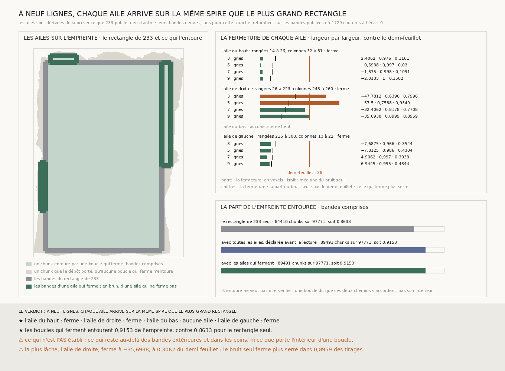

# `234` — Le segment au-delà du plus grand rectangle se relie-t-il au rectangle sur la même spire ? Oui, par trois ailes : à neuf lignes, chacune ferme sous le demi-feuillet, celle de droite à 0,3062 voxel du bord

*Autour du rectangle de `233`, la présence que le dépôt publie porte trois ailes : en haut, à droite et à gauche, rien en bas. Leurs neuf bandes neuves, lues, retombent sur les bandes publiées. À neuf lignes, chaque aile ferme sous le demi-feuillet de 36 voxels : l'aile du haut à −2,0133, celle de gauche à 6,9445, celle de droite à −35,6938. Les boucles qui ferment entourent 0,9153 de l'empreinte, contre 0,8633 pour le rectangle seul.*

## 0. Pourquoi cette tranche

`233` a listé le dépôt, et le plus grand rectangle dont les quatre bandes de neuf lignes y tiennent ferme à
−11,8449 voxels. Mais ses bandes s'arrêtent aux rangées 26 et 384 et aux colonnes 22 et 243, quand
l'empreinte va des rangées **5** à **394** et des colonnes **0** à **283**. Entre les deux, aucune boucle ne
passe. C'est `R4-P79` : ce segment-là se relie-t-il au rectangle sur la même spire ?

⚠⚠⚠ Le fichier a été écrit avant que les ailes ne soient dérivées et que la moindre ligne nouvelle ne soit
lue. Ce qui était vu avant d'écrire : ce que `233` publie, sa présence listée et la figure qui la montre.

## 1. Les ailes, dérivées

Une **aile** est un rectangle qui partage avec celui de `233` une portion de l'un de ses côtés et s'étend
vers l'extérieur. Ses trois autres bandes tiennent au sens de `233` : à chaque couture, leurs neuf lignes ont
leurs deux chunks dans le dépôt. Sa bande extérieure ne partage aucune ligne avec la bande qu'elle prolonge,
ses deux bandes de travers aucune entre elles. De chaque côté, l'aile est la plus grande : la plus grande
aire, puis le plus long chemin, puis le plus petit début, puis la bande extérieure la plus proche. Le code les
dérive de la présence publiée, et de rien d'autre.

| côté | rangées | colonnes | aire (chunks) | chemin (coutures) |
|---|---|---|---:|---:|
| haut | 14 à 26 | 32 à 81 | 588 | 61 |
| droite | 26 à 223 | 243 à 260 | 3349 | 214 |
| bas | aucune | | | |
| gauche | 216 à 308 | 13 à 22 | 828 | 101 |

En bas, aucune aile ne tient : la bande du rectangle est centrée sur la rangée 384, une bande extérieure
devrait l'être sur la rangée 393 au moins, et ses lignes sortiraient de la grille.

Avant toute lecture, la couverture était déclarée : le rectangle seul entoure
**84410** chunks sur les **97771** que le dépôt porte, soit **0,8633** ; avec toutes les ailes, **89491**, soit **0,9153**.

## 2. Ce qui s'est lu, et ce qui le contrôle

Trois bandes neuves par aile, neuf lignes chacune, par le lecteur de `224` : neuf bandes. La bande qu'une aile
partage avec le rectangle n'est pas relue, ses pas sont ceux que `233` publie. Sur les **81** lignes lues, les
chunks que la lecture compte absents du dépôt sont ceux que la présence dit absents.

Partout où une bande neuve croise une bande publiée, de `219`, `232` ou `233`, les pas relus retombent :
**1729** coutures, écart **0**. ⚠⚠ Chaque bande neuve doit être contrôlée sur au moins une couture, par une
bande publiée ou, faute de mieux, par une bande neuve déjà contrôlée qu'elle croise ; jamais par une bande qui
ne l'est pas, sinon deux bandes mal placées se contrôleraient l'une l'autre. Sur le relevé réel,
chacune des **9** bandes neuves croise une bande publiée ; les croisements entre bandes neuves s'ajoutent au
contrôle, **238** coutures sur les 1729.

## 3. La fermeture, aile par aile

L'instrument de `228` sur chaque aile, à chaque largeur, avec la garde de `232` : un trou de majorité se
franchit par le maillage, et seulement jusqu'aux **17** coutures que `225` a essayées.

| aile | lignes | fermeture | dispersion du pas | bruit seul : médiane | bruit seul sous le demi-feuillet | bruit seul sous la fermeture |
|---|---:|---:|---:|---:|---:|---:|
| haut | 3 | 2,4062 | 1,8111 | 11,1875 | 0,976 | 0,1161 |
| haut | 5 | −0,5938 | 1,47 | 9,2813 | 0,997 | 0,03 |
| haut | 7 | −1,875 | 1,1875 | 8,6563 | 0,998 | 0,1091 |
| haut | 9 | **−2,0133** | 1,0602 | 7,4554 | 1 | 0,1502 |
| droite | 3 | −47,7812 | 2,1582 | 25,3438 | 0,6396 | 0,7998 |
| droite | 5 | −57,5 | 1,8401 | 20,8125 | 0,7588 | 0,9349 |
| droite | 7 | −32,4062 | 1,7038 | 18,1875 | 0,8178 | 0,7708 |
| droite | 9 | **−35,6938** | 1,4935 | 15,15 | 0,8999 | 0,8959 |
| gauche | 3 | −7,6875 | 1,532 | 11,3125 | 0,966 | 0,3544 |
| gauche | 5 | −7,8125 | 1,2821 | 9,2813 | 0,986 | 0,4304 |
| gauche | 7 | 4,9062 | 1,1645 | 8,625 | 0,997 | 0,3033 |
| gauche | 9 | **6,9445** | 1,0786 | 8,2395 | 0,995 | 0,4344 |

À trois lignes, trois trous de majorité d'une couture, tous franchis par le maillage ; au-delà, aucun.

Les ailes du haut et de gauche ferment à toutes les largeurs, loin du demi-feuillet, et leur fermeture reste
dans ce que le bruit seul produit. L'aile de droite dépasse le demi-feuillet à trois et cinq lignes, passe
dessous à sept et neuf.

⚠⚠⚠ **L'aile de droite ferme au bord.** À neuf lignes, elle est à **0,3062** voxel du demi-feuillet, et le
bruit seul ferme plus serré que la mesure dans **0,8959** des tirages : sa fermeture est plus grande que ce que
le bruit seul produit d'ordinaire. Elle tient à l'écart de ses deux colonnes : **28,9375** voxels le long de la
colonne 243, celle que l'aile partage avec le rectangle, **−4,9437** le long de la colonne 260.

## 4. La couverture

Les trois ailes ferment : les boucles qui ferment entourent **89491** chunks sur **97771**, soit **0,9153** de
l'empreinte, ce que la déclaration annonçait si toutes fermaient. ⚠ Entouré ne veut pas dire vérifié : une
boucle dit que ses deux chemins s'accordent, pas ce que porte son intérieur.

## 5. Le verdict

**À NEUF LIGNES, CHAQUE AILE ARRIVE SUR LA MÊME SPIRE QUE LE PLUS GRAND RECTANGLE.**

⭐⭐⭐⭐ **`R4-P79` est répondue pour les ailes que la présence porte.** Au-delà du plus grand rectangle, le
dépôt porte trois ailes, et chacune se relie au rectangle sous le demi-feuillet. Les boucles qui ferment
passent de 0,8633 de l'empreinte à 0,9153.

⚠⚠⚠ Ce oui tient, pour l'aile de droite, à 0,3062 voxel près, et sa fermeture est dans la queue haute du
bruit seul.

## 6. Ce que cette tranche ne dit pas

- ⚠⚠⚠ **Où l'aile de droite se sépare.** Sa fermeture est l'écart de ses deux colonnes sur 197 coutures ; rien
  ne dit encore à quelle rangée il entre, ni laquelle des deux colonnes dérive.
- ⚠⚠ **Ce qui reste de l'empreinte.** Au-delà des bandes extérieures des ailes, dans les coins et sous le
  rectangle, aucune boucle ne passe.
- ⚠⚠ Une fermeture sous le demi-feuillet dit que deux chemins s'accordent, pas lequel est sur la bonne spire,
  ni ce que porte l'intérieur d'une boucle.
- ⚠ Les largeurs sont emboîtées, et chaque aile partage une bande avec le rectangle : leurs fermetures ne sont
  pas des tirages indépendants.

## 7. Les sondes et les bris

**Trente-quatre bris** ont été appliqués un par un au code, et **les trente-quatre rougissent** : l'aire qui
ne départage plus, la bande extérieure collée à la bande intérieure de chacun des quatre côtés, les bandes de
travers à moins de neuf lignes l'une de l'autre, la bande extérieure puis les bandes de travers qui ne sont plus
exigées, les bandes de travers vérifiées jusqu'à mi-chemin, la recherche qui garde une rangée de moins, l'aile
de droite dessinée à l'envers, l'aile du haut retournée, la bande partagée prise du mauvais côté, la bande
partagée relue, la couverture sans ses bandes, la couverture qui compte les absents, la couverture déclarée
sans les ailes, la couverture finale qui compte toutes les ailes, une aile ouverte qui ne compte plus, le
demi-feuillet qui ne compte plus, chaque aile qui se ferme quand aucune ne tient, le trou qui ne prime plus sur
le demi-feuillet, un rectangle de `233` qui ne ferme pas et fait lire quand même, la présence qui n'est plus
contrôlée par `232`, par `233` ni par la lecture, la reproduction qui n'est plus exigée, la définition des
bandes lues qui n'est plus vérifiée, les bandes de `233` hors des sources, la chaîne qui accepte une bande qui
ne croise rien, se contrôle par des bandes non contrôlées ou avale un désaccord, l'analyse qui ne prend plus la
bande partagée à `233`, et la plus courte longueur de `225` au lieu de la plus longue.

⚠ **Au premier passage, deux bris ont passé et un est mort** : ni la couverture qui compte les absents, ni
chaque aile qui se ferme quand aucune ne tient n'étaient vues, et l'analyse privée de la bande partagée levait
une erreur avant d'être jugée. Les sondes ont été complétées pour voir les deux premiers, et la section du
rejeu rendue indépendante de la mesure. Tout cela avant que les ailes ne soient dérivées.

Après la mesure, seule la figure a été écrite. La mesure est déterministe et se rejoue à l'octet près depuis sa
lecture comme depuis le fichier publié, qui porte les neuf bandes.

## 8. Ce qui reste

⭐⭐⭐ **Ce qui s'ouvre** (`R4-P80`) : l'aile de droite ferme à 0,3062 voxel du demi-feuillet, et son écart
tient à ses deux colonnes. Où, le long des rangées 26 à 223, ses deux colonnes se séparent-elles ? ⚠⚠ Les
boucles plus courtes qui le diraient se dérivent de la présence, jamais ne se choisissent.
