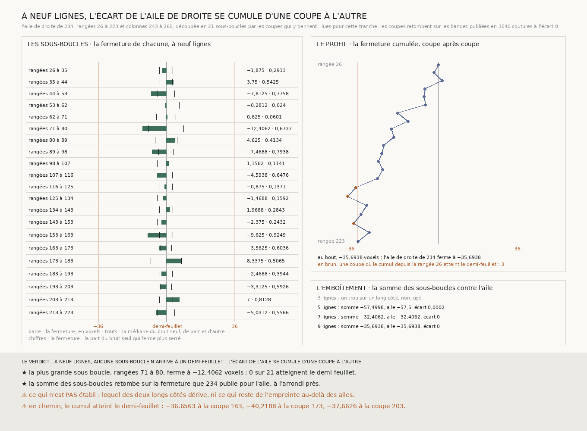

# `235` — Où, le long de l'aile de droite, ses deux colonnes se séparent-elles ? Nulle part d'un coup : découpée en 21 sous-boucles, l'aile n'en a aucune au demi-feuillet, et son écart se cumule, au point de franchir le demi-feuillet en chemin

*L'aile de droite de `234`, des rangées 26 à 223 et des colonnes 243 à 260, se découpe en 21 sous-boucles de neuf ou dix rangées : les 20 coupes intérieures tiennent toutes dans le dépôt. Lues, elles retombent sur les bandes publiées, et la somme des sous-boucles retombe exactement sur la fermeture que `234` publie pour l'aile. À neuf lignes, la plus grande sous-boucle ferme à −12,4062 voxels ; aucune n'approche le demi-feuillet. Mais la fermeture cumulée depuis la rangée 26 l'atteint en chemin, à −40,2188 à la coupe 173, avant de revenir à −35,6938 au bout de l'aile.*

## 0. Pourquoi cette tranche

`234` a relié trois ailes au plus grand rectangle de `233`. L'aile de droite ferme à −35,6938 voxels, à 0,3062
du demi-feuillet, et son écart tient à ses deux colonnes : 28,9375 voxels le long de la 243, −4,9437 le long de
la 260. C'est `R4-P80` : entre-t-il d'un coup, entre deux rangées, ou se cumule-t-il le long de l'aile ?

⚠⚠⚠ Le fichier a été écrit avant que les coupes ne soient dérivées et que la moindre ligne nouvelle ne soit lue.
Ce qui était vu avant d'écrire : ce que `234` publie, et sa figure.

## 1. L'aile et ses coupes, dérivées

L'aile découpée est la plus lâche de celles qui ferment dans `234`, par sa fermeture à neuf lignes : l'aile de
droite, à **−35,6938**. Elle n'est pas choisie.

Une **coupe** est une bande de rangées de neuf lignes tendue entre les deux colonnes de l'aile, qui tient dans le
dépôt à chaque couture. Deux coupes voisines ne partagent aucune ligne. Parmi tous les découpages : le plus de
sous-boucles, puis le plus petit des plus grands écarts, puis les coupes les plus tôt. Sur les 197 coutures de
l'aile, le découpage est celui qu'aurait une grille pleine :
**21** sous-boucles, de neuf rangées jusqu'à la coupe 143 puis de dix, le plus grand écart valant **10**.

## 2. Ce qui s'est lu, et ce qui le contrôle

Les 20 coupes intérieures, neuf lignes chacune, par le lecteur de `224`. Les deux colonnes et les deux bouts ne sont
pas relus : leurs pas sont ceux que `233` et `234` publient. Sur les **180** lignes lues, les chunks que la lecture
compte absents du dépôt sont ceux que la présence dit absents.

Chaque coupe croise la colonne 243 de `233` et la colonne 260 de `234`, deux d'entre elles aussi la publication de
`219` : les pas relus retombent en **3040** coutures, écart **0**.

## 3. L'emboîtement

Chaque coupe est parcourue une fois dans chaque sens, donc la somme des sous-boucles est la fermeture de l'aile. Là
où aucune boucle n'a de trou de majorité sur ses deux colonnes, elle retombe sur ce que `234` publie :

| lignes | somme des sous-boucles | l'aile, publiée par `234` | écart |
|---:|---:|---:|---:|
| 3 | non jugé : un trou sur une colonne | | |
| 5 | −57,4998 | −57,5 | 0,0002 |
| 7 | −32,4062 | −32,4062 | 0 |
| 9 | −35,6938 | −35,6938 | 0 |

L'écart de 0,0002 à cinq lignes est celui de l'arrondi à quatre décimales des 21 fermetures.

## 4. Les sous-boucles, à neuf lignes

| rangées | fermeture | dispersion du pas | bruit seul : médiane | bruit seul sous la fermeture |
|---|---:|---:|---:|---:|
| 26 à 35 | −1,875 | 1,0472 | 3,5 | 0,2913 |
| 35 à 44 | 3,75 | 1,0532 | 3,375 | 0,5425 |
| 44 à 53 | −7,8125 | 1,1046 | 4,4375 | 0,7758 |
| 53 à 62 | −0,2812 | 1,2364 | 7,0312 | 0,024 |
| 62 à 71 | 0,625 | 1,2909 | 5,125 | 0,0601 |
| 71 à 80 | **−12,4062** | 1,6906 | 9,2188 | 0,6737 |
| 80 à 89 | 4,625 | 0,9491 | 5,8438 | 0,4134 |
| 89 à 98 | −7,4688 | 0,9847 | 3,9063 | 0,7938 |
| 98 à 107 | 1,1562 | 1,1984 | 4,7813 | 0,1141 |
| 107 à 116 | −4,5938 | 1,005 | 3,3438 | 0,6476 |
| 116 à 125 | −0,875 | 0,9784 | 3,375 | 0,1371 |
| 125 à 134 | −1,4688 | 0,9876 | 4,5938 | 0,1592 |
| 134 à 143 | 1,9688 | 0,7726 | 3,6562 | 0,2843 |
| 143 à 153 | −2,375 | 0,9641 | 4,625 | 0,2432 |
| 153 à 163 | −9,625 | 0,728 | 3,5937 | 0,9249 |
| 163 à 173 | −3,5625 | 0,696 | 2,8125 | 0,6036 |
| 173 à 183 | 8,3375 | 1,2226 | 8,1875 | 0,5065 |
| 183 à 193 | −2,4688 | 0,7134 | 3,3125 | 0,3944 |
| 193 à 203 | −3,3125 | 0,7473 | 2,75 | 0,5926 |
| 203 à 213 | 7 | 0,7427 | 3,5938 | 0,8128 |
| 213 à 223 | −5,0312 | 1,4092 | 4,4375 | 0,5566 |

Aucune sous-boucle n'approche le demi-feuillet de 36 : la plus grande, des rangées 71 à 80, ferme à −12,4062. La plus
éloignée de son bruit seul est celle des rangées 153 à 163 : le bruit seul y ferme plus serré dans 0,9249 des tirages.
**14** des 21 sous-boucles portent le signe de l'aile.

## 5. Le profil

La fermeture cumulée depuis la rangée 26 est, par l'emboîtement, celle de l'aile qu'on arrêterait à cette coupe. Elle
est à −27,0313 à la coupe 153, puis :

| coupe | 163 | 173 | 183 | 193 | 203 | 213 | 223 |
|---|---:|---:|---:|---:|---:|---:|---:|
| cumul | **−36,6563** | **−40,2188** | −31,8813 | −34,3501 | **−37,6626** | −30,6626 | −35,6938 |

⚠⚠⚠ **En chemin, le cumul atteint le demi-feuillet à trois coupes** : l'aile arrêtée à la rangée 163, 173 ou 203
fermerait au-delà. Elle ne passe dessous, au bout, que de 0,3062.

## 6. Le verdict

**À NEUF LIGNES, AUCUNE SOUS-BOUCLE N'ARRIVE À UN DEMI-FEUILLET : L'ÉCART DE L'AILE SE CUMULE D'UNE COUPE À L'AUTRE.**

⭐⭐⭐⭐ **`R4-P80` est répondue : les deux colonnes de l'aile de droite ne se séparent nulle part d'un coup.** Aucune
des 21 sous-boucles ne change de spire ; l'écart de −35,6938 voxels se fait par petits pas, dont deux sur trois vont
dans le même sens.

⚠⚠⚠ **Ce que cela retire à `234`.** L'aile de droite passe sous le demi-feuillet parce qu'elle s'arrête à la rangée
223 : la même aile, arrêtée vingt, cinquante ou soixante rangées plus tôt, le franchit. Son « oui » tient à l'endroit où
elle finit, pas à ce qu'elle porte.

## 7. Ce que cette tranche ne dit pas

- ⚠⚠⚠ **Laquelle des deux colonnes dérive.** Entre les colonnes 243 et 260, dix-sept coutures, aucune troisième colonne
  de neuf lignes ne tient sans partager de ligne avec l'une des deux. Une référence ne peut venir que de l'extérieur de
  l'aile.
- ⚠⚠ Si le cumul est une dérive ou une marche au hasard : 14 sous-boucles sur 21 du même signe ne tranchent pas.
- ⚠⚠ Ce qui reste de l'empreinte au-delà des ailes.
- ⚠ Chaque coupe appartient à deux sous-boucles, et les deux colonnes à toutes : les fermetures des sous-boucles ne sont
  pas des tirages indépendants.

## 8. Les sondes et les bris

**Trente-trois bris** ont été appliqués un par un au code, et **les trente-trois rougissent** : le plus de sous-boucles
qui ne prime plus, le plus grand écart qui ne départage plus, les coupes prises le plus tard, les coupes qui ne gardent
plus neuf lignes entre elles, une coupe qui ne tient pas acceptée, la coupe vérifiée jusqu'à mi-chemin, l'aile du haut
coupée dans le mauvais sens, les sous-boucles d'une aile du haut retournées, une sous-boucle de droite amputée d'une
colonne, les bouts relus, l'aile la plus lâche choisie sans valeur absolue, une aile qui ne ferme pas désignée comme la
plus lâche, l'emboîtement qui n'est plus exigé, une tolérance d'arrondi trop large, un trou sur une colonne qui
n'empêche plus de juger, un trou sur une coupe qui l'empêche, les longs côtés d'une aile du haut pris pour ceux d'une
aile de droite, le profil qui ne cumule plus, le profil qui continue après une sous-boucle ouverte, une sous-boucle
ouverte qui ne compte plus, le demi-feuillet qui ne compte plus, le trou qui ne prime plus sur le demi-feuillet, l'écart
qui se cumule sans coupe, la plus grande sous-boucle prise par sa valeur signée, la présence qui n'est plus contrôlée
par la lecture ni par `234`, la reproduction qui n'est plus exigée, les bandes de `234` hors des sources, la définition
des coupes lues qui n'est plus vérifiée, l'analyse privée des bandes de `234`, une aile découpée quand aucune ne ferme,
la plus courte longueur de `225` au lieu de la plus longue, et la sous-boucle nommée par ses colonnes.

⚠ **Au premier passage, un bris était mort** : le plus de sous-boucles qui ne prime plus faisait tomber la batterie
avant qu'elle ne juge. Les contrôles des coupes ont été rendus indépendants les uns des autres. La batterie porte aussi
un saut fabriqué d'un demi-feuillet sur une seule couture, compensé ailleurs : elle le localise entre les deux coupes
qui l'entourent. Tout cela avant que les coupes ne soient dérivées.

Après la mesure, seule la figure a été écrite. La mesure est déterministe et se rejoue à l'octet près depuis sa lecture
comme depuis le fichier publié, qui porte les vingt coupes.

## 9. Ce qui reste

⭐⭐⭐ **Ce qui s'ouvre** (`R4-P81`) : l'écart de l'aile de droite se cumule sans saut et franchit le demi-feuillet en
chemin. Laquelle de ses deux colonnes dérive, et de combien par rangée ? ⚠⚠ Aucune colonne de référence ne tient entre
elles : la référence est à chercher hors de l'aile, et à dériver de la présence, jamais à choisir.
