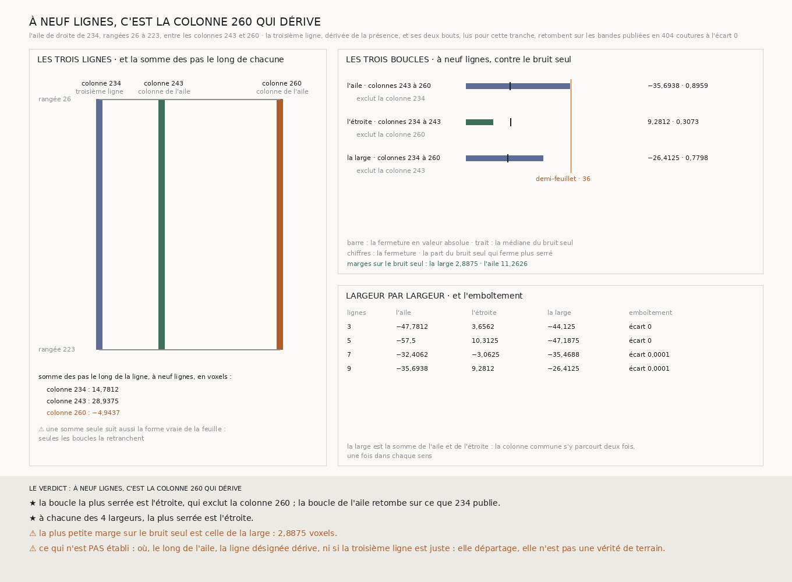

# `236` — Laquelle des deux colonnes de l'aile de droite dérive ? La colonne 260 : une troisième colonne, la 234, s'accorde avec la 243 et pas avec elle, à 2,8875 voxels près au-delà du bruit seul

*Une troisième colonne, dérivée de la présence hors de l'aile, tient à neuf colonnes de la 243, du côté du rectangle : la colonne 234. Les trois colonnes ferment trois boucles deux à deux. À neuf lignes, celle qui laisse la colonne 260 de côté ferme à 9,2812 voxels, les deux qui passent par elle à −35,6938 et −26,4125 : c'est la colonne 260 qui dérive. La plus petite des deux marges sur le bruit seul est de 2,8875 voxels.*

## 0. Pourquoi cette tranche

`235` a découpé l'aile de droite de `234`, des rangées 26 à 223 et des colonnes 243 à 260 : aucune sous-boucle n'arrive
au demi-feuillet, et l'écart de −35,6938 voxels se cumule, jusqu'à franchir le demi-feuillet en chemin. C'est `R4-P81` :
laquelle des deux colonnes dérive ? Entre elles, aucune troisième colonne de neuf lignes ne tient ; la référence est hors
de l'aile.

⚠⚠⚠ Le fichier a été écrit avant que la troisième ligne ne soit dérivée et que la moindre ligne nouvelle ne soit lue. Ce
qui était vu avant d'écrire : ce que `235` publie, et sa figure. La présence autour de l'aile n'a pas été regardée.

## 1. La troisième ligne, dérivée

Une **troisième ligne** est une bande de neuf lignes parallèle aux deux colonnes de l'aile, à neuf colonnes au moins de
chacune, qui tient dans le dépôt sur toute la longueur de l'aile ; les deux bandes de bout qui la relient à la colonne la
plus proche tiennent aussi. Des deux côtés de l'aile, la plus proche d'une colonne ; à égalité, celle du côté du
rectangle. Le code la dérive de la présence publiée par `233`, et de rien d'autre.

C'est la colonne **234**, du côté du rectangle, à **9** colonnes de la 243.

## 2. Ce qui s'est lu, et ce qui le contrôle

La colonne 234 des rangées 26 à 223, et ses deux bouts jusqu'à la colonne 243 : trois bandes, neuf lignes chacune. Sur
les **27** lignes lues, les chunks que la lecture compte absents du dépôt sont ceux que la présence dit absents.

La colonne 234 croise la publication de `219` et la bande du haut de `233`, les deux bouts la colonne 243 de `233` et les
bouts de `234`, et le bout du haut relit la bande du haut de `233` elle-même :
les pas relus retombent en **404** coutures, écart **0**.

## 3. Les trois boucles

La boucle de l'aile (colonnes 243 à 260), l'étroite (234 à 243) et la large (234 à 260), sur les rangées 26 à 223. La
boucle de l'aile retombe à chaque largeur sur ce que `234` publie. La large est la somme des deux autres, la colonne 243
s'y parcourant une fois dans chaque sens :

| lignes | l'aile | l'étroite | la large | emboîtement : écart |
|---:|---:|---:|---:|---:|
| 3 | −47,7812 | 3,6562 | −44,125 | 0 |
| 5 | −57,5 | 10,3125 | −47,1875 | 0 |
| 7 | −32,4062 | −3,0625 | −35,4688 | 0,0001 |
| 9 | −35,6938 | **9,2812** | −26,4125 | 0,0001 |

À neuf lignes, contre le bruit seul :

| boucle | exclut la colonne | fermeture | bruit seul : médiane | bruit seul sous la fermeture |
|---|---:|---:|---:|---:|
| l'aile | 234 | −35,6938 | 15,15 | 0,8959 |
| l'étroite | 260 | **9,2812** | 15,3437 | 0,3073 |
| la large | 243 | −26,4125 | 14,2438 | 0,7798 |

## 4. Le verdict

**À NEUF LIGNES, C'EST LA COLONNE 260 QUI DÉRIVE.**

La boucle la plus serrée est l'étroite, qui laisse la colonne 260 de côté : les colonnes 234 et 243 s'accordent, dans ce
que le bruit seul produit, et les deux boucles qui passent par la colonne 260 portent l'écart. La marge sur le bruit seul
est de **11,2626** voxels sur l'aile et de **2,8875** sur la large : la colonne est désignée.

⭐⭐⭐⭐ **`R4-P81` est répondue : de ses deux colonnes, c'est la 260, lue par `234` comme bande extérieure de l'aile, qui
dérive.** L'étroite est la plus serrée à chacune des quatre largeurs, pas seulement à neuf lignes.

⚠⚠⚠ **La désignation tient de peu.** La marge sur la large, 2,8875 voxels, est petite devant la médiane de son bruit
seul, 14,2438.

## 5. Ce que cette tranche ne dit pas

- ⚠⚠⚠ **Où, le long des rangées 26 à 223, la colonne 260 dérive.** Les trois boucles ne sont pas découpées.
- ⚠⚠ **Si la colonne 234 est juste.** Elle départage, elle n'est pas une vérité de terrain : deux colonnes qui dériveraient
  ensemble s'accorderaient aussi.
- ⚠⚠ **Pourquoi la colonne 260 dérive.** La somme des pas le long de chaque colonne, à neuf lignes, vaut 14,7812 pour la
  234, 28,9375 pour la 243 et −4,9437 pour la 260 ; mais une somme seule suit aussi la forme vraie de la feuille, et seules
  les boucles la retranchent.
- ⚠ Les trois boucles partagent leurs colonnes deux à deux : leurs fermetures ne sont pas des tirages indépendants.

## 6. Les sondes et les bris

**Trente bris** ont été appliqués un par un au code, et **les trente rougissent** : l'aile de gauche qui prend sa colonne
extérieure pour l'intérieure, l'aile du haut qui prend sa rangée extérieure pour l'intérieure, les coins d'une boucle de
rangées retournés, la troisième ligne collée au long côté, cherchée d'un seul côté, qui n'a plus à tenir, dont les bouts
n'ont plus à tenir, la plus loin d'un long côté, le côté extérieur à égalité, la troisième ligne lue sur une partie de
l'aile, un seul bout lu, l'étroite tendue vers le côté le plus loin, la boucle de l'aile qui n'est plus comparée à `234`,
l'emboîtement qui n'est plus exigé, une tolérance d'emboîtement trop large, tout trou de bout qui empêche de juger, un trou
à la jonction qui ne l'empêche plus, les bouts d'une boucle de rangées pris pour ceux d'une boucle de colonnes, la boucle
la plus serrée prise par sa valeur signée, la marge sans le bruit seul, une seule marge qui suffit, l'étroite qui exclut le
côté le plus proche, une boucle ouverte qui ne compte plus, la présence qui n'est plus contrôlée par la lecture ni par
`234`, la reproduction qui n'est plus exigée, la définition des bandes lues qui n'est plus vérifiée, les bouts publiés par
`234` écrasés par les neufs, une aile désignée quand aucune ne ferme, et la plus courte longueur de `225` au lieu de la plus
longue.

⚠ **Au premier passage, cinq bris ont passé** : les coins d'une boucle de rangées retournés, la troisième ligne lue sur une
partie de l'aile, l'emboîtement qui n'est plus exigé, les bouts d'une boucle de rangées pris pour ceux d'une boucle de
colonnes, et la présence qui n'est plus contrôlée par `234`. Des sondes nouvelles les voient, dont une qui fausse la
boucle large et exige le refus. La batterie porte aussi deux dérives fabriquées, l'une sur la colonne extérieure, l'autre
sur l'intérieure : chacune est désignée. Tout cela avant que la troisième ligne ne soit dérivée.

Après la mesure, seule la figure a été écrite. La mesure est déterministe et se rejoue à l'octet près depuis sa lecture
comme depuis le fichier publié, qui porte les trois bandes.

## 7. Ce qui reste

⭐⭐⭐ **Ce qui s'ouvre** (`R4-P82`) : la colonne 260 est désignée à 2,8875 voxels près. Découpées aux coupes de `235`,
l'étroite reste-t-elle sans écart cumulé pendant que l'aile dérive, et où la colonne 260 s'écarte-t-elle ? ⚠⚠ Les coupes de
l'étroite se dérivent de la présence comme celles de l'aile, jamais ne se choisissent.
