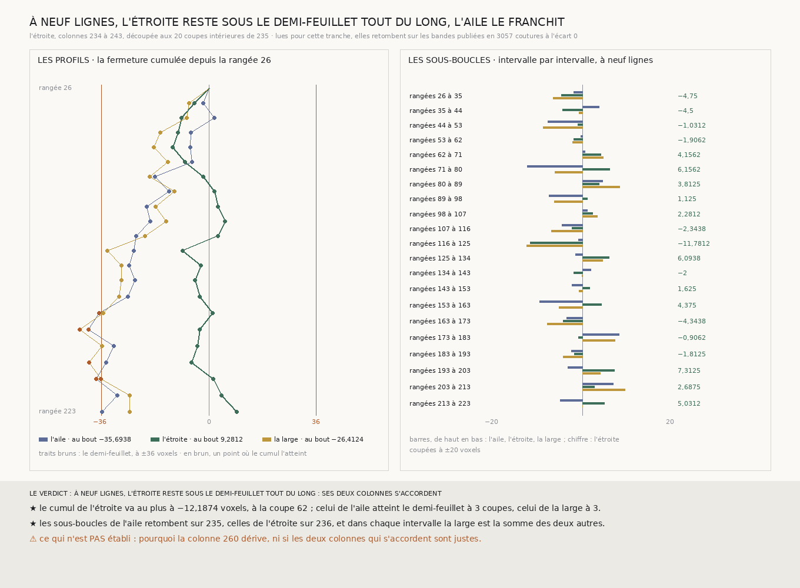

# `237` — Découpée aux coupes de `235`, l'étroite reste-t-elle sans écart cumulé pendant que l'aile dérive ? Oui : son cumul ne dépasse jamais 12,1874 voxels, quand les deux boucles qui passent par la colonne 260 franchissent le demi-feuillet en chemin

*L'étroite, entre les colonnes 234 et 243, se découpe aux 20 coupes que `235` a dérivées pour l'aile : toutes tiennent. Lues, elles retombent sur les bandes publiées. Dans chacun des 21 intervalles, l'aile, l'étroite et la large ont leur sous-boucle, et la large y est la somme des deux autres. La fermeture cumulée de l'étroite depuis la rangée 26 reste entre −12,1874 et 9,2812 voxels ; celles de l'aile et de la large atteignent le demi-feuillet chacune à trois coupes, jusqu'à −40,2188 et −43,25.*

## 0. Pourquoi cette tranche

`236` a désigné la colonne 260 : l'étroite, entre les colonnes 234 et 243, ferme à 9,2812 voxels quand l'aile ferme à
−35,6938 et la large à −26,4125. Mais la marge sur le bruit seul de la large n'était que de 2,8875 voxels, et `235` a
montré qu'une boucle peut fermer au bout après avoir franchi le demi-feuillet en chemin. C'est `R4-P82` : découpée
comme l'aile, l'étroite reste-t-elle sans écart cumulé tout du long, et où la colonne 260 s'écarte-t-elle ?

⚠⚠⚠ Le fichier a été écrit avant que la moindre ligne nouvelle ne soit lue. Ce qui était vu avant d'écrire : ce que
`236` publie, et sa figure.

## 1. Les coupes, reprises

Les coupes de l'étroite sont celles de `235`, aux mêmes rangées, tendues de la colonne 234 à la 243. Une coupe dont la
bande ne tiendrait pas dans le dépôt serait retirée et ses deux intervalles fondus ; les **20** tiennent. Chaque
intervalle de rangées a ainsi trois sous-boucles : l'aile (243 à 260), l'étroite (234 à 243) et la large (234 à 260).

## 2. Ce qui s'est lu, et ce qui le contrôle

Les 20 coupes de l'étroite, neuf lignes chacune. Sur les **180** lignes lues, les chunks que la lecture compte absents du
dépôt sont ceux que la présence dit absents. Chaque coupe croise la colonne 243 de `233`, la colonne 234 de `236` et la
coupe de `235` à la même rangée : les pas relus retombent en **3057** coutures, écart **0**.

Trois contrôles sans lecture de plus, tous passés. Les 21 sous-boucles de l'aile retombent sur ce que `235` publie. Dans
chaque intervalle, à chacune des quatre largeurs, la large est la somme de l'aile et de l'étroite. Et les sous-boucles
de l'étroite somment à ce que `236` publie : **9,2812** à neuf lignes, −3,0624 contre −3,0625 à sept ; à trois et cinq
lignes, un trou sur une colonne empêche de juger.

## 3. Les sous-boucles, à neuf lignes

| rangées | l'aile | l'étroite | la large |
|---|---:|---:|---:|
| 26 à 35 | −1,875 | −4,75 | −6,625 |
| 35 à 44 | 3,75 | −4,5 | −0,75 |
| 44 à 53 | −7,8125 | −1,0312 | −8,8438 |
| 53 à 62 | −0,2812 | −1,9062 | −2,1875 |
| 62 à 71 | 0,625 | 4,1562 | 4,7812 |
| 71 à 80 | −12,4062 | 6,1562 | −6,25 |
| 80 à 89 | 4,625 | 3,8125 | 8,4375 |
| 89 à 98 | −7,4688 | 1,125 | −6,3438 |
| 98 à 107 | 1,1562 | 2,2812 | 3,4375 |
| 107 à 116 | −4,5938 | −2,3438 | −6,9375 |
| 116 à 125 | −0,875 | −11,7812 | −12,6562 |
| 125 à 134 | −1,4688 | 6,0938 | 4,625 |
| 134 à 143 | 1,9688 | −2 | −0,0312 |
| 143 à 153 | −2,375 | 1,625 | −0,75 |
| 153 à 163 | −9,625 | 4,375 | −5,25 |
| 163 à 173 | −3,5625 | −4,3438 | −7,9062 |
| 173 à 183 | 8,3375 | −0,9062 | 7,4313 |
| 183 à 193 | −2,4688 | −1,8125 | −4,2812 |
| 193 à 203 | −3,3125 | 7,3125 | 4 |
| 203 à 213 | 7 | 2,6875 | 9,6875 |
| 213 à 223 | −5,0312 | 5,0312 | 0 |

⚠ Localement, ce n'est pas toujours la colonne 260 qui s'écarte. Des rangées 116 à 125, l'étroite et la large portent
−11,7812 et −12,6562, l'aile −0,875 : c'est la colonne 234 qui s'y écarte des deux autres, et cet intervalle porte la plus
grande sous-boucle de la large.

## 4. Les profils

| cumul depuis la rangée 26 | au plus loin de zéro | au bout | coupes où il atteint le demi-feuillet |
|---|---:|---:|---|
| l'étroite | −12,1874, à la coupe 62 | 9,2812 | aucune |
| l'aile | −40,2188, à la coupe 173 | −35,6938 | 163, 173, 203 |
| la large | −43,25, à la coupe 173 | −26,4124 | 173, 193, 203 |

## 5. Le verdict

**À NEUF LIGNES, L'ÉTROITE RESTE SOUS LE DEMI-FEUILLET TOUT DU LONG : SES DEUX COLONNES S'ACCORDENT.**

⭐⭐⭐⭐ **`R4-P82` est répondue.** Les colonnes 234 et 243 s'accordent sur toute la longueur de l'aile, jamais à plus de
12,1874 voxels ; les deux boucles qui passent par la colonne 260 franchissent le demi-feuillet en chemin, dès la coupe
163 pour l'aile, 173 pour la large. La colonne 260 s'écarte par petits pas, sans saut, sur toute la longueur de l'aile.

⚠⚠⚠ **Ce que cela retire à `234`.** L'aile de droite n'arrive pas sur la même spire que le rectangle de façon sûre : sa
fermeture sous le demi-feuillet, au bout, est la fin d'une dérive de la colonne 260 qui l'a franchi en chemin. Un
jugement au bout d'une boucle ne suffit pas ; il faut que son profil reste sous le demi-feuillet.

## 6. Ce que cette tranche ne dit pas

- ⚠⚠⚠ **Si le plus grand rectangle de `233` tient sur son profil.** Il ferme à −11,8449 voxels au bout ; rien ne dit
  encore ce que font ses boucles partielles.
- ⚠⚠ Pourquoi la colonne 260 dérive, ni si les colonnes 234 et 243, qui s'accordent, sont justes : deux colonnes qui
  dériveraient ensemble s'accorderaient aussi.
- ⚠ Les trois familles partagent leurs coupes et leurs colonnes : leurs sous-boucles ne sont pas des tirages
  indépendants.

## 7. Les sondes et les bris

**Vingt-huit bris** ont été appliqués un par un au code, et **les vingt-huit rougissent** : une coupe qui ne tient pas
gardée, la coupe vérifiée sur la moitié de l'étroite, un bout qui ne tient pas retiré, les bouts relus, les intervalles
décalés, le demi-feuillet franchi seulement au-delà, le demi-feuillet compté avec son signe, le verdict qui juge l'aile
au lieu de l'étroite, l'étroite jugée sur la large, le pic pris au bout, la plus grande de la large prise par sa valeur
signée, une sous-boucle ouverte de l'aile qui ne compte plus, le verdict jugé sans coupe, l'étroite tendue jusqu'à la
colonne loin, la large prise entre la troisième ligne et la colonne proche, l'aile qui n'est plus comparée à `235`,
l'emboîtement par intervalle qui n'est plus exigé, la jonction prise à la colonne loin, l'emboîtement de l'étroite qui
n'est plus exigé, les deux publications qui ne sont plus comparées, la présence qui n'est plus contrôlée par `236` ni
par la lecture, la reproduction qui n'est plus exigée, les coupes de `235` puis les bandes de `236` hors des sources, la
définition des coupes lues qui n'est plus vérifiée, les pas publiés écrasés au lieu d'être fusionnés, et la plus courte
longueur de `225` au lieu de la plus longue.

⚠ **Au premier passage, un bris est mort et un a passé** : le verdict jugé sans coupe faisait tomber la batterie avant
qu'elle ne juge, et la jonction prise à la colonne loin ne changeait rien sur l'empreinte fabriquée, qui n'a pas de trou
à la jonction. Le contrôle du verdict a été rendu indépendant, et une sonde vérifie désormais que chaque emboîtement est
jugé à la colonne commune. La batterie porte aussi une troisième colonne fabriquée qui s'écarte puis revient : l'étroite
y atteint le demi-feuillet en chemin et ferme au bout. Tout cela avant que la moindre coupe ne soit lue.

Après la mesure, seule la figure a été écrite. La mesure est déterministe et se rejoue à l'octet près depuis sa lecture
comme depuis le fichier publié, qui porte les vingt coupes.

## 8. Ce qui reste

⭐⭐⭐ **Ce qui s'ouvre** (`R4-P83`) : l'aile de droite fermait au bout et franchissait le demi-feuillet en chemin. Le plus
grand rectangle de `233`, jugé sur son profil et non à son bout, reste-t-il sous le demi-feuillet ? ⚠⚠ Ses boucles
partielles demandent des coupes tendues sur toute sa largeur, et elles se dérivent de la présence, jamais ne se
choisissent.
