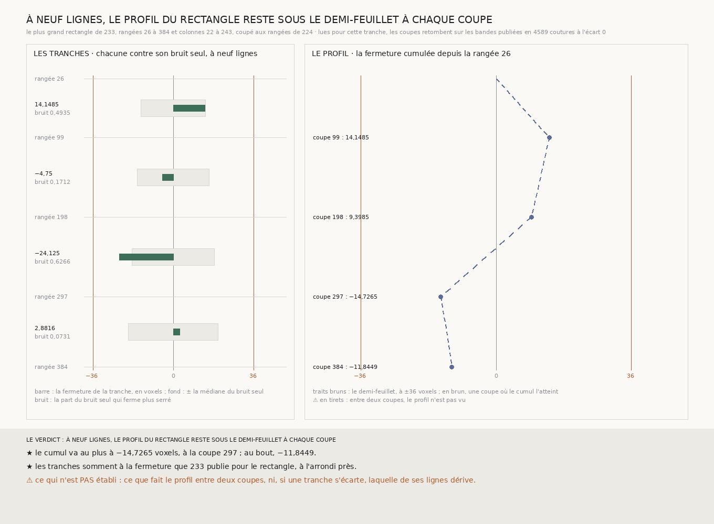

# `238` — Le plus grand rectangle de `233`, jugé sur son profil et non à son bout, reste-t-il sous le demi-feuillet ? Oui, aux trois coupes où il est vu : son cumul ne dépasse jamais 14,7265 voxels

*Aucune bande publiée ne traverse le rectangle de part en part hors de ses deux bouts. Il est coupé aux trois rangées que `224` a publiées, 99, 198 et 297, qui tiennent toutes : quatre tranches. Lues, les coupes retombent sur les bandes publiées, dont les rangées 99 et 297 de `224` elles-mêmes, et les tranches somment exactement à la fermeture que `233` publie. À neuf lignes, la fermeture cumulée depuis la rangée 26 vaut 14,1485, 9,3985, −14,7265 puis −11,8449 : jamais près du demi-feuillet. Entre deux coupes, le profil n'est pas vu.*

## 0. Pourquoi cette tranche

`237` a montré que l'aile de droite de `234` fermait à −35,6938 voxels au bout après avoir franchi le demi-feuillet en
chemin : juger une boucle à son bout ne suffit pas. C'est `R4-P83` : le plus grand rectangle de `233`, des rangées 26 à
384 et des colonnes 22 à 243, qui ferme à −11,8449 au bout, reste-t-il sous le demi-feuillet sur son profil ?

⚠⚠⚠ Le fichier a été écrit avant que la moindre ligne nouvelle ne soit lue. Ce qui était vu avant d'écrire : ce que `237`
publie et sa figure, et la liste des bandes publiées, dont aucune ne traverse le rectangle hors de ses bouts.

## 1. Les coupes, reprises de `224`

Une **coupe** est une bande de rangées de neuf lignes tendue d'une colonne du rectangle à l'autre, qui tient dans le
dépôt. Les coupes sont les rangées que `224` a dérivées pour ses boucles et publiées comme ses centres de rangées : 99, 198
et 297. Les trois tiennent. Le rectangle se découpe en **4** tranches, de 73 à 99 rangées.

⚠⚠ Elles sont peu nombreuses parce qu'une coupe du rectangle coûte deux cent vingt-deux colonnes de neuf lignes, près de
deux mille chunks.

## 2. Ce qui s'est lu, et ce qui le contrôle

Les trois coupes, neuf lignes chacune : sur les **27** lignes lues, les chunks que la lecture compte absents du dépôt
sont ceux que la présence dit absents. Chaque coupe croise les deux colonnes de `233`, la colonne 21 de `232`, les deux
colonnes de `224` et la publication de `223` ; les coupes 99 et 297 relisent les bandes de rangées de `224` elles-mêmes, et
la coupe 198 croise la publication de `219` : les pas relus retombent en **4589** coutures, écart **0**.

Les tranches somment à la fermeture que `233` publie : **−11,8449** à neuf lignes, écart 0 ; −24,8957 contre −24,8959 à
sept lignes ; à trois et cinq lignes, un trou sur une colonne empêche de juger.

## 3. Les tranches, à neuf lignes

| rangées | fermeture | dispersion du pas | bruit seul : médiane | bruit seul sous la fermeture |
|---|---:|---:|---:|---:|
| 26 à 99 | 14,1485 | 1,1693 | 14,4339 | 0,4935 |
| 99 à 198 | −4,75 | 1,1766 | 16,0625 | 0,1712 |
| 198 à 297 | −24,125 | 1,2154 | 18,411 | 0,6266 |
| 297 à 384 | 2,8816 | 1,2002 | 20,0255 | 0,0731 |

Aucune tranche ne s'écarte de ce que le bruit seul produit.

## 4. Le profil

| coupe | 99 | 198 | 297 | 384 |
|---|---:|---:|---:|---:|
| cumul depuis la rangée 26 | 14,1485 | 9,3985 | **−14,7265** | −11,8449 |

## 5. Le verdict

**À NEUF LIGNES, LE PROFIL DU RECTANGLE RESTE SOUS LE DEMI-FEUILLET À CHAQUE COUPE.**

⭐⭐⭐⭐ **`R4-P83` est répondue aux coupes où le profil est vu.** Les boucles partielles du rectangle, de la rangée 26 aux
rangées 99, 198 et 297, ferment à 14,7265 voxels au plus, loin du demi-feuillet de 36 : contrairement à l'aile de droite,
le « oui » de `233` ne tient pas qu'à l'endroit où le rectangle finit.

⚠⚠⚠ **Entre deux coupes, rien n'est vu.** Les tranches font de 73 à 99 rangées ; la traversée du demi-feuillet par l'aile
de droite a duré de la coupe 163 à la coupe 203 de `235`. Une traversée de cette durée entre deux coupes de `224` passerait
inaperçue.

## 6. Ce que cette tranche ne dit pas

- ⚠⚠⚠ **Ce que fait le profil entre deux coupes.**
- ⚠⚠ Si une tranche s'écartait, laquelle de ses lignes dériverait : aucune ne s'écarte ici de son bruit seul.
- ⚠ Les tranches partagent leurs coupes : leurs fermetures ne sont pas des tirages indépendants.

## 7. Les sondes et les bris

**Dix-neuf bris** ont été appliqués un par un au code, et **les dix-neuf rougissent** : une rangée trop proche d'un bout
gardée, une rangée trop proche du bout de fin gardée, une coupe qui ne tient pas gardée, la coupe vérifiée sur la moitié
du rectangle, les rangées prises dans l'ordre donné, les bouts relus, le demi-feuillet franchi seulement au-delà, le pic
pris au bout, une tranche ouverte qui ne compte plus, le verdict jugé sans coupe, le verdict qui dit dessous quand le
profil franchit, l'emboîtement qui n'est plus exigé, la présence qui n'est plus contrôlée par `233` ni par la lecture, la
reproduction qui n'est plus exigée, la définition des coupes lues qui n'est plus vérifiée, les rangées de `224` remplacées
par ses colonnes, les tranches prises à l'envers, et la plus courte longueur de `225` au lieu de la plus longue.

⚠ **Au premier passage, deux bris ont passé** : le demi-feuillet franchi seulement au-delà, faute de sonde qui atteigne
exactement le seuil, et des pas publiés écrasés par les coupes, qui ne pouvaient rien écraser, les coupes étant à neuf
lignes au moins des bouts. Une sonde place désormais le profil sur le seuil, et la fusion inutile a été retirée du code.
La batterie porte aussi une colonne fabriquée qui s'écarte puis revient : le profil en montre la trace à chaque coupe,
et le bout rien. Tout cela avant que la moindre coupe ne soit lue.

Après la mesure, seule la figure a été écrite. La mesure est déterministe et se rejoue à l'octet près depuis sa lecture
comme depuis le fichier publié, qui porte les trois coupes.

## 8. Ce qui reste

⭐⭐⭐ **Ce qui s'ouvre** (`R4-P84`) : entre deux coupes de `224`, le profil du rectangle reste-t-il sous le demi-feuillet ?
⚠⚠ Chaque coupe de plus coûte près de deux mille chunks, et se dérive de la présence, jamais ne se choisit.
